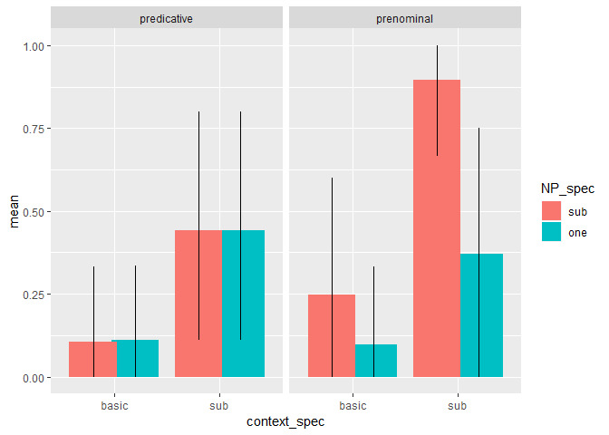

Comparison class inference free production pilot
================
Polina Tsvilodub
08/18/2019

``` r
library(tidyverse)
```

    ## -- Attaching packages ----------------------------------------------------- tidyverse 1.2.1 --

    ## v ggplot2 3.1.0     v purrr   0.2.5
    ## v tibble  1.4.2     v dplyr   0.7.7
    ## v tidyr   0.8.2     v stringr 1.3.1
    ## v readr   1.1.1     v forcats 0.3.0

    ## -- Conflicts -------------------------------------------------------- tidyverse_conflicts() --
    ## x dplyr::filter() masks stats::filter()
    ## x dplyr::lag()    masks stats::lag()

``` r
library(tidyboot)
```

    ## Warning: package 'tidyboot' was built under R version 3.5.3

``` r
library(brms)
```

    ## Warning: package 'brms' was built under R version 3.5.3

    ## Loading required package: Rcpp

    ## Loading 'brms' package (version 2.8.0). Useful instructions
    ## can be found by typing help('brms'). A more detailed introduction
    ## to the package is available through vignette('brms_overview').

``` r
d <- read_csv("../data/results_9_comp-class-inference-pilot.csv")
```

    ## Parsed with column specification:
    ## cols(
    ##   .default = col_character(),
    ##   submission_id = col_integer(),
    ##   experiment_id = col_integer(),
    ##   enjoyment = col_integer(),
    ##   pic_spec = col_integer(),
    ##   age = col_integer(),
    ##   ref_spec = col_integer(),
    ##   trial_number = col_integer(),
    ##   startTime = col_double(),
    ##   attempts = col_integer(),
    ##   fairprice = col_double()
    ## )

    ## See spec(...) for full column specifications.

``` r
glimpse(d)
```

    ## Observations: 249
    ## Variables: 42
    ## $ submission_id   <int> 282, 282, 282, 282, 282, 282, 282, 282, 282, 2...
    ## $ question        <chr> NA, NA, NA, NA, NA, NA, NA, "Please rephrase y...
    ## $ response1       <chr> "chihuahua", "chihuahua", "clipart", "dandelro...
    ## $ sentence_left   <chr> NA, NA, NA, NA, NA, NA, NA, "It is small relat...
    ## $ startDate       <chr> "Fri Aug 16 2019 16:34:19 GMT-0400 (Eastern Da...
    ## $ context_picture <chr> NA, NA, NA, NA, NA, NA, NA, "images/dog-parade...
    ## $ experiment_id   <int> 9, 9, 9, 9, 9, 9, 9, 9, 9, 9, 9, 9, 9, 9, 9, 9...
    ## $ picture2        <chr> "warmup/doberman.png", "warmup/doberman.png", ...
    ## $ correct1        <chr> "chihuahua", "chihuahua", "dandelion", "dandel...
    ## $ question1       <chr> "This is a", "This is a", "This is a", "This i...
    ## $ problems        <chr> "No", "No", "No", "No", "No", "No", "No", "No"...
    ## $ enjoyment       <int> 2, 2, 2, 2, 2, 2, 2, 2, 2, 2, 2, 2, 2, 2, 2, 2...
    ## $ hit_id          <chr> "3Y3CZJSZ9KHKHVYKEZXYJ8SJWZXR5X", "3Y3CZJSZ9KH...
    ## $ item            <chr> "dogs", "dogs", "flowers", "flowers", "flowers...
    ## $ botresponse     <chr> "elizabeth", "elizabeth", "elizabeth", "elizab...
    ## $ assignment_id   <chr> "39KFRKBFIOJI9QEHNBQTOUHV3JVYOY", "39KFRKBFIOJ...
    ## $ correct2        <chr> "doberman", "doberman", "sunflower", "sunflowe...
    ## $ pic_spec        <int> NA, NA, NA, NA, NA, NA, NA, 1, 1, 0, NA, NA, N...
    ## $ understand      <chr> "yes", "yes", "yes", "yes", "yes", "yes", "yes...
    ## $ text            <chr> "Please label the pictures below.", "Please la...
    ## $ age             <int> 48, 48, 48, 48, 48, 48, 48, 48, 48, 48, 48, 48...
    ## $ response        <chr> NA, NA, NA, NA, NA, NA, NA, "dogs", "flowers",...
    ## $ comments        <chr> "None", "None", "None", "None", "None", "None"...
    ## $ ref_spec        <int> NA, NA, NA, NA, NA, NA, NA, 1, 1, 0, NA, NA, N...
    ## $ picture1        <chr> "warmup/chihuahua.jpg", "warmup/chihuahua.jpg"...
    ## $ response3       <chr> "Dogs", "Dogs", "flowers", "flowers", "flowers...
    ## $ education       <chr> "graduated_college", "graduated_college", "gra...
    ## $ target_size     <chr> NA, NA, NA, NA, NA, NA, NA, "small", "big", "s...
    ## $ worker_id       <chr> "AZNFEOC5WRHZP", "AZNFEOC5WRHZP", "AZNFEOC5WRH...
    ## $ languages       <chr> "English", "English", "English", "English", "E...
    ## $ sex             <chr> "female", "female", "female", "female", "femal...
    ## $ RT              <chr> NA, NA, NA, NA, NA, NA, NA, NA, NA, NA, NA, NA...
    ## $ correct3        <chr> "dogs", "dogs", "flowers", "flowers", "flowers...
    ## $ context         <chr> NA, NA, NA, NA, NA, NA, NA, "You and your frie...
    ## $ trial_number    <int> 1, 1, 2, 2, 2, 3, 3, 1, 2, 3, 1, 1, 1, 1, 1, 1...
    ## $ startTime       <dbl> 1.565988e+12, 1.565988e+12, 1.565988e+12, 1.56...
    ## $ attempts        <int> 1, 2, 1, 2, 3, 1, 2, NA, NA, NA, 1, 2, 3, 4, 5...
    ## $ question3       <chr> "This is a", "This is a", "This is a", "This i...
    ## $ fairprice       <dbl> 1, 1, 1, 1, 1, 1, 1, 1, 1, 1, 1, 1, 1, 1, 1, 1...
    ## $ question2       <chr> "These are both", "These are both", "These are...
    ## $ response2       <chr> "dobermann", "doberman", "sunflower", "sunflow...
    ## $ trial_name      <chr> "warmup1", "warmup1", "warmup1", "warmup1", "w...

``` r
d %>% distinct(d$languages)# %>% View()
```

    ## # A tibble: 3 x 1
    ##   `d$languages`
    ##   <chr>        
    ## 1 English      
    ## 2 english      
    ## 3 Englilsh

``` r
d_filt <- d %>% 
  filter(grepl("English", languages, ignore.case = T))

# choose main trials 
d_main <- d_filt %>% filter((trial_name == "custom_main_text1")|(trial_name == "custom_main_text2")) %>% select(submission_id, trial_number, ref_spec, pic_spec, item, response, context, text)

d_main %>% distinct(d_main$response) %>% View()
```

## Response categorization

``` r
# remove invalid responses 
d_main_valid <- subset(d_main, !(response %in% c("Yes", "That one is big", "That chihuahua is small", "That great dane is big"))) 

# categorize responses
d_main_responseCat <- d_main_valid %>%
  rowwise() %>%
  mutate(  
    response_cat =
      ifelse(
      tolower(response) %in% c("birds", "dogs", "fish", "flowers",  "trees"), "basic", "sub"),
    
    response_num = ifelse(response_cat == "sub", 1, 0),
    response_label = "sub"
  )
# categorize syntactic condition since I forgot to record it 
d_main_cat <- d_main_responseCat %>% rowwise() %>% mutate(condition = ifelse((grepl("That's", text)), "prenominal", "predicative"))
```

``` r
# raw reponse counts by syntactic condition (6 participants each)
 d_main_cat %>% ggplot(aes(x=response_cat, fill=ref_spec)) + geom_bar(position=position_dodge()) + facet_wrap(~condition) 
```

<!-- --> \#\#
Proportion of sub responses by syntactic condition, picture specificity
and NP
specificity

``` r
d_main_cat %>% group_by(response_label, ref_spec, pic_spec, condition) %>% tidyboot_mean(column = response_num) %>% ungroup() %>% 
  mutate(NP_spec = factor(ref_spec, levels= c(0, 1), labels = c("sub", "one")),
         context_spec = factor(pic_spec, levels = c(0, 1), labels = c("basic", "sub"))) %>% ggplot(aes(x=context_spec, fill= NP_spec, y = mean, ymin = ci_lower, ymax = ci_upper)) +
  geom_col(position = position_dodge(0.8))+
  geom_linerange(position = position_dodge(0.8)) + facet_wrap(~condition)
```

    ## Warning: Grouping rowwise data frame strips rowwise nature

<!-- -->

## Stats

``` r
# does not converge due to small amount of data

library(lme4)
```

    ## Loading required package: Matrix

    ## 
    ## Attaching package: 'Matrix'

    ## The following object is masked from 'package:tidyr':
    ## 
    ##     expand

    ## 
    ## Attaching package: 'lme4'

    ## The following object is masked from 'package:brms':
    ## 
    ##     ngrps

``` r
lm.fit <- glmer(response_num ~ condition*ref_spec*pic_spec + (1|submission_id), data =d_main_cat, family = "binomial" )
```

    ## Warning in checkConv(attr(opt, "derivs"), opt$par, ctrl =
    ## control$checkConv, : Model failed to converge with max|grad| = 0.00167501
    ## (tol = 0.001, component 1)

``` r
summary(lm.fit)
```

    ## Generalized linear mixed model fit by maximum likelihood (Laplace
    ##   Approximation) [glmerMod]
    ##  Family: binomial  ( logit )
    ## Formula: 
    ## response_num ~ condition * ref_spec * pic_spec + (1 | submission_id)
    ##    Data: d_main_cat
    ## 
    ##      AIC      BIC   logLik deviance df.resid 
    ##     74.4     94.9    -28.2     56.4       63 
    ## 
    ## Scaled residuals: 
    ##     Min      1Q  Median      3Q     Max 
    ## -1.4819 -0.2681 -0.0591  0.1036  3.2544 
    ## 
    ## Random effects:
    ##  Groups        Name        Variance Std.Dev.
    ##  submission_id (Intercept) 11.2     3.347   
    ## Number of obs: 72, groups:  submission_id, 12
    ## 
    ## Fixed effects:
    ##                                       Estimate Std. Error z value Pr(>|z|)
    ## (Intercept)                            -3.9571     2.1489  -1.841   0.0656
    ## conditionprenominal                     0.3461     3.2459   0.107   0.9151
    ## ref_spec                                0.6690     1.6822   0.398   0.6909
    ## pic_spec                                3.6940     1.7315   2.133   0.0329
    ## conditionprenominal:ref_spec           -1.9423     2.9124  -0.667   0.5048
    ## conditionprenominal:pic_spec            4.3918     4.5355   0.968   0.3329
    ## ref_spec:pic_spec                      -1.8334     2.2671  -0.809   0.4187
    ## conditionprenominal:ref_spec:pic_spec  -2.6145     4.5627  -0.573   0.5666
    ##                                        
    ## (Intercept)                           .
    ## conditionprenominal                    
    ## ref_spec                               
    ## pic_spec                              *
    ## conditionprenominal:ref_spec           
    ## conditionprenominal:pic_spec           
    ## ref_spec:pic_spec                      
    ## conditionprenominal:ref_spec:pic_spec  
    ## ---
    ## Signif. codes:  0 '***' 0.001 '**' 0.01 '*' 0.05 '.' 0.1 ' ' 1
    ## 
    ## Correlation of Fixed Effects:
    ##                (Intr) cndtnp rf_spc pc_spc cndtnprnmnl:r_ cndtnprnmnl:p_
    ## cndtnprnmnl    -0.371                                                   
    ## ref_spec       -0.410  0.238                                            
    ## pic_spec       -0.577  0.203  0.518                                     
    ## cndtnprnmnl:r_  0.224 -0.482 -0.576 -0.291                              
    ## cndtnprnmnl:p_ -0.147 -0.675 -0.155 -0.156  0.346                       
    ## rf_spc:pc_s     0.419 -0.157 -0.780 -0.748  0.445          0.134        
    ## cndtnpr:_:_     0.025  0.554  0.361  0.228 -0.673         -0.760        
    ##                rf_s:_
    ## cndtnprnmnl          
    ## ref_spec             
    ## pic_spec             
    ## cndtnprnmnl:r_       
    ## cndtnprnmnl:p_       
    ## rf_spc:pc_s          
    ## cndtnpr:_:_    -0.401
    ## convergence code: 0
    ## Model failed to converge with max|grad| = 0.00167501 (tol = 0.001, component 1)

## Table

``` r
d_main_cat %>% group_by(condition, ref_spec, pic_spec) %>% count()
```

    ## Warning: Grouping rowwise data frame strips rowwise nature

    ## # A tibble: 8 x 4
    ## # Groups:   condition, ref_spec, pic_spec [8]
    ##   condition   ref_spec pic_spec     n
    ##   <chr>          <int>    <int> <int>
    ## 1 predicative        0        0     9
    ## 2 predicative        0        1     9
    ## 3 predicative        1        0     9
    ## 4 predicative        1        1     9
    ## 5 prenominal         0        0     8
    ## 6 prenominal         0        1    10
    ## 7 prenominal         1        0    10
    ## 8 prenominal         1        1     8

## Sub response proportions by item and syntactic condition

``` r
d_main_cat %>% group_by(item, condition, response_label, ref_spec, pic_spec) %>% 
  tidyboot_mean(column = response_num) %>% ungroup() %>% 
  mutate(NP_spec = factor(ref_spec, levels= c(0, 1), labels = c("sub", "one")),
         context_spec = factor(pic_spec, levels = c(0, 1), labels = c("basic", "sub"))) %>% ggplot(aes(x=context_spec, fill= NP_spec, y = mean, ymin = ci_lower, ymax = ci_upper)) +
  geom_col(position = position_dodge(0.8))+
  geom_linerange(position = position_dodge(0.8)) + facet_grid(condition~item)
```

    ## Warning: Grouping rowwise data frame strips rowwise nature

<!-- -->
