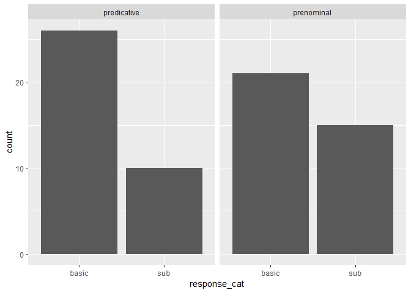
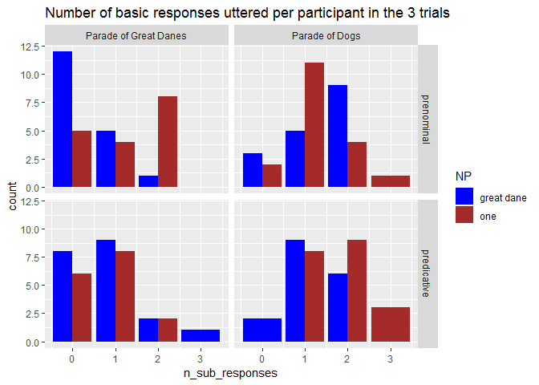
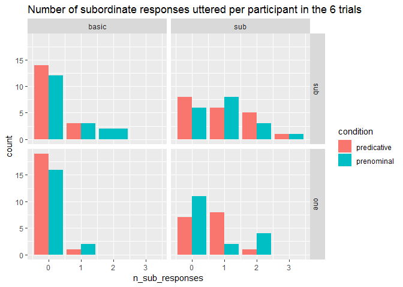

Comparison class inference free production pilot
================
Polina Tsvilodub
08/18/2019

``` r
library(tidyverse)
```

    ## -- Attaching packages --------------------------------------- tidyverse 1.2.1 --

    ## v ggplot2 3.1.0     v purrr   0.2.5
    ## v tibble  1.4.2     v dplyr   0.7.7
    ## v tidyr   0.8.2     v stringr 1.3.1
    ## v readr   1.1.1     v forcats 0.3.0

    ## -- Conflicts ------------------------------------------ tidyverse_conflicts() --
    ## x dplyr::filter() masks stats::filter()
    ## x dplyr::lag()    masks stats::lag()

``` r
library(tidyboot)
```

    ## Warning: package 'tidyboot' was built under R version 3.5.3

``` r
library(brms)
```

    ## Warning: package 'brms' was built under R version 3.5.3

    ## Loading required package: Rcpp

    ## Loading 'brms' package (version 2.8.0). Useful instructions
    ## can be found by typing help('brms'). A more detailed introduction
    ## to the package is available through vignette('brms_overview').

``` r
d1 <- read_csv("../data/results_9_comp-class-inference-pred_batch2.csv")
```

    ## Parsed with column specification:
    ## cols(
    ##   .default = col_character(),
    ##   submission_id = col_integer(),
    ##   experiment_id = col_integer(),
    ##   enjoyment = col_integer(),
    ##   pic_spec = col_integer(),
    ##   age = col_integer(),
    ##   ref_spec = col_integer(),
    ##   trial_number = col_integer(),
    ##   startTime = col_double(),
    ##   attempts = col_integer(),
    ##   fairprice = col_double()
    ## )

    ## See spec(...) for full column specifications.

``` r
d2 <- read_csv("../data/results_9_comp-class-inference-prenom_batch2.csv")
```

    ## Parsed with column specification:
    ## cols(
    ##   .default = col_character(),
    ##   submission_id = col_integer(),
    ##   experiment_id = col_integer(),
    ##   enjoyment = col_integer(),
    ##   pic_spec = col_integer(),
    ##   age = col_integer(),
    ##   ref_spec = col_integer(),
    ##   trial_number = col_integer(),
    ##   startTime = col_double(),
    ##   attempts = col_integer(),
    ##   fairprice = col_double()
    ## )
    ## See spec(...) for full column specifications.

``` r
d3 <- read_csv("../data/results_9_comp-class-inference-pilot.csv")
```

    ## Parsed with column specification:
    ## cols(
    ##   .default = col_character(),
    ##   submission_id = col_integer(),
    ##   experiment_id = col_integer(),
    ##   enjoyment = col_integer(),
    ##   pic_spec = col_integer(),
    ##   age = col_integer(),
    ##   ref_spec = col_integer(),
    ##   trial_number = col_integer(),
    ##   startTime = col_double(),
    ##   attempts = col_integer(),
    ##   fairprice = col_double()
    ## )
    ## See spec(...) for full column specifications.

``` r
d4 <- rbind(d1, d2)

# add the missing column condition to d3 (pilot data)
d3["condition"] <-  ifelse(grepl("That's", d3$text), "prenominal", "predicative")

d <- rbind(d4, d3)

glimpse(d)
```

    ## Observations: 763
    ## Variables: 43
    ## $ submission_id   <int> 419, 419, 419, 419, 419, 419, 419, 419, 419, 4...
    ## $ question        <chr> NA, NA, NA, NA, "Please rephrase your friend's...
    ## $ response1       <chr> "swordfish", "swordfish", "chihuahua", "hummin...
    ## $ sentence_left   <chr> NA, NA, NA, NA, "It is small relative to other...
    ## $ startDate       <chr> "Mon Aug 26 2019 11:05:12 GMT-0400 (Eastern Da...
    ## $ context_picture <chr> NA, NA, NA, NA, "images/bird-parade-hummingbir...
    ## $ experiment_id   <int> 9, 9, 9, 9, 9, 9, 9, 9, 9, 9, 9, 9, 9, 9, 9, 9...
    ## $ picture2        <chr> "warmup/goldfish.png", "warmup/goldfish.png", ...
    ## $ correct1        <chr> "swordfish", "swordfish", "chihuahua", "hummin...
    ## $ question1       <chr> "This is a", "This is a", "This is a", "This i...
    ## $ problems        <chr> "no", "no", "no", "no", "no", "no", "no", "no"...
    ## $ enjoyment       <int> 2, 2, 2, 2, 2, 2, 2, 2, 2, 2, 2, 2, 2, 2, 2, 1...
    ## $ hit_id          <chr> "3HRWUH63QUQZ2X6SLSGHAON9VJ75NK", "3HRWUH63QUQ...
    ## $ item            <chr> "fish", "fish", "dogs", "birds", "birds", "fis...
    ## $ botresponse     <chr> "Patricia", "Patricia", "Patricia", "Patricia"...
    ## $ assignment_id   <chr> "3OCHAWUVGP8AJU3SKNCYYZTDJOLKXM", "3OCHAWUVGP8...
    ## $ correct2        <chr> "goldfish", "goldfish", "doberman", "eagle", N...
    ## $ pic_spec        <int> NA, NA, NA, NA, 1, 1, 0, NA, NA, NA, NA, NA, 0...
    ## $ understand      <chr> "yes", "yes", "yes", "yes", "yes", "yes", "yes...
    ## $ text            <chr> "Please label the pictures below.", "Please la...
    ## $ condition       <chr> NA, NA, NA, NA, "predicative", "predicative", ...
    ## $ age             <int> 49, 49, 49, 49, 49, 49, 49, 49, 49, 49, 49, 49...
    ## $ response        <chr> NA, NA, NA, NA, "birds", "fish", "dogs", NA, N...
    ## $ comments        <chr> "Glad it wasn't case sensitive.", "Glad it was...
    ## $ ref_spec        <int> NA, NA, NA, NA, 1, 0, 1, NA, NA, NA, NA, NA, 0...
    ## $ picture1        <chr> "warmup/swordfish.jpg", "warmup/swordfish.jpg"...
    ## $ response3       <chr> "fist", "fish", "dogs", "birds", NA, NA, NA, "...
    ## $ education       <chr> "some_college", "some_college", "some_college"...
    ## $ target_size     <chr> NA, NA, NA, NA, "small", "small", "big", NA, N...
    ## $ worker_id       <chr> "A2GKVSPM1AI44X", "A2GKVSPM1AI44X", "A2GKVSPM1...
    ## $ languages       <chr> "english", "english", "english", "english", "e...
    ## $ sex             <chr> "female", "female", "female", "female", "femal...
    ## $ RT              <chr> NA, NA, NA, NA, NA, NA, NA, NA, NA, NA, NA, NA...
    ## $ correct3        <chr> "fish", "fish", "dogs", "birds", NA, NA, NA, "...
    ## $ context         <chr> NA, NA, NA, NA, "You and your friend see the f...
    ## $ trial_number    <int> 1, 1, 2, 3, 1, 2, 3, 1, 1, 2, 2, 3, 1, 2, 3, 1...
    ## $ startTime       <dbl> 1.566832e+12, 1.566832e+12, 1.566832e+12, 1.56...
    ## $ attempts        <int> 1, 2, 1, 1, NA, NA, NA, 1, 2, 1, 2, 1, NA, NA,...
    ## $ question3       <chr> "This is a", "This is a", "This is a", "This i...
    ## $ fairprice       <dbl> 1, 1, 1, 1, 1, 1, 1, 1, 1, 1, 1, 1, 1, 1, 1, 1...
    ## $ question2       <chr> "These are both", "These are both", "These are...
    ## $ response2       <chr> "goldfish", "goldfish", "doberman", "eagle", N...
    ## $ trial_name      <chr> "warmup1", "warmup1", "warmup1", "warmup1", "c...

``` r
d %>% distinct(d$languages)# %>% View()
```

    ## # A tibble: 6 x 1
    ##   `d$languages` 
    ##   <chr>         
    ## 1 english       
    ## 2 English       
    ## 3 <NA>          
    ## 4 English, Dutch
    ## 5 englsih       
    ## 6 Englilsh

``` r
d_filt <- d %>% 
  filter(grepl("english", languages, ignore.case = T))

# choose main trials 
d_main <- d_filt %>% filter((trial_name == "custom_main_text1")|(trial_name == "custom_main_text2")) %>% select(submission_id, trial_number, ref_spec, pic_spec, item, response, condition, context, text)

d_main %>% distinct(d_main$response) %>% View()
d_comments <- d %>% distinct(d$comments) %>% View()
```

## Response categorization

``` r
# remove invalid responses 
d_main_valid <- subset(d_main, !(response %in% c("Yes", "That one is big", "That chihuahua is small", "That great dane is big", "those dogs are small", "the swordfish are big", "those eagles are big", "those dandelions are small", "that tree on the far left is big", "that pug on the left is small", "ones", "this is a little pug", "there is a little bonsai", "that's a big dog", "that sunflower is large", "that is a little bird", "that fish is large" ))) 

# categorize responses
d_main_responseCat <- d_main_valid %>%
  rowwise() %>%
  mutate(  
    response_cat =
      ifelse(
      tolower(response) %in% c("birds", "dogs", "fish", "flowers", "flower", "large dogs", "dogs in the line", "other birds in the group", "small dogs", "trees"), "basic", ifelse(tolower(response) %in% c("plant", "animal"), "super", "sub")),
    
    response_num = ifelse(response_cat == "sub", 1, 0),
    response_label = "sub"
  )
```

``` r
# raw reponse counts by syntactic condition (6 participants each)
 d_main_responseCat %>% ggplot(aes(x=response_cat)) + geom_bar(position=position_dodge()) + facet_wrap(~condition) 
```

<!-- --> \#\#
Proportion of sub responses by syntactic condition, picture specificity
and NP specificity

Expectations: When the underspecified ‘one’ is used, participants infer
the comparison class froom the perceptual context: subordinate label
(comparison class) for the subordinate parade, basic-level label for the
basic-level parade. When thue subordinate noun phrase is used, the
prenominal syntax sets the comparison class, whereas the predicative
syntax allows for stronger context influence: more basic-level labels in
the basic-level context are expected than in the subordinate
context.

``` r
#d_main_responseCat %>% group_by(response_label, ref_spec, pic_spec, condition) %>% tidyboot_mean(column = response_num) %>% ungroup() %>%   mutate(NP_spec = factor(ref_spec, levels= c(0, 1), labels = c("sub", "one")), condition = factor(condition, levels = c("predicative", "prenominal"), labels = c("That NP is big", "That's a big NP")), context_spec = factor(pic_spec, levels = c(0, 1), labels = c("basic", "sub"))) %>% ggplot(aes(x=context_spec, fill= NP_spec, y = mean, ymin = ci_lower, ymax = ci_upper)) +   geom_col(position = position_dodge(0.8))+   geom_linerange(position = position_dodge(0.8)) + facet_wrap(~condition)
```

## Sub responses proportion by noun phrase

``` r
 # d_main_responseCat %>% group_by(response_label, ref_spec, pic_spec, condition) %>% tidyboot_mean(column = response_num) %>% ungroup() %>% 
#  mutate(NP_spec = factor(ref_spec, levels= c(0, 1), labels = c("subordinate", "one")), condition = factor(condition, levels = c("predicative", "prenominal"), labels = c("That NP is big", "That's a big NP")), context_spec = factor(pic_spec, levels = c(0, 1), labels = c("basic", "sub"))) %>% ggplot(aes(x=context_spec, fill= condition, y = mean, ymin = ci_lower, ymax = ci_upper)) + geom_col(position = position_dodge(0.8))+  geom_linerange(position = position_dodge(0.8)) + facet_wrap(~NP_spec)
```

## Sub responses proportion by context condition

``` r
d_main_responseCat %>% group_by(response_label, ref_spec, pic_spec, condition) %>% tidyboot_mean(column = response_num) %>% ungroup() %>% 
  mutate(NP = factor(ref_spec, levels= c(0, 1), labels = c("subordinate", "one")),
         condition = factor(condition, levels = c("predicative", "prenominal"), labels = c("That NP is big", "That's a big NP")), context_spec = factor(pic_spec, levels = c(0, 1), labels = c("basic", "sub"))) %>% ggplot(aes(x=condition, fill= NP, y = mean, ymin = ci_lower, ymax = ci_upper)) + geom_col(position = position_dodge(0.8))+   geom_linerange(position = position_dodge(0.8)) + facet_wrap(~context_spec)  
```

    ## Warning: Grouping rowwise data frame strips rowwise nature

<!-- -->

## Stats

``` r
library(lme4)
```

    ## Loading required package: Matrix

    ## 
    ## Attaching package: 'Matrix'

    ## The following object is masked from 'package:tidyr':
    ## 
    ##     expand

    ## 
    ## Attaching package: 'lme4'

    ## The following object is masked from 'package:brms':
    ## 
    ##     ngrps

``` r
lm.fit <- glmer(response_num ~ condition*ref_spec*pic_spec + (1|submission_id), data = d_main_responseCat, family = "binomial" )
summary(lm.fit)
```

    ## Generalized linear mixed model fit by maximum likelihood (Laplace
    ##   Approximation) [glmerMod]
    ##  Family: binomial  ( logit )
    ## Formula: 
    ## response_num ~ condition * ref_spec * pic_spec + (1 | submission_id)
    ##    Data: d_main_responseCat
    ## 
    ##      AIC      BIC   logLik deviance df.resid 
    ##    195.0    225.8    -88.5    177.0      217 
    ## 
    ## Scaled residuals: 
    ##     Min      1Q  Median      3Q     Max 
    ## -1.9036 -0.2708 -0.0884  0.1794 10.9305 
    ## 
    ## Random effects:
    ##  Groups        Name        Variance Std.Dev.
    ##  submission_id (Intercept) 7.774    2.788   
    ## Number of obs: 226, groups:  submission_id, 38
    ## 
    ## Fixed effects:
    ##                                       Estimate Std. Error z value Pr(>|z|)
    ## (Intercept)                            -3.2846     1.0906  -3.012   0.0026
    ## conditionprenominal                     0.5799     1.4428   0.402   0.6877
    ## ref_spec                               -2.2213     1.3671  -1.625   0.1042
    ## pic_spec                                3.1678     0.9780   3.239   0.0012
    ## conditionprenominal:ref_spec            0.1455     1.8535   0.079   0.9374
    ## conditionprenominal:pic_spec            1.3655     1.5543   0.879   0.3796
    ## ref_spec:pic_spec                       1.7144     1.6256   1.055   0.2916
    ## conditionprenominal:ref_spec:pic_spec  -2.9756     2.3525  -1.265   0.2059
    ##                                         
    ## (Intercept)                           **
    ## conditionprenominal                     
    ## ref_spec                                
    ## pic_spec                              **
    ## conditionprenominal:ref_spec            
    ## conditionprenominal:pic_spec            
    ## ref_spec:pic_spec                       
    ## conditionprenominal:ref_spec:pic_spec   
    ## ---
    ## Signif. codes:  0 '***' 0.001 '**' 0.01 '*' 0.05 '.' 0.1 ' ' 1
    ## 
    ## Correlation of Fixed Effects:
    ##                (Intr) cndtnp rf_spc pc_spc cndtnprnmnl:r_ cndtnprnmnl:p_
    ## cndtnprnmnl    -0.650                                                   
    ## ref_spec       -0.355  0.296                                            
    ## pic_spec       -0.675  0.447  0.411                                     
    ## cndtnprnmnl:r_  0.300 -0.392 -0.728 -0.326                              
    ## cndtnprnmnl:p_  0.275 -0.595 -0.298 -0.539  0.344                       
    ## rf_spc:pc_s     0.334 -0.271 -0.870 -0.544  0.636          0.368        
    ## cndtnpr:_:_    -0.187  0.386  0.613  0.349 -0.805         -0.624        
    ##                rf_s:_
    ## cndtnprnmnl          
    ## ref_spec             
    ## pic_spec             
    ## cndtnprnmnl:r_       
    ## cndtnprnmnl:p_       
    ## rf_spc:pc_s          
    ## cndtnpr:_:_    -0.699

## Table

``` r
d_main_responseCat %>% group_by(condition, ref_spec, pic_spec) %>% count()
```

    ## Warning: Grouping rowwise data frame strips rowwise nature

    ## # A tibble: 8 x 4
    ## # Groups:   condition, ref_spec, pic_spec [8]
    ##   condition   ref_spec pic_spec     n
    ##   <chr>          <int>    <int> <int>
    ## 1 predicative        0        0    24
    ## 2 predicative        0        1    35
    ## 3 predicative        1        0    36
    ## 4 predicative        1        1    23
    ## 5 prenominal         0        0    30
    ## 6 prenominal         0        1    24
    ## 7 prenominal         1        0    24
    ## 8 prenominal         1        1    30

## Sub response proportions by item and syntactic condition

``` r
d_main_responseCat %>% group_by(item, condition, response_label, ref_spec, pic_spec) %>% 
  tidyboot_mean(column = response_num) %>% ungroup() %>% 
  mutate(NP_spec = factor(ref_spec, levels= c(0, 1), labels = c("sub", "one")),
         context_spec = factor(pic_spec, levels = c(0, 1), labels = c("basic", "sub"))) %>% ggplot(aes(x=context_spec, fill= NP_spec, y = mean, ymin = ci_lower, ymax = ci_upper)) +
  geom_col(position = position_dodge(0.8))+
  geom_linerange(position = position_dodge(0.8)) + facet_grid(condition~item)
```

    ## Warning: Grouping rowwise data frame strips rowwise nature

<!-- --> \#\# Sub
responses proportion per participant

``` r
d_main_responseCat %>%
  group_by(submission_id, condition, response_label, ref_spec, pic_spec) %>%
  summarize(n_sub_responses = sum(response_num)) %>%
  ungroup() %>% mutate(NP_spec = factor(ref_spec, levels= c(0, 1), labels = c("sub", "one")), context_spec = factor(pic_spec, levels = c(0, 1), labels = c("basic", "sub"))) %>%
  ggplot(., aes( x = n_sub_responses, fill=condition))+
  geom_bar(position=position_dodge())+
  facet_grid(NP_spec~context_spec) + ggtitle("Number of subordinate responses uttered per participant in the 6 trials")
```

    ## Warning: Grouping rowwise data frame strips rowwise nature

<!-- -->
