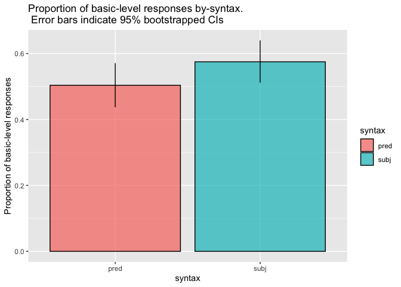
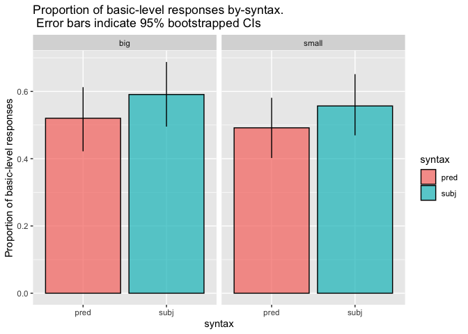
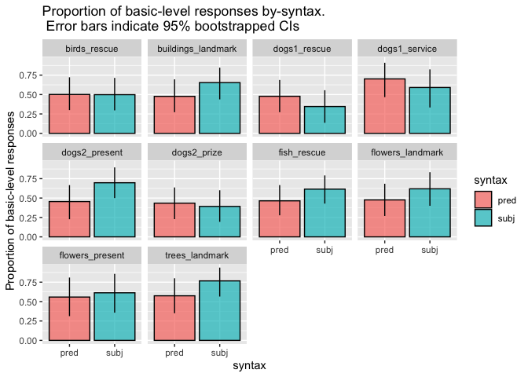

Direct Modification Forced Choice Pilot
================
Polina Tsvilodub
4/8/2021

``` r
library(tidyverse)
```

    ## ── Attaching packages ────────────────────────────────────────────────────── tidyverse 1.3.0 ──

    ## ✓ ggplot2 3.3.1     ✓ purrr   0.3.4
    ## ✓ tibble  3.0.1     ✓ dplyr   1.0.0
    ## ✓ tidyr   1.1.0     ✓ stringr 1.4.0
    ## ✓ readr   1.3.1     ✓ forcats 0.5.0

    ## ── Conflicts ───────────────────────────────────────────────────────── tidyverse_conflicts() ──
    ## x dplyr::filter() masks stats::filter()
    ## x dplyr::lag()    masks stats::lag()

``` r
library(tidyboot)
library(brms)
```

    ## Loading required package: Rcpp

    ## Loading 'brms' package (version 2.13.0). Useful instructions
    ## can be found by typing help('brms'). A more detailed introduction
    ## to the package is available through vignette('brms_overview').

    ## 
    ## Attaching package: 'brms'

    ## The following object is masked from 'package:stats':
    ## 
    ##     ar

``` r
d <- read_csv("~/Documents/Research/refpred/data/direct-modification/results_39_double-mod-FC-pilot_N40.csv")
```

    ## Parsed with column specification:
    ## cols(
    ##   .default = col_character(),
    ##   submission_id = col_double(),
    ##   experiment_id = col_double(),
    ##   enjoyment = col_double(),
    ##   trials = col_double(),
    ##   age = col_double(),
    ##   RT = col_double(),
    ##   trial_number = col_double(),
    ##   startTime = col_double(),
    ##   attempts = col_double(),
    ##   fairprice = col_double()
    ## )

    ## See spec(...) for full column specifications.

``` r
# d %>% filter(prolific_id != "mhm") %>% select(-prolific_id) %>%  write_csv("~/Documents/Research/refpred/data/direct-modification/results_39_double-mod-FC-pilot_N40.csv")
```

``` r
# exclusions
d %>% distinct(comments) %>% View()
d %>% distinct(languages)
```

    ## # A tibble: 4 x 1
    ##   languages         
    ##   <chr>             
    ## 1 English           
    ## 2 english           
    ## 3 <NA>              
    ## 4 English and Korean

``` r
d %>% distinct(submission_id) %>% count() %>% pull()
```

    ## [1] 39

``` r
d_native <- d %>% filter(grepl("en", languages, ignore.case = T))
d_native %>% distinct(submission_id) %>% count() %>% pull()
```

    ## [1] 36

``` r
d_main <- d_native %>% filter(!is.na(trial_type)) 

d_main %>% count(item_noun, syntax)
```

    ## # A tibble: 20 x 3
    ##    item_noun          syntax     n
    ##    <chr>              <chr>  <int>
    ##  1 birds_rescue       pred      24
    ##  2 birds_rescue       subj      24
    ##  3 buildings_landmark pred      23
    ##  4 buildings_landmark subj      23
    ##  5 dogs1_rescue       pred      23
    ##  6 dogs1_rescue       subj      23
    ##  7 dogs1_service      pred      17
    ##  8 dogs1_service      subj      17
    ##  9 dogs2_present      pred      20
    ## 10 dogs2_present      subj      20
    ## 11 dogs2_prize        pred      23
    ## 12 dogs2_prize        subj      23
    ## 13 fish_rescue        pred      28
    ## 14 fish_rescue        subj      28
    ## 15 flowers_landmark   pred      21
    ## 16 flowers_landmark   subj      21
    ## 17 flowers_present    pred      16
    ## 18 flowers_present    subj      16
    ## 19 trees_landmark     pred      21
    ## 20 trees_landmark     subj      21

``` r
d_main %>% count(syntax, adj)
```

    ## # A tibble: 4 x 3
    ##   syntax adj       n
    ##   <chr>  <chr> <int>
    ## 1 pred   big     108
    ## 2 pred   small   108
    ## 3 subj   big     108
    ## 4 subj   small   108

``` r
d_main_cat <- d_main %>%
  rowwise() %>%
  mutate(response_cat = case_when(grepl(target, response) ~ "subordinate",
                                  (target == "doberman" & response == "dobermen") ~ "subordinate",
                                  (target == "Great Dane" & response == "Great") ~ "subordinate",
                                  TRUE ~ "basic"
                                  ),
         response_num = ifelse(response_cat == "basic", 1, 0))
```

``` r
d_main_cat_summary <- d_main_cat %>% group_by(syntax) %>%
  tidyboot_mean(column = response_num)
```

    ## Warning: `as_data_frame()` is deprecated as of tibble 2.0.0.
    ## Please use `as_tibble()` instead.
    ## The signature and semantics have changed, see `?as_tibble`.
    ## This warning is displayed once every 8 hours.
    ## Call `lifecycle::last_warnings()` to see where this warning was generated.

    ## Warning: `cols` is now required when using unnest().
    ## Please use `cols = c(strap)`

``` r
d_main_cat_summary %>%
  ggplot(., aes(x = syntax, y = mean, fill = syntax, ymin = ci_lower, ymax = ci_upper,)) +
  geom_col(alpha = 0.7, color = "black") +
  geom_linerange() +
  ylab("Proportion of basic-level responses") +
  ggtitle("Proportion of basic-level responses by-syntax.\n Error bars indicate 95% bootstrapped CIs")
```

<!-- -->

``` r
d_main_cat_size_summary <- d_main_cat %>% group_by(syntax, adj) %>%
  tidyboot_mean(column = response_num)
```

    ## Warning: `cols` is now required when using unnest().
    ## Please use `cols = c(strap)`

``` r
d_main_cat_size_summary %>%
  ggplot(., aes(x = syntax, y = mean, fill = syntax, ymin = ci_lower, ymax = ci_upper,)) +
  geom_col(alpha = 0.7, color = "black") +
  geom_linerange() +
  ylab("Proportion of basic-level responses") +
  facet_wrap(~adj) +
  ggtitle("Proportion of basic-level responses by-syntax.\n Error bars indicate 95% bootstrapped CIs")
```

<!-- -->

``` r
d_main_cat_item_summary <- d_main_cat %>% group_by(syntax, item_noun) %>%
  tidyboot_mean(column = response_num)
```

    ## Warning: `cols` is now required when using unnest().
    ## Please use `cols = c(strap)`

``` r
d_main_cat_item_summary %>%
  ggplot(., aes(x = syntax, y = mean, fill = syntax, ymin = ci_lower, ymax = ci_upper,)) +
  geom_col(alpha = 0.7, color = "black") +
  geom_linerange() +
  ylab("Proportion of basic-level responses") +
  facet_wrap(~item_noun) +
  ggtitle("Proportion of basic-level responses by-syntax.\n Error bars indicate 95% bootstrapped CIs")
```

<!-- -->

``` r
d_main_cat <- d_main_cat %>% mutate(
  unique_target = paste(target, ref_np, sep = "_")
)
model <- brm(response_num ~ syntax + (1 + syntax | submission_id) + 
               (1 + syntax | unique_target ),
             data = d_main_cat,
             family = "bernoulli",
             iter = 2000,
             cores = 4)
```

    ## Compiling the C++ model

    ## Trying to compile a simple C file

    ## Start sampling

    ## Warning: There were 1 divergent transitions after warmup. Increasing adapt_delta above 0.8 may help. See
    ## http://mc-stan.org/misc/warnings.html#divergent-transitions-after-warmup

    ## Warning: Examine the pairs() plot to diagnose sampling problems

``` r
summary(model)
```

    ## Warning: There were 1 divergent transitions after warmup. Increasing adapt_delta
    ## above 0.8 may help. See http://mc-stan.org/misc/warnings.html#divergent-
    ## transitions-after-warmup

    ##  Family: bernoulli 
    ##   Links: mu = logit 
    ## Formula: response_num ~ syntax + (1 + syntax | submission_id) + (1 + syntax | unique_target) 
    ##    Data: d_main_cat (Number of observations: 432) 
    ## Samples: 4 chains, each with iter = 2000; warmup = 1000; thin = 1;
    ##          total post-warmup samples = 4000
    ## 
    ## Group-Level Effects: 
    ## ~submission_id (Number of levels: 36) 
    ##                           Estimate Est.Error l-95% CI u-95% CI Rhat Bulk_ESS
    ## sd(Intercept)                 2.13      0.48     1.37     3.24 1.00     1115
    ## sd(syntaxsubj)                0.74      0.46     0.05     1.74 1.01      711
    ## cor(Intercept,syntaxsubj)    -0.45      0.46    -0.98     0.73 1.00     2762
    ##                           Tail_ESS
    ## sd(Intercept)                 1843
    ## sd(syntaxsubj)                1386
    ## cor(Intercept,syntaxsubj)     2224
    ## 
    ## ~unique_target (Number of levels: 20) 
    ##                           Estimate Est.Error l-95% CI u-95% CI Rhat Bulk_ESS
    ## sd(Intercept)                 0.33      0.23     0.01     0.86 1.00     1278
    ## sd(syntaxsubj)                0.59      0.35     0.04     1.32 1.01      990
    ## cor(Intercept,syntaxsubj)     0.03      0.55    -0.91     0.95 1.00     1114
    ##                           Tail_ESS
    ## sd(Intercept)                 2021
    ## sd(syntaxsubj)                1577
    ## cor(Intercept,syntaxsubj)     1396
    ## 
    ## Population-Level Effects: 
    ##            Estimate Est.Error l-95% CI u-95% CI Rhat Bulk_ESS Tail_ESS
    ## Intercept      0.02      0.43    -0.83     0.86 1.00      851     1267
    ## syntaxsubj     0.43      0.33    -0.21     1.11 1.00     2474     2389
    ## 
    ## Samples were drawn using sampling(NUTS). For each parameter, Bulk_ESS
    ## and Tail_ESS are effective sample size measures, and Rhat is the potential
    ## scale reduction factor on split chains (at convergence, Rhat = 1).
