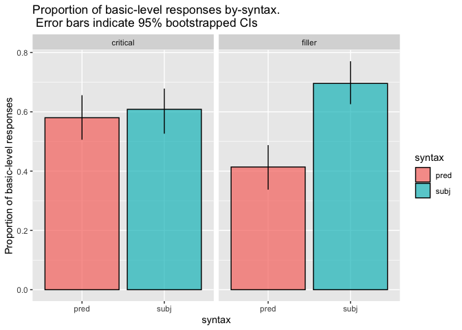
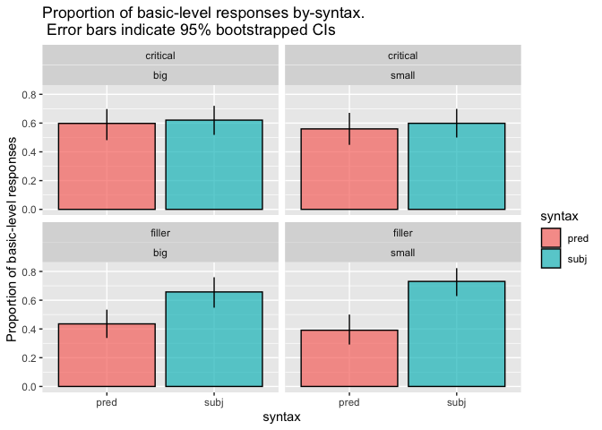
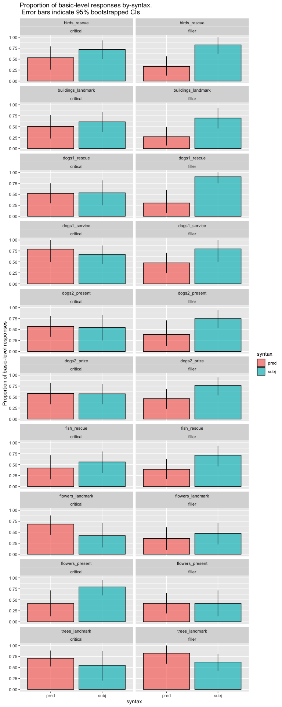

Direct Modification Forced Choice Pilot
================
Polina Tsvilodub
4/9/2021

``` r
library(tidyverse)
```

    ## ── Attaching packages ───────────────────────────────────────────────────────────────────────────────────────── tidyverse 1.3.0 ──

    ## ✓ ggplot2 3.3.1     ✓ purrr   0.3.4
    ## ✓ tibble  3.0.1     ✓ dplyr   1.0.0
    ## ✓ tidyr   1.1.0     ✓ stringr 1.4.0
    ## ✓ readr   1.3.1     ✓ forcats 0.5.0

    ## ── Conflicts ──────────────────────────────────────────────────────────────────────────────────────────── tidyverse_conflicts() ──
    ## x dplyr::filter() masks stats::filter()
    ## x dplyr::lag()    masks stats::lag()

``` r
library(tidyboot)
library(brms)
```

    ## Loading required package: Rcpp

    ## Loading 'brms' package (version 2.13.0). Useful instructions
    ## can be found by typing help('brms'). A more detailed introduction
    ## to the package is available through vignette('brms_overview').

    ## 
    ## Attaching package: 'brms'

    ## The following object is masked from 'package:stats':
    ## 
    ##     ar

``` r
d <- read_csv("~/Documents/Research/refpred/data/direct-modification/results_40_double-mod-FC-wFilers-pilot_N50.csv")
```

    ## Parsed with column specification:
    ## cols(
    ##   .default = col_character(),
    ##   submission_id = col_double(),
    ##   experiment_id = col_double(),
    ##   enjoyment = col_double(),
    ##   trials = col_double(),
    ##   age = col_double(),
    ##   RT = col_double(),
    ##   trial_number = col_double(),
    ##   startTime = col_double(),
    ##   attempts = col_double(),
    ##   fairprice = col_double()
    ## )

    ## See spec(...) for full column specifications.

``` r
#d %>% select(-prolific_id) %>%  write_csv("~/Documents/Research/refpred/data/direct-modification/results_40_double-mod-FC-wFilers-pilot_N50.csv")
```

``` r
# exclusions
d %>% distinct(comments) %>% View()
d %>% distinct(problems) %>% View()
d %>% distinct(languages)
```

    ## # A tibble: 5 x 1
    ##   languages       
    ##   <chr>           
    ## 1 English         
    ## 2 english         
    ## 3 English, Spanish
    ## 4 <NA>            
    ## 5 American English

``` r
d %>% distinct(submission_id) %>% count() %>% pull()
```

    ## [1] 47

``` r
d_native <- d %>% filter(grepl("en", languages, ignore.case = T))
d_native %>% distinct(submission_id) %>% count() %>% pull()
```

    ## [1] 43

``` r
# only accept workers who get the paraphrase warmup trial with max. 3 attempts
d_warmup_catch <- d_native %>% filter(trial_name == "comp_class_warmup") %>% group_by(submission_id) %>% filter(attempts > 3)
d_clean <- anti_join(d_native, d_warmup_catch, by = "submission_id")
d_clean %>% distinct(submission_id) %>% count() %>% pull()
```

    ## [1] 41

``` r
d_main <- d_clean %>% filter(!is.na(trial_type)) 

d_main %>% count(trial_type, item_noun, syntax)
```

    ## # A tibble: 40 x 4
    ##    trial_type item_noun          syntax     n
    ##    <chr>      <chr>              <chr>  <int>
    ##  1 critical   birds_rescue       pred      17
    ##  2 critical   birds_rescue       subj      18
    ##  3 critical   buildings_landmark pred      16
    ##  4 critical   buildings_landmark subj      18
    ##  5 critical   dogs1_rescue       pred      19
    ##  6 critical   dogs1_rescue       subj      13
    ##  7 critical   dogs1_service      pred      10
    ##  8 critical   dogs1_service      subj      21
    ##  9 critical   dogs2_present      pred      16
    ## 10 critical   dogs2_present      subj      13
    ## # … with 30 more rows

``` r
d_main %>% count(trial_type, syntax, adj)
```

    ## # A tibble: 8 x 4
    ##   trial_type syntax adj       n
    ##   <chr>      <chr>  <chr> <int>
    ## 1 critical   pred   big      82
    ## 2 critical   pred   small    82
    ## 3 critical   subj   big      82
    ## 4 critical   subj   small    82
    ## 5 filler     pred   big      82
    ## 6 filler     pred   small    82
    ## 7 filler     subj   big      82
    ## 8 filler     subj   small    82

``` r
d_main_cat <- d_main %>%
  rowwise() %>%
  mutate(response_cat = case_when(grepl(target, response) ~ "subordinate",
                                  (target == "doberman" & response == "dobermen") ~ "subordinate",
                                  (target == "Great Dane" & response == "Great") ~ "subordinate",
                                  TRUE ~ "basic"
                                  ),
         response_num = ifelse(response_cat == "basic", 1, 0))
```

``` r
d_main_cat_summary <- d_main_cat %>% group_by(syntax, trial_type) %>%
  tidyboot_mean(column = response_num)
```

    ## Warning: `as_data_frame()` is deprecated as of tibble 2.0.0.
    ## Please use `as_tibble()` instead.
    ## The signature and semantics have changed, see `?as_tibble`.
    ## This warning is displayed once every 8 hours.
    ## Call `lifecycle::last_warnings()` to see where this warning was generated.

    ## Warning: `cols` is now required when using unnest().
    ## Please use `cols = c(strap)`

``` r
d_main_cat_summary %>%
  ggplot(., aes(x = syntax, y = mean, fill = syntax, ymin = ci_lower, ymax = ci_upper,)) +
  geom_col(alpha = 0.7, color = "black") +
  geom_linerange() +
  facet_wrap(~trial_type) +
  ylab("Proportion of basic-level responses") +
  ggtitle("Proportion of basic-level responses by-syntax.\n Error bars indicate 95% bootstrapped CIs")
```

<!-- -->

``` r
d_main_cat_size_summary <- d_main_cat %>% group_by(syntax, adj, trial_type) %>%
  tidyboot_mean(column = response_num)
```

    ## Warning: `cols` is now required when using unnest().
    ## Please use `cols = c(strap)`

``` r
d_main_cat_size_summary %>%
  ggplot(., aes(x = syntax, y = mean, fill = syntax, ymin = ci_lower, ymax = ci_upper,)) +
  geom_col(alpha = 0.7, color = "black") +
  geom_linerange() +
  ylab("Proportion of basic-level responses") +
  facet_wrap(trial_type~adj) +
  ggtitle("Proportion of basic-level responses by-syntax.\n Error bars indicate 95% bootstrapped CIs")
```

<!-- -->

``` r
d_main_cat_item_summary <- d_main_cat %>% group_by(syntax, item_noun, trial_type) %>%
  tidyboot_mean(column = response_num)
```

    ## Warning: `cols` is now required when using unnest().
    ## Please use `cols = c(strap)`

``` r
d_main_cat_item_summary %>%
  ggplot(., aes(x = syntax, y = mean, fill = syntax, ymin = ci_lower, ymax = ci_upper,)) +
  geom_col(alpha = 0.7, color = "black") +
  geom_linerange() +
  ylab("Proportion of basic-level responses") +
  facet_wrap(item_noun~trial_type, ncol = 2) +
  ggtitle("Proportion of basic-level responses by-syntax.\n Error bars indicate 95% bootstrapped CIs")
```

<!-- -->

``` r
d_main_cat <- d_main_cat %>% mutate(
  unique_target = ifelse(trial_type == "critical", paste(target, ref_np, sep = "_"), target),
  syntax = factor(syntax, levels = c("subj", "pred")),
  trial_type = factor(trial_type)
)
contrasts(d_main_cat$trial_type) <- contr.sum(2)
contrasts(d_main_cat$syntax) <- contr.sum(2)
model <- brm(response_num ~ syntax*trial_type + (1 + syntax*trial_type || submission_id) + 
               (1 + syntax*trial_type || unique_target ),
             data = d_main_cat,
             family = "bernoulli",
             iter = 2000,
             cores = 4)
```

    ## Compiling the C++ model

    ## Trying to compile a simple C file

    ## Start sampling

``` r
summary(model)
```

    ##  Family: bernoulli 
    ##   Links: mu = logit 
    ## Formula: response_num ~ syntax * trial_type + (1 + syntax * trial_type || submission_id) + (1 + syntax * trial_type || unique_target) 
    ##    Data: d_main_cat (Number of observations: 656) 
    ## Samples: 4 chains, each with iter = 2000; warmup = 1000; thin = 1;
    ##          total post-warmup samples = 4000
    ## 
    ## Group-Level Effects: 
    ## ~submission_id (Number of levels: 41) 
    ##                         Estimate Est.Error l-95% CI u-95% CI Rhat Bulk_ESS
    ## sd(Intercept)               1.03      0.18     0.71     1.44 1.00     1718
    ## sd(syntax1)                 0.15      0.11     0.01     0.42 1.00     1863
    ## sd(trial_type1)             0.49      0.18     0.12     0.85 1.01      858
    ## sd(syntax1:trial_type1)     0.49      0.17     0.15     0.82 1.01      766
    ##                         Tail_ESS
    ## sd(Intercept)               2825
    ## sd(syntax1)                 1955
    ## sd(trial_type1)              906
    ## sd(syntax1:trial_type1)     1097
    ## 
    ## ~unique_target (Number of levels: 34) 
    ##                         Estimate Est.Error l-95% CI u-95% CI Rhat Bulk_ESS
    ## sd(Intercept)               0.22      0.15     0.01     0.56 1.00     1544
    ## sd(syntax1)                 0.24      0.16     0.01     0.60 1.00     1117
    ## sd(trial_type1)             0.22      0.15     0.01     0.55 1.00     1251
    ## sd(syntax1:trial_type1)     0.26      0.17     0.01     0.61 1.00     1087
    ##                         Tail_ESS
    ## sd(Intercept)               2061
    ## sd(syntax1)                 1734
    ## sd(trial_type1)             2124
    ## sd(syntax1:trial_type1)     1702
    ## 
    ## Population-Level Effects: 
    ##                     Estimate Est.Error l-95% CI u-95% CI Rhat Bulk_ESS Tail_ESS
    ## Intercept               0.41      0.20     0.02     0.82 1.00     2453     2748
    ## syntax1                 0.44      0.12     0.20     0.68 1.00     4845     3059
    ## trial_type1             0.09      0.14    -0.19     0.37 1.00     3878     2912
    ## syntax1:trial_type1    -0.37      0.15    -0.67    -0.08 1.00     4020     3250
    ## 
    ## Samples were drawn using sampling(NUTS). For each parameter, Bulk_ESS
    ## and Tail_ESS are effective sample size measures, and Rhat is the potential
    ## scale reduction factor on split chains (at convergence, Rhat = 1).
