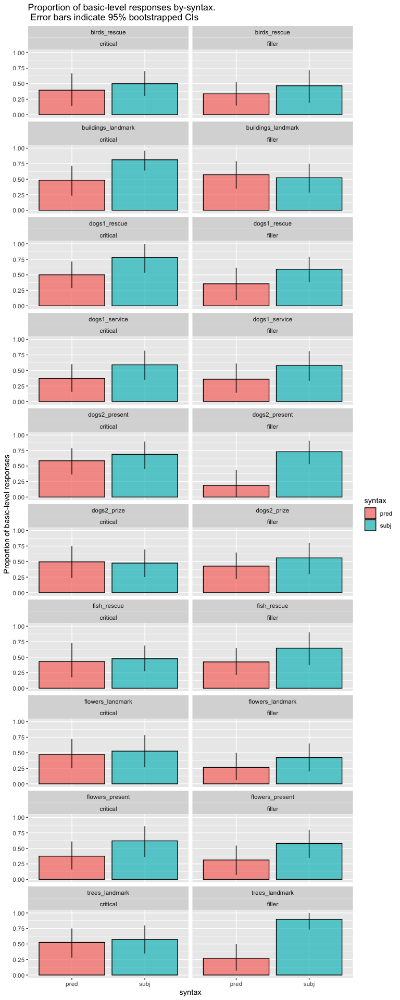

Direct Modification Forced Choice Pilot
================
Polina Tsvilodub
4/9/2021

``` r
library(tidyverse)
```

    ## ── Attaching packages ───────────────────────────────────────────────────────────────────────────────────────── tidyverse 1.3.0 ──

    ## ✓ ggplot2 3.3.1     ✓ purrr   0.3.4
    ## ✓ tibble  3.0.1     ✓ dplyr   1.0.0
    ## ✓ tidyr   1.1.0     ✓ stringr 1.4.0
    ## ✓ readr   1.3.1     ✓ forcats 0.5.0

    ## ── Conflicts ──────────────────────────────────────────────────────────────────────────────────────────── tidyverse_conflicts() ──
    ## x dplyr::filter() masks stats::filter()
    ## x dplyr::lag()    masks stats::lag()

``` r
library(tidyboot)
library(brms)
```

    ## Loading required package: Rcpp

    ## Loading 'brms' package (version 2.13.0). Useful instructions
    ## can be found by typing help('brms'). A more detailed introduction
    ## to the package is available through vignette('brms_overview').

    ## 
    ## Attaching package: 'brms'

    ## The following object is masked from 'package:stats':
    ## 
    ##     ar

``` r
d <- read_csv("./../../data/direct-modification/results_41_double-mod-FC-wFilers-noTarget-pilot_N50.csv")
```

    ## Parsed with column specification:
    ## cols(
    ##   .default = col_character(),
    ##   submission_id = col_double(),
    ##   experiment_id = col_double(),
    ##   enjoyment = col_double(),
    ##   trials = col_double(),
    ##   age = col_double(),
    ##   RT = col_double(),
    ##   trial_number = col_double(),
    ##   startTime = col_double(),
    ##   attempts = col_double(),
    ##   fairprice = col_double()
    ## )

    ## See spec(...) for full column specifications.

``` r
#d <- read_csv("~/projects/refpred/data/direct-modification/results_41_double-mod-FC-wFilers-noTarget-pilot_N50.csv")
#d %>% select(-prolific_id) %>% write_csv("~/Documents/Research/refpred/data/direct-modification/results_41_double-mod-FC-wFilers-noTarget-pilot_N50.csv")
```

``` r
# exclusions
d %>% distinct(comments) 
```

    ## # A tibble: 16 x 1
    ##    comments                                                                     
    ##    <chr>                                                                        
    ##  1  <NA>                                                                        
    ##  2 "I still don't understand the \"(Not shown)\" in the description"            
    ##  3 "n/a"                                                                        
    ##  4 "N/A"                                                                        
    ##  5 "Enjoyed the study."                                                         
    ##  6 "I saw two ways to answer each question. I am unsure if there was a wrong an…
    ##  7 "N/A. Thank you!"                                                            
    ##  8 "Thanks."                                                                    
    ##  9 "none"                                                                       
    ## 10 "NOTHING"                                                                    
    ## 11 "No"                                                                         
    ## 12 "None"                                                                       
    ## 13 "No comments to add."                                                        
    ## 14 "no"                                                                         
    ## 15 "This made me realize that I don't consciously recognize which subject I'm d…
    ## 16 "it felt difficult to decide which one without further context, thought of a…

``` r
d %>% distinct(problems) 
```

    ## # A tibble: 16 x 1
    ##    problems                                                                     
    ##    <chr>                                                                        
    ##  1 No                                                                           
    ##  2 No.                                                                          
    ##  3 No glitches                                                                  
    ##  4 n/a                                                                          
    ##  5 <NA>                                                                         
    ##  6 no                                                                           
    ##  7 None                                                                         
    ##  8 Nope!                                                                        
    ##  9 none                                                                         
    ## 10 NO                                                                           
    ## 11 There were no problems                                                       
    ## 12 No glitches. Smooth sailing.                                                 
    ## 13 None at all.                                                                 
    ## 14 no it all went well                                                          
    ## 15 No it just took a while for the survey to start and i thought it was a site …
    ## 16 No, everything ran smoothly.

``` r
d %>% distinct(languages)
```

    ## # A tibble: 7 x 1
    ##   languages          
    ##   <chr>              
    ## 1 English            
    ## 2 English, Filipino  
    ## 3 <NA>               
    ## 4 english            
    ## 5 ENGLISH            
    ## 6 BANGALI            
    ## 7 English, Vietnamese

``` r
d %>% distinct(submission_id) %>% count() %>% pull()
```

    ## [1] 50

``` r
d_native <- d %>% filter(grepl("en", languages, ignore.case = T))
d_native %>% distinct(submission_id) %>% count() %>% pull()
```

    ## [1] 47

``` r
# only accept workers who get the paraphrase warmup trial with max. 3 attempts
d_warmup_catch <- d_native %>% filter(trial_name == "comp_class_warmup") %>% group_by(submission_id) %>% filter(attempts > 3)
d_clean <- anti_join(d_native, d_warmup_catch, by = "submission_id")
# nr of subjects excluded based on CC warmup trial
d_clean %>% distinct(submission_id) %>% count() %>% pull()
```

    ## [1] 46

``` r
d_main <- d_clean %>% filter(!is.na(trial_type)) 

d_main %>% count(trial_type, item_noun, syntax)
```

    ## # A tibble: 40 x 4
    ##    trial_type item_noun          syntax     n
    ##    <chr>      <chr>              <chr>  <int>
    ##  1 critical   birds_rescue       pred      15
    ##  2 critical   birds_rescue       subj      24
    ##  3 critical   buildings_landmark pred      19
    ##  4 critical   buildings_landmark subj      21
    ##  5 critical   dogs1_rescue       pred      22
    ##  6 critical   dogs1_rescue       subj      14
    ##  7 critical   dogs1_service      pred      19
    ##  8 critical   dogs1_service      subj      17
    ##  9 critical   dogs2_present      pred      22
    ## 10 critical   dogs2_present      subj      16
    ## # … with 30 more rows

``` r
d_main %>% count(trial_type, syntax, adj)
```

    ## # A tibble: 8 x 4
    ##   trial_type syntax adj       n
    ##   <chr>      <chr>  <chr> <int>
    ## 1 critical   pred   big      92
    ## 2 critical   pred   small    92
    ## 3 critical   subj   big      92
    ## 4 critical   subj   small    92
    ## 5 filler     pred   big      92
    ## 6 filler     pred   small    92
    ## 7 filler     subj   big      92
    ## 8 filler     subj   small    92

``` r
d_main_cat <- d_main %>%
  rowwise() %>%
  mutate(response_cat = case_when(grepl(target, response) ~ "subordinate",
                                  (target == "doberman" & response == "dobermen") ~ "subordinate",
                                  (target == "Great Dane" & response == "Great") ~ "subordinate",
                                  TRUE ~ "basic"
                                  ),
         response_num = ifelse(response_cat == "basic", 1, 0))
```

``` r
d_main_cat_summary <- d_main_cat %>% group_by(syntax, trial_type) %>%
  tidyboot_mean(column = response_num)
```

    ## Warning: `as_data_frame()` is deprecated as of tibble 2.0.0.
    ## Please use `as_tibble()` instead.
    ## The signature and semantics have changed, see `?as_tibble`.
    ## This warning is displayed once every 8 hours.
    ## Call `lifecycle::last_warnings()` to see where this warning was generated.

    ## Warning: `cols` is now required when using unnest().
    ## Please use `cols = c(strap)`

``` r
d_main_cat_summary %>%
  ggplot(., aes(x = syntax, y = mean, fill = syntax, ymin = ci_lower, ymax = ci_upper,)) +
  geom_col(alpha = 0.7, color = "black") +
  geom_linerange() +
  facet_wrap(~trial_type) +
  ylab("Proportion of basic-level responses") +
  ggtitle("Proportion of basic-level responses by-syntax.\n Error bars indicate 95% bootstrapped CIs")
```

<!-- -->

``` r
d_main_cat_size_summary <- d_main_cat %>% group_by(syntax, adj, trial_type) %>%
  tidyboot_mean(column = response_num)
```

    ## Warning: `cols` is now required when using unnest().
    ## Please use `cols = c(strap)`

``` r
d_main_cat_size_summary %>%
  ggplot(., aes(x = syntax, y = mean, fill = syntax, ymin = ci_lower, ymax = ci_upper,)) +
  geom_col(alpha = 0.7, color = "black") +
  geom_linerange() +
  ylab("Proportion of basic-level responses") +
  facet_wrap(trial_type~adj) +
  ggtitle("Proportion of basic-level responses by-syntax.\n Error bars indicate 95% bootstrapped CIs")
```

<!-- -->

``` r
d_main_cat_item_summary <- d_main_cat %>% group_by(syntax, item_noun, trial_type) %>%
  tidyboot_mean(column = response_num)
```

    ## Warning: `cols` is now required when using unnest().
    ## Please use `cols = c(strap)`

``` r
d_main_cat_item_summary %>%
  ggplot(., aes(x = syntax, y = mean, fill = syntax, ymin = ci_lower, ymax = ci_upper,)) +
  geom_col(alpha = 0.7, color = "black") +
  geom_linerange() +
  ylab("Proportion of basic-level responses") +
  facet_wrap(item_noun~trial_type, ncol = 2) +
  ggtitle("Proportion of basic-level responses by-syntax.\n Error bars indicate 95% bootstrapped CIs")
```

<!-- -->

``` r
d_main_cat <- d_main_cat %>% mutate(
  unique_target = ifelse(trial_type == "critical", paste(target, ref_np, sep = "_"), target),
  syntax = factor(syntax, levels = c("subj", "pred")),
  trial_type = factor(trial_type),
  adj = factor(adj, levels = c("big", "small"))
)
# critical 1, filler -1
contrasts(d_main_cat$trial_type) <- contr.sum(2)
contrasts(d_main_cat$trial_type)
# subj 1, -1 pred
contrasts(d_main_cat$syntax) <- contr.sum(2)
contrasts(d_main_cat$syntax) 
model <- brm(response_num ~ syntax*trial_type + (1 + syntax*trial_type || submission_id) + 
               (1 + syntax*trial_type || item), # random effects by-item (flowers, dogs, buildings etc) 
             data = d_main_cat,
             family = "bernoulli",
             control = list(adapt_delta = 0.96),
             iter = 3000,
             cores = 4)
```

    ## Compiling the C++ model

    ## Trying to compile a simple C file

    ## Start sampling

    ## Warning: There were 5 divergent transitions after warmup. Increasing adapt_delta above 0.96 may help. See
    ## http://mc-stan.org/misc/warnings.html#divergent-transitions-after-warmup

    ## Warning: Examine the pairs() plot to diagnose sampling problems

``` r
summary(model)
```

    ## Warning: There were 5 divergent transitions after warmup. Increasing adapt_delta
    ## above 0.96 may help. See http://mc-stan.org/misc/warnings.html#divergent-
    ## transitions-after-warmup

    ##  Family: bernoulli 
    ##   Links: mu = logit 
    ## Formula: response_num ~ syntax * trial_type + (1 + syntax * trial_type || submission_id) + (1 + syntax * trial_type || item) 
    ##    Data: d_main_cat (Number of observations: 736) 
    ## Samples: 4 chains, each with iter = 3000; warmup = 1500; thin = 1;
    ##          total post-warmup samples = 6000
    ## 
    ## Group-Level Effects: 
    ## ~item (Number of levels: 7) 
    ##                         Estimate Est.Error l-95% CI u-95% CI Rhat Bulk_ESS
    ## sd(Intercept)               0.35      0.22     0.03     0.89 1.00     1483
    ## sd(syntax1)                 0.16      0.16     0.01     0.54 1.00     2405
    ## sd(trial_type1)             0.15      0.15     0.01     0.49 1.00     2842
    ## sd(syntax1:trial_type1)     0.18      0.15     0.01     0.57 1.00     2142
    ##                         Tail_ESS
    ## sd(Intercept)               1248
    ## sd(syntax1)                 2652
    ## sd(trial_type1)             3044
    ## sd(syntax1:trial_type1)     2647
    ## 
    ## ~submission_id (Number of levels: 46) 
    ##                         Estimate Est.Error l-95% CI u-95% CI Rhat Bulk_ESS
    ## sd(Intercept)               1.22      0.20     0.88     1.65 1.00     1945
    ## sd(syntax1)                 0.27      0.16     0.01     0.59 1.00     1453
    ## sd(trial_type1)             0.74      0.15     0.46     1.05 1.00     2220
    ## sd(syntax1:trial_type1)     0.18      0.12     0.01     0.46 1.00     2106
    ##                         Tail_ESS
    ## sd(Intercept)               3594
    ## sd(syntax1)                 2331
    ## sd(trial_type1)             2930
    ## sd(syntax1:trial_type1)     2668
    ## 
    ## Population-Level Effects: 
    ##                     Estimate Est.Error l-95% CI u-95% CI Rhat Bulk_ESS Tail_ESS
    ## Intercept               0.04      0.26    -0.47     0.54 1.00     1321     2528
    ## syntax1                 0.54      0.14     0.28     0.82 1.00     3533     2335
    ## trial_type1             0.14      0.16    -0.18     0.46 1.00     2994     4087
    ## syntax1:trial_type1    -0.17      0.13    -0.43     0.09 1.00     3763     3111
    ## 
    ## Samples were drawn using sampling(NUTS). For each parameter, Bulk_ESS
    ## and Tail_ESS are effective sample size measures, and Rhat is the potential
    ## scale reduction factor on split chains (at convergence, Rhat = 1).

Get other contrasts from brm model fit

``` r
critical_subj <- c(critical_subj = "Intercept + trial_type1 + syntax1 + syntax1:trial_type1= 0")
critical_pred <- c(critical_pred = "Intercept + trial_type1 - syntax1 - syntax1:trial_type1 = 0")

filler_subj <- c(filler_subj = "Intercept - trial_type1 + syntax1 - syntax1:trial_type1= 0")
filler_pred <- c(filler_pred = "Intercept - trial_type1 - syntax1 + syntax1:trial_type1 = 0")
# our syntax hypotheses are actually directional: we expect more basic responses in the subject than predicate conditions, 
# and therefore this contrast being larger than 0
syntax_critical <- c(syntax_critical = "2 * syntax1 + 2 * syntax1:trial_type1 > 0")
syntax_filler <- c(syntax_filler = "2 * syntax1 - 2 * syntax1:trial_type1 > 0")

subj_critical_filler <- c(subj_critical_filler = "2*trial_type1 + 2 * syntax1:trial_type1 = 0" )
pred_critical_filler <- c(pred_critical_filler = "2*trial_type1 - 2 * syntax1:trial_type1 = 0" )

contrast_answers <- hypothesis(model, c(critical_subj, critical_pred, syntax_critical,
                                 filler_subj, filler_pred, syntax_filler,
                                 subj_critical_filler, pred_critical_filler))
contrast_answers
```

    ## Hypothesis Tests for class b:
    ##             Hypothesis Estimate Est.Error CI.Lower CI.Upper Evid.Ratio
    ## 1        critical_subj     0.56      0.36    -0.16     1.27         NA
    ## 2        critical_pred    -0.19      0.35    -0.90     0.48         NA
    ## 3      syntax_critical     0.75      0.38     0.18     1.36      49.85
    ## 4          filler_subj     0.62      0.37    -0.08     1.36         NA
    ## 5          filler_pred    -0.81      0.36    -1.53    -0.10         NA
    ## 6        syntax_filler     1.42      0.40     0.81     2.05    5999.00
    ## 7 subj_critical_filler    -0.06      0.42    -0.90     0.78         NA
    ## 8 pred_critical_filler     0.61      0.41    -0.21     1.42         NA
    ##   Post.Prob Star
    ## 1        NA     
    ## 2        NA     
    ## 3      0.98    *
    ## 4        NA     
    ## 5        NA    *
    ## 6      1.00    *
    ## 7        NA     
    ## 8        NA     
    ## ---
    ## 'CI': 90%-CI for one-sided and 95%-CI for two-sided hypotheses.
    ## '*': For one-sided hypotheses, the posterior probability exceeds 95%;
    ## for two-sided hypotheses, the value tested against lies outside the 95%-CI.
    ## Posterior probabilities of point hypotheses assume equal prior probabilities.

\*\* REDO BELOW \*\* Get critical effect of syntax in the critical
condition:

``` r
model %>% tidybayes::spread_draws(b_Intercept, b_syntax1, b_trial_type1, `b_syntax1:trial_type1`) %>%
  mutate(critical_subj = b_Intercept + b_syntax1 + b_trial_type1 + `b_syntax1:trial_type1`,
         critical_pred = b_Intercept - b_syntax1 + b_trial_type1 - `b_syntax1:trial_type1`,
         syntax_critical = critical_subj - critical_pred, # subject vs predicate 
         filler_subj = b_Intercept + b_syntax1 - b_trial_type1 - `b_syntax1:trial_type1`,
         filler_pred = b_Intercept - b_syntax1 - b_trial_type1 + `b_syntax1:trial_type1`,
         syntax_filler = filler_subj - filler_pred
         ) %>% 
  select(b_Intercept, b_syntax1, critical_subj, critical_pred, syntax_critical, syntax_filler) %>%
  gather(key, val) %>%
  group_by(key) %>%
 filter(key == "syntax_filler" | key == "syntax_critical") %>% summarize(prob = mean(val > 0))
```

    ## `summarise()` ungrouping output (override with `.groups` argument)

    ## # A tibble: 2 x 2
    ##   key              prob
    ##   <chr>           <dbl>
    ## 1 syntax_critical 0.980
    ## 2 syntax_filler   1.00

Exploratory model with main effect of size:

``` r
# big 1, small -1
contrasts(d_main_cat$adj) <- contr.sum(2)

model_size <- brm(response_num ~ syntax*trial_type*adj + (1 + syntax*trial_type*adj || submission_id) + 
               (1 + syntax*trial_type*adj || item), # random effects by-item (flowers, dogs, buildings etc) 
             data = d_main_cat,
             family = "bernoulli",
             control = list(adapt_delta = 0.96),
             iter = 3000,
             cores = 4)
```

    ## Compiling the C++ model

    ## Trying to compile a simple C file

    ## Start sampling

``` r
summary(model_size)
```

    ##  Family: bernoulli 
    ##   Links: mu = logit 
    ## Formula: response_num ~ syntax * trial_type * adj + (1 + syntax * trial_type * adj || submission_id) + (1 + syntax * trial_type * adj || item) 
    ##    Data: d_main_cat (Number of observations: 736) 
    ## Samples: 4 chains, each with iter = 3000; warmup = 1500; thin = 1;
    ##          total post-warmup samples = 6000
    ## 
    ## Group-Level Effects: 
    ## ~item (Number of levels: 7) 
    ##                              Estimate Est.Error l-95% CI u-95% CI Rhat Bulk_ESS
    ## sd(Intercept)                    0.42      0.26     0.05     1.05 1.01     1904
    ## sd(syntax1)                      0.17      0.16     0.01     0.57 1.00     2651
    ## sd(trial_type1)                  0.16      0.14     0.01     0.51 1.00     3158
    ## sd(adj1)                         0.46      0.29     0.05     1.16 1.00     1685
    ## sd(syntax1:trial_type1)          0.20      0.18     0.01     0.65 1.00     2304
    ## sd(syntax1:adj1)                 0.17      0.15     0.01     0.56 1.00     2611
    ## sd(trial_type1:adj1)             0.15      0.14     0.01     0.52 1.00     2772
    ## sd(syntax1:trial_type1:adj1)     0.22      0.18     0.01     0.68 1.00     1807
    ##                              Tail_ESS
    ## sd(Intercept)                    2310
    ## sd(syntax1)                      3877
    ## sd(trial_type1)                  3813
    ## sd(adj1)                         2334
    ## sd(syntax1:trial_type1)          2542
    ## sd(syntax1:adj1)                 2540
    ## sd(trial_type1:adj1)             3614
    ## sd(syntax1:trial_type1:adj1)     2692
    ## 
    ## ~submission_id (Number of levels: 46) 
    ##                              Estimate Est.Error l-95% CI u-95% CI Rhat Bulk_ESS
    ## sd(Intercept)                    1.42      0.23     1.03     1.92 1.00     2114
    ## sd(syntax1)                      0.30      0.18     0.02     0.67 1.00     1500
    ## sd(trial_type1)                  0.87      0.17     0.56     1.24 1.00     2132
    ## sd(adj1)                         0.35      0.18     0.03     0.70 1.00     1607
    ## sd(syntax1:trial_type1)          0.22      0.15     0.01     0.55 1.00     2227
    ## sd(syntax1:adj1)                 0.20      0.14     0.01     0.51 1.00     2534
    ## sd(trial_type1:adj1)             0.22      0.15     0.01     0.54 1.00     2167
    ## sd(syntax1:trial_type1:adj1)     0.44      0.18     0.07     0.79 1.00     1371
    ##                              Tail_ESS
    ## sd(Intercept)                    4055
    ## sd(syntax1)                      3024
    ## sd(trial_type1)                  3531
    ## sd(adj1)                         2713
    ## sd(syntax1:trial_type1)          3324
    ## sd(syntax1:adj1)                 3250
    ## sd(trial_type1:adj1)             3041
    ## sd(syntax1:trial_type1:adj1)     1998
    ## 
    ## Population-Level Effects: 
    ##                          Estimate Est.Error l-95% CI u-95% CI Rhat Bulk_ESS
    ## Intercept                    0.06      0.31    -0.54     0.65 1.00     3415
    ## syntax1                      0.62      0.15     0.34     0.92 1.00     5941
    ## trial_type1                  0.15      0.18    -0.22     0.50 1.00     4880
    ## adj1                        -0.01      0.23    -0.48     0.44 1.00     5474
    ## syntax1:trial_type1         -0.20      0.15    -0.50     0.11 1.00     4577
    ## syntax1:adj1                 0.09      0.13    -0.18     0.35 1.00     6947
    ## trial_type1:adj1            -0.14      0.14    -0.40     0.13 1.00     6465
    ## syntax1:trial_type1:adj1     0.21      0.16    -0.10     0.55 1.00     5257
    ##                          Tail_ESS
    ## Intercept                    3658
    ## syntax1                      4198
    ## trial_type1                  4783
    ## adj1                         4032
    ## syntax1:trial_type1          2568
    ## syntax1:adj1                 4280
    ## trial_type1:adj1             3693
    ## syntax1:trial_type1:adj1     3474
    ## 
    ## Samples were drawn using sampling(NUTS). For each parameter, Bulk_ESS
    ## and Tail_ESS are effective sample size measures, and Rhat is the potential
    ## scale reduction factor on split chains (at convergence, Rhat = 1).

Get effects of syntax and effects of size by trial-type:

``` r
model_size %>% tidybayes::spread_draws(b_Intercept, b_syntax1, b_trial_type1, b_adj1, `b_syntax1:adj1`, `b_trial_type1:adj1`,
                                       `b_syntax1:trial_type1`, `b_syntax1:trial_type1:adj1`) %>%
  mutate(critical_subj = b_Intercept + b_syntax1 + b_trial_type1 + `b_syntax1:trial_type1`,
         critical_pred = b_Intercept - b_syntax1 + b_trial_type1 - `b_syntax1:trial_type1`,
         syntax_critical = critical_subj - critical_pred, # subject vs predicate 
         filler_subj = b_Intercept + b_syntax1 - b_trial_type1 - `b_syntax1:trial_type1`,
         filler_pred = b_Intercept - b_syntax1 - b_trial_type1 + `b_syntax1:trial_type1`,
         syntax_filler = filler_subj - filler_pred,
         critical_big = b_Intercept + b_trial_type1 + b_adj1 + `b_trial_type1:adj1`,
         critical_small = b_Intercept + b_trial_type1 - b_adj1 - `b_trial_type1:adj1`,
         critical_size = critical_big - critical_small,
         filler_big = b_Intercept - b_trial_type1 + b_adj1 - `b_trial_type1:adj1`,
         filler_small =  b_Intercept - b_trial_type1 - b_adj1 + `b_trial_type1:adj1`,
         filler_size = filler_big - filler_small
         ) %>% 
  select(b_Intercept, b_syntax1, critical_subj, critical_pred, syntax_critical, syntax_filler, critical_size, filler_size) %>%
  gather(key, val) %>%
  group_by(key) %>%
 filter(key == "syntax_filler" | key == "syntax_critical" | key == "critical_size" | key == "filler_size") %>% 
  summarize(prob = mean(val > 0))
```

    ## `summarise()` ungrouping output (override with `.groups` argument)

    ## # A tibble: 4 x 2
    ##   key              prob
    ##   <chr>           <dbl>
    ## 1 critical_size   0.273
    ## 2 filler_size     0.708
    ## 3 syntax_critical 0.978
    ## 4 syntax_filler   1.00

Check how many participants stuck to the same option (e.g., always the
left one):

``` r
d_main_cat %>% mutate(leftOption = option1,
                      rightOption = option2,
                      optionChosen = case_when(
                        (response == "Great") & (leftOption == "Great Danes") ~ "left", 
                        (response == "Great") & (rightOption == "Great Danes") ~ "right", 
                        response == leftOption ~ "left",
                        response == rightOption ~ "right")
                      ) %>% 
  group_by(submission_id, optionChosen) %>% count() -> d_main_option_counts

d_main_option_counts  
```

    ## # A tibble: 92 x 3
    ## # Groups:   submission_id, optionChosen [92]
    ##    submission_id optionChosen     n
    ##            <dbl> <chr>        <int>
    ##  1          2821 left            12
    ##  2          2821 right            4
    ##  3          2822 left             8
    ##  4          2822 right            8
    ##  5          2823 left             7
    ##  6          2823 right            9
    ##  7          2824 left             9
    ##  8          2824 right            7
    ##  9          2825 left            11
    ## 10          2825 right            5
    ## # … with 82 more rows

``` r
# no participants stuck to one option only
d_main_option_counts %>% filter(n == 16)
```

    ## # A tibble: 0 x 3
    ## # Groups:   submission_id, optionChosen [0]
    ## # … with 3 variables: submission_id <dbl>, optionChosen <chr>, n <int>

``` r
# check tendency towards one of the sides -- there seem to be no preferences
d_main_option_counts %>% group_by(optionChosen) %>% summarise(mean_choices = mean(n))
```

    ## `summarise()` ungrouping output (override with `.groups` argument)

    ## # A tibble: 2 x 2
    ##   optionChosen mean_choices
    ##   <chr>               <dbl>
    ## 1 left                 8.04
    ## 2 right                7.96
