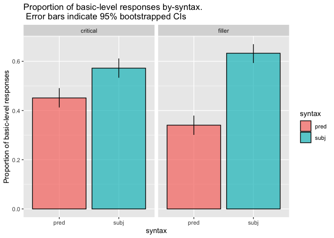
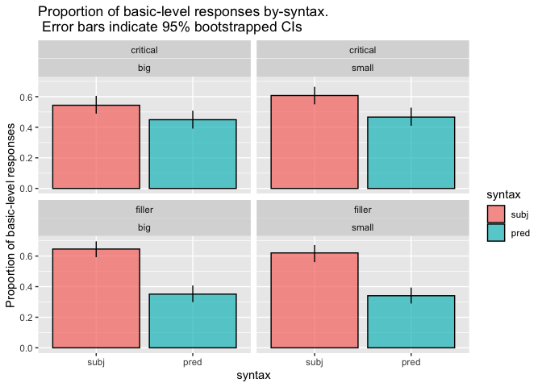
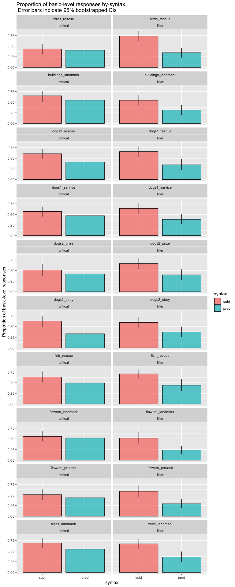

Direct Modification Forced Choice Prereg Final
================
Polina Tsvilodub
6/23/2021

    ## ── Attaching packages ─────────────────────────────────────────────────────────────────────────────────────────────────────────────────────────────────────────── tidyverse 1.3.0 ──

    ## ✓ ggplot2 3.3.1     ✓ purrr   0.3.4
    ## ✓ tibble  3.0.1     ✓ dplyr   1.0.0
    ## ✓ tidyr   1.1.0     ✓ stringr 1.4.0
    ## ✓ readr   1.3.1     ✓ forcats 0.5.0

    ## ── Conflicts ────────────────────────────────────────────────────────────────────────────────────────────────────────────────────────────────────────────── tidyverse_conflicts() ──
    ## x dplyr::filter() masks stats::filter()
    ## x dplyr::lag()    masks stats::lag()

    ## Loading required package: Rcpp

    ## Loading 'brms' package (version 2.13.0). Useful instructions
    ## can be found by typing help('brms'). A more detailed introduction
    ## to the package is available through vignette('brms_overview').

    ## 
    ## Attaching package: 'brms'

    ## The following object is masked from 'package:stats':
    ## 
    ##     ar

    ## Parsed with column specification:
    ## cols(
    ##   .default = col_character(),
    ##   submission_id = col_double(),
    ##   experiment_id = col_double(),
    ##   enjoyment = col_double(),
    ##   trials = col_double(),
    ##   optionLeft = col_double(),
    ##   age = col_double(),
    ##   RT = col_double(),
    ##   trial_number = col_double(),
    ##   attempts = col_double(),
    ##   fairprice = col_double()
    ## )

    ## See spec(...) for full column specifications.

``` r
# exclusions

# check comments for any issues
d %>% distinct(comments) 
```

    ## # A tibble: 21 x 1
    ##    comments                                                                     
    ##    <chr>                                                                        
    ##  1 <NA>                                                                         
    ##  2 Na                                                                           
    ##  3 none                                                                         
    ##  4 That was surprisingly stressful                                              
    ##  5 n/a                                                                          
    ##  6 It was interesting to see the difference in which a sentence would mean to m…
    ##  7 N/A                                                                          
    ##  8 For the fair compensation question, no units are specified. That confused me…
    ##  9 nonw                                                                         
    ## 10 None                                                                         
    ## # … with 11 more rows

``` r
# check if bugs were reported
d %>% distinct(problems) 
```

    ## # A tibble: 24 x 1
    ##    problems                                 
    ##    <chr>                                    
    ##  1 No                                       
    ##  2 there were no glitches                   
    ##  3 <NA>                                     
    ##  4 no                                       
    ##  5 Na                                       
    ##  6 none                                     
    ##  7 Slow loading. Might have been my computer
    ##  8 Nope                                     
    ##  9 Nope! :)                                 
    ## 10 No it went smooth!                       
    ## # … with 14 more rows

``` r
# exclude non-native speakers
d %>% distinct(languages)
```

    ## # A tibble: 11 x 1
    ##    languages                      
    ##    <chr>                          
    ##  1 English                        
    ##  2 english                        
    ##  3 English, American Sign Language
    ##  4 englidh                        
    ##  5 English and Vietnamese         
    ##  6 english, tamil                 
    ##  7 English, Malay                 
    ##  8 English, Spanish               
    ##  9 hmong                          
    ## 10 English, German                
    ## 11 Chinese, English

``` r
d %>% distinct(submission_id) %>% count() %>% pull()
```

    ## [1] 152

``` r
d_native <- d %>% filter(grepl("en", languages, ignore.case = T))
# check the number of participants after exclusions
d_native %>% distinct(submission_id) %>% count() %>% pull()
```

    ## [1] 151

``` r
# only accept workers who get the paraphrase warm-up trial with max. 3 attempts
d_warmup_catch <- d_native %>% filter(trial_name == "comp_class_warmup") %>% group_by(submission_id) %>% filter(attempts > 3)
d_clean <- anti_join(d_native, d_warmup_catch, by = "submission_id")

# number of subjects left after exclusions based on the paraphrase warmup trial
d_clean %>% distinct(submission_id) %>% count() %>% pull()
```

    ## [1] 150

``` r
# get main trials
d_main <- d_clean %>% filter(!is.na(trial_type)) 
# check trial counts
d_main %>% count(trial_type, item_noun, syntax)
```

    ## # A tibble: 40 x 4
    ##    trial_type item_noun          syntax     n
    ##    <chr>      <chr>              <chr>  <int>
    ##  1 critical   birds_rescue       pred      57
    ##  2 critical   birds_rescue       subj      67
    ##  3 critical   buildings_landmark pred      64
    ##  4 critical   buildings_landmark subj      54
    ##  5 critical   dogs1_rescue       pred      63
    ##  6 critical   dogs1_rescue       subj      58
    ##  7 critical   dogs1_service      pred      64
    ##  8 critical   dogs1_service      subj      65
    ##  9 critical   dogs2_prize        pred      62
    ## 10 critical   dogs2_prize        subj      53
    ## # … with 30 more rows

``` r
d_main %>% count(trial_type, syntax, adj)
```

    ## # A tibble: 8 x 4
    ##   trial_type syntax adj       n
    ##   <chr>      <chr>  <chr> <int>
    ## 1 critical   pred   big     300
    ## 2 critical   pred   small   300
    ## 3 critical   subj   big     300
    ## 4 critical   subj   small   300
    ## 5 filler     pred   big     300
    ## 6 filler     pred   small   300
    ## 7 filler     subj   big     300
    ## 8 filler     subj   small   300

``` r
# classify responses into basic vs subordinate responses
d_main_cat <- d_main %>%
  rowwise() %>%
  mutate(response_cat = case_when(grepl(target, response) ~ "subordinate",
                                  (target == "strip mall" & response == "strip") ~ "subordinate",
                                  (target == "Great Dane" & response == "Great") ~ "subordinate",
                                  TRUE ~ "basic"
                                  ),
         response_num = ifelse(response_cat == "basic", 1, 0))
```

``` r
# get 95% bootstrapped CIs
d_main_cat_summary <- d_main_cat %>% mutate(syntax = factor(syntax, levels = c('subj', 'pred'))) %>%
  group_by(syntax, trial_type) %>%
  tidyboot_mean(column = response_num)
```

    ## Warning: `as_data_frame()` is deprecated as of tibble 2.0.0.
    ## Please use `as_tibble()` instead.
    ## The signature and semantics have changed, see `?as_tibble`.
    ## This warning is displayed once every 8 hours.
    ## Call `lifecycle::last_warnings()` to see where this warning was generated.

    ## Warning: `cols` is now required when using unnest().
    ## Please use `cols = c(strap)`

``` r
# plot by syntax
d_main_cat_summary %>%
  ggplot(., aes(x = syntax, y = mean, fill = syntax, ymin = ci_lower, ymax = ci_upper,)) +
  geom_col(alpha = 0.7, color = "black", ) +
  ylim(0, 1) +
  geom_linerange() +
  facet_wrap(~trial_type) +
  ylab("Proportion of basic-level responses") +
  ggtitle("Proportion of basic-level responses by-syntax.\n Error bars indicate 95% bootstrapped CIs")
```

<!-- -->

``` r
d_main_cat_size_summary <- d_main_cat %>% group_by(syntax, adj, trial_type) %>%
  mutate(syntax = factor(syntax, levels = c('subj', 'pred'))) %>%
  tidyboot_mean(column = response_num)
```

    ## Warning: `cols` is now required when using unnest().
    ## Please use `cols = c(strap)`

``` r
# plot syntax by-trial-type by-adjectives
d_main_cat_size_summary %>%
  ggplot(., aes(x = syntax, y = mean, fill = syntax, ymin = ci_lower, ymax = ci_upper,)) +
  geom_col(alpha = 0.7, color = "black") +
  geom_linerange() +
  ylab("Proportion of basic-level responses") +
  facet_wrap(trial_type~adj) +
  ggtitle("Proportion of basic-level responses by-syntax.\n Error bars indicate 95% bootstrapped CIs")
```

<!-- -->

``` r
d_main_cat_item_summary <- d_main_cat %>% 
  mutate(syntax = factor(syntax, levels = c('subj', 'pred'))) %>%
  group_by(syntax, item_noun, trial_type) %>%
  tidyboot_mean(column = response_num)
```

    ## Warning: `cols` is now required when using unnest().
    ## Please use `cols = c(strap)`

``` r
# plot syntax by-item by-trial_type
d_main_cat_item_summary %>%
  ggplot(., aes(x = syntax, y = mean, fill = syntax, ymin = ci_lower, ymax = ci_upper,)) +
  geom_col(alpha = 0.7, color = "black") +
  geom_linerange() +
  ylab("Proportion of basic-level responses") +
  facet_wrap(item_noun~trial_type, ncol = 2) +
  ggtitle("Proportion of basic-level responses by-syntax.\n Error bars indicate 95% bootstrapped CIs")
```

<!-- -->

``` r
# reorder factors
d_main_cat <- d_main_cat %>% mutate(
  unique_target = ifelse(trial_type == "critical", paste(target, ref_np, sep = "_"), target),
  syntax = factor(syntax, levels = c("subj", "pred")),
  trial_type = factor(trial_type),
  adj = factor(adj, levels = c("big", "small")),
  optionLeft = factor(optionLeft, levels = c(0, 1), labels = c("basic", "sub"))
)
# critical 1, filler -1
contrasts(d_main_cat$trial_type) <- contr.sum(2)
contrasts(d_main_cat$trial_type)
# subj 1, -1 pred
contrasts(d_main_cat$syntax) <- contr.sum(2)
contrasts(d_main_cat$syntax) 
# fit logistic regression
model <- brm(bf(response_num ~ syntax*trial_type + (1 + syntax*trial_type | submission_id) + 
               (1 + syntax*trial_type | item),
               decomp = "QR"), # random effects by-item (flowers, dogs, buildings etc) 
             data = d_main_cat,
             family = "bernoulli",
             control = list(adapt_delta = 0.99),
             iter = 3000,
             cores = 4)
```

    ## Compiling the C++ model

    ## Trying to compile a simple C file

    ## Start sampling

``` r
summary(model)
```

    ##  Family: bernoulli 
    ##   Links: mu = logit 
    ## Formula: response_num ~ syntax * trial_type + (1 + syntax * trial_type | submission_id) + (1 + syntax * trial_type | item) 
    ##    Data: d_main_cat (Number of observations: 2400) 
    ## Samples: 4 chains, each with iter = 3000; warmup = 1500; thin = 1;
    ##          total post-warmup samples = 6000
    ## 
    ## Group-Level Effects: 
    ## ~item (Number of levels: 7) 
    ##                                      Estimate Est.Error l-95% CI u-95% CI Rhat
    ## sd(Intercept)                            0.23      0.14     0.03     0.58 1.00
    ## sd(syntax1)                              0.07      0.07     0.00     0.24 1.00
    ## sd(trial_type1)                          0.31      0.16     0.07     0.72 1.00
    ## sd(syntax1:trial_type1)                  0.13      0.10     0.01     0.38 1.00
    ## cor(Intercept,syntax1)                   0.01      0.45    -0.80     0.82 1.00
    ## cor(Intercept,trial_type1)              -0.11      0.40    -0.81     0.68 1.00
    ## cor(syntax1,trial_type1)                 0.10      0.45    -0.76     0.86 1.00
    ## cor(Intercept,syntax1:trial_type1)      -0.24      0.42    -0.90     0.66 1.00
    ## cor(syntax1,syntax1:trial_type1)        -0.01      0.45    -0.82     0.82 1.00
    ## cor(trial_type1,syntax1:trial_type1)    -0.01      0.43    -0.80     0.76 1.00
    ##                                      Bulk_ESS Tail_ESS
    ## sd(Intercept)                            1742     2197
    ## sd(syntax1)                              3156     2909
    ## sd(trial_type1)                          2052     1966
    ## sd(syntax1:trial_type1)                  2437     2487
    ## cor(Intercept,syntax1)                   7239     4210
    ## cor(Intercept,trial_type1)               3090     4214
    ## cor(syntax1,trial_type1)                 1904     3606
    ## cor(Intercept,syntax1:trial_type1)       4838     3826
    ## cor(syntax1,syntax1:trial_type1)         4422     4709
    ## cor(trial_type1,syntax1:trial_type1)     4972     4812
    ## 
    ## ~submission_id (Number of levels: 150) 
    ##                                      Estimate Est.Error l-95% CI u-95% CI Rhat
    ## sd(Intercept)                            1.30      0.11     1.08     1.54 1.00
    ## sd(syntax1)                              0.46      0.10     0.26     0.64 1.00
    ## sd(trial_type1)                          0.65      0.08     0.49     0.82 1.00
    ## sd(syntax1:trial_type1)                  0.30      0.12     0.04     0.50 1.00
    ## cor(Intercept,syntax1)                  -0.36      0.19    -0.69     0.03 1.00
    ## cor(Intercept,trial_type1)               0.19      0.16    -0.14     0.49 1.00
    ## cor(syntax1,trial_type1)                 0.00      0.21    -0.42     0.41 1.00
    ## cor(Intercept,syntax1:trial_type1)      -0.00      0.28    -0.55     0.53 1.00
    ## cor(syntax1,syntax1:trial_type1)         0.18      0.33    -0.52     0.75 1.00
    ## cor(trial_type1,syntax1:trial_type1)     0.35      0.28    -0.27     0.84 1.00
    ##                                      Bulk_ESS Tail_ESS
    ## sd(Intercept)                            1975     3342
    ## sd(syntax1)                              1695     1845
    ## sd(trial_type1)                          2288     3692
    ## sd(syntax1:trial_type1)                   808      858
    ## cor(Intercept,syntax1)                   3047     3179
    ## cor(Intercept,trial_type1)               2394     3320
    ## cor(syntax1,trial_type1)                  840     1696
    ## cor(Intercept,syntax1:trial_type1)       3655     2833
    ## cor(syntax1,syntax1:trial_type1)         1724     2079
    ## cor(trial_type1,syntax1:trial_type1)     2443     2538
    ## 
    ## Population-Level Effects: 
    ##                     Estimate Est.Error l-95% CI u-95% CI Rhat Bulk_ESS Tail_ESS
    ## Intercept               0.03      0.16    -0.27     0.34 1.00     1788     3107
    ## syntax1                 0.59      0.08     0.44     0.74 1.00     3917     3834
    ## trial_type1            -0.09      0.15    -0.39     0.21 1.00     3017     3470
    ## syntax1:trial_type1     0.27      0.09     0.10     0.44 1.00     4027     3338
    ## 
    ## Samples were drawn using sampling(NUTS). For each parameter, Bulk_ESS
    ## and Tail_ESS are effective sample size measures, and Rhat is the potential
    ## scale reduction factor on split chains (at convergence, Rhat = 1).

Get contrasts (esp. effect of syntax in the critical condition) from brm
model fit w `hypothesis`:

``` r
critical_subj <- c(critical_subj = "Intercept + trial_type1 + syntax1 + syntax1:trial_type1= 0")
critical_pred <- c(critical_pred = "Intercept + trial_type1 - syntax1 - syntax1:trial_type1 = 0")

filler_subj <- c(filler_subj = "Intercept - trial_type1 + syntax1 - syntax1:trial_type1= 0")
filler_pred <- c(filler_pred = "Intercept - trial_type1 - syntax1 + syntax1:trial_type1 = 0")

# our syntax hypotheses are actually directional: we expect more basic responses in the subject than predicate conditions, 
# and therefore this contrast being larger than 0
syntax_critical <- c(syntax_critical = "2 * syntax1 + 2 * syntax1:trial_type1 > 0")
syntax_filler <- c(syntax_filler = "2 * syntax1 - 2 * syntax1:trial_type1 > 0")

subj_critical_filler <- c(subj_critical_filler = "2*trial_type1 + 2 * syntax1:trial_type1 = 0" )
pred_critical_filler <- c(pred_critical_filler = "2*trial_type1 - 2 * syntax1:trial_type1 = 0" )

contrast_answers <- hypothesis(model, c(critical_subj, critical_pred, syntax_critical,
                                 filler_subj, filler_pred, syntax_filler,
                                 subj_critical_filler, pred_critical_filler))
contrast_answers
```

    ## Hypothesis Tests for class b:
    ##             Hypothesis Estimate Est.Error CI.Lower CI.Upper Evid.Ratio
    ## 1        critical_subj     0.79      0.23     0.34     1.26         NA
    ## 2        critical_pred    -0.92      0.26    -1.43    -0.41         NA
    ## 3      syntax_critical     1.71      0.24     1.32     2.10        Inf
    ## 4          filler_subj     0.44      0.24    -0.04     0.92         NA
    ## 5          filler_pred    -0.19      0.25    -0.69     0.32         NA
    ## 6        syntax_filler     0.63      0.22     0.29     1.00     271.73
    ## 7 subj_critical_filler     0.35      0.34    -0.32     1.04         NA
    ## 8 pred_critical_filler    -0.73      0.35    -1.42     0.00         NA
    ##   Post.Prob Star
    ## 1        NA    *
    ## 2        NA    *
    ## 3         1    *
    ## 4        NA     
    ## 5        NA     
    ## 6         1    *
    ## 7        NA     
    ## 8        NA     
    ## ---
    ## 'CI': 90%-CI for one-sided and 95%-CI for two-sided hypotheses.
    ## '*': For one-sided hypotheses, the posterior probability exceeds 95%;
    ## for two-sided hypotheses, the value tested against lies outside the 95%-CI.
    ## Posterior probabilities of point hypotheses assume equal prior probabilities.

Separate model on critical conditions only for checking simple effect of
syntax:

``` r
d_main_cat_critical <- d_main_cat %>% filter(trial_type == "critical")

model_critical <- brm(bf(response_num ~ syntax + (1 + syntax | submission_id) + 
               (1 + syntax | item),
               decomp = "QR"), # random effects by-item (flowers, dogs, buildings etc) 
             data = d_main_cat_critical,
             family = "bernoulli",
             control = list(adapt_delta = 0.96),
             iter = 3000,
             cores = 4)
```

    ## Compiling the C++ model

    ## Trying to compile a simple C file

    ## Start sampling

``` r
summary(model_critical)
```

    ##  Family: bernoulli 
    ##   Links: mu = logit 
    ## Formula: response_num ~ syntax + (1 + syntax | submission_id) + (1 + syntax | item) 
    ##    Data: d_main_cat_critical (Number of observations: 1200) 
    ## Samples: 4 chains, each with iter = 3000; warmup = 1500; thin = 1;
    ##          total post-warmup samples = 6000
    ## 
    ## Group-Level Effects: 
    ## ~item (Number of levels: 7) 
    ##                        Estimate Est.Error l-95% CI u-95% CI Rhat Bulk_ESS
    ## sd(Intercept)              0.43      0.22     0.11     0.99 1.00     1260
    ## sd(syntax1)                0.13      0.11     0.00     0.42 1.00     2583
    ## cor(Intercept,syntax1)     0.07      0.57    -0.94     0.96 1.00     5215
    ##                        Tail_ESS
    ## sd(Intercept)              1671
    ## sd(syntax1)                2479
    ## cor(Intercept,syntax1)     3350
    ## 
    ## ~submission_id (Number of levels: 150) 
    ##                        Estimate Est.Error l-95% CI u-95% CI Rhat Bulk_ESS
    ## sd(Intercept)              1.29      0.14     1.04     1.57 1.00     2092
    ## sd(syntax1)                0.48      0.15     0.12     0.75 1.00      923
    ## cor(Intercept,syntax1)    -0.16      0.29    -0.71     0.42 1.00     3107
    ##                        Tail_ESS
    ## sd(Intercept)              3566
    ## sd(syntax1)                 840
    ## cor(Intercept,syntax1)     2283
    ## 
    ## Population-Level Effects: 
    ##           Estimate Est.Error l-95% CI u-95% CI Rhat Bulk_ESS Tail_ESS
    ## Intercept     0.11      0.22    -0.32     0.56 1.00     1905     3026
    ## syntax1       0.32      0.11     0.11     0.53 1.00     4506     3494
    ## 
    ## Samples were drawn using sampling(NUTS). For each parameter, Bulk_ESS
    ## and Tail_ESS are effective sample size measures, and Rhat is the potential
    ## scale reduction factor on split chains (at convergence, Rhat = 1).

Exploratory model with main effect of size:

``` r
# big 1, small -1
contrasts(d_main_cat$adj) <- contr.sum(2)

model_size <- brm(bf(response_num ~ syntax*trial_type*adj + (1 + syntax*trial_type*adj | submission_id) + 
               (1 + syntax*trial_type*adj | item),
               decomp = "QR"), # random effects by-item (flowers, dogs, buildings etc) 
             data = d_main_cat,
             family = "bernoulli",
             control = list(adapt_delta = 0.99),
             iter = 3000,
             cores = 4)
```

    ## Compiling the C++ model

    ## Trying to compile a simple C file

    ## Start sampling

``` r
summary(model_size)
```

    ##  Family: bernoulli 
    ##   Links: mu = logit 
    ## Formula: response_num ~ syntax * trial_type * adj + (1 + syntax * trial_type * adj | submission_id) + (1 + syntax * trial_type * adj | item) 
    ##    Data: d_main_cat (Number of observations: 2400) 
    ## Samples: 4 chains, each with iter = 3000; warmup = 1500; thin = 1;
    ##          total post-warmup samples = 6000
    ## 
    ## Group-Level Effects: 
    ## ~item (Number of levels: 7) 
    ##                                                   Estimate Est.Error l-95% CI
    ## sd(Intercept)                                         0.25      0.16     0.03
    ## sd(syntax1)                                           0.08      0.07     0.00
    ## sd(trial_type1)                                       0.37      0.18     0.12
    ## sd(adj1)                                              0.36      0.18     0.12
    ## sd(syntax1:trial_type1)                               0.16      0.11     0.01
    ## sd(syntax1:adj1)                                      0.12      0.11     0.00
    ## sd(trial_type1:adj1)                                  0.23      0.15     0.02
    ## sd(syntax1:trial_type1:adj1)                          0.09      0.08     0.00
    ## cor(Intercept,syntax1)                                0.01      0.33    -0.62
    ## cor(Intercept,trial_type1)                           -0.05      0.31    -0.64
    ## cor(syntax1,trial_type1)                              0.04      0.34    -0.62
    ## cor(Intercept,adj1)                                   0.20      0.32    -0.44
    ## cor(syntax1,adj1)                                    -0.01      0.33    -0.64
    ## cor(trial_type1,adj1)                                -0.22      0.30    -0.73
    ## cor(Intercept,syntax1:trial_type1)                   -0.15      0.32    -0.73
    ## cor(syntax1,syntax1:trial_type1)                     -0.00      0.34    -0.64
    ## cor(trial_type1,syntax1:trial_type1)                 -0.01      0.33    -0.62
    ## cor(adj1,syntax1:trial_type1)                        -0.13      0.32    -0.72
    ## cor(Intercept,syntax1:adj1)                          -0.01      0.32    -0.62
    ## cor(syntax1,syntax1:adj1)                             0.02      0.34    -0.62
    ## cor(trial_type1,syntax1:adj1)                         0.11      0.32    -0.54
    ## cor(adj1,syntax1:adj1)                               -0.06      0.32    -0.66
    ## cor(syntax1:trial_type1,syntax1:adj1)                 0.01      0.33    -0.63
    ## cor(Intercept,trial_type1:adj1)                      -0.00      0.32    -0.62
    ## cor(syntax1,trial_type1:adj1)                        -0.04      0.33    -0.68
    ## cor(trial_type1,trial_type1:adj1)                    -0.24      0.31    -0.76
    ## cor(adj1,trial_type1:adj1)                            0.15      0.31    -0.49
    ## cor(syntax1:trial_type1,trial_type1:adj1)             0.03      0.32    -0.60
    ## cor(syntax1:adj1,trial_type1:adj1)                   -0.12      0.33    -0.72
    ## cor(Intercept,syntax1:trial_type1:adj1)              -0.04      0.34    -0.67
    ## cor(syntax1,syntax1:trial_type1:adj1)                -0.00      0.33    -0.64
    ## cor(trial_type1,syntax1:trial_type1:adj1)             0.03      0.33    -0.61
    ## cor(adj1,syntax1:trial_type1:adj1)                   -0.01      0.34    -0.64
    ## cor(syntax1:trial_type1,syntax1:trial_type1:adj1)     0.00      0.34    -0.63
    ## cor(syntax1:adj1,syntax1:trial_type1:adj1)            0.01      0.33    -0.63
    ## cor(trial_type1:adj1,syntax1:trial_type1:adj1)       -0.02      0.34    -0.64
    ##                                                   u-95% CI Rhat Bulk_ESS
    ## sd(Intercept)                                         0.64 1.00     1973
    ## sd(syntax1)                                           0.27 1.00     4124
    ## sd(trial_type1)                                       0.81 1.00     2512
    ## sd(adj1)                                              0.81 1.00     2811
    ## sd(syntax1:trial_type1)                               0.44 1.00     2086
    ## sd(syntax1:adj1)                                      0.40 1.00     2822
    ## sd(trial_type1:adj1)                                  0.59 1.00     2281
    ## sd(syntax1:trial_type1:adj1)                          0.29 1.00     3992
    ## cor(Intercept,syntax1)                                0.63 1.00    10951
    ## cor(Intercept,trial_type1)                            0.54 1.00     4742
    ## cor(syntax1,trial_type1)                              0.65 1.00     3339
    ## cor(Intercept,adj1)                                   0.74 1.00     4388
    ## cor(syntax1,adj1)                                     0.61 1.00     4121
    ## cor(trial_type1,adj1)                                 0.40 1.00     5290
    ## cor(Intercept,syntax1:trial_type1)                    0.49 1.00     8013
    ## cor(syntax1,syntax1:trial_type1)                      0.64 1.00     6482
    ## cor(trial_type1,syntax1:trial_type1)                  0.62 1.00     8338
    ## cor(adj1,syntax1:trial_type1)                         0.51 1.00     6640
    ## cor(Intercept,syntax1:adj1)                           0.61 1.00     8806
    ## cor(syntax1,syntax1:adj1)                             0.66 1.00     6090
    ## cor(trial_type1,syntax1:adj1)                         0.69 1.00     6996
    ## cor(adj1,syntax1:adj1)                                0.58 1.00     6317
    ## cor(syntax1:trial_type1,syntax1:adj1)                 0.62 1.00     5394
    ## cor(Intercept,trial_type1:adj1)                       0.60 1.00     6932
    ## cor(syntax1,trial_type1:adj1)                         0.60 1.00     5108
    ## cor(trial_type1,trial_type1:adj1)                     0.44 1.00     5877
    ## cor(adj1,trial_type1:adj1)                            0.71 1.00     6011
    ## cor(syntax1:trial_type1,trial_type1:adj1)             0.64 1.00     4751
    ## cor(syntax1:adj1,trial_type1:adj1)                    0.55 1.00     4608
    ## cor(Intercept,syntax1:trial_type1:adj1)               0.62 1.00    10910
    ## cor(syntax1,syntax1:trial_type1:adj1)                 0.63 1.00     8131
    ## cor(trial_type1,syntax1:trial_type1:adj1)             0.65 1.00     8365
    ## cor(adj1,syntax1:trial_type1:adj1)                    0.63 1.00     7735
    ## cor(syntax1:trial_type1,syntax1:trial_type1:adj1)     0.66 1.00     5477
    ## cor(syntax1:adj1,syntax1:trial_type1:adj1)            0.63 1.00     4066
    ## cor(trial_type1:adj1,syntax1:trial_type1:adj1)        0.65 1.00     4616
    ##                                                   Tail_ESS
    ## sd(Intercept)                                         1900
    ## sd(syntax1)                                           3163
    ## sd(trial_type1)                                       3063
    ## sd(adj1)                                              3381
    ## sd(syntax1:trial_type1)                               2329
    ## sd(syntax1:adj1)                                      3127
    ## sd(trial_type1:adj1)                                  2230
    ## sd(syntax1:trial_type1:adj1)                          3309
    ## cor(Intercept,syntax1)                                3977
    ## cor(Intercept,trial_type1)                            4537
    ## cor(syntax1,trial_type1)                              4135
    ## cor(Intercept,adj1)                                   3946
    ## cor(syntax1,adj1)                                     4704
    ## cor(trial_type1,adj1)                                 5097
    ## cor(Intercept,syntax1:trial_type1)                    4610
    ## cor(syntax1,syntax1:trial_type1)                      4889
    ## cor(trial_type1,syntax1:trial_type1)                  5423
    ## cor(adj1,syntax1:trial_type1)                         5050
    ## cor(Intercept,syntax1:adj1)                           5025
    ## cor(syntax1,syntax1:adj1)                             4494
    ## cor(trial_type1,syntax1:adj1)                         4651
    ## cor(adj1,syntax1:adj1)                                5221
    ## cor(syntax1:trial_type1,syntax1:adj1)                 5160
    ## cor(Intercept,trial_type1:adj1)                       4323
    ## cor(syntax1,trial_type1:adj1)                         4682
    ## cor(trial_type1,trial_type1:adj1)                     4529
    ## cor(adj1,trial_type1:adj1)                            5013
    ## cor(syntax1:trial_type1,trial_type1:adj1)             5452
    ## cor(syntax1:adj1,trial_type1:adj1)                    5200
    ## cor(Intercept,syntax1:trial_type1:adj1)               3947
    ## cor(syntax1,syntax1:trial_type1:adj1)                 4581
    ## cor(trial_type1,syntax1:trial_type1:adj1)             4654
    ## cor(adj1,syntax1:trial_type1:adj1)                    5144
    ## cor(syntax1:trial_type1,syntax1:trial_type1:adj1)     5018
    ## cor(syntax1:adj1,syntax1:trial_type1:adj1)            5199
    ## cor(trial_type1:adj1,syntax1:trial_type1:adj1)        5064
    ## 
    ## ~submission_id (Number of levels: 150) 
    ##                                                   Estimate Est.Error l-95% CI
    ## sd(Intercept)                                         1.46      0.13     1.23
    ## sd(syntax1)                                           0.56      0.10     0.36
    ## sd(trial_type1)                                       0.74      0.09     0.57
    ## sd(adj1)                                              0.46      0.10     0.26
    ## sd(syntax1:trial_type1)                               0.41      0.11     0.17
    ## sd(syntax1:adj1)                                      0.16      0.10     0.01
    ## sd(trial_type1:adj1)                                  0.31      0.12     0.05
    ## sd(syntax1:trial_type1:adj1)                          0.16      0.10     0.01
    ## cor(Intercept,syntax1)                               -0.30      0.16    -0.60
    ## cor(Intercept,trial_type1)                            0.12      0.15    -0.17
    ## cor(syntax1,trial_type1)                              0.00      0.19    -0.36
    ## cor(Intercept,adj1)                                  -0.26      0.18    -0.60
    ## cor(syntax1,adj1)                                     0.26      0.21    -0.17
    ## cor(trial_type1,adj1)                                 0.14      0.20    -0.26
    ## cor(Intercept,syntax1:trial_type1)                    0.00      0.20    -0.40
    ## cor(syntax1,syntax1:trial_type1)                      0.11      0.23    -0.34
    ## cor(trial_type1,syntax1:trial_type1)                  0.29      0.20    -0.12
    ## cor(adj1,syntax1:trial_type1)                         0.09      0.24    -0.39
    ## cor(Intercept,syntax1:adj1)                          -0.14      0.30    -0.68
    ## cor(syntax1,syntax1:adj1)                             0.14      0.31    -0.52
    ## cor(trial_type1,syntax1:adj1)                         0.17      0.29    -0.45
    ## cor(adj1,syntax1:adj1)                                0.03      0.31    -0.57
    ## cor(syntax1:trial_type1,syntax1:adj1)                 0.16      0.31    -0.48
    ## cor(Intercept,trial_type1:adj1)                       0.08      0.24    -0.40
    ## cor(syntax1,trial_type1:adj1)                         0.09      0.26    -0.43
    ## cor(trial_type1,trial_type1:adj1)                    -0.30      0.24    -0.72
    ## cor(adj1,trial_type1:adj1)                           -0.21      0.26    -0.68
    ## cor(syntax1:trial_type1,trial_type1:adj1)            -0.14      0.27    -0.64
    ## cor(syntax1:adj1,trial_type1:adj1)                   -0.07      0.32    -0.66
    ## cor(Intercept,syntax1:trial_type1:adj1)              -0.00      0.30    -0.58
    ## cor(syntax1,syntax1:trial_type1:adj1)                -0.07      0.31    -0.65
    ## cor(trial_type1,syntax1:trial_type1:adj1)             0.04      0.29    -0.54
    ## cor(adj1,syntax1:trial_type1:adj1)                   -0.07      0.32    -0.65
    ## cor(syntax1:trial_type1,syntax1:trial_type1:adj1)     0.01      0.31    -0.59
    ## cor(syntax1:adj1,syntax1:trial_type1:adj1)            0.01      0.33    -0.62
    ## cor(trial_type1:adj1,syntax1:trial_type1:adj1)       -0.20      0.33    -0.75
    ##                                                   u-95% CI Rhat Bulk_ESS
    ## sd(Intercept)                                         1.74 1.00     1648
    ## sd(syntax1)                                           0.76 1.00     2014
    ## sd(trial_type1)                                       0.93 1.00     2282
    ## sd(adj1)                                              0.65 1.00     1902
    ## sd(syntax1:trial_type1)                               0.61 1.01     1321
    ## sd(syntax1:adj1)                                      0.38 1.00     1249
    ## sd(trial_type1:adj1)                                  0.52 1.00     1293
    ## sd(syntax1:trial_type1:adj1)                          0.39 1.00     1123
    ## cor(Intercept,syntax1)                                0.04 1.00     4675
    ## cor(Intercept,trial_type1)                            0.40 1.00     3462
    ## cor(syntax1,trial_type1)                              0.37 1.00     1138
    ## cor(Intercept,adj1)                                   0.12 1.00     3873
    ## cor(syntax1,adj1)                                     0.64 1.00     2144
    ## cor(trial_type1,adj1)                                 0.52 1.00     2954
    ## cor(Intercept,syntax1:trial_type1)                    0.39 1.00     4788
    ## cor(syntax1,syntax1:trial_type1)                      0.55 1.00     2873
    ## cor(trial_type1,syntax1:trial_type1)                  0.66 1.00     3204
    ## cor(adj1,syntax1:trial_type1)                         0.54 1.00     2395
    ## cor(Intercept,syntax1:adj1)                           0.49 1.00     8348
    ## cor(syntax1,syntax1:adj1)                             0.70 1.00     4709
    ## cor(trial_type1,syntax1:adj1)                         0.69 1.00     6484
    ## cor(adj1,syntax1:adj1)                                0.62 1.00     6194
    ## cor(syntax1:trial_type1,syntax1:adj1)                 0.70 1.00     4735
    ## cor(Intercept,trial_type1:adj1)                       0.52 1.00     6096
    ## cor(syntax1,trial_type1:adj1)                         0.57 1.00     3629
    ## cor(trial_type1,trial_type1:adj1)                     0.22 1.00     3927
    ## cor(adj1,trial_type1:adj1)                            0.34 1.00     3890
    ## cor(syntax1:trial_type1,trial_type1:adj1)             0.43 1.00     3223
    ## cor(syntax1:adj1,trial_type1:adj1)                    0.56 1.00     2800
    ## cor(Intercept,syntax1:trial_type1:adj1)               0.59 1.00     8368
    ## cor(syntax1,syntax1:trial_type1:adj1)                 0.55 1.00     6697
    ## cor(trial_type1,syntax1:trial_type1:adj1)             0.61 1.00     7221
    ## cor(adj1,syntax1:trial_type1:adj1)                    0.57 1.00     5405
    ## cor(syntax1:trial_type1,syntax1:trial_type1:adj1)     0.62 1.00     5296
    ## cor(syntax1:adj1,syntax1:trial_type1:adj1)            0.63 1.00     4042
    ## cor(trial_type1:adj1,syntax1:trial_type1:adj1)        0.49 1.00     2796
    ##                                                   Tail_ESS
    ## sd(Intercept)                                         3590
    ## sd(syntax1)                                           2655
    ## sd(trial_type1)                                       3870
    ## sd(adj1)                                              2546
    ## sd(syntax1:trial_type1)                               1666
    ## sd(syntax1:adj1)                                      2272
    ## sd(trial_type1:adj1)                                  1329
    ## sd(syntax1:trial_type1:adj1)                          2610
    ## cor(Intercept,syntax1)                                4505
    ## cor(Intercept,trial_type1)                            4463
    ## cor(syntax1,trial_type1)                              1879
    ## cor(Intercept,adj1)                                   4347
    ## cor(syntax1,adj1)                                     3672
    ## cor(trial_type1,adj1)                                 3741
    ## cor(Intercept,syntax1:trial_type1)                    4220
    ## cor(syntax1,syntax1:trial_type1)                      4030
    ## cor(trial_type1,syntax1:trial_type1)                  3961
    ## cor(adj1,syntax1:trial_type1)                         3835
    ## cor(Intercept,syntax1:adj1)                           3309
    ## cor(syntax1,syntax1:adj1)                             3774
    ## cor(trial_type1,syntax1:adj1)                         4423
    ## cor(adj1,syntax1:adj1)                                5032
    ## cor(syntax1:trial_type1,syntax1:adj1)                 4950
    ## cor(Intercept,trial_type1:adj1)                       4091
    ## cor(syntax1,trial_type1:adj1)                         4001
    ## cor(trial_type1,trial_type1:adj1)                     2959
    ## cor(adj1,trial_type1:adj1)                            4070
    ## cor(syntax1:trial_type1,trial_type1:adj1)             4006
    ## cor(syntax1:adj1,trial_type1:adj1)                    4473
    ## cor(Intercept,syntax1:trial_type1:adj1)               3726
    ## cor(syntax1,syntax1:trial_type1:adj1)                 4059
    ## cor(trial_type1,syntax1:trial_type1:adj1)             4195
    ## cor(adj1,syntax1:trial_type1:adj1)                    4546
    ## cor(syntax1:trial_type1,syntax1:trial_type1:adj1)     4419
    ## cor(syntax1:adj1,syntax1:trial_type1:adj1)            4501
    ## cor(trial_type1:adj1,syntax1:trial_type1:adj1)        4006
    ## 
    ## Population-Level Effects: 
    ##                          Estimate Est.Error l-95% CI u-95% CI Rhat Bulk_ESS
    ## Intercept                    0.03      0.17    -0.30     0.39 1.00     2385
    ## syntax1                      0.64      0.09     0.47     0.83 1.00     4054
    ## trial_type1                 -0.12      0.17    -0.48     0.22 1.00     3007
    ## adj1                         0.01      0.17    -0.31     0.36 1.00     3326
    ## syntax1:trial_type1          0.29      0.10     0.09     0.49 1.00     4639
    ## syntax1:adj1                -0.06      0.09    -0.24     0.11 1.00     4777
    ## trial_type1:adj1             0.12      0.11    -0.10     0.36 1.00     4408
    ## syntax1:trial_type1:adj1     0.05      0.07    -0.10     0.19 1.00     5277
    ##                          Tail_ESS
    ## Intercept                    3184
    ## syntax1                      4355
    ## trial_type1                  2997
    ## adj1                         3722
    ## syntax1:trial_type1          4435
    ## syntax1:adj1                 3534
    ## trial_type1:adj1             4053
    ## syntax1:trial_type1:adj1     4184
    ## 
    ## Samples were drawn using sampling(NUTS). For each parameter, Bulk_ESS
    ## and Tail_ESS are effective sample size measures, and Rhat is the potential
    ## scale reduction factor on split chains (at convergence, Rhat = 1).

Get exploratory effects of target size by syntax and trial-type using
`hypothesis`:

``` r
critical_subj <- c(critical_subj = "Intercept + trial_type1 + syntax1 + syntax1:trial_type1= 0")
critical_pred <- c(critical_pred = "Intercept + trial_type1 - syntax1 - syntax1:trial_type1 = 0")

filler_subj <- c(filler_subj = "Intercept - trial_type1 + syntax1 - syntax1:trial_type1= 0")
filler_pred <- c(filler_pred = "Intercept - trial_type1 - syntax1 + syntax1:trial_type1 = 0")

critical_big <- c(critical_big = "Intercept + trial_type1 + adj1 + trial_type1:adj1 = 0")
critical_small <- c(critical_small = "Intercept + trial_type1 - adj1 - trial_type1:adj1 = 0")

filler_big <- c(filler_big = "Intercept - trial_type1 + adj1 - trial_type1:adj1 = 0")
filler_small <- c(filler_small = "Intercept - trial_type1 - adj1 + trial_type1:adj1 = 0")

# our syntax hypotheses are actually directional: we expect more basic responses in the subject than predicate conditions, 
# and therefore this contrast being larger than 0
syntax_critical <- c(syntax_critical = "2 * syntax1 + 2 * syntax1:trial_type1 > 0") # subj - pred
syntax_filler <- c(syntax_filler = "2 * syntax1 - 2 * syntax1:trial_type1 > 0") # subj - pred

# exploratory check if there is an effect of size by trial type and by syntactic condition
size_critical <- c(size_critical = "2 * adj1 + 2 * trial_type1:adj1 = 0") # big - small 
size_filler <- c(size_filler = "2 * adj1 - 2 * trial_type1:adj1 = 0") # big - small
size_subj <- c(size_subj = "2 * adj1 + 2 * syntax1:adj1 = 0") # big - small
size_pred <- c(size_pred = "2 * adj1 - 2 * syntax1:adj1 = 0") # big - small

# effect of trial type by syntactic condition
subj_critical_filler <- c(subj_critical_filler = "2*trial_type1 + 2 * syntax1:trial_type1 = 0" )
pred_critical_filler <- c(pred_critical_filler = "2*trial_type1 - 2 * syntax1:trial_type1 = 0" )

contrast_answers_size <- hypothesis(model_size, c(critical_subj, critical_pred, syntax_critical,
                                 filler_subj, filler_pred, syntax_filler,
                                 subj_critical_filler, pred_critical_filler,
                                 critical_big, critical_small, size_critical, 
                                 filler_big, filler_small, size_filler,
                                 size_subj, size_pred))
contrast_answers_size
```

    ## Hypothesis Tests for class b:
    ##              Hypothesis Estimate Est.Error CI.Lower CI.Upper Evid.Ratio
    ## 1         critical_subj     0.85      0.28     0.32     1.40         NA
    ## 2         critical_pred    -1.03      0.29    -1.59    -0.47         NA
    ## 3       syntax_critical     1.87      0.28     1.44     2.34        Inf
    ## 4           filler_subj     0.50      0.28    -0.03     1.07         NA
    ## 5           filler_pred    -0.20      0.28    -0.75     0.38         NA
    ## 6         syntax_filler     0.71      0.26     0.30     1.12     192.55
    ## 7  subj_critical_filler     0.34      0.40    -0.46     1.13         NA
    ## 8  pred_critical_filler    -0.82      0.40    -1.66    -0.04         NA
    ## 9          critical_big     0.05      0.31    -0.57     0.67         NA
    ## 10       critical_small    -0.23      0.34    -0.91     0.43         NA
    ## 11        size_critical     0.27      0.42    -0.55     1.13         NA
    ## 12           filler_big     0.04      0.32    -0.56     0.69         NA
    ## 13         filler_small     0.26      0.31    -0.36     0.88         NA
    ## 14          size_filler    -0.21      0.39    -0.96     0.58         NA
    ## 15            size_subj    -0.09      0.37    -0.82     0.66         NA
    ## 16            size_pred     0.15      0.39    -0.58     0.94         NA
    ##    Post.Prob Star
    ## 1         NA    *
    ## 2         NA    *
    ## 3       1.00    *
    ## 4         NA     
    ## 5         NA     
    ## 6       0.99    *
    ## 7         NA     
    ## 8         NA    *
    ## 9         NA     
    ## 10        NA     
    ## 11        NA     
    ## 12        NA     
    ## 13        NA     
    ## 14        NA     
    ## 15        NA     
    ## 16        NA     
    ## ---
    ## 'CI': 90%-CI for one-sided and 95%-CI for two-sided hypotheses.
    ## '*': For one-sided hypotheses, the posterior probability exceeds 95%;
    ## for two-sided hypotheses, the value tested against lies outside the 95%-CI.
    ## Posterior probabilities of point hypotheses assume equal prior probabilities.

Check how many participants stuck to the same option (e.g., always the
left one):

``` r
d_main_cat %>% mutate(leftOption = option1,
                      rightOption = option2,
                      optionChosen = case_when(
                        (response == "Great") & (leftOption == "Great Danes") ~ "left", 
                        (response == "Great") & (rightOption == "Great Danes") ~ "right",
                        (response == "strip") & (leftOption == "strip malls") ~ "left", 
                        (response == "strip") & (rightOption == "strip malls") ~ "right",
                        response == leftOption ~ "left",
                        response == rightOption ~ "right")
                      ) %>% 
  group_by(submission_id, optionChosen) %>% count() -> d_main_option_counts

d_main_option_counts  
```

    ## # A tibble: 291 x 3
    ## # Groups:   submission_id, optionChosen [291]
    ##    submission_id optionChosen     n
    ##            <dbl> <chr>        <int>
    ##  1          2875 left            10
    ##  2          2875 right            6
    ##  3          2876 left            10
    ##  4          2876 right            6
    ##  5          2877 left            11
    ##  6          2877 right            5
    ##  7          2878 left             7
    ##  8          2878 right            9
    ##  9          2879 left             3
    ## 10          2879 right           13
    ## # … with 281 more rows

``` r
# no participants stuck to one option only
d_main_option_counts %>% filter(n == 16)
```

    ## # A tibble: 9 x 3
    ## # Groups:   submission_id, optionChosen [9]
    ##   submission_id optionChosen     n
    ##           <dbl> <chr>        <int>
    ## 1          2896 right           16
    ## 2          2912 right           16
    ## 3          2915 left            16
    ## 4          2983 left            16
    ## 5          2990 left            16
    ## 6          2996 left            16
    ## 7          2998 left            16
    ## 8          3013 left            16
    ## 9          3015 right           16

``` r
# check tendency towards one of the sides -- there seem to be no preferences
d_main_option_counts %>% group_by(optionChosen) %>% summarise(mean_choices = mean(n))
```

    ## `summarise()` ungrouping output (override with `.groups` argument)

    ## # A tibble: 2 x 2
    ##   optionChosen mean_choices
    ##   <chr>               <dbl>
    ## 1 left                 7.95
    ## 2 right                8.55

Count the different FC orders:

``` r
d_main_cat %>% count(optionLeft)
```

    ## # A tibble: 2 x 2
    ## # Rowwise: 
    ##   optionLeft     n
    ##   <fct>      <int>
    ## 1 basic       1120
    ## 2 sub         1280

Explore the between-subjects effect of the order of response options:

``` r
# basic is the left option 1, sub is the left option -1
contrasts(d_main_cat$optionLeft) <- contr.sum(2)

model_option <- brm(bf(response_num ~ syntax*trial_type*optionLeft + (1 + syntax*trial_type | submission_id) + 
               (1 + syntax*trial_type*optionLeft | item),
               decomp = "QR"), # random effects by-item (flowers, dogs, buildings etc) 
             data = d_main_cat,
             family = "bernoulli",
             control = list(adapt_delta = 0.99),
             iter = 3000,
             cores = 4)
```

    ## Compiling the C++ model

    ## Trying to compile a simple C file

    ## Start sampling

``` r
summary(model_option)
```

    ##  Family: bernoulli 
    ##   Links: mu = logit 
    ## Formula: response_num ~ syntax * trial_type * optionLeft + (1 + syntax * trial_type | submission_id) + (1 + syntax * trial_type * optionLeft | item) 
    ##    Data: d_main_cat (Number of observations: 2400) 
    ## Samples: 4 chains, each with iter = 3000; warmup = 1500; thin = 1;
    ##          total post-warmup samples = 6000
    ## 
    ## Group-Level Effects: 
    ## ~item (Number of levels: 7) 
    ##                                                              Estimate Est.Error
    ## sd(Intercept)                                                    0.23      0.14
    ## sd(syntax1)                                                      0.08      0.07
    ## sd(trial_type1)                                                  0.32      0.18
    ## sd(optionLeft1)                                                  0.11      0.09
    ## sd(syntax1:trial_type1)                                          0.13      0.10
    ## sd(syntax1:optionLeft1)                                          0.08      0.08
    ## sd(trial_type1:optionLeft1)                                      0.10      0.09
    ## sd(syntax1:trial_type1:optionLeft1)                              0.16      0.13
    ## cor(Intercept,syntax1)                                           0.01      0.34
    ## cor(Intercept,trial_type1)                                      -0.06      0.32
    ## cor(syntax1,trial_type1)                                         0.06      0.33
    ## cor(Intercept,optionLeft1)                                       0.04      0.33
    ## cor(syntax1,optionLeft1)                                        -0.01      0.33
    ## cor(trial_type1,optionLeft1)                                     0.00      0.33
    ## cor(Intercept,syntax1:trial_type1)                              -0.13      0.33
    ## cor(syntax1,syntax1:trial_type1)                                -0.01      0.33
    ## cor(trial_type1,syntax1:trial_type1)                            -0.01      0.33
    ## cor(optionLeft1,syntax1:trial_type1)                            -0.06      0.33
    ## cor(Intercept,syntax1:optionLeft1)                              -0.02      0.33
    ## cor(syntax1,syntax1:optionLeft1)                                 0.01      0.34
    ## cor(trial_type1,syntax1:optionLeft1)                            -0.01      0.34
    ## cor(optionLeft1,syntax1:optionLeft1)                            -0.01      0.33
    ## cor(syntax1:trial_type1,syntax1:optionLeft1)                    -0.00      0.34
    ## cor(Intercept,trial_type1:optionLeft1)                          -0.08      0.33
    ## cor(syntax1,trial_type1:optionLeft1)                             0.01      0.34
    ## cor(trial_type1,trial_type1:optionLeft1)                         0.02      0.33
    ## cor(optionLeft1,trial_type1:optionLeft1)                         0.01      0.33
    ## cor(syntax1:trial_type1,trial_type1:optionLeft1)                 0.01      0.34
    ## cor(syntax1:optionLeft1,trial_type1:optionLeft1)                 0.03      0.34
    ## cor(Intercept,syntax1:trial_type1:optionLeft1)                   0.08      0.33
    ## cor(syntax1,syntax1:trial_type1:optionLeft1)                     0.03      0.34
    ## cor(trial_type1,syntax1:trial_type1:optionLeft1)                 0.04      0.33
    ## cor(optionLeft1,syntax1:trial_type1:optionLeft1)                -0.04      0.34
    ## cor(syntax1:trial_type1,syntax1:trial_type1:optionLeft1)         0.01      0.33
    ## cor(syntax1:optionLeft1,syntax1:trial_type1:optionLeft1)        -0.02      0.33
    ## cor(trial_type1:optionLeft1,syntax1:trial_type1:optionLeft1)    -0.03      0.33
    ##                                                              l-95% CI u-95% CI
    ## sd(Intercept)                                                    0.03     0.57
    ## sd(syntax1)                                                      0.00     0.25
    ## sd(trial_type1)                                                  0.08     0.79
    ## sd(optionLeft1)                                                  0.00     0.35
    ## sd(syntax1:trial_type1)                                          0.01     0.39
    ## sd(syntax1:optionLeft1)                                          0.00     0.27
    ## sd(trial_type1:optionLeft1)                                      0.00     0.34
    ## sd(syntax1:trial_type1:optionLeft1)                              0.01     0.48
    ## cor(Intercept,syntax1)                                          -0.63     0.64
    ## cor(Intercept,trial_type1)                                      -0.66     0.56
    ## cor(syntax1,trial_type1)                                        -0.57     0.66
    ## cor(Intercept,optionLeft1)                                      -0.60     0.66
    ## cor(syntax1,optionLeft1)                                        -0.64     0.63
    ## cor(trial_type1,optionLeft1)                                    -0.64     0.64
    ## cor(Intercept,syntax1:trial_type1)                              -0.73     0.53
    ## cor(syntax1,syntax1:trial_type1)                                -0.64     0.63
    ## cor(trial_type1,syntax1:trial_type1)                            -0.64     0.62
    ## cor(optionLeft1,syntax1:trial_type1)                            -0.67     0.57
    ## cor(Intercept,syntax1:optionLeft1)                              -0.64     0.60
    ## cor(syntax1,syntax1:optionLeft1)                                -0.64     0.64
    ## cor(trial_type1,syntax1:optionLeft1)                            -0.65     0.64
    ## cor(optionLeft1,syntax1:optionLeft1)                            -0.63     0.62
    ## cor(syntax1:trial_type1,syntax1:optionLeft1)                    -0.64     0.64
    ## cor(Intercept,trial_type1:optionLeft1)                          -0.69     0.56
    ## cor(syntax1,trial_type1:optionLeft1)                            -0.62     0.64
    ## cor(trial_type1,trial_type1:optionLeft1)                        -0.62     0.64
    ## cor(optionLeft1,trial_type1:optionLeft1)                        -0.63     0.65
    ## cor(syntax1:trial_type1,trial_type1:optionLeft1)                -0.63     0.65
    ## cor(syntax1:optionLeft1,trial_type1:optionLeft1)                -0.63     0.66
    ## cor(Intercept,syntax1:trial_type1:optionLeft1)                  -0.55     0.68
    ## cor(syntax1,syntax1:trial_type1:optionLeft1)                    -0.61     0.66
    ## cor(trial_type1,syntax1:trial_type1:optionLeft1)                -0.59     0.65
    ## cor(optionLeft1,syntax1:trial_type1:optionLeft1)                -0.65     0.61
    ## cor(syntax1:trial_type1,syntax1:trial_type1:optionLeft1)        -0.63     0.64
    ## cor(syntax1:optionLeft1,syntax1:trial_type1:optionLeft1)        -0.64     0.63
    ## cor(trial_type1:optionLeft1,syntax1:trial_type1:optionLeft1)    -0.66     0.60
    ##                                                              Rhat Bulk_ESS
    ## sd(Intercept)                                                1.00     1992
    ## sd(syntax1)                                                  1.00     3742
    ## sd(trial_type1)                                              1.00     2306
    ## sd(optionLeft1)                                              1.00     2869
    ## sd(syntax1:trial_type1)                                      1.00     2286
    ## sd(syntax1:optionLeft1)                                      1.00     3319
    ## sd(trial_type1:optionLeft1)                                  1.00     3281
    ## sd(syntax1:trial_type1:optionLeft1)                          1.00     2412
    ## cor(Intercept,syntax1)                                       1.00     9882
    ## cor(Intercept,trial_type1)                                   1.00     4744
    ## cor(syntax1,trial_type1)                                     1.00     3551
    ## cor(Intercept,optionLeft1)                                   1.00     9267
    ## cor(syntax1,optionLeft1)                                     1.00     6904
    ## cor(trial_type1,optionLeft1)                                 1.00     7662
    ## cor(Intercept,syntax1:trial_type1)                           1.00     7033
    ## cor(syntax1,syntax1:trial_type1)                             1.00     6273
    ## cor(trial_type1,syntax1:trial_type1)                         1.00     6952
    ## cor(optionLeft1,syntax1:trial_type1)                         1.00     4552
    ## cor(Intercept,syntax1:optionLeft1)                           1.00    10064
    ## cor(syntax1,syntax1:optionLeft1)                             1.00     8211
    ## cor(trial_type1,syntax1:optionLeft1)                         1.00     7817
    ## cor(optionLeft1,syntax1:optionLeft1)                         1.00     4995
    ## cor(syntax1:trial_type1,syntax1:optionLeft1)                 1.00     4664
    ## cor(Intercept,trial_type1:optionLeft1)                       1.00     8572
    ## cor(syntax1,trial_type1:optionLeft1)                         1.00     6696
    ## cor(trial_type1,trial_type1:optionLeft1)                     1.00     7371
    ## cor(optionLeft1,trial_type1:optionLeft1)                     1.00     5390
    ## cor(syntax1:trial_type1,trial_type1:optionLeft1)             1.00     4721
    ## cor(syntax1:optionLeft1,trial_type1:optionLeft1)             1.00     4311
    ## cor(Intercept,syntax1:trial_type1:optionLeft1)               1.00     6601
    ## cor(syntax1,syntax1:trial_type1:optionLeft1)                 1.00     5656
    ## cor(trial_type1,syntax1:trial_type1:optionLeft1)             1.00     6785
    ## cor(optionLeft1,syntax1:trial_type1:optionLeft1)             1.00     5004
    ## cor(syntax1:trial_type1,syntax1:trial_type1:optionLeft1)     1.00     4667
    ## cor(syntax1:optionLeft1,syntax1:trial_type1:optionLeft1)     1.00     4192
    ## cor(trial_type1:optionLeft1,syntax1:trial_type1:optionLeft1) 1.00     3942
    ##                                                              Tail_ESS
    ## sd(Intercept)                                                    1839
    ## sd(syntax1)                                                      3587
    ## sd(trial_type1)                                                  2741
    ## sd(optionLeft1)                                                  3298
    ## sd(syntax1:trial_type1)                                          2557
    ## sd(syntax1:optionLeft1)                                          2986
    ## sd(trial_type1:optionLeft1)                                      3183
    ## sd(syntax1:trial_type1:optionLeft1)                              3114
    ## cor(Intercept,syntax1)                                           4324
    ## cor(Intercept,trial_type1)                                       4571
    ## cor(syntax1,trial_type1)                                         4116
    ## cor(Intercept,optionLeft1)                                       4584
    ## cor(syntax1,optionLeft1)                                         4941
    ## cor(trial_type1,optionLeft1)                                     5032
    ## cor(Intercept,syntax1:trial_type1)                               4509
    ## cor(syntax1,syntax1:trial_type1)                                 4496
    ## cor(trial_type1,syntax1:trial_type1)                             5015
    ## cor(optionLeft1,syntax1:trial_type1)                             4608
    ## cor(Intercept,syntax1:optionLeft1)                               4173
    ## cor(syntax1,syntax1:optionLeft1)                                 4675
    ## cor(trial_type1,syntax1:optionLeft1)                             4970
    ## cor(optionLeft1,syntax1:optionLeft1)                             4701
    ## cor(syntax1:trial_type1,syntax1:optionLeft1)                     4703
    ## cor(Intercept,trial_type1:optionLeft1)                           4743
    ## cor(syntax1,trial_type1:optionLeft1)                             4842
    ## cor(trial_type1,trial_type1:optionLeft1)                         4078
    ## cor(optionLeft1,trial_type1:optionLeft1)                         5101
    ## cor(syntax1:trial_type1,trial_type1:optionLeft1)                 4819
    ## cor(syntax1:optionLeft1,trial_type1:optionLeft1)                 4675
    ## cor(Intercept,syntax1:trial_type1:optionLeft1)                   4600
    ## cor(syntax1,syntax1:trial_type1:optionLeft1)                     4047
    ## cor(trial_type1,syntax1:trial_type1:optionLeft1)                 4614
    ## cor(optionLeft1,syntax1:trial_type1:optionLeft1)                 5154
    ## cor(syntax1:trial_type1,syntax1:trial_type1:optionLeft1)         4970
    ## cor(syntax1:optionLeft1,syntax1:trial_type1:optionLeft1)         5159
    ## cor(trial_type1:optionLeft1,syntax1:trial_type1:optionLeft1)     4557
    ## 
    ## ~submission_id (Number of levels: 150) 
    ##                                      Estimate Est.Error l-95% CI u-95% CI Rhat
    ## sd(Intercept)                            1.34      0.12     1.12     1.58 1.00
    ## sd(syntax1)                              0.48      0.10     0.29     0.67 1.00
    ## sd(trial_type1)                          0.66      0.09     0.49     0.83 1.00
    ## sd(syntax1:trial_type1)                  0.32      0.12     0.06     0.52 1.00
    ## cor(Intercept,syntax1)                  -0.38      0.18    -0.70    -0.00 1.00
    ## cor(Intercept,trial_type1)               0.21      0.16    -0.11     0.50 1.00
    ## cor(syntax1,trial_type1)                 0.05      0.22    -0.36     0.47 1.00
    ## cor(Intercept,syntax1:trial_type1)      -0.00      0.27    -0.54     0.54 1.00
    ## cor(syntax1,syntax1:trial_type1)         0.21      0.30    -0.46     0.75 1.00
    ## cor(trial_type1,syntax1:trial_type1)     0.34      0.27    -0.23     0.82 1.00
    ##                                      Bulk_ESS Tail_ESS
    ## sd(Intercept)                            1992     3940
    ## sd(syntax1)                              2065     2607
    ## sd(trial_type1)                          2410     3800
    ## sd(syntax1:trial_type1)                   950     1064
    ## cor(Intercept,syntax1)                   3084     3697
    ## cor(Intercept,trial_type1)               2828     3672
    ## cor(syntax1,trial_type1)                  991     1440
    ## cor(Intercept,syntax1:trial_type1)       3541     2676
    ## cor(syntax1,syntax1:trial_type1)         2298     2849
    ## cor(trial_type1,syntax1:trial_type1)     2999     2853
    ## 
    ## Population-Level Effects: 
    ##                                 Estimate Est.Error l-95% CI u-95% CI Rhat
    ## Intercept                           0.03      0.16    -0.27     0.35 1.00
    ## syntax1                             0.59      0.08     0.43     0.76 1.00
    ## trial_type1                        -0.08      0.16    -0.41     0.24 1.00
    ## optionLeft1                        -0.07      0.13    -0.33     0.20 1.00
    ## syntax1:trial_type1                 0.28      0.09     0.11     0.46 1.00
    ## syntax1:optionLeft1                -0.09      0.08    -0.25     0.07 1.00
    ## trial_type1:optionLeft1             0.13      0.09    -0.06     0.31 1.00
    ## syntax1:trial_type1:optionLeft1     0.01      0.10    -0.18     0.21 1.00
    ##                                 Bulk_ESS Tail_ESS
    ## Intercept                           1734     3196
    ## syntax1                             3537     3624
    ## trial_type1                         2850     2771
    ## optionLeft1                         1673     3023
    ## syntax1:trial_type1                 3732     3813
    ## syntax1:optionLeft1                 3850     3839
    ## trial_type1:optionLeft1             4001     4351
    ## syntax1:trial_type1:optionLeft1     4218     3680
    ## 
    ## Samples were drawn using sampling(NUTS). For each parameter, Bulk_ESS
    ## and Tail_ESS are effective sample size measures, and Rhat is the potential
    ## scale reduction factor on split chains (at convergence, Rhat = 1).

Get exploratory effects of the FC options order by-syntax / by-trial
type:

``` r
critical_optionBasic <- c(critical_optionBasic = "Intercept + trial_type1 + optionLeft1 + trial_type1:optionLeft1 = 0")
critical_optionSub <- c(critical_optionSub = "Intercept + trial_type1 - optionLeft1 - trial_type1:optionLeft1 = 0")

filler_optionBasic <- c(filler_optionBasic = "Intercept - trial_type1 + optionLeft1 - trial_type1:optionLeft1 = 0")
filler_optionSub <- c(filler_optionSub = "Intercept - trial_type1 - optionLeft1 + trial_type1:optionLeft1 = 0")
# explore effect of options order by trial type
option_critical <- c(option_critical = "2 * optionLeft1 + 2 * trial_type1:optionLeft1 = 0") # basic - sub is left
option_filler <- c(option_filler = "2 * optionLeft1 - 2 * trial_type1:optionLeft1 = 0") # basic - sub is left
# explore effect of options order by syntax
option_subj <- c(option_subj = "2 * optionLeft1 + 2 * syntax1:optionLeft1 = 0") # basic - sub is left
option_pred <- c(option_pred = "2 * optionLeft1 - 2 * syntax1:optionLeft1 = 0")# basic - sub is left

# explore effect of options order in the single syntactic conditions of critical trials
# in subject condition
option_subj_critical <- c(option_subj_critical = "2 * optionLeft1 + 2 * syntax1:optionLeft1 + 2 * trial_type1:optionLeft1 + 2 * syntax1:trial_type1:optionLeft1 = 0")
# in predicate condition
option_pred_critical <- c(option_pred_critical = "2 * optionLeft1 - 2 * syntax1:optionLeft1 + 2 * trial_type1:optionLeft1 - 2 * syntax1:trial_type1:optionLeft1 = 0")

contrast_answers_option <- hypothesis(model_option, c(critical_optionBasic, critical_optionSub, option_critical,
                                 filler_optionBasic, filler_optionSub, option_filler,
                                 option_subj, option_pred,
                                 option_subj_critical, option_pred_critical))
contrast_answers_option
```

    ## Hypothesis Tests for class b:
    ##              Hypothesis Estimate Est.Error CI.Lower CI.Upper Evid.Ratio
    ## 1  critical_optionBasic     0.00      0.29    -0.57     0.60         NA
    ## 2    critical_optionSub    -0.12      0.29    -0.68     0.47         NA
    ## 3       option_critical     0.12      0.35    -0.56     0.80         NA
    ## 4    filler_optionBasic    -0.08      0.27    -0.62     0.46         NA
    ## 5      filler_optionSub     0.30      0.26    -0.22     0.84         NA
    ## 6         option_filler    -0.38      0.31    -0.98     0.23         NA
    ## 7           option_subj    -0.31      0.29    -0.89     0.25         NA
    ## 8           option_pred     0.05      0.34    -0.62     0.70         NA
    ## 9  option_subj_critical    -0.03      0.42    -0.85     0.80         NA
    ## 10 option_pred_critical     0.27      0.45    -0.59     1.16         NA
    ##    Post.Prob Star
    ## 1         NA     
    ## 2         NA     
    ## 3         NA     
    ## 4         NA     
    ## 5         NA     
    ## 6         NA     
    ## 7         NA     
    ## 8         NA     
    ## 9         NA     
    ## 10        NA     
    ## ---
    ## 'CI': 90%-CI for one-sided and 95%-CI for two-sided hypotheses.
    ## '*': For one-sided hypotheses, the posterior probability exceeds 95%;
    ## for two-sided hypotheses, the value tested against lies outside the 95%-CI.
    ## Posterior probabilities of point hypotheses assume equal prior probabilities.
