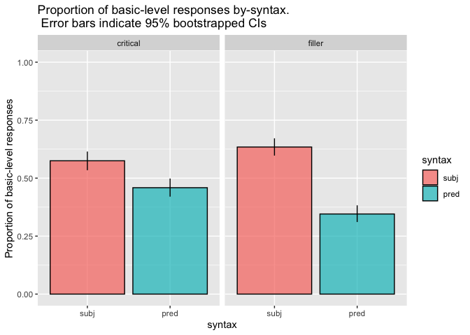
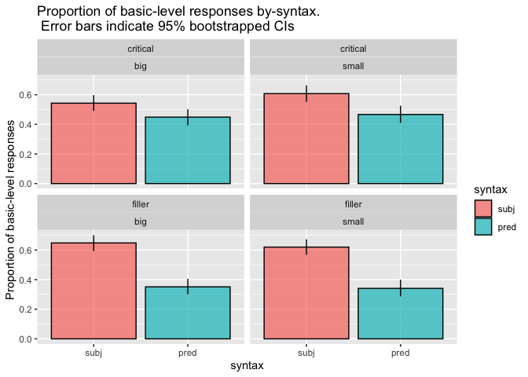

Direct Modification Forced Choice Prereg Final
================
Polina Tsvilodub
6/23/2021

``` r
# load libraries
library(tidyverse)
```

    ## ── Attaching packages ───────────────────────────────────────────────────────────────────────────────── tidyverse 1.3.0 ──

    ## ✓ ggplot2 3.3.1     ✓ purrr   0.3.4
    ## ✓ tibble  3.0.1     ✓ dplyr   1.0.0
    ## ✓ tidyr   1.1.0     ✓ stringr 1.4.0
    ## ✓ readr   1.3.1     ✓ forcats 0.5.0

    ## ── Conflicts ──────────────────────────────────────────────────────────────────────────────────── tidyverse_conflicts() ──
    ## x dplyr::filter() masks stats::filter()
    ## x dplyr::lag()    masks stats::lag()

``` r
library(tidyboot)
library(brms)
```

    ## Loading required package: Rcpp

    ## Loading 'brms' package (version 2.13.0). Useful instructions
    ## can be found by typing help('brms'). A more detailed introduction
    ## to the package is available through vignette('brms_overview').

    ## 
    ## Attaching package: 'brms'

    ## The following object is masked from 'package:stats':
    ## 
    ##     ar

``` r
# read data
d <- read_csv("./../../data/direct-modification/results_42_double-mod-FC-wFilers-noTarget_prereg_final.csv")
```

    ## Parsed with column specification:
    ## cols(
    ##   .default = col_character(),
    ##   submission_id = col_double(),
    ##   experiment_id = col_double(),
    ##   enjoyment = col_double(),
    ##   trials = col_double(),
    ##   optionLeft = col_double(),
    ##   age = col_double(),
    ##   RT = col_double(),
    ##   trial_number = col_double(),
    ##   attempts = col_double(),
    ##   fairprice = col_double()
    ## )

    ## See spec(...) for full column specifications.

``` r
# exclusions

# check comments for any issues
d %>% distinct(comments) 
```

    ## # A tibble: 21 x 1
    ##    comments                                                                     
    ##    <chr>                                                                        
    ##  1 <NA>                                                                         
    ##  2 Na                                                                           
    ##  3 none                                                                         
    ##  4 That was surprisingly stressful                                              
    ##  5 n/a                                                                          
    ##  6 It was interesting to see the difference in which a sentence would mean to m…
    ##  7 N/A                                                                          
    ##  8 For the fair compensation question, no units are specified. That confused me…
    ##  9 nonw                                                                         
    ## 10 None                                                                         
    ## # … with 11 more rows

``` r
# check if bugs were reported
d %>% distinct(problems) 
```

    ## # A tibble: 24 x 1
    ##    problems                                 
    ##    <chr>                                    
    ##  1 No                                       
    ##  2 there were no glitches                   
    ##  3 <NA>                                     
    ##  4 no                                       
    ##  5 Na                                       
    ##  6 none                                     
    ##  7 Slow loading. Might have been my computer
    ##  8 Nope                                     
    ##  9 Nope! :)                                 
    ## 10 No it went smooth!                       
    ## # … with 14 more rows

``` r
# exclude non-native speakers
d %>% distinct(languages)
```

    ## # A tibble: 11 x 1
    ##    languages                      
    ##    <chr>                          
    ##  1 English                        
    ##  2 english                        
    ##  3 English, American Sign Language
    ##  4 englidh                        
    ##  5 English and Vietnamese         
    ##  6 english, tamil                 
    ##  7 English, Malay                 
    ##  8 English, Spanish               
    ##  9 hmong                          
    ## 10 English, German                
    ## 11 Chinese, English

``` r
d %>% distinct(submission_id) %>% count() %>% pull()
```

    ## [1] 152

``` r
d_native <- d %>% filter(grepl("en", languages, ignore.case = T))
# check the number of participants after exclusions
d_native %>% distinct(submission_id) %>% count() %>% pull()
```

    ## [1] 151

``` r
# only accept workers who get the paraphrase warm-up trial with max. 3 attempts
d_warmup_catch <- d_native %>% filter(trial_name == "comp_class_warmup") %>% group_by(submission_id) %>% filter(attempts > 3)
d_clean <- anti_join(d_native, d_warmup_catch, by = "submission_id")

# number of subjects left after exclusions based on the paraphrase warmup trial
d_clean %>% distinct(submission_id) %>% count() %>% pull()
```

    ## [1] 150

``` r
# get main trials
d_main <- d_clean %>% filter(!is.na(trial_type)) 
# check trial counts
d_main %>% count(trial_type, item_noun, syntax)
```

    ## # A tibble: 40 x 4
    ##    trial_type item_noun          syntax     n
    ##    <chr>      <chr>              <chr>  <int>
    ##  1 critical   birds_rescue       pred      57
    ##  2 critical   birds_rescue       subj      67
    ##  3 critical   buildings_landmark pred      64
    ##  4 critical   buildings_landmark subj      54
    ##  5 critical   dogs1_rescue       pred      63
    ##  6 critical   dogs1_rescue       subj      58
    ##  7 critical   dogs1_service      pred      64
    ##  8 critical   dogs1_service      subj      65
    ##  9 critical   dogs2_prize        pred      62
    ## 10 critical   dogs2_prize        subj      53
    ## # … with 30 more rows

``` r
d_main %>% count(trial_type, syntax, adj)
```

    ## # A tibble: 8 x 4
    ##   trial_type syntax adj       n
    ##   <chr>      <chr>  <chr> <int>
    ## 1 critical   pred   big     300
    ## 2 critical   pred   small   300
    ## 3 critical   subj   big     300
    ## 4 critical   subj   small   300
    ## 5 filler     pred   big     300
    ## 6 filler     pred   small   300
    ## 7 filler     subj   big     300
    ## 8 filler     subj   small   300

``` r
# classify responses into basic vs subordinate responses
d_main_cat <- d_main %>%
  rowwise() %>%
  mutate(response_cat = case_when(grepl(target, response) ~ "subordinate",
                                  (target == "strip mall" & response == "strip") ~ "subordinate",
                                  (target == "Great Dane" & response == "Great") ~ "subordinate",
                                  TRUE ~ "basic"
                                  ),
         response_num = ifelse(response_cat == "basic", 1, 0))
```

``` r
# get 95% bootstrapped CIs
d_main_cat_summary <- d_main_cat %>% mutate(syntax = factor(syntax, levels = c('subj', 'pred'))) %>%
  group_by(syntax, trial_type) %>%
  tidyboot_mean(column = response_num)
```

    ## Warning: `as_data_frame()` is deprecated as of tibble 2.0.0.
    ## Please use `as_tibble()` instead.
    ## The signature and semantics have changed, see `?as_tibble`.
    ## This warning is displayed once every 8 hours.
    ## Call `lifecycle::last_warnings()` to see where this warning was generated.

    ## Warning: `cols` is now required when using unnest().
    ## Please use `cols = c(strap)`

``` r
# plot by syntax
d_main_cat_summary %>%
  ggplot(., aes(x = syntax, y = mean, fill = syntax, ymin = ci_lower, ymax = ci_upper,)) +
  geom_col(alpha = 0.7, color = "black", ) +
  ylim(0, 1) +
  geom_linerange() +
  facet_wrap(~trial_type) +
  ylab("Proportion of basic-level responses") +
  ggtitle("Proportion of basic-level responses by-syntax.\n Error bars indicate 95% bootstrapped CIs")
```

<!-- -->

``` r
d_main_cat_size_summary <- d_main_cat %>% group_by(syntax, adj, trial_type) %>%
  mutate(syntax = factor(syntax, levels = c('subj', 'pred'))) %>%
  tidyboot_mean(column = response_num)
```

    ## Warning: `cols` is now required when using unnest().
    ## Please use `cols = c(strap)`

``` r
# plot syntax by-trial-type by-adjectives
d_main_cat_size_summary %>%
  ggplot(., aes(x = syntax, y = mean, fill = syntax, ymin = ci_lower, ymax = ci_upper,)) +
  geom_col(alpha = 0.7, color = "black") +
  geom_linerange() +
  ylab("Proportion of basic-level responses") +
  facet_wrap(trial_type~adj) +
  ggtitle("Proportion of basic-level responses by-syntax.\n Error bars indicate 95% bootstrapped CIs")
```

<!-- -->

``` r
d_main_cat_item_summary <- d_main_cat %>% 
  mutate(syntax = factor(syntax, levels = c('subj', 'pred'))) %>%
  group_by(syntax, item_noun, trial_type) %>%
  tidyboot_mean(column = response_num)
```

    ## Warning: `cols` is now required when using unnest().
    ## Please use `cols = c(strap)`

``` r
# plot syntax by-item by-trial_type
d_main_cat_item_summary %>%
  ggplot(., aes(x = syntax, y = mean, fill = syntax, ymin = ci_lower, ymax = ci_upper,)) +
  geom_col(alpha = 0.7, color = "black") +
  geom_linerange() +
  ylab("Proportion of basic-level responses") +
  facet_wrap(item_noun~trial_type, ncol = 2) +
  ggtitle("Proportion of basic-level responses by-syntax.\n Error bars indicate 95% bootstrapped CIs")
```

<!-- -->

``` r
# reorder factors
d_main_cat <- d_main_cat %>% mutate(
  unique_target = ifelse(trial_type == "critical", paste(target, ref_np, sep = "_"), target),
  syntax = factor(syntax, levels = c("subj", "pred")),
  trial_type = factor(trial_type),
  adj = factor(adj, levels = c("big", "small")),
  optionLeft = factor(optionLeft, levels = c(0, 1), labels = c("basic", "sub"))
)
# critical 1, filler -1
contrasts(d_main_cat$trial_type) <- contr.sum(2)
contrasts(d_main_cat$trial_type)
# subj 1, -1 pred
contrasts(d_main_cat$syntax) <- contr.sum(2)
contrasts(d_main_cat$syntax) 
# fit logistic regression
model <- brm(bf(response_num ~ syntax*trial_type + (1 + syntax*trial_type || submission_id) + 
               (1 + syntax*trial_type || item),
               decomp = "QR"), # random effects by-item (flowers, dogs, buildings etc) 
             data = d_main_cat,
             family = "bernoulli",
             control = list(adapt_delta = 0.96),
             iter = 3000,
             cores = 4)
```

    ## Compiling the C++ model

    ## Trying to compile a simple C file

    ## Start sampling

``` r
summary(model)
```

    ##  Family: bernoulli 
    ##   Links: mu = logit 
    ## Formula: response_num ~ syntax * trial_type + (1 + syntax * trial_type || submission_id) + (1 + syntax * trial_type || item) 
    ##    Data: d_main_cat (Number of observations: 2400) 
    ## Samples: 4 chains, each with iter = 3000; warmup = 1500; thin = 1;
    ##          total post-warmup samples = 6000
    ## 
    ## Group-Level Effects: 
    ## ~item (Number of levels: 7) 
    ##                         Estimate Est.Error l-95% CI u-95% CI Rhat Bulk_ESS
    ## sd(Intercept)               0.23      0.14     0.03     0.57 1.00     1558
    ## sd(syntax1)                 0.07      0.06     0.00     0.24 1.00     3512
    ## sd(trial_type1)             0.29      0.16     0.07     0.69 1.00     1570
    ## sd(syntax1:trial_type1)     0.12      0.10     0.01     0.36 1.00     1836
    ##                         Tail_ESS
    ## sd(Intercept)               1748
    ## sd(syntax1)                 2831
    ## sd(trial_type1)             1564
    ## sd(syntax1:trial_type1)     1979
    ## 
    ## ~submission_id (Number of levels: 150) 
    ##                         Estimate Est.Error l-95% CI u-95% CI Rhat Bulk_ESS
    ## sd(Intercept)               1.29      0.12     1.08     1.54 1.00     1853
    ## sd(syntax1)                 0.45      0.09     0.28     0.63 1.00     1628
    ## sd(trial_type1)             0.65      0.08     0.50     0.81 1.00     2315
    ## sd(syntax1:trial_type1)     0.34      0.10     0.12     0.53 1.00     1364
    ##                         Tail_ESS
    ## sd(Intercept)               3224
    ## sd(syntax1)                 2595
    ## sd(trial_type1)             3943
    ## sd(syntax1:trial_type1)     1403
    ## 
    ## Population-Level Effects: 
    ##                     Estimate Est.Error l-95% CI u-95% CI Rhat Bulk_ESS Tail_ESS
    ## Intercept               0.05      0.16    -0.27     0.36 1.00     1623     2729
    ## syntax1                 0.59      0.08     0.44     0.74 1.00     3648     3698
    ## trial_type1            -0.09      0.14    -0.38     0.20 1.00     1958     2807
    ## syntax1:trial_type1     0.26      0.08     0.09     0.43 1.00     3438     3284
    ## 
    ## Samples were drawn using sampling(NUTS). For each parameter, Bulk_ESS
    ## and Tail_ESS are effective sample size measures, and Rhat is the potential
    ## scale reduction factor on split chains (at convergence, Rhat = 1).

Get contrasts (esp. effect of syntax in the critical condition) from brm
model fit w `hypothesis`:

``` r
critical_subj <- c(critical_subj = "Intercept + trial_type1 + syntax1 + syntax1:trial_type1= 0")
critical_pred <- c(critical_pred = "Intercept + trial_type1 - syntax1 - syntax1:trial_type1 = 0")

filler_subj <- c(filler_subj = "Intercept - trial_type1 + syntax1 - syntax1:trial_type1= 0")
filler_pred <- c(filler_pred = "Intercept - trial_type1 - syntax1 + syntax1:trial_type1 = 0")

# our syntax hypotheses are actually directional: we expect more basic responses in the subject than predicate conditions, 
# and therefore this contrast being larger than 0
syntax_critical <- c(syntax_critical = "2 * syntax1 + 2 * syntax1:trial_type1 > 0")
syntax_filler <- c(syntax_filler = "2 * syntax1 - 2 * syntax1:trial_type1 > 0")

subj_critical_filler <- c(subj_critical_filler = "2*trial_type1 + 2 * syntax1:trial_type1 = 0" )
pred_critical_filler <- c(pred_critical_filler = "2*trial_type1 - 2 * syntax1:trial_type1 = 0" )

contrast_answers <- hypothesis(model, c(critical_subj, critical_pred, syntax_critical,
                                 filler_subj, filler_pred, syntax_filler,
                                 subj_critical_filler, pred_critical_filler))
contrast_answers
```

    ## Hypothesis Tests for class b:
    ##             Hypothesis Estimate Est.Error CI.Lower CI.Upper Evid.Ratio
    ## 1        critical_subj     0.80      0.24     0.33     1.29         NA
    ## 2        critical_pred    -0.89      0.25    -1.37    -0.42         NA
    ## 3      syntax_critical     1.69      0.23     1.31     2.08        Inf
    ## 4          filler_subj     0.46      0.24    -0.01     0.94         NA
    ## 5          filler_pred    -0.20      0.24    -0.69     0.28         NA
    ## 6        syntax_filler     0.66      0.22     0.31     1.02        399
    ## 7 subj_critical_filler     0.34      0.33    -0.33     1.00         NA
    ## 8 pred_critical_filler    -0.69      0.33    -1.35    -0.03         NA
    ##   Post.Prob Star
    ## 1        NA    *
    ## 2        NA    *
    ## 3         1    *
    ## 4        NA     
    ## 5        NA     
    ## 6         1    *
    ## 7        NA     
    ## 8        NA    *
    ## ---
    ## 'CI': 90%-CI for one-sided and 95%-CI for two-sided hypotheses.
    ## '*': For one-sided hypotheses, the posterior probability exceeds 95%;
    ## for two-sided hypotheses, the value tested against lies outside the 95%-CI.
    ## Posterior probabilities of point hypotheses assume equal prior probabilities.

Exploratory model with main effect of size:

``` r
# big 1, small -1
contrasts(d_main_cat$adj) <- contr.sum(2)

model_size <- brm(bf(response_num ~ syntax*trial_type*adj + (1 + syntax*trial_type*adj || submission_id) + 
               (1 + syntax*trial_type*adj || item),
               decomp = "QR"), # random effects by-item (flowers, dogs, buildings etc) 
             data = d_main_cat,
             family = "bernoulli",
             control = list(adapt_delta = 0.96),
             iter = 3000,
             cores = 4)
```

    ## Compiling the C++ model

    ## Trying to compile a simple C file

    ## Start sampling

``` r
summary(model_size)
```

    ##  Family: bernoulli 
    ##   Links: mu = logit 
    ## Formula: response_num ~ syntax * trial_type * adj + (1 + syntax * trial_type * adj || submission_id) + (1 + syntax * trial_type * adj || item) 
    ##    Data: d_main_cat (Number of observations: 2400) 
    ## Samples: 4 chains, each with iter = 3000; warmup = 1500; thin = 1;
    ##          total post-warmup samples = 6000
    ## 
    ## Group-Level Effects: 
    ## ~item (Number of levels: 7) 
    ##                              Estimate Est.Error l-95% CI u-95% CI Rhat Bulk_ESS
    ## sd(Intercept)                    0.24      0.15     0.03     0.60 1.00     1564
    ## sd(syntax1)                      0.08      0.07     0.00     0.25 1.00     3354
    ## sd(trial_type1)                  0.36      0.19     0.12     0.84 1.00     1904
    ## sd(adj1)                         0.36      0.18     0.11     0.82 1.00     1854
    ## sd(syntax1:trial_type1)          0.15      0.11     0.01     0.41 1.00     1988
    ## sd(syntax1:adj1)                 0.11      0.10     0.00     0.35 1.00     2186
    ## sd(trial_type1:adj1)             0.20      0.15     0.01     0.56 1.00     1308
    ## sd(syntax1:trial_type1:adj1)     0.08      0.08     0.00     0.28 1.00     3088
    ##                              Tail_ESS
    ## sd(Intercept)                    1781
    ## sd(syntax1)                      3771
    ## sd(trial_type1)                  2802
    ## sd(adj1)                         2249
    ## sd(syntax1:trial_type1)          2563
    ## sd(syntax1:adj1)                 3526
    ## sd(trial_type1:adj1)             2537
    ## sd(syntax1:trial_type1:adj1)     3405
    ## 
    ## ~submission_id (Number of levels: 150) 
    ##                              Estimate Est.Error l-95% CI u-95% CI Rhat Bulk_ESS
    ## sd(Intercept)                    1.47      0.13     1.22     1.73 1.00     2046
    ## sd(syntax1)                      0.56      0.09     0.39     0.75 1.00     1309
    ## sd(trial_type1)                  0.75      0.09     0.58     0.95 1.00     2112
    ## sd(adj1)                         0.48      0.09     0.29     0.66 1.00     1717
    ## sd(syntax1:trial_type1)          0.45      0.10     0.25     0.64 1.00     2007
    ## sd(syntax1:adj1)                 0.19      0.11     0.01     0.41 1.00     1511
    ## sd(trial_type1:adj1)             0.33      0.11     0.08     0.54 1.00     1297
    ## sd(syntax1:trial_type1:adj1)     0.20      0.11     0.01     0.42 1.00     1290
    ##                              Tail_ESS
    ## sd(Intercept)                    3272
    ## sd(syntax1)                      2825
    ## sd(trial_type1)                  3856
    ## sd(adj1)                         2604
    ## sd(syntax1:trial_type1)          2755
    ## sd(syntax1:adj1)                 2807
    ## sd(trial_type1:adj1)             1539
    ## sd(syntax1:trial_type1:adj1)     2385
    ## 
    ## Population-Level Effects: 
    ##                          Estimate Est.Error l-95% CI u-95% CI Rhat Bulk_ESS
    ## Intercept                    0.04      0.17    -0.29     0.38 1.00     2229
    ## syntax1                      0.65      0.09     0.48     0.82 1.00     4479
    ## trial_type1                 -0.11      0.17    -0.45     0.24 1.00     2956
    ## adj1                         0.01      0.17    -0.31     0.36 1.00     3298
    ## syntax1:trial_type1          0.29      0.10     0.10     0.48 1.00     4506
    ## syntax1:adj1                -0.04      0.08    -0.20     0.12 1.00     5191
    ## trial_type1:adj1             0.11      0.11    -0.10     0.34 1.00     4386
    ## syntax1:trial_type1:adj1     0.05      0.07    -0.09     0.20 1.00     6310
    ##                          Tail_ESS
    ## Intercept                    3289
    ## syntax1                      4355
    ## trial_type1                  3694
    ## adj1                         3244
    ## syntax1:trial_type1          3301
    ## syntax1:adj1                 3064
    ## trial_type1:adj1             3259
    ## syntax1:trial_type1:adj1     4384
    ## 
    ## Samples were drawn using sampling(NUTS). For each parameter, Bulk_ESS
    ## and Tail_ESS are effective sample size measures, and Rhat is the potential
    ## scale reduction factor on split chains (at convergence, Rhat = 1).

Get exploratory effects of target size by syntax and trial-type using
`hypothesis`:

``` r
critical_subj <- c(critical_subj = "Intercept + trial_type1 + syntax1 + syntax1:trial_type1= 0")
critical_pred <- c(critical_pred = "Intercept + trial_type1 - syntax1 - syntax1:trial_type1 = 0")

filler_subj <- c(filler_subj = "Intercept - trial_type1 + syntax1 - syntax1:trial_type1= 0")
filler_pred <- c(filler_pred = "Intercept - trial_type1 - syntax1 + syntax1:trial_type1 = 0")

critical_big <- c(critical_big = "Intercept + trial_type1 + adj1 + trial_type1:adj1 = 0")
critical_small <- c(critical_small = "Intercept + trial_type1 - adj1 - trial_type1:adj1 = 0")

filler_big <- c(filler_big = "Intercept - trial_type1 + adj1 - trial_type1:adj1 = 0")
filler_small <- c(filler_small = "Intercept - trial_type1 - adj1 + trial_type1:adj1 = 0")

# our syntax hypotheses are actually directional: we expect more basic responses in the subject than predicate conditions, 
# and therefore this contrast being larger than 0
syntax_critical <- c(syntax_critical = "2 * syntax1 + 2 * syntax1:trial_type1 > 0") # subj - pred
syntax_filler <- c(syntax_filler = "2 * syntax1 - 2 * syntax1:trial_type1 > 0") # subj - pred

# exploratory check if there is an effect of size by trial type and by syntactic condition
size_critical <- c(size_critical = "2 * adj1 + 2 * trial_type1:adj1 = 0") # big - small 
size_filler <- c(size_filler = "2 * adj1 - 2 * trial_type1:adj1 = 0") # big - small
size_subj <- c(size_subj = "2 * adj1 + 2 * syntax1:adj1 = 0") # big - small
size_pred <- c(size_pred = "2 * adj1 - 2 * syntax1:adj1 = 0") # big - small

# effect of trial type by syntactic condition
subj_critical_filler <- c(subj_critical_filler = "2*trial_type1 + 2 * syntax1:trial_type1 = 0" )
pred_critical_filler <- c(pred_critical_filler = "2*trial_type1 - 2 * syntax1:trial_type1 = 0" )

contrast_answers_size <- hypothesis(model_size, c(critical_subj, critical_pred, syntax_critical,
                                 filler_subj, filler_pred, syntax_filler,
                                 subj_critical_filler, pred_critical_filler,
                                 critical_big, critical_small, size_critical, 
                                 filler_big, filler_small, size_filler,
                                 size_subj, size_pred))
contrast_answers_size
```

    ## Hypothesis Tests for class b:
    ##              Hypothesis Estimate Est.Error CI.Lower CI.Upper Evid.Ratio
    ## 1         critical_subj     0.88      0.27     0.34     1.41         NA
    ## 2         critical_pred    -1.01      0.28    -1.56    -0.47         NA
    ## 3       syntax_critical     1.89      0.26     1.47     2.32        Inf
    ## 4           filler_subj     0.51      0.27    -0.03     1.07         NA
    ## 5           filler_pred    -0.21      0.27    -0.74     0.32         NA
    ## 6         syntax_filler     0.72      0.25     0.33     1.12     351.94
    ## 7  subj_critical_filler     0.37      0.40    -0.43     1.17         NA
    ## 8  pred_critical_filler    -0.80      0.40    -1.57    -0.03         NA
    ## 9          critical_big     0.06      0.32    -0.55     0.68         NA
    ## 10       critical_small    -0.19      0.32    -0.81     0.43         NA
    ## 11        size_critical     0.25      0.40    -0.54     1.08         NA
    ## 12           filler_big     0.05      0.31    -0.58     0.68         NA
    ## 13         filler_small     0.25      0.32    -0.38     0.89         NA
    ## 14          size_filler    -0.20      0.40    -0.97     0.62         NA
    ## 15            size_subj    -0.06      0.37    -0.77     0.70         NA
    ## 16            size_pred     0.11      0.38    -0.61     0.89         NA
    ##    Post.Prob Star
    ## 1         NA    *
    ## 2         NA    *
    ## 3          1    *
    ## 4         NA     
    ## 5         NA     
    ## 6          1    *
    ## 7         NA     
    ## 8         NA    *
    ## 9         NA     
    ## 10        NA     
    ## 11        NA     
    ## 12        NA     
    ## 13        NA     
    ## 14        NA     
    ## 15        NA     
    ## 16        NA     
    ## ---
    ## 'CI': 90%-CI for one-sided and 95%-CI for two-sided hypotheses.
    ## '*': For one-sided hypotheses, the posterior probability exceeds 95%;
    ## for two-sided hypotheses, the value tested against lies outside the 95%-CI.
    ## Posterior probabilities of point hypotheses assume equal prior probabilities.

Check how many participants stuck to the same option (e.g., always the
left one):

``` r
d_main_cat %>% mutate(leftOption = option1,
                      rightOption = option2,
                      optionChosen = case_when(
                        (response == "Great") & (leftOption == "Great Danes") ~ "left", 
                        (response == "Great") & (rightOption == "Great Danes") ~ "right",
                        (response == "strip") & (leftOption == "strip malls") ~ "left", 
                        (response == "strip") & (rightOption == "strip malls") ~ "right",
                        response == leftOption ~ "left",
                        response == rightOption ~ "right")
                      ) %>% 
  group_by(submission_id, optionChosen) %>% count() -> d_main_option_counts

d_main_option_counts  
```

    ## # A tibble: 291 x 3
    ## # Groups:   submission_id, optionChosen [291]
    ##    submission_id optionChosen     n
    ##            <dbl> <chr>        <int>
    ##  1          2875 left            10
    ##  2          2875 right            6
    ##  3          2876 left            10
    ##  4          2876 right            6
    ##  5          2877 left            11
    ##  6          2877 right            5
    ##  7          2878 left             7
    ##  8          2878 right            9
    ##  9          2879 left             3
    ## 10          2879 right           13
    ## # … with 281 more rows

``` r
# no participants stuck to one option only
d_main_option_counts %>% filter(n == 16)
```

    ## # A tibble: 9 x 3
    ## # Groups:   submission_id, optionChosen [9]
    ##   submission_id optionChosen     n
    ##           <dbl> <chr>        <int>
    ## 1          2896 right           16
    ## 2          2912 right           16
    ## 3          2915 left            16
    ## 4          2983 left            16
    ## 5          2990 left            16
    ## 6          2996 left            16
    ## 7          2998 left            16
    ## 8          3013 left            16
    ## 9          3015 right           16

``` r
# check tendency towards one of the sides -- there seem to be no preferences
d_main_option_counts %>% group_by(optionChosen) %>% summarise(mean_choices = mean(n))
```

    ## `summarise()` ungrouping output (override with `.groups` argument)

    ## # A tibble: 2 x 2
    ##   optionChosen mean_choices
    ##   <chr>               <dbl>
    ## 1 left                 7.95
    ## 2 right                8.55

Count the different FC orders:

``` r
d_main_cat %>% count(optionLeft)
```

    ## # A tibble: 2 x 2
    ## # Rowwise: 
    ##   optionLeft     n
    ##   <fct>      <int>
    ## 1 basic       1120
    ## 2 sub         1280

Explore the between-subjects effect of the order of response options:

``` r
# basic is the left option 1, sub is the left option -1
contrasts(d_main_cat$optionLeft) <- contr.sum(2)

model_option <- brm(bf(response_num ~ syntax*trial_type*optionLeft + (1 + syntax*trial_type || submission_id) + 
               (1 + syntax*trial_type*optionLeft || item),
               decomp = "QR"), # random effects by-item (flowers, dogs, buildings etc) 
             data = d_main_cat,
             family = "bernoulli",
             control = list(adapt_delta = 0.96),
             iter = 3000,
             cores = 4)
```

    ## Compiling the C++ model

    ## Trying to compile a simple C file

    ## Start sampling

    ## Warning: There were 2 divergent transitions after warmup. Increasing adapt_delta above 0.96 may help. See
    ## http://mc-stan.org/misc/warnings.html#divergent-transitions-after-warmup

    ## Warning: Examine the pairs() plot to diagnose sampling problems

``` r
summary(model_option)
```

    ## Warning: There were 2 divergent transitions after warmup. Increasing adapt_delta
    ## above 0.96 may help. See http://mc-stan.org/misc/warnings.html#divergent-
    ## transitions-after-warmup

    ##  Family: bernoulli 
    ##   Links: mu = logit 
    ## Formula: response_num ~ syntax * trial_type * optionLeft + (1 + syntax * trial_type || submission_id) + (1 + syntax * trial_type * optionLeft || item) 
    ##    Data: d_main_cat (Number of observations: 2400) 
    ## Samples: 4 chains, each with iter = 3000; warmup = 1500; thin = 1;
    ##          total post-warmup samples = 6000
    ## 
    ## Group-Level Effects: 
    ## ~item (Number of levels: 7) 
    ##                                     Estimate Est.Error l-95% CI u-95% CI Rhat
    ## sd(Intercept)                           0.23      0.14     0.03     0.57 1.00
    ## sd(syntax1)                             0.07      0.07     0.00     0.23 1.00
    ## sd(trial_type1)                         0.29      0.16     0.08     0.67 1.00
    ## sd(optionLeft1)                         0.10      0.09     0.00     0.32 1.00
    ## sd(syntax1:trial_type1)                 0.12      0.10     0.01     0.36 1.00
    ## sd(syntax1:optionLeft1)                 0.08      0.07     0.00     0.26 1.00
    ## sd(trial_type1:optionLeft1)             0.10      0.08     0.00     0.31 1.00
    ## sd(syntax1:trial_type1:optionLeft1)     0.15      0.12     0.01     0.46 1.00
    ##                                     Bulk_ESS Tail_ESS
    ## sd(Intercept)                           1633     1750
    ## sd(syntax1)                             3083     2876
    ## sd(trial_type1)                         1721     2223
    ## sd(optionLeft1)                         2653     3463
    ## sd(syntax1:trial_type1)                 1782     2998
    ## sd(syntax1:optionLeft1)                 2808     3535
    ## sd(trial_type1:optionLeft1)             2495     2432
    ## sd(syntax1:trial_type1:optionLeft1)     1529     2208
    ## 
    ## ~submission_id (Number of levels: 150) 
    ##                         Estimate Est.Error l-95% CI u-95% CI Rhat Bulk_ESS
    ## sd(Intercept)               1.32      0.12     1.10     1.57 1.00     1876
    ## sd(syntax1)                 0.46      0.09     0.28     0.62 1.00     1963
    ## sd(trial_type1)             0.65      0.08     0.50     0.82 1.00     2223
    ## sd(syntax1:trial_type1)     0.36      0.10     0.13     0.54 1.01     1093
    ##                         Tail_ESS
    ## sd(Intercept)               3325
    ## sd(syntax1)                 2216
    ## sd(trial_type1)             2564
    ## sd(syntax1:trial_type1)      940
    ## 
    ## Population-Level Effects: 
    ##                                 Estimate Est.Error l-95% CI u-95% CI Rhat
    ## Intercept                           0.04      0.16    -0.27     0.36 1.01
    ## syntax1                             0.59      0.08     0.44     0.74 1.00
    ## trial_type1                        -0.08      0.15    -0.37     0.21 1.00
    ## optionLeft1                        -0.07      0.13    -0.32     0.19 1.00
    ## syntax1:trial_type1                 0.26      0.09     0.10     0.43 1.00
    ## syntax1:optionLeft1                -0.09      0.08    -0.24     0.07 1.00
    ## trial_type1:optionLeft1             0.13      0.09    -0.05     0.31 1.00
    ## syntax1:trial_type1:optionLeft1     0.02      0.10    -0.17     0.22 1.00
    ##                                 Bulk_ESS Tail_ESS
    ## Intercept                           2025     2242
    ## syntax1                             3945     3952
    ## trial_type1                         1989     2380
    ## optionLeft1                         1897     2788
    ## syntax1:trial_type1                 3995     3787
    ## syntax1:optionLeft1                 4457     3996
    ## trial_type1:optionLeft1             3689     3875
    ## syntax1:trial_type1:optionLeft1     2949     2923
    ## 
    ## Samples were drawn using sampling(NUTS). For each parameter, Bulk_ESS
    ## and Tail_ESS are effective sample size measures, and Rhat is the potential
    ## scale reduction factor on split chains (at convergence, Rhat = 1).

Get exploratory effects of the FC options order by-syntax / by-trial
type:

``` r
critical_optionBasic <- c(critical_optionBasic = "Intercept + trial_type1 + optionLeft1 + trial_type1:optionLeft1 = 0")
critical_optionSub <- c(critical_optionSub = "Intercept + trial_type1 - optionLeft1 - trial_type1:optionLeft1 = 0")

filler_optionBasic <- c(filler_optionBasic = "Intercept - trial_type1 + optionLeft1 - trial_type1:optionLeft1 = 0")
filler_optionSub <- c(filler_optionSub = "Intercept - trial_type1 - optionLeft1 + trial_type1:optionLeft1 = 0")
# explore effect of options order by trial type
option_critical <- c(option_critical = "2 * optionLeft1 + 2 * trial_type1:optionLeft1 = 0") # basic - sub is left
option_filler <- c(option_filler = "2 * optionLeft1 - 2 * trial_type1:optionLeft1 = 0") # basic - sub is left
# explore effect of options order by syntax
option_subj <- c(option_subj = "2 * optionLeft1 + 2 * syntax1:optionLeft1 = 0") # basic - sub is left
option_pred <- c(option_pred = "2 * optionLeft1 - 2 * syntax1:optionLeft1 = 0")# basic - sub is left

# explore effect of options order in the single syntactic conditions of critical trials
# in subject condition
option_subj_critical <- c(option_subj_critical = "2 * optionLeft1 + 2 * syntax1:optionLeft1 + 2 * trial_type1:optionLeft1 + 2 * syntax1:trial_type1:optionLeft1 = 0")
# in predicate condition
option_pred_critical <- c(option_pred_critical = "2 * optionLeft1 - 2 * syntax1:optionLeft1 + 2 * trial_type1:optionLeft1 - 2 * syntax1:trial_type1:optionLeft1 = 0")

contrast_answers_option <- hypothesis(model_option, c(critical_optionBasic, critical_optionSub, option_critical,
                                 filler_optionBasic, filler_optionSub, option_filler,
                                 option_subj, option_pred,
                                 option_subj_critical, option_pred_critical))
contrast_answers_option
```

    ## Hypothesis Tests for class b:
    ##              Hypothesis Estimate Est.Error CI.Lower CI.Upper Evid.Ratio
    ## 1  critical_optionBasic     0.02      0.28    -0.52     0.58         NA
    ## 2    critical_optionSub    -0.10      0.27    -0.63     0.42         NA
    ## 3       option_critical     0.11      0.32    -0.51     0.73         NA
    ## 4    filler_optionBasic    -0.08      0.27    -0.65     0.47         NA
    ## 5      filler_optionSub     0.32      0.27    -0.21     0.85         NA
    ## 6         option_filler    -0.40      0.31    -1.01     0.23         NA
    ## 7           option_subj    -0.32      0.30    -0.91     0.28         NA
    ## 8           option_pred     0.03      0.30    -0.56     0.64         NA
    ## 9  option_subj_critical    -0.03      0.41    -0.83     0.78         NA
    ## 10 option_pred_critical     0.25      0.41    -0.56     1.10         NA
    ##    Post.Prob Star
    ## 1         NA     
    ## 2         NA     
    ## 3         NA     
    ## 4         NA     
    ## 5         NA     
    ## 6         NA     
    ## 7         NA     
    ## 8         NA     
    ## 9         NA     
    ## 10        NA     
    ## ---
    ## 'CI': 90%-CI for one-sided and 95%-CI for two-sided hypotheses.
    ## '*': For one-sided hypotheses, the posterior probability exceeds 95%;
    ## for two-sided hypotheses, the value tested against lies outside the 95%-CI.
    ## Posterior probabilities of point hypotheses assume equal prior probabilities.
