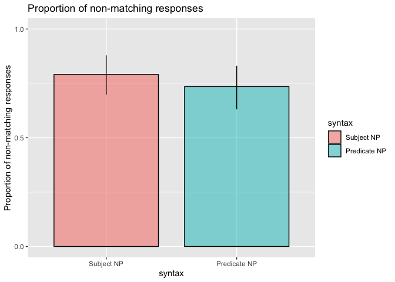
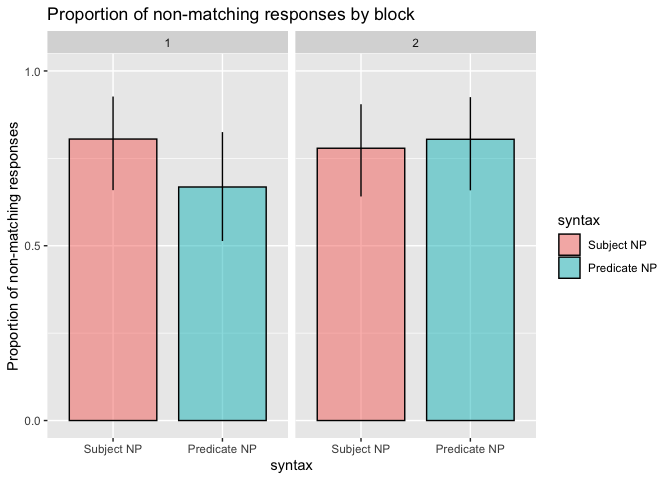
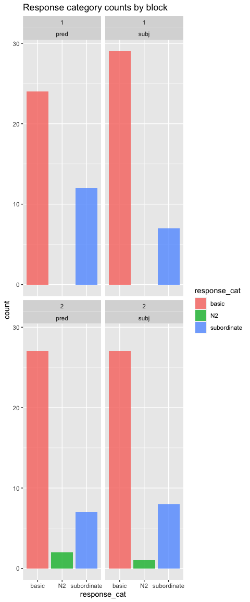
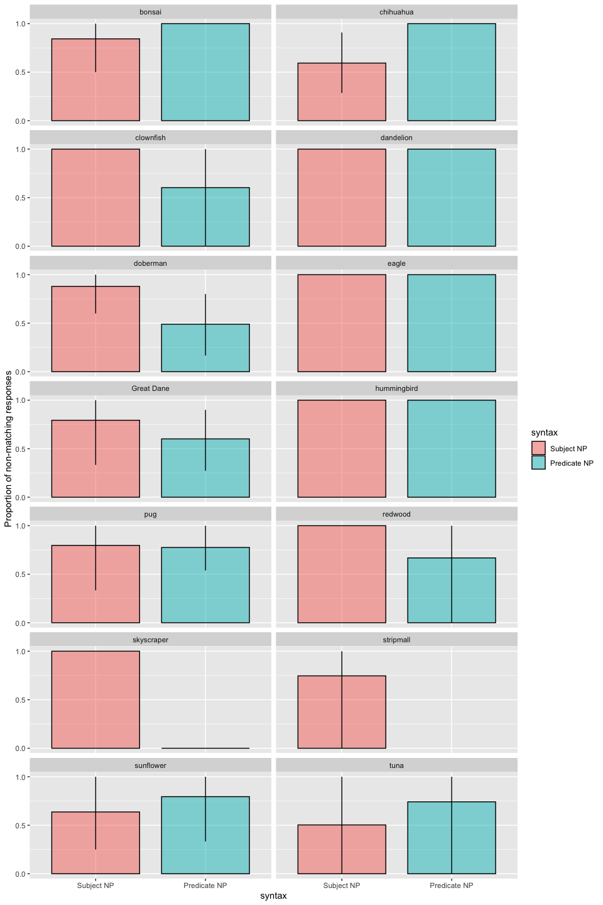

Direct Modification Results - Critical Trials Only Pilot
================
Polina Tsvilodub
12/29/2020

This write-up presents results of the pilot direct-modification
experiment for the refpred project which includes only critical trials,
i.e., trials including directly modified nouns only. It is a follow-up
on the full preregistered direct-modification
[experiment](https://github.com/polina-tsvilodub/refpred/blob/master/analysis/direct-modification/direct-modification-prereg-final.md).

N=40 subjects were recruited for this pilot on Prolific.

# Experiment design

The experiment has a 2-level factorial within-subjects design,
manipulating the syntactic position of subordinate nouns (subject vs
predicate N), all appearing in basic-level context.

Participants see a context picture and read a sentence about a referent
which they have to paraphrase, completing a total of 4 main trials,
presented in two blocks of 2 main trials each, where each trial is a
condition resulting from a unique combination of the noun position
condition (subject N vs. predicate N) crossed with the size of the
referent within its basic-level category (e.g., large vs. small
subordinate dog category). Ten contexts created from six different
basic-level categories are used: dogs, flowers, birds, fish, buildings
and trees. For each basic-level context, there are two possible targets
representing a large-subordinate and a small-subordinate category,
respectively. Four contexts are sampled for each participant.
Information about the items can be found
[here](https://docs.google.com/document/d/1yxF9ACALa6MQB70nYydGStvLiY0JjO8mmkASI049lT4/edit?usp=sharing).

# Analysis

## Data Preprocessing

We collected data from N = 40 participants. 3 participants are excluded
for not reporting their native language, or being non-native English
speakers. 1 subject failed the labeling warm-up trials (also taking more
than 4 attempts upon correction). This leaves N = 36.

``` r
# exclude participants who report glitches
data %>% select(submission_id, comments, problems) %>% distinct() %>% View()
d_modRef_woGlitches <- data 

# exclude non-native English speakers
d_modRef_woGlitches %>% distinct(languages) %>% View()

# 40 participants received
d_modRef_Native <- d_modRef_woGlitches %>% 
  filter(grepl("en", languages, ignore.case = T)) 
# excluded 3 as non-native English speakers

# cleaning warm-up trials
# comparison class paraphrase trial

# excludes 0
d_failed_cc_warmup <- d_modRef_Native %>% 
  filter( trial_name == "comp_class_warmup") %>%
  group_by(submission_id) %>% count() %>%
  filter( n > 4 )
# excludes 1
d_failed_label_warmup <- d_modRef_Native %>%
  filter( (trial_name == "warmup1") | (trial_name == "warmup2")) %>%
  group_by(submission_id) %>%
  filter(attempts > 4)
d_label_warmup_more1 <- d_modRef_Native %>%
  filter( (trial_name == "warmup1") | (trial_name == "warmup2")) %>%
  group_by(submission_id) %>%
  filter(attempts > 1) %>% ungroup() %>% 
  select(submission_id, picture1, response1, picture2, response2, attempts)

# 36 left 
d_modRef_filter <- anti_join(d_modRef_Native, d_failed_cc_warmup, by = c("submission_id"))
d_modRef_filter <- anti_join(d_modRef_filter, d_failed_label_warmup, by = c("submission_id"))

# exclude last 4 submissions to get 300 subjects
#d_modRef_filter300 <- d_modRef_filter %>% filter(!(submission_id %in% c(2644, 2645, 2646, 2647)))
```

Check the balancing of conditions:

``` r
d_modRef_filter %>% count(trial_type, syntax, target_size)
```

    ## # A tibble: 5 x 4
    ##   trial_type syntax target_size     n
    ##   <chr>      <chr>  <chr>       <int>
    ## 1 critical   pred   big            36
    ## 2 critical   pred   small          36
    ## 3 critical   subj   big            36
    ## 4 critical   subj   small          36
    ## 5 <NA>       <NA>   <NA>          207

``` r
d_modRef_filter %>% count(syntax, item)
```

    ## # A tibble: 22 x 3
    ##    syntax item          n
    ##    <chr>  <chr>     <int>
    ##  1 pred   birds         3
    ##  2 pred   buildings     2
    ##  3 pred   dogs1        17
    ##  4 pred   dogs2        23
    ##  5 pred   fish          9
    ##  6 pred   flowers      12
    ##  7 pred   trees         6
    ##  8 subj   birds         6
    ##  9 subj   buildings     7
    ## 10 subj   dogs1        18
    ## # … with 12 more rows

Add unique identifiers of the items resulting from the combination of
the context and the N2:

``` r
d_modRef_filter <- d_modRef_filter %>% mutate(
  unique_target = paste(target, ref_np, sep = "_")
)
d_modRef_filter %>% count( unique_target)
```

    ## # A tibble: 19 x 2
    ##    unique_target                n
    ##    <chr>                    <int>
    ##  1 bonsai_landmark              9
    ##  2 chihuahua_service-animal    17
    ##  3 clownfish_rescue             6
    ##  4 dandelion_gift              13
    ##  5 dandelion_landmark           2
    ##  6 doberman_service-animal     18
    ##  7 eagle_rescue                 6
    ##  8 Great Dane_gift              4
    ##  9 Great Dane_prize-winner     11
    ## 10 hummingbird_rescue           3
    ## 11 NA_NA                      207
    ## 12 pug_gift                     2
    ## 13 pug_prize-winner            16
    ## 14 redwood_landmark             5
    ## 15 skyscraper_landmark          5
    ## 16 stripmall_landmark           4
    ## 17 sunflower_gift              10
    ## 18 sunflower_landmark           3
    ## 19 tuna_rescue                 10

### Response Classification

#### Minimal exclusions

In this data set there are no invalid responses.

``` r
d_modRef_main <- d_modRef_filter %>% filter((trial_name == "custom_main_text1") |
                                (trial_name == "custom_main_text2")) %>%
  select(submission_id, trial_number, context_picture, response, target_size, adj, syntax, target, item, adj_cond, trial_type, ref_np, unique_target )

d_modRef_main <- d_modRef_main %>% group_by(submission_id) %>%
  mutate(
    block = c(1,1,2,2)
) 

d_modRef_main %>% distinct(response) %>% View()

# exclude 14 answers with minimal exclusion criteria
d_modRef_valid <- d_modRef_main #%>% 
  #subset(., !(tolower(response) %in% c("deandal", "the size of the flower", "pigeon or other common birds", "a rose", "pigeon", "trees or himself", "child", "himself and the other trees", "the size of other birds", "his own size", "human", "a person", "his award")))
# "sunflowers or bigger flowers", 
```

Then, the minimally cleaned responses are classified as matching the
critical noun (= subordinate) vs. non-matching (i.e., basic-level,
matchin N2, superordinate).

``` r
# classify 2386 responses 
d_modRef_main_responseCat <- d_modRef_valid %>% 
  mutate(response_cat = ifelse(
    tolower(response) %in% 
      c(
        "dog", "dogs", "tree" , "trees", "flower", "flowers", "building", "buildings", "fish", "bird", "birds",
        "fish in the tank", "the other dogs", "the other flowers", "fish\nfish", "landmark flowers","other buildings",
        
        "landmarks", "service animals",  "other service dog", "prize-winning dogs", "rescue fish"
      ), 
    "nonmatch", "match"
  ),
  response_num = ifelse(response_cat == "nonmatch", 1, 0)
  )
```

We also consider a more fine-grained 3-way response classification:
basic-level responses (also containing superordinate responses), N2
responses (e.g., “prize-winners”), subordinate responses.

``` r
# detailed analysis of non-matching responses, distinguishing between basic, N2 and 
# subordinate comparison classes
d_modRef_main_responseCat_3way <- d_modRef_main_responseCat %>%
  mutate(
    response_cat = ifelse(
      tolower(response) %in% 
        c("dog", "dogs", "tree" , "trees", "flower", "flowers", "building", "buildings", "fish", "bird", "birds",
        "fish in the tank", "the other dogs", "the other flowers", "fish\nfish", "landmark flowers", "other service dog",
        "prize-winning dogs", "rescue fish", "other buildings"
        ), "basic",
      ifelse( tolower(response) %in% c("landmarks", "service animals"
                                       ), "N2", "subordinate")
    )
  )
```

##### Plots

Here the proportion of non-matching responses by-syntax and by-trial
type is plotted. Error bars represent bootstrapped 95%-CIs.

We see a small effect in the critical condition, and we see a pronounced
effect in the filler conditions (replicating crucial results from CogSci
Exp. 3).

    ## Warning: `as_data_frame()` is deprecated as of tibble 2.0.0.
    ## Please use `as_tibble()` instead.
    ## The signature and semantics have changed, see `?as_tibble`.
    ## This warning is displayed once every 8 hours.
    ## Call `lifecycle::last_warnings()` to see where this warning was generated.

    ## Warning: `cols` is now required when using unnest().
    ## Please use `cols = c(strap)`

<!-- -->

Here, counts of the three response categories (basic, N2, subordinate)
in the critical direct-modification trials are plotted by-syntax.
<!-- -->
Here is an exploratory plot of the responses by response block (first
two trials versus third and fourth trial):

    ## Warning: `cols` is now required when using unnest().
    ## Please use `cols = c(strap)`

<!-- -->
Here is an exploratory plot of the 3-way response counts by response
block (first two trials versus third and fourth trial):
<!-- -->

## Stats

In the following, the dataset where less strict exclusions were applied
is used for analysis. The predictors are deviation-coded.

### Critical trials only

Fit the preregistered logistic model to critical trials only:

``` r
d_modRef_main_critical <- d_modRef_main_responseCat %>% filter(trial_type == "critical")

logistic_model_critical <- brm(
  response_num ~ syntax_dev + (1 + syntax_dev || submission_id) + 
    (1 + syntax_dev || unique_target),
  data = d_modRef_main_critical,
  family = "bernoulli",
  cores = 4,
  iter = 3000,
  chains = 4 ,
  control = list(adapt_delta = 0.95)
  )
```

    ## Running /Library/Frameworks/R.framework/Resources/bin/R CMD SHLIB foo.c
    ## clang -I"/Library/Frameworks/R.framework/Resources/include" -DNDEBUG   -I"/Library/Frameworks/R.framework/Versions/3.6/Resources/library/Rcpp/include/"  -I"/Library/Frameworks/R.framework/Versions/3.6/Resources/library/RcppEigen/include/"  -I"/Library/Frameworks/R.framework/Versions/3.6/Resources/library/RcppEigen/include/unsupported"  -I"/Library/Frameworks/R.framework/Versions/3.6/Resources/library/BH/include" -I"/Library/Frameworks/R.framework/Versions/3.6/Resources/library/StanHeaders/include/src/"  -I"/Library/Frameworks/R.framework/Versions/3.6/Resources/library/StanHeaders/include/"  -I"/Library/Frameworks/R.framework/Versions/3.6/Resources/library/rstan/include" -DEIGEN_NO_DEBUG  -D_REENTRANT  -DBOOST_DISABLE_ASSERTS -DBOOST_PENDING_INTEGER_LOG2_HPP -include stan/math/prim/mat/fun/Eigen.hpp   -isysroot /Library/Developer/CommandLineTools/SDKs/MacOSX.sdk -I/usr/local/include  -fPIC  -isysroot /Library/Developer/CommandLineTools/SDKs/MacOSX.sdk -c foo.c -o foo.o
    ## In file included from <built-in>:1:
    ## In file included from /Library/Frameworks/R.framework/Versions/3.6/Resources/library/StanHeaders/include/stan/math/prim/mat/fun/Eigen.hpp:13:
    ## In file included from /Library/Frameworks/R.framework/Versions/3.6/Resources/library/RcppEigen/include/Eigen/Dense:1:
    ## In file included from /Library/Frameworks/R.framework/Versions/3.6/Resources/library/RcppEigen/include/Eigen/Core:88:
    ## /Library/Frameworks/R.framework/Versions/3.6/Resources/library/RcppEigen/include/Eigen/src/Core/util/Macros.h:613:1: error: unknown type name 'namespace'
    ## namespace Eigen {
    ## ^
    ## /Library/Frameworks/R.framework/Versions/3.6/Resources/library/RcppEigen/include/Eigen/src/Core/util/Macros.h:613:16: error: expected ';' after top level declarator
    ## namespace Eigen {
    ##                ^
    ##                ;
    ## In file included from <built-in>:1:
    ## In file included from /Library/Frameworks/R.framework/Versions/3.6/Resources/library/StanHeaders/include/stan/math/prim/mat/fun/Eigen.hpp:13:
    ## In file included from /Library/Frameworks/R.framework/Versions/3.6/Resources/library/RcppEigen/include/Eigen/Dense:1:
    ## /Library/Frameworks/R.framework/Versions/3.6/Resources/library/RcppEigen/include/Eigen/Core:96:10: fatal error: 'complex' file not found
    ## #include <complex>
    ##          ^~~~~~~~~
    ## 3 errors generated.
    ## make: *** [foo.o] Error 1

``` r
summary(logistic_model_critical)
```

    ##  Family: bernoulli 
    ##   Links: mu = logit 
    ## Formula: response_num ~ syntax_dev + (1 + syntax_dev || submission_id) + (1 + syntax_dev || unique_target) 
    ##    Data: d_modRef_main_critical (Number of observations: 144) 
    ## Samples: 4 chains, each with iter = 3000; warmup = 1500; thin = 1;
    ##          total post-warmup samples = 6000
    ## 
    ## Group-Level Effects: 
    ## ~submission_id (Number of levels: 36) 
    ##                 Estimate Est.Error l-95% CI u-95% CI Rhat Bulk_ESS Tail_ESS
    ## sd(Intercept)       4.91      1.90     2.26     9.42 1.00     1310     2131
    ## sd(syntax_dev1)     1.62      1.02     0.11     3.99 1.00     1296     2209
    ## 
    ## ~unique_target (Number of levels: 18) 
    ##                 Estimate Est.Error l-95% CI u-95% CI Rhat Bulk_ESS Tail_ESS
    ## sd(Intercept)       2.14      1.18     0.36     4.93 1.00     1241     1671
    ## sd(syntax_dev1)     1.74      1.03     0.20     4.23 1.00     1423     2024
    ## 
    ## Population-Level Effects: 
    ##             Estimate Est.Error l-95% CI u-95% CI Rhat Bulk_ESS Tail_ESS
    ## Intercept       3.96      1.65     1.56     7.89 1.00     1706     2126
    ## syntax_dev1     0.73      0.83    -0.76     2.67 1.00     2457     2344
    ## 
    ## Samples were drawn using sampling(NUTS). For each parameter, Bulk_ESS
    ## and Tail_ESS are effective sample size measures, and Rhat is the potential
    ## scale reduction factor on split chains (at convergence, Rhat = 1).

Compute the probability of the effect of syntax being greater than 0:

    ## # A tibble: 1 x 1
    ##    prob
    ##   <dbl>
    ## 1 0.839

### Basic and subordinate responses only

Exploratory model on critical trials without N2 responses only (should
match the contrast in the rate of basic level responses in the
multinomial model on critical responses):

``` r
d_modRef_main_responseCat_noN2_critical <- d_modRef_main_responseCat_3way %>% filter (response_cat != "N2", trial_type == "critical")

logistic_model_noN2_critical <- brm(
  response_num ~ syntax_dev + (1 + syntax_dev || submission_id) + 
    (1 + syntax_dev || unique_target),
  data = d_modRef_main_responseCat_noN2_critical,
  family = "bernoulli",
  cores = 4,
  iter = 3000,
  chains = 4 , 
  control = list(adapt_delta = 0.95)
) 
```

    ## Running /Library/Frameworks/R.framework/Resources/bin/R CMD SHLIB foo.c
    ## clang -I"/Library/Frameworks/R.framework/Resources/include" -DNDEBUG   -I"/Library/Frameworks/R.framework/Versions/3.6/Resources/library/Rcpp/include/"  -I"/Library/Frameworks/R.framework/Versions/3.6/Resources/library/RcppEigen/include/"  -I"/Library/Frameworks/R.framework/Versions/3.6/Resources/library/RcppEigen/include/unsupported"  -I"/Library/Frameworks/R.framework/Versions/3.6/Resources/library/BH/include" -I"/Library/Frameworks/R.framework/Versions/3.6/Resources/library/StanHeaders/include/src/"  -I"/Library/Frameworks/R.framework/Versions/3.6/Resources/library/StanHeaders/include/"  -I"/Library/Frameworks/R.framework/Versions/3.6/Resources/library/rstan/include" -DEIGEN_NO_DEBUG  -D_REENTRANT  -DBOOST_DISABLE_ASSERTS -DBOOST_PENDING_INTEGER_LOG2_HPP -include stan/math/prim/mat/fun/Eigen.hpp   -isysroot /Library/Developer/CommandLineTools/SDKs/MacOSX.sdk -I/usr/local/include  -fPIC  -isysroot /Library/Developer/CommandLineTools/SDKs/MacOSX.sdk -c foo.c -o foo.o
    ## In file included from <built-in>:1:
    ## In file included from /Library/Frameworks/R.framework/Versions/3.6/Resources/library/StanHeaders/include/stan/math/prim/mat/fun/Eigen.hpp:13:
    ## In file included from /Library/Frameworks/R.framework/Versions/3.6/Resources/library/RcppEigen/include/Eigen/Dense:1:
    ## In file included from /Library/Frameworks/R.framework/Versions/3.6/Resources/library/RcppEigen/include/Eigen/Core:88:
    ## /Library/Frameworks/R.framework/Versions/3.6/Resources/library/RcppEigen/include/Eigen/src/Core/util/Macros.h:613:1: error: unknown type name 'namespace'
    ## namespace Eigen {
    ## ^
    ## /Library/Frameworks/R.framework/Versions/3.6/Resources/library/RcppEigen/include/Eigen/src/Core/util/Macros.h:613:16: error: expected ';' after top level declarator
    ## namespace Eigen {
    ##                ^
    ##                ;
    ## In file included from <built-in>:1:
    ## In file included from /Library/Frameworks/R.framework/Versions/3.6/Resources/library/StanHeaders/include/stan/math/prim/mat/fun/Eigen.hpp:13:
    ## In file included from /Library/Frameworks/R.framework/Versions/3.6/Resources/library/RcppEigen/include/Eigen/Dense:1:
    ## /Library/Frameworks/R.framework/Versions/3.6/Resources/library/RcppEigen/include/Eigen/Core:96:10: fatal error: 'complex' file not found
    ## #include <complex>
    ##          ^~~~~~~~~
    ## 3 errors generated.
    ## make: *** [foo.o] Error 1

``` r
summary(logistic_model_noN2_critical)
```

    ##  Family: bernoulli 
    ##   Links: mu = logit 
    ## Formula: response_num ~ syntax_dev + (1 + syntax_dev || submission_id) + (1 + syntax_dev || unique_target) 
    ##    Data: d_modRef_main_responseCat_noN2_critical (Number of observations: 141) 
    ## Samples: 4 chains, each with iter = 3000; warmup = 1500; thin = 1;
    ##          total post-warmup samples = 6000
    ## 
    ## Group-Level Effects: 
    ## ~submission_id (Number of levels: 36) 
    ##                 Estimate Est.Error l-95% CI u-95% CI Rhat Bulk_ESS Tail_ESS
    ## sd(Intercept)       5.47      2.18     2.59    10.95 1.00     1625     3058
    ## sd(syntax_dev1)     1.53      1.00     0.10     3.90 1.00     1585     2153
    ## 
    ## ~unique_target (Number of levels: 18) 
    ##                 Estimate Est.Error l-95% CI u-95% CI Rhat Bulk_ESS Tail_ESS
    ## sd(Intercept)       2.06      1.19     0.29     4.94 1.00     1790     2586
    ## sd(syntax_dev1)     1.33      0.94     0.07     3.58 1.00     2036     2878
    ## 
    ## Population-Level Effects: 
    ##             Estimate Est.Error l-95% CI u-95% CI Rhat Bulk_ESS Tail_ESS
    ## Intercept       3.85      1.72     1.33     8.10 1.00     2487     2975
    ## syntax_dev1     0.94      0.87    -0.46     2.96 1.00     3405     3041
    ## 
    ## Samples were drawn using sampling(NUTS). For each parameter, Bulk_ESS
    ## and Tail_ESS are effective sample size measures, and Rhat is the potential
    ## scale reduction factor on split chains (at convergence, Rhat = 1).

Compute the contrast of effect of syntax:

    ## `summarise()` ungrouping output (override with `.groups` argument)

    ## # A tibble: 1 x 2
    ##   key              prob
    ##   <chr>           <dbl>
    ## 1 syntax_critical 0.906

### Exploratory models with FE of adjective

Exploratory model on critical trial types with a fixed effect of
adjective (big vs. small):

``` r
logistic_model_adjectiveFE <- brm(
  response_num ~ syntax_dev * adj_dev +
    (1 + syntax_dev + adj_dev || submission_id) +   
    (1 + syntax_dev || unique_target), 
  data = d_modRef_main_responseCat,
  family = "bernoulli",
  cores = 4,
  iter = 3000,
  chains = 4 ,
  control = list(adapt_delta = 0.95)
)
```

    ## Running /Library/Frameworks/R.framework/Resources/bin/R CMD SHLIB foo.c
    ## clang -I"/Library/Frameworks/R.framework/Resources/include" -DNDEBUG   -I"/Library/Frameworks/R.framework/Versions/3.6/Resources/library/Rcpp/include/"  -I"/Library/Frameworks/R.framework/Versions/3.6/Resources/library/RcppEigen/include/"  -I"/Library/Frameworks/R.framework/Versions/3.6/Resources/library/RcppEigen/include/unsupported"  -I"/Library/Frameworks/R.framework/Versions/3.6/Resources/library/BH/include" -I"/Library/Frameworks/R.framework/Versions/3.6/Resources/library/StanHeaders/include/src/"  -I"/Library/Frameworks/R.framework/Versions/3.6/Resources/library/StanHeaders/include/"  -I"/Library/Frameworks/R.framework/Versions/3.6/Resources/library/rstan/include" -DEIGEN_NO_DEBUG  -D_REENTRANT  -DBOOST_DISABLE_ASSERTS -DBOOST_PENDING_INTEGER_LOG2_HPP -include stan/math/prim/mat/fun/Eigen.hpp   -isysroot /Library/Developer/CommandLineTools/SDKs/MacOSX.sdk -I/usr/local/include  -fPIC  -isysroot /Library/Developer/CommandLineTools/SDKs/MacOSX.sdk -c foo.c -o foo.o
    ## In file included from <built-in>:1:
    ## In file included from /Library/Frameworks/R.framework/Versions/3.6/Resources/library/StanHeaders/include/stan/math/prim/mat/fun/Eigen.hpp:13:
    ## In file included from /Library/Frameworks/R.framework/Versions/3.6/Resources/library/RcppEigen/include/Eigen/Dense:1:
    ## In file included from /Library/Frameworks/R.framework/Versions/3.6/Resources/library/RcppEigen/include/Eigen/Core:88:
    ## /Library/Frameworks/R.framework/Versions/3.6/Resources/library/RcppEigen/include/Eigen/src/Core/util/Macros.h:613:1: error: unknown type name 'namespace'
    ## namespace Eigen {
    ## ^
    ## /Library/Frameworks/R.framework/Versions/3.6/Resources/library/RcppEigen/include/Eigen/src/Core/util/Macros.h:613:16: error: expected ';' after top level declarator
    ## namespace Eigen {
    ##                ^
    ##                ;
    ## In file included from <built-in>:1:
    ## In file included from /Library/Frameworks/R.framework/Versions/3.6/Resources/library/StanHeaders/include/stan/math/prim/mat/fun/Eigen.hpp:13:
    ## In file included from /Library/Frameworks/R.framework/Versions/3.6/Resources/library/RcppEigen/include/Eigen/Dense:1:
    ## /Library/Frameworks/R.framework/Versions/3.6/Resources/library/RcppEigen/include/Eigen/Core:96:10: fatal error: 'complex' file not found
    ## #include <complex>
    ##          ^~~~~~~~~
    ## 3 errors generated.
    ## make: *** [foo.o] Error 1

``` r
summary(logistic_model_adjectiveFE)
```

    ##  Family: bernoulli 
    ##   Links: mu = logit 
    ## Formula: response_num ~ syntax_dev * adj_dev + (1 + syntax_dev + adj_dev || submission_id) + (1 + syntax_dev || unique_target) 
    ##    Data: d_modRef_main_responseCat (Number of observations: 144) 
    ## Samples: 4 chains, each with iter = 3000; warmup = 1500; thin = 1;
    ##          total post-warmup samples = 6000
    ## 
    ## Group-Level Effects: 
    ## ~submission_id (Number of levels: 36) 
    ##                 Estimate Est.Error l-95% CI u-95% CI Rhat Bulk_ESS Tail_ESS
    ## sd(Intercept)       8.17      3.47     3.58    17.01 1.00     1912     2302
    ## sd(syntax_dev1)     3.08      1.67     0.49     7.17 1.00     1589     1721
    ## sd(adj_dev1)        1.22      1.02     0.05     3.74 1.00     2306     3671
    ## 
    ## ~unique_target (Number of levels: 18) 
    ##                 Estimate Est.Error l-95% CI u-95% CI Rhat Bulk_ESS Tail_ESS
    ## sd(Intercept)       2.42      1.67     0.18     6.46 1.00     1823     2973
    ## sd(syntax_dev1)     1.88      1.43     0.10     5.29 1.00     2139     3463
    ## 
    ## Population-Level Effects: 
    ##                      Estimate Est.Error l-95% CI u-95% CI Rhat Bulk_ESS
    ## Intercept                6.33      2.91     2.42    13.57 1.00     2167
    ## syntax_dev1              0.58      1.23    -1.74     3.29 1.00     3787
    ## adj_dev1                -2.52      1.47    -6.22    -0.33 1.00     2851
    ## syntax_dev1:adj_dev1     1.98      1.25     0.09     4.95 1.00     2511
    ##                      Tail_ESS
    ## Intercept                2049
    ## syntax_dev1              3224
    ## adj_dev1                 2146
    ## syntax_dev1:adj_dev1     2235
    ## 
    ## Samples were drawn using sampling(NUTS). For each parameter, Bulk_ESS
    ## and Tail_ESS are effective sample size measures, and Rhat is the potential
    ## scale reduction factor on split chains (at convergence, Rhat = 1).

``` r
logistic_model_adjectiveFE %>% spread_draws(b_Intercept, b_syntax_dev1, b_adj_dev1, `b_syntax_dev1:adj_dev1`) %>%
  mutate(critical_subj = b_Intercept + b_syntax_dev1,
         critical_pred = b_Intercept - b_syntax_dev1,
         syntax_critical = critical_subj - critical_pred,
         syntax_big = (b_Intercept + b_syntax_dev1 + b_adj_dev1 + `b_syntax_dev1:adj_dev1`) - (b_Intercept - b_syntax_dev1 + b_adj_dev1 - `b_syntax_dev1:adj_dev1`),
         syntax_small = (b_Intercept + b_syntax_dev1 - b_adj_dev1 - `b_syntax_dev1:adj_dev1`) - (b_Intercept - b_syntax_dev1 - b_adj_dev1 + `b_syntax_dev1:adj_dev1`)
         ) %>%
  select(b_Intercept, b_syntax_dev1, critical_subj, critical_pred, syntax_critical, syntax_big, syntax_small) %>%
  gather(key, val) %>%
  group_by(key) %>%
  summarise(
    mean = mean(val),
    lower = quantile(val, probs = 0.025),
    upper = quantile(val, probs = 0.975)
  )
```

    ## `summarise()` ungrouping output (override with `.groups` argument)

    ## # A tibble: 7 x 4
    ##   key               mean   lower upper
    ##   <chr>            <dbl>   <dbl> <dbl>
    ## 1 b_Intercept      6.33    2.42  13.6 
    ## 2 b_syntax_dev1    0.582  -1.74   3.29
    ## 3 critical_pred    5.75    1.51  13.4 
    ## 4 critical_subj    6.92    2.39  15.2 
    ## 5 syntax_big       5.13   -0.376 13.5 
    ## 6 syntax_critical  1.16   -3.49   6.59
    ## 7 syntax_small    -2.81  -10.5    3.51

### Multinomial regression

We might run an exploratory multinomial regression in run on the 3-way
classified responses:

``` r
d_modRef_main_3way_critical <- d_modRef_main_responseCat_3way %>%
  mutate(syntax_dev = factor(syntax, levels = c("subj", "pred")),
         trial_type_dev = factor(trial_type, levels = c( "filler", "critical"))) %>%
  filter(trial_type == "critical")

contrasts(d_modRef_main_3way_critical$syntax_dev) <- contr.sum(2)

model_multinomial_critical <- brm(
  response_cat ~ syntax_dev + (1 + syntax_dev || submission_id) + 
    (1 + syntax_dev || unique_target),
  data = d_modRef_main_3way_critical,
  family = "categorical",
  cores = 3,
  iter = 2000,
  chains = 3 ,
  control = list(adapt_delta = 0.95)
)
```

    ## Running /Library/Frameworks/R.framework/Resources/bin/R CMD SHLIB foo.c
    ## clang -I"/Library/Frameworks/R.framework/Resources/include" -DNDEBUG   -I"/Library/Frameworks/R.framework/Versions/3.6/Resources/library/Rcpp/include/"  -I"/Library/Frameworks/R.framework/Versions/3.6/Resources/library/RcppEigen/include/"  -I"/Library/Frameworks/R.framework/Versions/3.6/Resources/library/RcppEigen/include/unsupported"  -I"/Library/Frameworks/R.framework/Versions/3.6/Resources/library/BH/include" -I"/Library/Frameworks/R.framework/Versions/3.6/Resources/library/StanHeaders/include/src/"  -I"/Library/Frameworks/R.framework/Versions/3.6/Resources/library/StanHeaders/include/"  -I"/Library/Frameworks/R.framework/Versions/3.6/Resources/library/rstan/include" -DEIGEN_NO_DEBUG  -D_REENTRANT  -DBOOST_DISABLE_ASSERTS -DBOOST_PENDING_INTEGER_LOG2_HPP -include stan/math/prim/mat/fun/Eigen.hpp   -isysroot /Library/Developer/CommandLineTools/SDKs/MacOSX.sdk -I/usr/local/include  -fPIC  -isysroot /Library/Developer/CommandLineTools/SDKs/MacOSX.sdk -c foo.c -o foo.o
    ## In file included from <built-in>:1:
    ## In file included from /Library/Frameworks/R.framework/Versions/3.6/Resources/library/StanHeaders/include/stan/math/prim/mat/fun/Eigen.hpp:13:
    ## In file included from /Library/Frameworks/R.framework/Versions/3.6/Resources/library/RcppEigen/include/Eigen/Dense:1:
    ## In file included from /Library/Frameworks/R.framework/Versions/3.6/Resources/library/RcppEigen/include/Eigen/Core:88:
    ## /Library/Frameworks/R.framework/Versions/3.6/Resources/library/RcppEigen/include/Eigen/src/Core/util/Macros.h:613:1: error: unknown type name 'namespace'
    ## namespace Eigen {
    ## ^
    ## /Library/Frameworks/R.framework/Versions/3.6/Resources/library/RcppEigen/include/Eigen/src/Core/util/Macros.h:613:16: error: expected ';' after top level declarator
    ## namespace Eigen {
    ##                ^
    ##                ;
    ## In file included from <built-in>:1:
    ## In file included from /Library/Frameworks/R.framework/Versions/3.6/Resources/library/StanHeaders/include/stan/math/prim/mat/fun/Eigen.hpp:13:
    ## In file included from /Library/Frameworks/R.framework/Versions/3.6/Resources/library/RcppEigen/include/Eigen/Dense:1:
    ## /Library/Frameworks/R.framework/Versions/3.6/Resources/library/RcppEigen/include/Eigen/Core:96:10: fatal error: 'complex' file not found
    ## #include <complex>
    ##          ^~~~~~~~~
    ## 3 errors generated.
    ## make: *** [foo.o] Error 1

``` r
summary(model_multinomial_critical)
```

    ##  Family: categorical 
    ##   Links: muN2 = logit; musubordinate = logit 
    ## Formula: response_cat ~ syntax_dev + (1 + syntax_dev || submission_id) + (1 + syntax_dev || unique_target) 
    ##    Data: d_modRef_main_3way_critical (Number of observations: 144) 
    ## Samples: 3 chains, each with iter = 2000; warmup = 1000; thin = 1;
    ##          total post-warmup samples = 3000
    ## 
    ## Group-Level Effects: 
    ## ~submission_id (Number of levels: 36) 
    ##                               Estimate Est.Error l-95% CI u-95% CI Rhat
    ## sd(muN2_Intercept)                2.28      1.87     0.10     7.30 1.00
    ## sd(muN2_syntax_dev1)              2.50      2.27     0.10     8.18 1.00
    ## sd(musubordinate_Intercept)       5.08      2.01     2.43    10.07 1.00
    ## sd(musubordinate_syntax_dev1)     1.59      1.02     0.08     3.86 1.00
    ##                               Bulk_ESS Tail_ESS
    ## sd(muN2_Intercept)                 908     1508
    ## sd(muN2_syntax_dev1)               688      741
    ## sd(musubordinate_Intercept)        474      956
    ## sd(musubordinate_syntax_dev1)      582      924
    ## 
    ## ~unique_target (Number of levels: 18) 
    ##                               Estimate Est.Error l-95% CI u-95% CI Rhat
    ## sd(muN2_Intercept)                1.43      1.24     0.06     4.57 1.00
    ## sd(muN2_syntax_dev1)              1.90      1.57     0.07     5.87 1.00
    ## sd(musubordinate_Intercept)       2.16      1.24     0.28     5.15 1.00
    ## sd(musubordinate_syntax_dev1)     1.65      1.08     0.12     4.23 1.00
    ##                               Bulk_ESS Tail_ESS
    ## sd(muN2_Intercept)                1523     1672
    ## sd(muN2_syntax_dev1)              1115     1220
    ## sd(musubordinate_Intercept)        452      687
    ## sd(musubordinate_syntax_dev1)      548      728
    ## 
    ## Population-Level Effects: 
    ##                           Estimate Est.Error l-95% CI u-95% CI Rhat Bulk_ESS
    ## muN2_Intercept               -9.40      4.54   -21.46    -4.24 1.00      893
    ## musubordinate_Intercept      -3.92      1.75    -7.89    -1.37 1.00      720
    ## muN2_syntax_dev1             -0.94      1.57    -4.35     1.80 1.00     1558
    ## musubordinate_syntax_dev1    -0.81      0.87    -2.70     0.63 1.00     1159
    ##                           Tail_ESS
    ## muN2_Intercept                 674
    ## musubordinate_Intercept       1067
    ## muN2_syntax_dev1              1080
    ## musubordinate_syntax_dev1     1162
    ## 
    ## Samples were drawn using sampling(NUTS). For each parameter, Bulk_ESS
    ## and Tail_ESS are effective sample size measures, and Rhat is the potential
    ## scale reduction factor on split chains (at convergence, Rhat = 1).

Extract contrasts of interest from the multinomial model on critical
condition :

``` r
# extract the probabilities of the different response types in different syntactic positions in the critical condition
# from Kruschke, Doing BDA

# not sure if the contrasts are right yet
posteriors_multinomial_critical <- model_multinomial_critical %>%
  spread_draws(b_muN2_Intercept, b_musubordinate_Intercept, b_muN2_syntax_dev1, b_musubordinate_syntax_dev1) %>%
  mutate(basic_subj = exp(0)/(exp(b_muN2_Intercept + b_muN2_syntax_dev1) + exp(b_musubordinate_Intercept + b_musubordinate_syntax_dev1) + exp(0)),
         basic_pred = exp(0) / (exp(b_muN2_Intercept - b_muN2_syntax_dev1) + exp(b_musubordinate_Intercept - b_musubordinate_syntax_dev1) + exp(0)),
         N2_subj = exp(b_muN2_Intercept + b_muN2_syntax_dev1) / (exp(b_muN2_Intercept + b_muN2_syntax_dev1) + exp(b_musubordinate_Intercept + b_musubordinate_syntax_dev1) + exp(0)),
         N2_pred = exp(b_muN2_Intercept - b_muN2_syntax_dev1) / (exp(b_muN2_Intercept - b_muN2_syntax_dev1) + exp(b_musubordinate_Intercept - b_musubordinate_syntax_dev1) + exp(0)),
         sub_subj = exp(b_musubordinate_Intercept + b_musubordinate_syntax_dev1) / (exp(b_muN2_Intercept + b_muN2_syntax_dev1) + exp(b_musubordinate_Intercept + b_musubordinate_syntax_dev1) + exp(0)),
         sub_pred = exp(b_musubordinate_Intercept - b_musubordinate_syntax_dev1) / (exp(b_muN2_Intercept - b_muN2_syntax_dev1) + exp(b_musubordinate_Intercept - b_musubordinate_syntax_dev1) + exp(0)),
         basic_syntax = basic_subj - basic_pred,
         N2_syntax = N2_subj - N2_pred,
         sub_syntax = sub_subj - sub_pred
                         ) %>%
  select(basic_subj, basic_pred, N2_subj, N2_pred, sub_subj, sub_pred, basic_syntax, N2_syntax, sub_syntax) %>%
  gather(key, val) %>%
  group_by(key) %>%
  summarise(
    mean = mean(val),
    lower = HDInterval::hdi(val, credMass = 0.95)[1],
    upper = HDInterval::hdi(val, credMass = 0.95)[2]
  )
```

    ## `summarise()` ungrouping output (override with `.groups` argument)

``` r
posteriors_multinomial_critical
```

    ## # A tibble: 9 x 4
    ##   key              mean     lower   upper
    ##   <chr>           <dbl>     <dbl>   <dbl>
    ## 1 basic_pred    0.902    6.73e- 1 1.00   
    ## 2 basic_subj    0.970    8.89e- 1 1.00   
    ## 3 basic_syntax  0.0678  -6.28e- 2 0.312  
    ## 4 N2_pred       0.00394  1.06e-17 0.0210 
    ## 5 N2_subj       0.00164  5.07e-21 0.00878
    ## 6 N2_syntax    -0.00230 -2.26e- 2 0.00743
    ## 7 sub_pred      0.0941   3.79e- 7 0.323  
    ## 8 sub_subj      0.0285   2.52e-12 0.109  
    ## 9 sub_syntax   -0.0655  -3.10e- 1 0.0661

Compute likelihood of a credible effect of syntax for the subordinate
response category:

    ## # A tibble: 1 x 1
    ##    prob
    ##   <dbl>
    ## 1 0.857

## Detailed plots

Here the proportion of non-matching responses by-syntax in the critical
condition is plotted by-item:

``` r
d_modRef_main_responseCat %>%  
  group_by(syntax, trial_type, target) %>%
  tidyboot_mean(column = response_num) -> d_modRef_main_responseCat.targets
```

    ## Warning: `cols` is now required when using unnest().
    ## Please use `cols = c(strap)`

``` r
d_modRef_main_responseCat.targets %>%
  ungroup() %>%
  filter(trial_type == "critical") %>%
  mutate(syntax = factor(syntax, levels = c("subj", "pred"), 
                         labels = c("Subject NP", "Predicate NP"))) %>%
  ggplot(., aes(x=syntax, y = mean, ymin = ci_lower, ymax = ci_upper, fill=syntax)) +
  geom_col(position = position_dodge(bar.width), width = bar.width,
           alpha = 0.5, color="black", size = 0.5) +
  geom_linerange(position = position_dodge(bar.width), size = 0.5) +
  scale_y_continuous(limits = c(0, 1),
                     breaks = c(0, 0.5, 1))+
  ylab("Proportion of non-matching responses") +
  #theme_bw() +
  facet_wrap(~target, ncol=2) 
```

<!-- -->

Here, the proportion of non-matching responses is plotted by-N2. The
landmark items (buildings, trees and flowers) seem to be less sensitive
to syntactic manipulations.

``` r
d_modRef_main_responseCat %>%  
  group_by(syntax, trial_type, ref_np) %>%
  tidyboot_mean(column = response_num) -> d_modRef_main_responseCat.N2
```

    ## Warning: `cols` is now required when using unnest().
    ## Please use `cols = c(strap)`

``` r
d_modRef_main_responseCat.N2 %>%
  ungroup() %>%
  filter(trial_type == "critical") %>%
  mutate(syntax = factor(syntax, levels = c("subj", "pred"), 
                         labels = c("Subject NP", "Predicate NP"))) %>%
  ggplot(., aes(x=syntax, y = mean, ymin = ci_lower, ymax = ci_upper, fill=syntax)) +
  geom_col(position = position_dodge(bar.width), width = bar.width,
           alpha = 0.5, color="black", size = 0.5) +
  geom_linerange(position = position_dodge(bar.width), size = 0.5) +
  scale_y_continuous(limits = c(0, 1),
                     breaks = c(0, 0.5, 1))+
  ylab("Proportion of non-matching responses") +
  #theme_bw() +
  facet_wrap(~ref_np, ncol = 1)
```

<!-- -->

The counts of different response types by-N2 for checking if there are
any inconsistencies:

``` r
d_modRef_main_responseCat_3way %>%
  filter(trial_type == "critical") %>%
  ggplot(., aes(x = response_cat, fill = response_cat)) +
  geom_bar(alpha = 0.8) +
  facet_wrap(ref_np~syntax, ncol=2) 
```

<!-- -->

More count plots: response category counts by syntax (x-axis) and by
unique target (N2 & target):

``` r
d_modRef_main_responseCat_3way %>%
  filter(trial_type == "critical") %>%
  ggplot(., aes(x = syntax, fill = response_cat)) +
  geom_bar(alpha = 0.8, position = position_dodge(width = 1)) +
  facet_wrap(ref_np~target, nrow=5) 
```

<!-- -->

## Exploratory descriptive stats

Look at the number of non-switchers (participants sticking to one type
of response throughout):

Critical trials only:

``` r
d_modRef_main_responseCat_3way %>% filter(trial_type == "critical") %>% 
  group_by(submission_id, response_cat) %>% count() %>% spread(response_cat, n) %>% 
  mutate(basic = ifelse(is.na(basic), 0, basic),
                                     N2 = ifelse(is.na(N2), 0, N2),
                                     subordinate = ifelse(is.na(subordinate), 0, subordinate),
                                     sum = basic + N2 + subordinate) %>%
  filter((basic == sum) | (N2 == sum) | (subordinate == sum)) -> non_switchers_critical

non_switchers_critical %>% nrow()
```

    ## [1] 21

``` r
21/40
```

    ## [1] 0.525

``` r
# which categories do subjects stick to?
non_switchers_critical %>% pivot_longer(cols = c("basic", "N2", "subordinate"), names_to = "response_cat", values_to = "count") %>% filter(count != 0) %>% group_by(response_cat) %>% count()
```

    ## # A tibble: 2 x 2
    ## # Groups:   response_cat [2]
    ##   response_cat     n
    ##   <chr>        <int>
    ## 1 basic           20
    ## 2 subordinate      1
