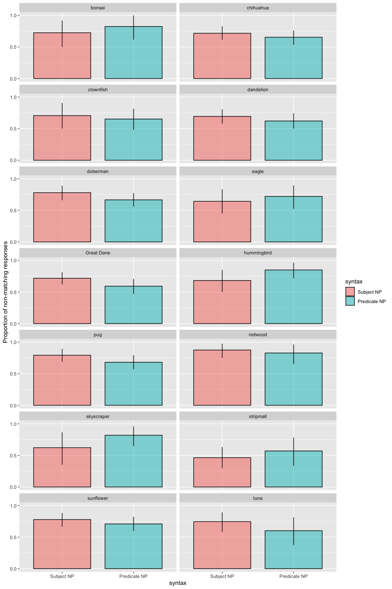

Direct Modification Results - Prereg Final
================
Polina Tsvilodub
12/13/2020

This write-up presents results of the final direct-modification
experiment for the refpred project. In this experiment we manipulate the
syntactic position of the noun directly modified by the adjective (“big
Great Dane” appearing in the subject or in the predicate) in order to
disentangle effects of reasoning about informational goals on comparison
class inference from effects of syntactic modification.

Our [Bayesian power
analysis](https://github.com/polina-tsvilodub/refpred/blob/master/analysis/direct-modification/direct-modification_power_bySubj-byItem_write-up.md)
based on pilot data revealed that for a power above 0.8 we need at least
300 subjects, so for this final [preregistered](https://osf.io/vt3f7)
study we recruited N=330 on Prolific, aiming for N=300 passing the
exclusion criteria.

# Experiment design

The experiment has a 2x2 within-subjects design, manipulating the
syntactic position of subordinate nouns (subject vs predicate N) and the
trial-type (critical vs filer, where fillers are trials from our CogSci
Experiment 3), all appearing in basic-level context.

Participants see a context picture and read a sentence about a referent
which they have to paraphrase, completing a total of eight main trials,
presented in two blocks of four main trials each. The eight main trials
consist of four critical and four filler trials, where each trial is a
condition resulting from a unique combination of the noun position
condition (subject N vs. predicate N) crossed with the size of the
referent within its basic-level category (e.g., large vs. small
subordinate dog category). Ten contexts created from six different
basic-level categories are used: dogs, flowers, birds, fish, buildings
and trees. For each basic-level context, there are two possible targets
representing a large-subordinate and a small-subordinate category,
respectively. Four contexts are sampled for each participant.
Information about the items can be found
[here](https://docs.google.com/document/d/1yxF9ACALa6MQB70nYydGStvLiY0JjO8mmkASI049lT4/edit?usp=sharing).

# Analysis

## Data Preprocessing

We collected data from N = 323 participants. 4 participants are excluded
for not reporting their native language, or being non-native English
speakers. 3 subjects failed the comparison class paraphrase warm-up
trial (i.e., took more than 4 attempts to enter the right response upon
correction); 14 subjects failed the labeling warm-up trials (also taking
more than 4 attempts upon correction). Overall, 15 subjects were
excluded for failing the warm-ups. This leaves N = 304. Last 4 received
submissions are excluded for an N = 300.

``` r
# exclude participants who report glitches
data %>% select(submission_id, comments, problems) %>% distinct() %>% View()
d_modRef_woGlitches <- data 

# exclude non-native English speakers
d_modRef_woGlitches %>% distinct(languages) %>% View()

# 323 participants received
d_modRef_Native <- d_modRef_woGlitches %>% 
  filter(grepl("en", languages, ignore.case = T)) 
# excluded 4 as non-native English speakers

# cleaning warm-up trials
# comparison class paraphrase trial

# excludes 3
d_failed_cc_warmup <- d_modRef_Native %>% 
  filter( trial_name == "comp_class_warmup") %>%
  group_by(submission_id) %>% count() %>%
  filter( n > 4 )
# excludes 14
d_failed_label_warmup <- d_modRef_Native %>%
  filter( (trial_name == "warmup1") | (trial_name == "warmup2")) %>%
  group_by(submission_id) %>%
  filter(attempts > 4)
d_label_warmup_more1 <- d_modRef_Native %>%
  filter( (trial_name == "warmup1") | (trial_name == "warmup2")) %>%
  group_by(submission_id) %>%
  filter(attempts > 1) %>% ungroup() %>% 
  select(submission_id, picture1, response1, picture2, response2, attempts)

# 304 left 
d_modRef_filter <- anti_join(d_modRef_Native, d_failed_cc_warmup, by = c("submission_id"))
d_modRef_filter <- anti_join(d_modRef_filter, d_failed_label_warmup, by = c("submission_id"))

# exclude last 4 submissions to get 300 subjects
d_modRef_filter300 <- d_modRef_filter %>% filter(!(submission_id %in% c(2644, 2645, 2646, 2647)))
```

Check the balancing of conditions:

``` r
d_modRef_filter300 %>% count(trial_type, syntax, target_size)
```

    ## # A tibble: 9 x 4
    ##   trial_type syntax target_size     n
    ##   <chr>      <chr>  <chr>       <int>
    ## 1 critical   pred   big           300
    ## 2 critical   pred   small         300
    ## 3 critical   subj   big           300
    ## 4 critical   subj   small         300
    ## 5 filler     pred   big           300
    ## 6 filler     pred   small         300
    ## 7 filler     subj   big           300
    ## 8 filler     subj   small         300
    ## 9 <NA>       <NA>   <NA>         1785

### Response Classification

#### Minimal exclusions

First, invalid responses are excluded. This is a minimal pre-processing
step: Excluded responses consist of disjunctions/conjunctions, massive
misspellings, compare the referent to a size, or to an invalid
subordinate category (reference failure). This excludes 21 responses
(0.9%).

``` r
d_modRef_main <- d_modRef_filter300 %>% filter((trial_name == "custom_main_text1") |
                                (trial_name == "custom_main_text2")) %>%
  select(submission_id, trial_number, context_picture, response, target_size, adj, syntax, target, item, adj_cond, trial_type, ref_np )

d_modRef_main %>% distinct(response) %>% View()

# exclude 21 answers with minimal exclusion criteria
d_modRef_valid <- d_modRef_main %>% 
  subset(., !(tolower(response) %in% c("deandal", "compared to the other fish", "compared to the fish", "the size of the flower", "pigeon or other common birds", "a rose", "pigeon", "trees or himself", "dogs or the bow", "landmark or trees", "bow/gift", "sunflowers or bigger flowers", "child", "himself and the other trees", "the size of other birds", "his own size", "human", "flowers and landmark", "a person", "his award")))
```

Then, the minimally cleaned responses are classified as matching the
critical noun (= subordinate) vs. non-matching (i.e., basic-level,
matchin N2, superordinate).

``` r
# classify 2379 responses 
d_modRef_main_responseCat <- d_modRef_valid %>% 
  mutate(response_cat = ifelse(
    tolower(response) %in% 
      c("building", "buildings", "flower", "flowers", "potted plants", "plants", "fish",
        "fishes", "dog", "dogs", "tree", "trees", "bird", "birds",  
        "flowers in the distance", "other flowers", "the other flowers", "the other dogs",
        "big dogs", "birds in the distance", "flowers that are already sold", "flowers.",
        "the other buildings around it", "the dogs around it", "the buildings around it",
        "flowers around it", "dogs around it", "the other flowers around it", "other plants",
        "other trees", "other rescue dogs\nother rescue dogs", "other floers", 
        "fish in the tank", "flowers with red bows", "dogs with red bows", 
        "dogs with leashes", "birda", "breeds", "pets", "trees\ntrees", "dogs that are gifts",
        "rescued fish","dogs.", "fish.", "dogs with medals", "smaller dogs", "dogs with bows", 
        "building with landmarks", "guide dogs", "landmark buildings", "other birds", 
        "flowers along the path", "flowers in the pots", "gift flowers", "dogd", 
        "the other prize winner dogs", "the other smaller birds", "birds you have seen",
        "smaller trees like the bonsai", "dogs that you have seen so far", "trees in general",
        "the other plants they are seeing", "the other trees you have seen", "fish\nfish",
        "the other flowers at the shop", "trees other than the other red wood", 
        "the other trees", "training dogs", "contestants", "gods", "small dogs",
        "landmark flowers", "other buildings", "dogs in the contest", "the other service dogs",
        "the other rescue birds", "the smaller dogs", "the smaller flowers", 
        "birds in the group", "fowers", "other landmarked flowers.", "other fish",
        "flowers at the garden store","flowers in the group", "present", "winner", 
        "rescued dogs", 
        
        "landmark", "landmarks", "service-animal", "service-animals", "service animals",
        "rescue", "rescues", "prize-winner", "prize-winners", "prize winner", "prizewinners",
        "prize winners", "dog gifts", "land mark trees", "smaller service animals",
        "prize-winner dogs", "rescue fish", "prize winning dogs", "prize-winning dogs",
        "other prize-winner dogs", "otherprize winning dog", "landmark trees", 
        "flower gifts", "the other prize winner", "the other service animal", "show winner",
        "prize dogs", "rescue birds", "service dogs", "gift", "gifts", "gifts.", "prize dog",
        "big trees with a landmark", "prize-winners."), 
    "nonmatch", "match"
  ),
  response_num = ifelse(response_cat == "nonmatch", 1, 0)
  )
```

We also consider a more fine-grained 3-way response classification:
basic-level responses (also containing superordinate responses), N2
responses (e.g., “prize-winners”), subordinate responses.

``` r
# detailed analysis of non-matching responses, distinguishing between basic, N2 and 
# subordinate comparison classes
d_modRef_main_responseCat_3way <- d_modRef_main_responseCat %>%
  mutate(
    response_cat = ifelse(
      tolower(response) %in% 
        c("building", "buildings", "flower", "flowers", "potted plants", "plants", "fish",
        "fishes", "dog", "dogs", "tree", "trees", "bird", "birds", "other dogs", 
        "flowers in the distance", "other flowers", "the other flowers", "the other dogs",
        "big dogs", "birds in the distance", "flowers that are already sold", "flowers.",
        "the other buildings around it", "the dogs around it", "the buildings around it",
        "flowers around it", "dogs around it", "the other flowers around it", "other plants",
        "other trees", "other rescue dogs\nother rescue dogs", "other floers", 
        "fish in the tank", "flowers with red bows", "dogs with red bows", 
        "dogs with leashes", "birda", "breeds", "pets", "trees\ntrees", "dogs that are gifts",
        "rescued fish","dogs.", "fish.", "dogs with medals", "smaller dogs", "dogs with bows", 
        "building with landmarks", "guide dogs", "landmark buildings", "other birds", 
        "flowers along the path", "flowers in the pots", "gift flowers", "dogd", 
        "the other prize winner dogs", "the other smaller birds", "birds you have seen",
        "smaller trees like the bonsai", "dogs that you have seen so far", "trees in general",
        "the other plants they are seeing", "the other trees you have seen", "fish\nfish",
        "the other flowers at the shop", "trees other than the other red wood", 
        "the other trees", "training dogs",  "gods", "small dogs",
        "landmark flowers", "other buildings", "dogs in the contest", "the other service dogs",
        "the other rescue birds", "the smaller dogs", "the smaller flowers", 
        "birds in the group", "fowers", "other landmarked flowers.", "other fish",
        "flowers at the garden store","flowers in the group", "prize-winner dogs",
        "rescued dogs", "rescue fish", "prize winning dogs", "prize-winning dogs",
        "other prize-winner dogs", "otherprize winning dog", "landmark trees",
        "prize dogs", "rescue birds", "service dogs", "prize dog", "big trees with a landmark"
        ), "basic",
      ifelse( tolower(response) %in% c("landmark", "landmarks", "service-animal", "service-animals",
                                       "service animals", "rescue", "rescues", "prize-winner",
                                       "prize-winners", "prize winner", "prizewinners",
        "prize winners", "dog gifts", "land mark trees", "smaller service animals",
        "flower gifts", "the other prize winner", "the other service animal", "show winner",
         "gift", "gifts", "gifts.", "prize-winners.", "present", "winner", "contestants"
                                       ), "N2", "subordinate")
    )
  )
```

##### Plots

Here the proportion of non-matching responses by-syntax and by-trial
type is plotted. Error bars represent bootstrapped 95%-CIs.

We see a small effect in the critical condition, and we see a pronounced
effect in the filler conditions (replicating crucial results from CogSci
Exp. 3).

    ## Warning: `as_data_frame()` is deprecated as of tibble 2.0.0.
    ## Please use `as_tibble()` instead.
    ## The signature and semantics have changed, see `?as_tibble`.
    ## This warning is displayed once every 8 hours.
    ## Call `lifecycle::last_warnings()` to see where this warning was generated.

    ## Warning: `cols` is now required when using unnest().
    ## Please use `cols = c(strap)`

<!-- -->

Here, counts of the three response categories (basic, N2, subordinate)
in the critical direct-modification trials are plotted by-syntax.
<!-- -->

#### More possible exclusions

Yet since the responses are quite noisy, we might consider excluding
further responses. The paraphrase template is "It is {big, small}
relative to other \_\_\_“. Therefore, responses starting with”to the…"
or “to other…” etc are technically ungrammatical. So the following
preprocessing excludes the aforementioned responses additionally to the
exclusions made before. This excludes 77 responses in total (3.2%).

If we are being really strict, responses starting with “the..” could
also be excluded (tbd).

``` r
# apply more strict exclusion criteria

d_modRef_valid_strict <- d_modRef_main %>%
  subset(., !(tolower(response) %in% c(
"deandal", "compared to the other fish", "compared to the fish", "the size of the flower",
"pigeon or other common birds", "a rose", "pigeon", "trees or himself", "dogs or the bow",
"landmark or trees", "bow/gift", "sunflowers or bigger flowers", "child", 
"himself and the other trees", "the size of other birds", "his own size", "human", 
"flowers and landmark", "a person", "his award", "other flowers", "the other flowers", 
"the other dogs", "the other buildings around it", "the other flowers around it", "other plants",
"other trees", "other rescue dogs\nother rescue dogs", "other floers", "other birds",
"the other prize winner dogs", "the other smaller birds", "the other plants they are seeing",
"the other trees you have seen", "the other flowers at the shop", "the other trees",
"other buildings", "the other service dogs", "the other rescue birds", 
"other landmarked flowers.", "other fish", "other prize-winner dogs", "otherprize winning dog",
"the other prize winner", "the other service animal",
# also some subordinate responses start with "other"
"other doberman", "other bonsai trees", "other eagles", "other hummingbirds", 
"other sunflowers", "other clownfish rescues", "the other dandelion", "the other chihuahua", 
"the other doberman", "other dandelions"
  )))
```

Furthermore, there are some responses where the classification might not
be clear.

For instance, some responses refer to perceptual categories. as e.g.,
“birds you have seen”. Since the perceptual context presents the
basic-level category, so far such responses are classified as
basic-level. There are modified basic-level responses (“smaller dogs”,
“the other smaller birds”, “smaller trees like the bonsai”, “small
dogs”, “the smaller dogs”, “the smaller flowers”, “smaller service
animals”,) or responses with a PP which are semantically very similar to
the N2 (“flowers that are already sold”,“flowers with red bows”, “dogs
with red bows”, “dogs with leashes”, “dogs that are gifts”, “dogs with
medals”, “dogs with bows”, “building with landmarks”, “big trees with a
landmark”).

There are also compound responses just difficult to classify, some of
them containing both a subordinate noun and a basic-level noun or N2
(“trees other than the other red wood”, “to the doberman
service-animal”, “prize winning pugs”, “other bonsai trees”, “tuna
fish”, “bonsai trees”, “the prize-winner pug”, “other clownfish
rescues”, “hummingbirds that have been rescued”, “great dane dogs”,
“redwood trees”). So far, all these responses containing a subordinate
N are classified as subordinate (= matching).

These responses are classified in non-matching vs matching:

``` r
d_modRef_main_responseCat_strict <- d_modRef_valid_strict %>% 
  mutate(response_cat = ifelse(
    tolower(response) %in% 
      c("building", "buildings", "flower", "flowers", "potted plants", "plants", "fish",
        "fishes", "dog", "dogs", "tree", "trees", "bird", "birds",  
        "flowers in the distance", 
        "big dogs", "birds in the distance", "flowers that are already sold", "flowers.",
        "the dogs around it", "the buildings around it",
        "flowers around it", "dogs around it",  
        "fish in the tank", "flowers with red bows", "dogs with red bows", 
        "dogs with leashes", "birda", "breeds", "pets", "trees\ntrees", "dogs that are gifts",
        "rescued fish","dogs.", "fish.", "dogs with medals", "smaller dogs", "dogs with bows", 
        "building with landmarks", "guide dogs", "landmark buildings", 
        "flowers along the path", "flowers in the pots", "gift flowers", "dogd", 
        "birds you have seen",
        "smaller trees like the bonsai", "dogs that you have seen so far", "trees in general",
        "fish\nfish", "trees other than the other red wood", 
        "training dogs", "contestants", "gods", "small dogs",
        "landmark flowers", "dogs in the contest", "the smaller dogs", "the smaller flowers", 
        "birds in the group", "fowers", "flowers at the garden store","flowers in the group",
        "present", "winner", "rescued dogs", 
        
        "landmark", "landmarks", "service-animal", "service-animals", "service animals",
        "rescue", "rescues", "prize-winner", "prize-winners", "prize winner", "prizewinners",
        "prize winners", "dog gifts", "land mark trees", "smaller service animals",
        "prize-winner dogs", "rescue fish", "prize winning dogs", "prize-winning dogs",
        "landmark trees", "flower gifts", "show winner",
        "prize dogs", "rescue birds", "service dogs", "gift", "gifts", "gifts.", "prize dog",
        "big trees with a landmark", "prize-winners."), 
    "nonmatch", "match"
  ),
  response_num = ifelse(response_cat == "nonmatch", 1, 0)
  )
```

3-way classification of strictly preproccesed responses:

``` r
d_modRef_main_responseCat_strict_3way <- d_modRef_main_responseCat_strict %>%
  mutate(
    response_cat = ifelse(
      tolower(response) %in% 
        c("building", "buildings", "flower", "flowers", "potted plants", "plants", "fish",
        "fishes", "dog", "dogs", "tree", "trees", "bird", "birds", "other dogs", 
        "flowers in the distance", "other flowers", "the other flowers", "the other dogs",
        "big dogs", "birds in the distance", "flowers that are already sold", "flowers.",
        "the other buildings around it", "the dogs around it", "the buildings around it",
        "flowers around it", "dogs around it",  
        "fish in the tank", "flowers with red bows", "dogs with red bows", 
        "dogs with leashes", "birda", "breeds", "pets", "trees\ntrees", "dogs that are gifts",
        "rescued fish","dogs.", "fish.", "dogs with medals", "smaller dogs", "dogs with bows", 
        "building with landmarks", "guide dogs", "landmark buildings", 
        "flowers along the path", "flowers in the pots", "gift flowers", "dogd", 
        "birds you have seen",
        "smaller trees like the bonsai", "dogs that you have seen so far", "trees in general",
        "fish\nfish", "trees other than the other red wood", 
        "training dogs",  "gods", "small dogs",
        "landmark flowers",  "dogs in the contest", 
         "the smaller dogs", "the smaller flowers", 
        "birds in the group", "fowers", 
        "flowers at the garden store","flowers in the group", "prize-winner dogs",
        "rescued dogs", "rescue fish", "prize winning dogs", "prize-winning dogs",
         "landmark trees",
        "prize dogs", "rescue birds", "service dogs", "prize dog", "big trees with a landmark"
        ), "basic",
      ifelse( tolower(response) %in% c("landmark", "landmarks", "service-animal", "service-animals",
                                       "service animals", "rescue", "rescues", "prize-winner",
                                       "prize-winners", "prize winner", "prizewinners",
        "prize winners", "dog gifts", "land mark trees", "smaller service animals",
        "flower gifts", "show winner",
         "gift", "gifts", "gifts.", "prize-winners.", "present", "winner", "contestants"
                                       ), "N2", "subordinate")
    )
  )
```

##### Plots

The proportion of non-matching responses in the strictly preprocessed
data is plotted by-syntax and by-trial type. No qualitative differences
appear under the more strict preprocessing.

    ## Warning: `cols` is now required when using unnest().
    ## Please use `cols = c(strap)`

<!-- -->

3-way response category counts in the strictly preprocessed data:
<!-- -->

## Stats

In the following, the dataset where less strict exclusions were applied
is used for analysis. The predictors are deviation-coded.

First, the preregistered Bayesian logistic regression is run. Maximal RE
structure is included:

``` r
model <- brm(
  response_num ~ syntax_dev * trial_type_dev + (1 + syntax_dev * trial_type_dev | submission_id) + 
    (1 + syntax_dev * trial_type_dev | target),
  data = d_modRef_main_responseCat,
  family = "bernoulli",
  cores = 4,
  iter = 3000,
  chains = 4, 
  control = list(adapt_delta = 0.9)
) 
```

    ## Running /Library/Frameworks/R.framework/Resources/bin/R CMD SHLIB foo.c
    ## clang -I"/Library/Frameworks/R.framework/Resources/include" -DNDEBUG   -I"/Library/Frameworks/R.framework/Versions/3.6/Resources/library/Rcpp/include/"  -I"/Library/Frameworks/R.framework/Versions/3.6/Resources/library/RcppEigen/include/"  -I"/Library/Frameworks/R.framework/Versions/3.6/Resources/library/RcppEigen/include/unsupported"  -I"/Library/Frameworks/R.framework/Versions/3.6/Resources/library/BH/include" -I"/Library/Frameworks/R.framework/Versions/3.6/Resources/library/StanHeaders/include/src/"  -I"/Library/Frameworks/R.framework/Versions/3.6/Resources/library/StanHeaders/include/"  -I"/Library/Frameworks/R.framework/Versions/3.6/Resources/library/rstan/include" -DEIGEN_NO_DEBUG  -D_REENTRANT  -DBOOST_DISABLE_ASSERTS -DBOOST_PENDING_INTEGER_LOG2_HPP -include stan/math/prim/mat/fun/Eigen.hpp   -isysroot /Library/Developer/CommandLineTools/SDKs/MacOSX.sdk -I/usr/local/include  -fPIC  -isysroot /Library/Developer/CommandLineTools/SDKs/MacOSX.sdk -c foo.c -o foo.o
    ## In file included from <built-in>:1:
    ## In file included from /Library/Frameworks/R.framework/Versions/3.6/Resources/library/StanHeaders/include/stan/math/prim/mat/fun/Eigen.hpp:13:
    ## In file included from /Library/Frameworks/R.framework/Versions/3.6/Resources/library/RcppEigen/include/Eigen/Dense:1:
    ## In file included from /Library/Frameworks/R.framework/Versions/3.6/Resources/library/RcppEigen/include/Eigen/Core:88:
    ## /Library/Frameworks/R.framework/Versions/3.6/Resources/library/RcppEigen/include/Eigen/src/Core/util/Macros.h:613:1: error: unknown type name 'namespace'
    ## namespace Eigen {
    ## ^
    ## /Library/Frameworks/R.framework/Versions/3.6/Resources/library/RcppEigen/include/Eigen/src/Core/util/Macros.h:613:16: error: expected ';' after top level declarator
    ## namespace Eigen {
    ##                ^
    ##                ;
    ## In file included from <built-in>:1:
    ## In file included from /Library/Frameworks/R.framework/Versions/3.6/Resources/library/StanHeaders/include/stan/math/prim/mat/fun/Eigen.hpp:13:
    ## In file included from /Library/Frameworks/R.framework/Versions/3.6/Resources/library/RcppEigen/include/Eigen/Dense:1:
    ## /Library/Frameworks/R.framework/Versions/3.6/Resources/library/RcppEigen/include/Eigen/Core:96:10: fatal error: 'complex' file not found
    ## #include <complex>
    ##          ^~~~~~~~~
    ## 3 errors generated.
    ## make: *** [foo.o] Error 1

``` r
summary(model)
```

    ##  Family: bernoulli 
    ##   Links: mu = logit 
    ## Formula: response_num ~ syntax_dev * trial_type_dev + (1 + syntax_dev * trial_type_dev | submission_id) + (1 + syntax_dev * trial_type_dev | target) 
    ##    Data: d_modRef_main_responseCat (Number of observations: 2379) 
    ## Samples: 4 chains, each with iter = 3000; warmup = 1500; thin = 1;
    ##          total post-warmup samples = 6000
    ## 
    ## Group-Level Effects: 
    ## ~submission_id (Number of levels: 300) 
    ##                                                  Estimate Est.Error l-95% CI
    ## sd(Intercept)                                        2.60      0.22     2.21
    ## sd(syntax_dev1)                                      0.31      0.17     0.02
    ## sd(trial_type_dev1)                                  0.33      0.16     0.03
    ## sd(syntax_dev1:trial_type_dev1)                      0.39      0.17     0.03
    ## cor(Intercept,syntax_dev1)                          -0.20      0.36    -0.81
    ## cor(Intercept,trial_type_dev1)                      -0.24      0.34    -0.79
    ## cor(syntax_dev1,trial_type_dev1)                     0.11      0.41    -0.69
    ## cor(Intercept,syntax_dev1:trial_type_dev1)          -0.32      0.30    -0.81
    ## cor(syntax_dev1,syntax_dev1:trial_type_dev1)         0.10      0.42    -0.73
    ## cor(trial_type_dev1,syntax_dev1:trial_type_dev1)     0.36      0.38    -0.55
    ##                                                  u-95% CI Rhat Bulk_ESS
    ## sd(Intercept)                                        3.06 1.00      864
    ## sd(syntax_dev1)                                      0.63 1.00      666
    ## sd(trial_type_dev1)                                  0.63 1.01      731
    ## sd(syntax_dev1:trial_type_dev1)                      0.70 1.01      512
    ## cor(Intercept,syntax_dev1)                           0.57 1.00     2378
    ## cor(Intercept,trial_type_dev1)                       0.48 1.00     3118
    ## cor(syntax_dev1,trial_type_dev1)                     0.82 1.00     1080
    ## cor(Intercept,syntax_dev1:trial_type_dev1)           0.36 1.00     2393
    ## cor(syntax_dev1,syntax_dev1:trial_type_dev1)         0.82 1.00      818
    ## cor(trial_type_dev1,syntax_dev1:trial_type_dev1)     0.90 1.00      827
    ##                                                  Tail_ESS
    ## sd(Intercept)                                        1712
    ## sd(syntax_dev1)                                      1211
    ## sd(trial_type_dev1)                                  1277
    ## sd(syntax_dev1:trial_type_dev1)                       529
    ## cor(Intercept,syntax_dev1)                           3107
    ## cor(Intercept,trial_type_dev1)                       3429
    ## cor(syntax_dev1,trial_type_dev1)                     2248
    ## cor(Intercept,syntax_dev1:trial_type_dev1)           2103
    ## cor(syntax_dev1,syntax_dev1:trial_type_dev1)         1633
    ## cor(trial_type_dev1,syntax_dev1:trial_type_dev1)     1749
    ## 
    ## ~target (Number of levels: 14) 
    ##                                                  Estimate Est.Error l-95% CI
    ## sd(Intercept)                                        0.74      0.21     0.42
    ## sd(syntax_dev1)                                      0.14      0.10     0.01
    ## sd(trial_type_dev1)                                  0.35      0.16     0.06
    ## sd(syntax_dev1:trial_type_dev1)                      0.12      0.09     0.00
    ## cor(Intercept,syntax_dev1)                           0.14      0.43    -0.72
    ## cor(Intercept,trial_type_dev1)                       0.21      0.34    -0.49
    ## cor(syntax_dev1,trial_type_dev1)                     0.06      0.43    -0.77
    ## cor(Intercept,syntax_dev1:trial_type_dev1)           0.07      0.44    -0.78
    ## cor(syntax_dev1,syntax_dev1:trial_type_dev1)         0.01      0.45    -0.82
    ## cor(trial_type_dev1,syntax_dev1:trial_type_dev1)     0.18      0.44    -0.72
    ##                                                  u-95% CI Rhat Bulk_ESS
    ## sd(Intercept)                                        1.24 1.00     1658
    ## sd(syntax_dev1)                                      0.39 1.00     1982
    ## sd(trial_type_dev1)                                  0.72 1.00     1353
    ## sd(syntax_dev1:trial_type_dev1)                      0.34 1.00     2617
    ## cor(Intercept,syntax_dev1)                           0.84 1.00     4873
    ## cor(Intercept,trial_type_dev1)                       0.79 1.00     3233
    ## cor(syntax_dev1,trial_type_dev1)                     0.80 1.00     1469
    ## cor(Intercept,syntax_dev1:trial_type_dev1)           0.84 1.00     5938
    ## cor(syntax_dev1,syntax_dev1:trial_type_dev1)         0.82 1.00     4136
    ## cor(trial_type_dev1,syntax_dev1:trial_type_dev1)     0.88 1.00     4476
    ##                                                  Tail_ESS
    ## sd(Intercept)                                        2852
    ## sd(syntax_dev1)                                      2135
    ## sd(trial_type_dev1)                                  1637
    ## sd(syntax_dev1:trial_type_dev1)                      2645
    ## cor(Intercept,syntax_dev1)                           4074
    ## cor(Intercept,trial_type_dev1)                       3735
    ## cor(syntax_dev1,trial_type_dev1)                     2785
    ## cor(Intercept,syntax_dev1:trial_type_dev1)           4313
    ## cor(syntax_dev1,syntax_dev1:trial_type_dev1)         4137
    ## cor(trial_type_dev1,syntax_dev1:trial_type_dev1)     4399
    ## 
    ## Population-Level Effects: 
    ##                             Estimate Est.Error l-95% CI u-95% CI Rhat Bulk_ESS
    ## Intercept                       1.91      0.30     1.34     2.52 1.00      832
    ## syntax_dev1                     0.55      0.11     0.34     0.77 1.00     2061
    ## trial_type_dev1                 0.12      0.15    -0.18     0.41 1.00     2167
    ## syntax_dev1:trial_type_dev1     0.33      0.11     0.12     0.54 1.00     2613
    ##                             Tail_ESS
    ## Intercept                       1351
    ## syntax_dev1                     2869
    ## trial_type_dev1                 2664
    ## syntax_dev1:trial_type_dev1     3826
    ## 
    ## Samples were drawn using sampling(NUTS). For each parameter, Bulk_ESS
    ## and Tail_ESS are effective sample size measures, and Rhat is the potential
    ## scale reduction factor on split chains (at convergence, Rhat = 1).

The contrast of interest is the effect of syntax in the critical
condition.

``` r
# get effect of syntax by trial type 
model_draws <- model %>%
  spread_draws(b_Intercept, b_syntax_dev1, b_trial_type_dev1, `b_syntax_dev1:trial_type_dev1`) %>%
  mutate(critical_subj = b_Intercept + b_syntax_dev1 - b_trial_type_dev1 - `b_syntax_dev1:trial_type_dev1`,
         critical_pred = b_Intercept - b_syntax_dev1 - b_trial_type_dev1 + `b_syntax_dev1:trial_type_dev1`,
         syntax_critical = critical_subj - critical_pred, # subject vs predicate 
         filler_subj = b_Intercept + b_syntax_dev1 + b_trial_type_dev1 + `b_syntax_dev1:trial_type_dev1`,
         filler_pred = b_Intercept - b_syntax_dev1 + b_trial_type_dev1 - `b_syntax_dev1:trial_type_dev1`,
         syntax_filler = filler_subj - filler_pred) %>% # subject vs predicate
  select(b_Intercept, b_syntax_dev1, b_trial_type_dev1, `b_syntax_dev1:trial_type_dev1`, critical_subj, critical_pred, syntax_critical, filler_subj, filler_pred, syntax_filler) %>%
  gather(key, val) %>%
  group_by(key) %>%
  summarise(
    mean = mean(val),
    lower = quantile(val, probs = 0.025),
    upper = quantile(val, probs = 0.975)
  )
```

    ## `summarise()` ungrouping output (override with `.groups` argument)

``` r
model_draws  
```

    ## # A tibble: 10 x 4
    ##    key                            mean  lower upper
    ##    <chr>                         <dbl>  <dbl> <dbl>
    ##  1 b_Intercept                   1.91   1.34  2.52 
    ##  2 b_syntax_dev1                 0.553  0.338 0.768
    ##  3 b_syntax_dev1:trial_type_dev1 0.331  0.115 0.544
    ##  4 b_trial_type_dev1             0.116 -0.175 0.408
    ##  5 critical_pred                 1.57   0.959 2.23 
    ##  6 critical_subj                 2.01   1.35  2.80 
    ##  7 filler_pred                   1.14   0.486 1.87 
    ##  8 filler_subj                   2.91   2.13  3.77 
    ##  9 syntax_critical               0.444 -0.127 1.05 
    ## 10 syntax_filler                 1.77   1.17  2.42

Compute the probability of the effect of syntax in the critical
condition being credible:

``` r
posterior_samples %>% filter(key == "syntax_critical") %>% summarize(prob = mean(val > 0))
```

    ## # A tibble: 1 x 1
    ##    prob
    ##   <dbl>
    ## 1 0.934

We might run an exploratory multinomial regression in run on the 3-way
classified responses on the whole dataset, but it takes quite long and
not sure how much sense that makes.

``` r
# make the response category a factor
d_modRef_main_responseCat_3way <- d_modRef_main_responseCat_3way %>%
  mutate(response_cat = as.factor(response_cat))

model_multinomial <- brm(
  response_cat ~ syntax_dev * trial_type_dev + (1 + syntax_dev * trial_type_dev || submission_id) + 
    (1 + syntax_dev * trial_type_dev || target),
  data = d_modRef_main_responseCat_3way,
  family = "categorical",
  cores = 3,
  iter = 2000,
  chains = 3 #, 
  #control = list(adapt_delta = 0.9)
)

summary(model_multinomial)
```

For computational tractability reasons, the exploratory multinomial
regression is run on critical trials only:

``` r
d_modRef_main_3way_critical <- d_modRef_main_responseCat_3way %>%
  mutate(syntax_dev = factor(syntax, levels = c("subj", "pred")),
         trial_type_dev = factor(trial_type, levels = c( "filler", "critical"))) %>%
  filter(trial_type == "critical")

contrasts(d_modRef_main_3way_critical$syntax_dev) <- contr.sum(2)

model_multinomial_critical <- brm(
  response_cat ~ syntax_dev + (1 + syntax_dev || submission_id) + 
    (1 + syntax_dev || target),
  data = d_modRef_main_3way_critical,
  family = "categorical",
  cores = 3,
  iter = 2000,
  chains = 3 
)
```

    ## Running /Library/Frameworks/R.framework/Resources/bin/R CMD SHLIB foo.c
    ## clang -I"/Library/Frameworks/R.framework/Resources/include" -DNDEBUG   -I"/Library/Frameworks/R.framework/Versions/3.6/Resources/library/Rcpp/include/"  -I"/Library/Frameworks/R.framework/Versions/3.6/Resources/library/RcppEigen/include/"  -I"/Library/Frameworks/R.framework/Versions/3.6/Resources/library/RcppEigen/include/unsupported"  -I"/Library/Frameworks/R.framework/Versions/3.6/Resources/library/BH/include" -I"/Library/Frameworks/R.framework/Versions/3.6/Resources/library/StanHeaders/include/src/"  -I"/Library/Frameworks/R.framework/Versions/3.6/Resources/library/StanHeaders/include/"  -I"/Library/Frameworks/R.framework/Versions/3.6/Resources/library/rstan/include" -DEIGEN_NO_DEBUG  -D_REENTRANT  -DBOOST_DISABLE_ASSERTS -DBOOST_PENDING_INTEGER_LOG2_HPP -include stan/math/prim/mat/fun/Eigen.hpp   -isysroot /Library/Developer/CommandLineTools/SDKs/MacOSX.sdk -I/usr/local/include  -fPIC  -isysroot /Library/Developer/CommandLineTools/SDKs/MacOSX.sdk -c foo.c -o foo.o
    ## In file included from <built-in>:1:
    ## In file included from /Library/Frameworks/R.framework/Versions/3.6/Resources/library/StanHeaders/include/stan/math/prim/mat/fun/Eigen.hpp:13:
    ## In file included from /Library/Frameworks/R.framework/Versions/3.6/Resources/library/RcppEigen/include/Eigen/Dense:1:
    ## In file included from /Library/Frameworks/R.framework/Versions/3.6/Resources/library/RcppEigen/include/Eigen/Core:88:
    ## /Library/Frameworks/R.framework/Versions/3.6/Resources/library/RcppEigen/include/Eigen/src/Core/util/Macros.h:613:1: error: unknown type name 'namespace'
    ## namespace Eigen {
    ## ^
    ## /Library/Frameworks/R.framework/Versions/3.6/Resources/library/RcppEigen/include/Eigen/src/Core/util/Macros.h:613:16: error: expected ';' after top level declarator
    ## namespace Eigen {
    ##                ^
    ##                ;
    ## In file included from <built-in>:1:
    ## In file included from /Library/Frameworks/R.framework/Versions/3.6/Resources/library/StanHeaders/include/stan/math/prim/mat/fun/Eigen.hpp:13:
    ## In file included from /Library/Frameworks/R.framework/Versions/3.6/Resources/library/RcppEigen/include/Eigen/Dense:1:
    ## /Library/Frameworks/R.framework/Versions/3.6/Resources/library/RcppEigen/include/Eigen/Core:96:10: fatal error: 'complex' file not found
    ## #include <complex>
    ##          ^~~~~~~~~
    ## 3 errors generated.
    ## make: *** [foo.o] Error 1

``` r
summary(model_multinomial_critical)
```

    ##  Family: categorical 
    ##   Links: muN2 = logit; musubordinate = logit 
    ## Formula: response_cat ~ syntax_dev + (1 + syntax_dev || submission_id) + (1 + syntax_dev || target) 
    ##    Data: d_modRef_main_3way_critical (Number of observations: 1192) 
    ## Samples: 3 chains, each with iter = 2000; warmup = 1000; thin = 1;
    ##          total post-warmup samples = 3000
    ## 
    ## Group-Level Effects: 
    ## ~submission_id (Number of levels: 300) 
    ##                               Estimate Est.Error l-95% CI u-95% CI Rhat
    ## sd(muN2_Intercept)                2.19      0.30     1.65     2.84 1.00
    ## sd(muN2_syntax_dev1)              0.58      0.28     0.04     1.11 1.01
    ## sd(musubordinate_Intercept)       2.76      0.30     2.20     3.40 1.00
    ## sd(musubordinate_syntax_dev1)     0.53      0.24     0.06     0.97 1.01
    ##                               Bulk_ESS Tail_ESS
    ## sd(muN2_Intercept)                 650     1468
    ## sd(muN2_syntax_dev1)               270      352
    ## sd(musubordinate_Intercept)        771     1475
    ## sd(musubordinate_syntax_dev1)      392      617
    ## 
    ## ~target (Number of levels: 14) 
    ##                               Estimate Est.Error l-95% CI u-95% CI Rhat
    ## sd(muN2_Intercept)                0.82      0.28     0.40     1.45 1.00
    ## sd(muN2_syntax_dev1)              0.38      0.22     0.03     0.86 1.00
    ## sd(musubordinate_Intercept)       0.81      0.26     0.37     1.42 1.01
    ## sd(musubordinate_syntax_dev1)     0.18      0.14     0.01     0.55 1.01
    ##                               Bulk_ESS Tail_ESS
    ## sd(muN2_Intercept)                 981     1559
    ## sd(muN2_syntax_dev1)               598      521
    ## sd(musubordinate_Intercept)        762      929
    ## sd(musubordinate_syntax_dev1)      839     1265
    ## 
    ## Population-Level Effects: 
    ##                           Estimate Est.Error l-95% CI u-95% CI Rhat Bulk_ESS
    ## muN2_Intercept               -2.35      0.38    -3.16    -1.64 1.00      694
    ## musubordinate_Intercept      -1.44      0.33    -2.10    -0.79 1.01      707
    ## muN2_syntax_dev1             -0.30      0.18    -0.68     0.03 1.00     1536
    ## musubordinate_syntax_dev1    -0.23      0.12    -0.48     0.01 1.00     1916
    ##                           Tail_ESS
    ## muN2_Intercept                1361
    ## musubordinate_Intercept       1293
    ## muN2_syntax_dev1              1942
    ## musubordinate_syntax_dev1     1818
    ## 
    ## Samples were drawn using sampling(NUTS). For each parameter, Bulk_ESS
    ## and Tail_ESS are effective sample size measures, and Rhat is the potential
    ## scale reduction factor on split chains (at convergence, Rhat = 1).

Extract contrasts of interest from the multinomial model on critical
condition :

``` r
# extract the probabilities of the different response types in different syntactic positions in the critical condition
# from Kruschke, Doing BDA

# not sure if the contrasts are right yet
posteriors_multinomial_critical <- model_multinomial_critical %>%
  spread_draws(b_muN2_Intercept, b_musubordinate_Intercept, b_muN2_syntax_dev1, b_musubordinate_syntax_dev1) %>%
  mutate(basic_subj = exp(0)/(exp(b_muN2_Intercept + b_muN2_syntax_dev1) + exp(b_musubordinate_Intercept + b_musubordinate_syntax_dev1) + exp(0)),
         basic_pred = exp(0) / (exp(b_muN2_Intercept - b_muN2_syntax_dev1) + exp(b_musubordinate_Intercept - b_musubordinate_syntax_dev1) + exp(0)),
         N2_subj = exp(b_muN2_Intercept + b_muN2_syntax_dev1) / (exp(b_muN2_Intercept + b_muN2_syntax_dev1) + exp(b_musubordinate_Intercept + b_musubordinate_syntax_dev1) + exp(0)),
         N2_pred = exp(b_muN2_Intercept - b_muN2_syntax_dev1) / (exp(b_muN2_Intercept - b_muN2_syntax_dev1) + exp(b_musubordinate_Intercept - b_musubordinate_syntax_dev1) + exp(0)),
         sub_subj = exp(b_musubordinate_Intercept + b_musubordinate_syntax_dev1) / (exp(b_muN2_Intercept + b_muN2_syntax_dev1) + exp(b_musubordinate_Intercept + b_musubordinate_syntax_dev1) + exp(0)),
         sub_pred = exp(b_musubordinate_Intercept - b_musubordinate_syntax_dev1) / (exp(b_muN2_Intercept - b_muN2_syntax_dev1) + exp(b_musubordinate_Intercept - b_musubordinate_syntax_dev1) + exp(0)),
         basic_syntax = basic_subj - basic_pred,
         N2_syntax = N2_subj - N2_pred,
         sub_syntax = sub_subj - sub_pred
                         ) %>%
  select(basic_syntax, N2_syntax, sub_syntax) %>%
  gather(key, val) %>%
  group_by(key) %>%
  summarise(
    mean = mean(val),
    lower = quantile(val, probs = 0.025),
    upper = quantile(val, probs = 0.975)
  )
```

    ## `summarise()` ungrouping output (override with `.groups` argument)

``` r
posteriors_multinomial_critical
```

    ## # A tibble: 3 x 4
    ##   key             mean   lower   upper
    ##   <chr>          <dbl>   <dbl>   <dbl>
    ## 1 basic_syntax  0.0935  0.0158 0.179  
    ## 2 N2_syntax    -0.0351 -0.0917 0.00949
    ## 3 sub_syntax   -0.0584 -0.139  0.0130

## Detailed plots

Here the proportion of non-matching responses by-syntax in the critical
condition is plotted by-item:

``` r
d_modRef_main_responseCat %>%  
  group_by(syntax, trial_type, target) %>%
  tidyboot_mean(column = response_num) -> d_modRef_main_responseCat.targets
```

    ## Warning: `cols` is now required when using unnest().
    ## Please use `cols = c(strap)`

``` r
d_modRef_main_responseCat.targets %>%
  ungroup() %>%
  filter(trial_type == "critical") %>%
  mutate(syntax = factor(syntax, levels = c("subj", "pred"), 
                         labels = c("Subject NP", "Predicate NP"))) %>%
  ggplot(., aes(x=syntax, y = mean, ymin = ci_lower, ymax = ci_upper, fill=syntax)) +
  geom_col(position = position_dodge(bar.width), width = bar.width,
           alpha = 0.5, color="black", size = 0.5) +
  geom_linerange(position = position_dodge(bar.width), size = 0.5) +
  scale_y_continuous(limits = c(0, 1),
                     breaks = c(0, 0.5, 1))+
  ylab("Proportion of non-matching responses") +
  #theme_bw() +
  facet_wrap(~target, ncol=1) 
```

<!-- -->

Here, the proportion of non-matching responses is plotted by-N2. The
landmark items (buildings, trees and flowers) seem to be less sensitive
to syntactic manipulations.

``` r
d_modRef_main_responseCat %>%  
  group_by(syntax, trial_type, ref_np) %>%
  tidyboot_mean(column = response_num) -> d_modRef_main_responseCat.N2
```

    ## Warning: `cols` is now required when using unnest().
    ## Please use `cols = c(strap)`

``` r
d_modRef_main_responseCat.N2 %>%
  ungroup() %>%
  filter(trial_type == "critical") %>%
  mutate(syntax = factor(syntax, levels = c("subj", "pred"), 
                         labels = c("Subject NP", "Predicate NP"))) %>%
  ggplot(., aes(x=syntax, y = mean, ymin = ci_lower, ymax = ci_upper, fill=syntax)) +
  geom_col(position = position_dodge(bar.width), width = bar.width,
           alpha = 0.5, color="black", size = 0.5) +
  geom_linerange(position = position_dodge(bar.width), size = 0.5) +
  scale_y_continuous(limits = c(0, 1),
                     breaks = c(0, 0.5, 1))+
  ylab("Proportion of non-matching responses") +
  #theme_bw() +
  facet_wrap(~ref_np, ncol = 1)
```

<!-- -->

The counts of different response types by-N2 for checking if there are
any inconsistencies:

``` r
d_modRef_main_responseCat_3way %>%
  filter(trial_type == "critical") %>%
  ggplot(., aes(x = response_cat, fill = response_cat)) +
  geom_bar(alpha = 0.8) +
  facet_wrap(ref_np~syntax, ncol=2) 
```

<!-- -->
