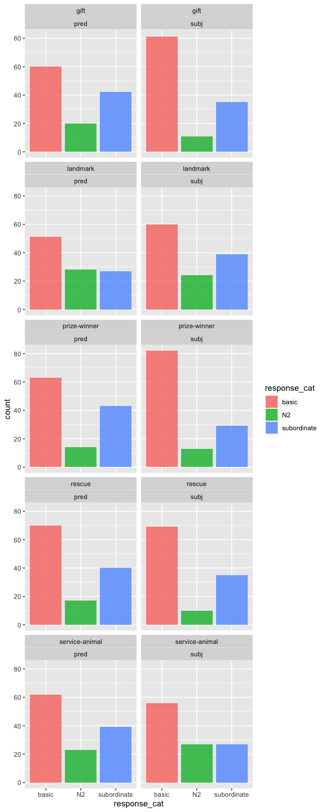

Direct Modification Results - Prereg Final
================
Polina Tsvilodub
12/13/2020

This write-up presents results of the final direct-modification
experiment for the refpred project. In this experiment we manipulate the
syntactic position of the noun directly modified by the adjective (“big
Great Dane” appearing in the subject or in the predicate) in order to
disentangle effects of reasoning about informational goals on comparison
class inference from effects of syntactic modification.

Our [Bayesian power
analysis](https://github.com/polina-tsvilodub/refpred/blob/master/analysis/direct-modification/direct-modification_power_bySubj-byItem_write-up.md)
based on pilot data revealed that for a power above 0.8 we need at least
300 subjects, so for this final [preregistered](https://osf.io/vt3f7)
study we recruited N=330 on Prolific, aiming for N=300 passing the
exclusion criteria.

# Experiment design

The experiment has a 2x2 within-subjects design, manipulating the
syntactic position of subordinate nouns (subject vs predicate N) and the
trial-type (critical vs filer, where fillers are trials from our CogSci
Experiment 3), all appearing in basic-level context.

Participants see a context picture and read a sentence about a referent
which they have to paraphrase, completing a total of eight main trials,
presented in two blocks of four main trials each. The eight main trials
consist of four critical and four filler trials, where each trial is a
condition resulting from a unique combination of the noun position
condition (subject N vs. predicate N) crossed with the size of the
referent within its basic-level category (e.g., large vs. small
subordinate dog category). Ten contexts created from six different
basic-level categories are used: dogs, flowers, birds, fish, buildings
and trees. For each basic-level context, there are two possible targets
representing a large-subordinate and a small-subordinate category,
respectively. Four contexts are sampled for each participant.
Information about the items can be found
[here](https://docs.google.com/document/d/1yxF9ACALa6MQB70nYydGStvLiY0JjO8mmkASI049lT4/edit?usp=sharing).

# Analysis

## Data Preprocessing

We collected data from N = 323 participants. 4 participants are excluded
for not reporting their native language, or being non-native English
speakers. 3 subjects failed the comparison class paraphrase warm-up
trial (i.e., took more than 4 attempts to enter the right response upon
correction); 14 subjects failed the labeling warm-up trials (also taking
more than 4 attempts upon correction). Overall, 15 subjects were
excluded for failing the warm-ups. This leaves N = 304. Last 4 received
submissions are excluded for an N = 300.

``` r
# exclude participants who report glitches
data %>% select(submission_id, comments, problems) %>% distinct() %>% View()
d_modRef_woGlitches <- data 

# exclude non-native English speakers
d_modRef_woGlitches %>% distinct(languages) %>% View()

# 323 participants received
d_modRef_Native <- d_modRef_woGlitches %>% 
  filter(grepl("en", languages, ignore.case = T)) 
# excluded 4 as non-native English speakers

# cleaning warm-up trials
# comparison class paraphrase trial

# excludes 3
d_failed_cc_warmup <- d_modRef_Native %>% 
  filter( trial_name == "comp_class_warmup") %>%
  group_by(submission_id) %>% count() %>%
  filter( n > 4 )
# excludes 14
d_failed_label_warmup <- d_modRef_Native %>%
  filter( (trial_name == "warmup1") | (trial_name == "warmup2")) %>%
  group_by(submission_id) %>%
  filter(attempts > 4)
d_label_warmup_more1 <- d_modRef_Native %>%
  filter( (trial_name == "warmup1") | (trial_name == "warmup2")) %>%
  group_by(submission_id) %>%
  filter(attempts > 1) %>% ungroup() %>% 
  select(submission_id, picture1, response1, picture2, response2, attempts)

# 304 left 
d_modRef_filter <- anti_join(d_modRef_Native, d_failed_cc_warmup, by = c("submission_id"))
d_modRef_filter <- anti_join(d_modRef_filter, d_failed_label_warmup, by = c("submission_id"))

# exclude last 4 submissions to get 300 subjects
d_modRef_filter300 <- d_modRef_filter %>% filter(!(submission_id %in% c(2644, 2645, 2646, 2647)))
```

Check the balancing of conditions:

``` r
d_modRef_filter300 %>% count(trial_type, syntax, target_size)
```

    ## # A tibble: 9 x 4
    ##   trial_type syntax target_size     n
    ##   <chr>      <chr>  <chr>       <int>
    ## 1 critical   pred   big           300
    ## 2 critical   pred   small         300
    ## 3 critical   subj   big           300
    ## 4 critical   subj   small         300
    ## 5 filler     pred   big           300
    ## 6 filler     pred   small         300
    ## 7 filler     subj   big           300
    ## 8 filler     subj   small         300
    ## 9 <NA>       <NA>   <NA>         1785

Add unique identifiers of the items resulting from the combination of
the context and the N2:

``` r
d_modRef_filter300 <- d_modRef_filter300 %>% mutate(
  unique_target = paste(target, ref_np, sep = "_")
)
```

### Response Classification

#### Minimal exclusions

First, invalid responses are excluded. This is a minimal pre-processing
step: Excluded responses consist of massive misspellings, compare the
referent to a size, or to an invalid subordinate category (reference
failure). This excludes 14 responses (0.6%).

``` r
d_modRef_main <- d_modRef_filter300 %>% filter((trial_name == "custom_main_text1") |
                                (trial_name == "custom_main_text2")) %>%
  select(submission_id, trial_number, context_picture, response, target_size, adj, syntax, target, item, adj_cond, trial_type, ref_np, unique_target )

d_modRef_main %>% distinct(response) %>% View()

# exclude 14 answers with minimal exclusion criteria
d_modRef_valid <- d_modRef_main %>% 
  subset(., !(tolower(response) %in% c("deandal", "the size of the flower", "pigeon or other common birds", "a rose", "pigeon", "trees or himself", "child", "himself and the other trees", "the size of other birds", "his own size", "human", "a person", "his award")))
# "sunflowers or bigger flowers", 
```

Then, the minimally cleaned responses are classified as matching the
critical noun (= subordinate) vs. non-matching (i.e., basic-level,
matchin N2, superordinate).

``` r
# classify 2386 responses 
d_modRef_main_responseCat <- d_modRef_valid %>% 
  mutate(response_cat = ifelse(
    tolower(response) %in% 
      c("building", "buildings", "flower", "flowers", "potted plants", "plants", "fish",
        "fishes", "dog", "dogs", "tree", "trees", "bird", "birds",  
         "compared to the other fish", "compared to the fish",
        "dogs or the bow", "landmark or trees", "bow/gift", "flowers and landmark",
        "flowers in the distance", "other flowers", "the other flowers", "the other dogs",
        "big dogs", "birds in the distance", "flowers that are already sold", "flowers.",
        "the other buildings around it", "the dogs around it", "the buildings around it",
        "flowers around it", "dogs around it", "the other flowers around it", "other plants",
        "other trees", "other rescue dogs\nother rescue dogs", "other floers", 
        "fish in the tank", "flowers with red bows", "dogs with red bows", 
        "dogs with leashes", "birda", "breeds", "pets", "trees\ntrees", "dogs that are gifts",
        "rescued fish","dogs.", "fish.", "dogs with medals", "smaller dogs", "dogs with bows", 
        "building with landmarks", "guide dogs", "landmark buildings", "other birds", 
        "flowers along the path", "flowers in the pots", "gift flowers", "dogd", 
        "the other prize winner dogs", "the other smaller birds", "birds you have seen",
        "smaller trees like the bonsai", "dogs that you have seen so far", "trees in general",
        "the other plants they are seeing", "the other trees you have seen", "fish\nfish",
        "the other flowers at the shop", "trees other than the other red wood", 
        "the other trees", "training dogs", "contestants", "gods", "small dogs",
        "landmark flowers", "other buildings", "dogs in the contest", "the other service dogs",
        "the other rescue birds", "the smaller dogs", "the smaller flowers", 
        "birds in the group", "fowers", "other landmarked flowers.", "other fish",
        "flowers at the garden store","flowers in the group", "present", "winner", 
        "rescued dogs", 
        
        "landmark", "landmarks", "service-animal", "service-animals", "service animals",
        "rescue", "rescues", "prize-winner", "prize-winners", "prize winner", "prizewinners",
        "prize winners", "dog gifts", "land mark trees", "smaller service animals",
        "prize-winner dogs", "rescue fish", "prize winning dogs", "prize-winning dogs",
        "other prize-winner dogs", "otherprize winning dog", "landmark trees", 
        "flower gifts", "the other prize winner", "the other service animal", "show winner",
        "prize dogs", "rescue birds", "service dogs", "gift", "gifts", "gifts.", "prize dog",
        "big trees with a landmark", "prize-winners."), 
    "nonmatch", "match"
  ),
  response_num = ifelse(response_cat == "nonmatch", 1, 0)
  )
```

We also consider a more fine-grained 3-way response classification:
basic-level responses (also containing superordinate responses), N2
responses (e.g., “prize-winners”), subordinate responses.

``` r
# detailed analysis of non-matching responses, distinguishing between basic, N2 and 
# subordinate comparison classes
d_modRef_main_responseCat_3way <- d_modRef_main_responseCat %>%
  mutate(
    response_cat = ifelse(
      tolower(response) %in% 
        c("building", "buildings", "flower", "flowers", "potted plants", "plants", "fish",
        "fishes", "dog", "dogs", "tree", "trees", "bird", "birds", "other dogs", 
        "flowers in the distance", "other flowers", "the other flowers", "the other dogs",
        "big dogs", "birds in the distance", "flowers that are already sold", "flowers.",
        "the other buildings around it", "the dogs around it", "the buildings around it",
        "flowers around it", "dogs around it", "the other flowers around it", "other plants",
        "other trees", "other rescue dogs\nother rescue dogs", "other floers", 
        "fish in the tank", "flowers with red bows", "dogs with red bows", 
        "dogs with leashes", "birda", "breeds", "pets", "trees\ntrees", "dogs that are gifts",
        "rescued fish","dogs.", "fish.", "dogs with medals", "smaller dogs", "dogs with bows", 
        "building with landmarks", "guide dogs", "landmark buildings", "other birds", 
        "flowers along the path", "flowers in the pots", "gift flowers", "dogd", 
        "the other prize winner dogs", "the other smaller birds", "birds you have seen",
        "smaller trees like the bonsai", "dogs that you have seen so far", "trees in general",
        "the other plants they are seeing", "the other trees you have seen", "fish\nfish",
        "the other flowers at the shop", "trees other than the other red wood", 
        "the other trees", "training dogs",  "gods", "small dogs",
        "landmark flowers", "other buildings", "dogs in the contest", "the other service dogs",
        "the other rescue birds", "the smaller dogs", "the smaller flowers", 
        "birds in the group", "fowers", "other landmarked flowers.", "other fish",
        "flowers at the garden store","flowers in the group", "prize-winner dogs",
        "rescued dogs", "rescue fish", "prize winning dogs", "prize-winning dogs",
        "other prize-winner dogs", "otherprize winning dog", "landmark trees",
        "prize dogs", "rescue birds", "service dogs", "prize dog", "big trees with a landmark"
        ), "basic",
      ifelse( tolower(response) %in% c("landmark", "landmarks", "service-animal", "service-animals",
                                       "service animals", "rescue", "rescues", "prize-winner",
                                       "prize-winners", "prize winner", "prizewinners",
        "prize winners", "dog gifts", "land mark trees", "smaller service animals",
        "flower gifts", "the other prize winner", "the other service animal", "show winner",
         "gift", "gifts", "gifts.", "prize-winners.", "present", "winner", "contestants", 
        "bow/gift",  "flowers and landmark"
                                       ), "N2", "subordinate")
    )
  )
```

##### Plots

Here the proportion of non-matching responses by-syntax and by-trial
type is plotted. Error bars represent bootstrapped 95%-CIs.

We see a small effect in the critical condition, and we see a pronounced
effect in the filler conditions (replicating crucial results from CogSci
Exp. 3).

    ## Warning: `as_data_frame()` is deprecated as of tibble 2.0.0.
    ## Please use `as_tibble()` instead.
    ## The signature and semantics have changed, see `?as_tibble`.
    ## This warning is displayed once every 8 hours.
    ## Call `lifecycle::last_warnings()` to see where this warning was generated.

    ## Warning: `cols` is now required when using unnest().
    ## Please use `cols = c(strap)`

<!-- -->

Here, counts of the three response categories (basic, N2, subordinate)
in the critical direct-modification trials are plotted by-syntax.
<!-- -->

#### More possible exclusions

Yet since the responses are quite noisy, we might consider excluding
further responses. The paraphrase template is "It is {big, small}
relative to other \_\_\_“. Therefore, responses starting with”to the…"
or “to other…” etc are technically ungrammatical. So the following
preprocessing excludes the aforementioned responses additionally to the
exclusions made before. This would exclude 77 responses in total (3.2%).
But we decided to **not** exclude ungrammatical responses.

Furthermore, there are some responses where the classification might not
be clear.

For instance, some responses refer to perceptual categories. as e.g.,
“birds you have seen”. Since the perceptual context presents the
basic-level category, so far such responses are classified as
basic-level. There are modified basic-level responses (“smaller dogs”,
“the other smaller birds”, “smaller trees like the bonsai”, “small
dogs”, “the smaller dogs”, “the smaller flowers”, “smaller service
animals”,) or responses with a PP which are semantically very similar to
the N2 (“flowers that are already sold”,“flowers with red bows”, “dogs
with red bows”, “dogs with leashes”, “dogs that are gifts”, “dogs with
medals”, “dogs with bows”, “building with landmarks”, “big trees with a
landmark”).

There are also compound responses just difficult to classify, some of
them containing both a subordinate noun and a basic-level noun or N2
(“trees other than the other red wood”, “to the doberman
service-animal”, “prize winning pugs”, “other bonsai trees”, “tuna
fish”, “bonsai trees”, “the prize-winner pug”, “other clownfish
rescues”, “hummingbirds that have been rescued”, “great dane dogs”,
“redwood trees”). So far, all these responses containing a subordinate
N are classified as subordinate (= matching).

## Stats

In the following, the dataset where less strict exclusions were applied
is used for analysis. The predictors are deviation-coded.

First, the preregistered Bayesian logistic regression is run. Maximal RE
structure is included:

``` r
model <- brm(
  response_num ~ syntax_dev * trial_type_dev + (1 + syntax_dev * trial_type_dev | submission_id) + 
    (1 + syntax_dev * trial_type_dev | unique_target), 
  data = d_modRef_main_responseCat,
  family = "bernoulli",
  cores = 4,
  iter = 3000,
  chains = 4, 
  control = list(adapt_delta = 0.9)
) 
```

    ## Running /Library/Frameworks/R.framework/Resources/bin/R CMD SHLIB foo.c
    ## clang -I"/Library/Frameworks/R.framework/Resources/include" -DNDEBUG   -I"/Library/Frameworks/R.framework/Versions/3.6/Resources/library/Rcpp/include/"  -I"/Library/Frameworks/R.framework/Versions/3.6/Resources/library/RcppEigen/include/"  -I"/Library/Frameworks/R.framework/Versions/3.6/Resources/library/RcppEigen/include/unsupported"  -I"/Library/Frameworks/R.framework/Versions/3.6/Resources/library/BH/include" -I"/Library/Frameworks/R.framework/Versions/3.6/Resources/library/StanHeaders/include/src/"  -I"/Library/Frameworks/R.framework/Versions/3.6/Resources/library/StanHeaders/include/"  -I"/Library/Frameworks/R.framework/Versions/3.6/Resources/library/rstan/include" -DEIGEN_NO_DEBUG  -D_REENTRANT  -DBOOST_DISABLE_ASSERTS -DBOOST_PENDING_INTEGER_LOG2_HPP -include stan/math/prim/mat/fun/Eigen.hpp   -isysroot /Library/Developer/CommandLineTools/SDKs/MacOSX.sdk -I/usr/local/include  -fPIC  -isysroot /Library/Developer/CommandLineTools/SDKs/MacOSX.sdk -c foo.c -o foo.o
    ## In file included from <built-in>:1:
    ## In file included from /Library/Frameworks/R.framework/Versions/3.6/Resources/library/StanHeaders/include/stan/math/prim/mat/fun/Eigen.hpp:13:
    ## In file included from /Library/Frameworks/R.framework/Versions/3.6/Resources/library/RcppEigen/include/Eigen/Dense:1:
    ## In file included from /Library/Frameworks/R.framework/Versions/3.6/Resources/library/RcppEigen/include/Eigen/Core:88:
    ## /Library/Frameworks/R.framework/Versions/3.6/Resources/library/RcppEigen/include/Eigen/src/Core/util/Macros.h:613:1: error: unknown type name 'namespace'
    ## namespace Eigen {
    ## ^
    ## /Library/Frameworks/R.framework/Versions/3.6/Resources/library/RcppEigen/include/Eigen/src/Core/util/Macros.h:613:16: error: expected ';' after top level declarator
    ## namespace Eigen {
    ##                ^
    ##                ;
    ## In file included from <built-in>:1:
    ## In file included from /Library/Frameworks/R.framework/Versions/3.6/Resources/library/StanHeaders/include/stan/math/prim/mat/fun/Eigen.hpp:13:
    ## In file included from /Library/Frameworks/R.framework/Versions/3.6/Resources/library/RcppEigen/include/Eigen/Dense:1:
    ## /Library/Frameworks/R.framework/Versions/3.6/Resources/library/RcppEigen/include/Eigen/Core:96:10: fatal error: 'complex' file not found
    ## #include <complex>
    ##          ^~~~~~~~~
    ## 3 errors generated.
    ## make: *** [foo.o] Error 1

``` r
summary(model)
```

    ##  Family: bernoulli 
    ##   Links: mu = logit 
    ## Formula: response_num ~ syntax_dev * trial_type_dev + (1 + syntax_dev * trial_type_dev | submission_id) + (1 + syntax_dev * trial_type_dev | unique_target) 
    ##    Data: d_modRef_main_responseCat (Number of observations: 2386) 
    ## Samples: 4 chains, each with iter = 3000; warmup = 1500; thin = 1;
    ##          total post-warmup samples = 6000
    ## 
    ## Group-Level Effects: 
    ## ~submission_id (Number of levels: 300) 
    ##                                                  Estimate Est.Error l-95% CI
    ## sd(Intercept)                                        2.57      0.21     2.19
    ## sd(syntax_dev1)                                      0.31      0.17     0.02
    ## sd(trial_type_dev1)                                  0.33      0.16     0.03
    ## sd(syntax_dev1:trial_type_dev1)                      0.39      0.17     0.04
    ## cor(Intercept,syntax_dev1)                          -0.22      0.35    -0.82
    ## cor(Intercept,trial_type_dev1)                      -0.26      0.34    -0.82
    ## cor(syntax_dev1,trial_type_dev1)                     0.11      0.41    -0.70
    ## cor(Intercept,syntax_dev1:trial_type_dev1)          -0.34      0.30    -0.84
    ## cor(syntax_dev1,syntax_dev1:trial_type_dev1)         0.13      0.40    -0.68
    ## cor(trial_type_dev1,syntax_dev1:trial_type_dev1)     0.40      0.37    -0.51
    ##                                                  u-95% CI Rhat Bulk_ESS
    ## sd(Intercept)                                        3.00 1.00     1243
    ## sd(syntax_dev1)                                      0.63 1.01      732
    ## sd(trial_type_dev1)                                  0.64 1.00      822
    ## sd(syntax_dev1:trial_type_dev1)                      0.70 1.01      697
    ## cor(Intercept,syntax_dev1)                           0.55 1.00     3340
    ## cor(Intercept,trial_type_dev1)                       0.51 1.00     3566
    ## cor(syntax_dev1,trial_type_dev1)                     0.81 1.00     1205
    ## cor(Intercept,syntax_dev1:trial_type_dev1)           0.35 1.00     3031
    ## cor(syntax_dev1,syntax_dev1:trial_type_dev1)         0.82 1.00     1135
    ## cor(trial_type_dev1,syntax_dev1:trial_type_dev1)     0.91 1.00      938
    ##                                                  Tail_ESS
    ## sd(Intercept)                                        2633
    ## sd(syntax_dev1)                                      1396
    ## sd(trial_type_dev1)                                  1290
    ## sd(syntax_dev1:trial_type_dev1)                       632
    ## cor(Intercept,syntax_dev1)                           3185
    ## cor(Intercept,trial_type_dev1)                       3301
    ## cor(syntax_dev1,trial_type_dev1)                     2262
    ## cor(Intercept,syntax_dev1:trial_type_dev1)           3028
    ## cor(syntax_dev1,syntax_dev1:trial_type_dev1)         1965
    ## cor(trial_type_dev1,syntax_dev1:trial_type_dev1)     2075
    ## 
    ## ~unique_target (Number of levels: 20) 
    ##                                                  Estimate Est.Error l-95% CI
    ## sd(Intercept)                                        0.65      0.17     0.38
    ## sd(syntax_dev1)                                      0.11      0.09     0.00
    ## sd(trial_type_dev1)                                  0.29      0.15     0.03
    ## sd(syntax_dev1:trial_type_dev1)                      0.13      0.10     0.00
    ## cor(Intercept,syntax_dev1)                           0.08      0.43    -0.75
    ## cor(Intercept,trial_type_dev1)                       0.21      0.35    -0.53
    ## cor(syntax_dev1,trial_type_dev1)                    -0.00      0.44    -0.80
    ## cor(Intercept,syntax_dev1:trial_type_dev1)           0.01      0.42    -0.78
    ## cor(syntax_dev1,syntax_dev1:trial_type_dev1)        -0.01      0.44    -0.80
    ## cor(trial_type_dev1,syntax_dev1:trial_type_dev1)     0.10      0.43    -0.74
    ##                                                  u-95% CI Rhat Bulk_ESS
    ## sd(Intercept)                                        1.05 1.00     1874
    ## sd(syntax_dev1)                                      0.34 1.00     2976
    ## sd(trial_type_dev1)                                  0.61 1.01     1516
    ## sd(syntax_dev1:trial_type_dev1)                      0.36 1.00     2332
    ## cor(Intercept,syntax_dev1)                           0.83 1.00     5727
    ## cor(Intercept,trial_type_dev1)                       0.80 1.00     3980
    ## cor(syntax_dev1,trial_type_dev1)                     0.79 1.00     1998
    ## cor(Intercept,syntax_dev1:trial_type_dev1)           0.79 1.00     6079
    ## cor(syntax_dev1,syntax_dev1:trial_type_dev1)         0.81 1.00     3848
    ## cor(trial_type_dev1,syntax_dev1:trial_type_dev1)     0.85 1.00     4505
    ##                                                  Tail_ESS
    ## sd(Intercept)                                        2904
    ## sd(syntax_dev1)                                      3079
    ## sd(trial_type_dev1)                                  2087
    ## sd(syntax_dev1:trial_type_dev1)                      2717
    ## cor(Intercept,syntax_dev1)                           3890
    ## cor(Intercept,trial_type_dev1)                       3435
    ## cor(syntax_dev1,trial_type_dev1)                     3437
    ## cor(Intercept,syntax_dev1:trial_type_dev1)           4125
    ## cor(syntax_dev1,syntax_dev1:trial_type_dev1)         4454
    ## cor(trial_type_dev1,syntax_dev1:trial_type_dev1)     4361
    ## 
    ## Population-Level Effects: 
    ##                             Estimate Est.Error l-95% CI u-95% CI Rhat Bulk_ESS
    ## Intercept                       1.84      0.25     1.36     2.35 1.00     1416
    ## syntax_dev1                     0.55      0.10     0.35     0.75 1.00     2720
    ## trial_type_dev1                 0.07      0.12    -0.17     0.31 1.00     3058
    ## syntax_dev1:trial_type_dev1     0.32      0.11     0.11     0.53 1.00     2534
    ##                             Tail_ESS
    ## Intercept                       2408
    ## syntax_dev1                     3595
    ## trial_type_dev1                 3671
    ## syntax_dev1:trial_type_dev1     3666
    ## 
    ## Samples were drawn using sampling(NUTS). For each parameter, Bulk_ESS
    ## and Tail_ESS are effective sample size measures, and Rhat is the potential
    ## scale reduction factor on split chains (at convergence, Rhat = 1).

The contrast of interest is the effect of syntax in the critical
condition.

``` r
# get effect of syntax by trial type 
model_draws <- model %>%
  spread_draws(b_Intercept, b_syntax_dev1, b_trial_type_dev1, `b_syntax_dev1:trial_type_dev1`) %>%
  mutate(critical_subj = b_Intercept + b_syntax_dev1 - b_trial_type_dev1 - `b_syntax_dev1:trial_type_dev1`,
         critical_pred = b_Intercept - b_syntax_dev1 - b_trial_type_dev1 + `b_syntax_dev1:trial_type_dev1`,
         syntax_critical = critical_subj - critical_pred, # subject vs predicate 
         filler_subj = b_Intercept + b_syntax_dev1 + b_trial_type_dev1 + `b_syntax_dev1:trial_type_dev1`,
         filler_pred = b_Intercept - b_syntax_dev1 + b_trial_type_dev1 - `b_syntax_dev1:trial_type_dev1`,
         syntax_filler = filler_subj - filler_pred) %>% # subject vs predicate
  select(b_Intercept, b_syntax_dev1, b_trial_type_dev1, `b_syntax_dev1:trial_type_dev1`, critical_subj, critical_pred, syntax_critical, filler_subj, filler_pred, syntax_filler) %>%
  gather(key, val) %>%
  group_by(key) %>%
  summarise(
    mean = mean(val),
    lower = quantile(val, probs = 0.025),
    upper = quantile(val, probs = 0.975)
  )
```

    ## `summarise()` ungrouping output (override with `.groups` argument)

``` r
model_draws  
```

    ## # A tibble: 10 x 4
    ##    key                             mean  lower upper
    ##    <chr>                          <dbl>  <dbl> <dbl>
    ##  1 b_Intercept                   1.84    1.36  2.35 
    ##  2 b_syntax_dev1                 0.549   0.349 0.750
    ##  3 b_syntax_dev1:trial_type_dev1 0.323   0.113 0.527
    ##  4 b_trial_type_dev1             0.0730 -0.167 0.306
    ##  5 critical_pred                 1.54    1.00  2.13 
    ##  6 critical_subj                 1.99    1.41  2.66 
    ##  7 filler_pred                   1.04    0.475 1.64 
    ##  8 filler_subj                   2.78    2.14  3.48 
    ##  9 syntax_critical               0.452  -0.103 1.03 
    ## 10 syntax_filler                 1.75    1.16  2.36

Compute the probability of the effect of syntax in the critical
condition being credible:

``` r
posterior_samples %>% filter(key == "syntax_critical") %>% summarize(prob = mean(val > 0))
```

    ## # A tibble: 1 x 1
    ##    prob
    ##   <dbl>
    ## 1 0.947

### Basic and subordinate responses only

Exploratory model on data without N2 responses:

``` r
d_modRef_main_responseCat_noN2 <- d_modRef_main_responseCat_3way %>% filter (response_cat != "N2")

logistic_model_noN2 <- brm(
  response_num ~ syntax_dev * trial_type_dev + (1 + syntax_dev * trial_type_dev | submission_id) + 
    (1 + syntax_dev * trial_type_dev | unique_target),
  data = d_modRef_main_responseCat_noN2,
  family = "bernoulli",
  cores = 4,
  iter = 3000,
  chains = 4 #, 
#  control = list(adapt_delta = 0.9)
) 
```

    ## Running /Library/Frameworks/R.framework/Resources/bin/R CMD SHLIB foo.c
    ## clang -I"/Library/Frameworks/R.framework/Resources/include" -DNDEBUG   -I"/Library/Frameworks/R.framework/Versions/3.6/Resources/library/Rcpp/include/"  -I"/Library/Frameworks/R.framework/Versions/3.6/Resources/library/RcppEigen/include/"  -I"/Library/Frameworks/R.framework/Versions/3.6/Resources/library/RcppEigen/include/unsupported"  -I"/Library/Frameworks/R.framework/Versions/3.6/Resources/library/BH/include" -I"/Library/Frameworks/R.framework/Versions/3.6/Resources/library/StanHeaders/include/src/"  -I"/Library/Frameworks/R.framework/Versions/3.6/Resources/library/StanHeaders/include/"  -I"/Library/Frameworks/R.framework/Versions/3.6/Resources/library/rstan/include" -DEIGEN_NO_DEBUG  -D_REENTRANT  -DBOOST_DISABLE_ASSERTS -DBOOST_PENDING_INTEGER_LOG2_HPP -include stan/math/prim/mat/fun/Eigen.hpp   -isysroot /Library/Developer/CommandLineTools/SDKs/MacOSX.sdk -I/usr/local/include  -fPIC  -isysroot /Library/Developer/CommandLineTools/SDKs/MacOSX.sdk -c foo.c -o foo.o
    ## In file included from <built-in>:1:
    ## In file included from /Library/Frameworks/R.framework/Versions/3.6/Resources/library/StanHeaders/include/stan/math/prim/mat/fun/Eigen.hpp:13:
    ## In file included from /Library/Frameworks/R.framework/Versions/3.6/Resources/library/RcppEigen/include/Eigen/Dense:1:
    ## In file included from /Library/Frameworks/R.framework/Versions/3.6/Resources/library/RcppEigen/include/Eigen/Core:88:
    ## /Library/Frameworks/R.framework/Versions/3.6/Resources/library/RcppEigen/include/Eigen/src/Core/util/Macros.h:613:1: error: unknown type name 'namespace'
    ## namespace Eigen {
    ## ^
    ## /Library/Frameworks/R.framework/Versions/3.6/Resources/library/RcppEigen/include/Eigen/src/Core/util/Macros.h:613:16: error: expected ';' after top level declarator
    ## namespace Eigen {
    ##                ^
    ##                ;
    ## In file included from <built-in>:1:
    ## In file included from /Library/Frameworks/R.framework/Versions/3.6/Resources/library/StanHeaders/include/stan/math/prim/mat/fun/Eigen.hpp:13:
    ## In file included from /Library/Frameworks/R.framework/Versions/3.6/Resources/library/RcppEigen/include/Eigen/Dense:1:
    ## /Library/Frameworks/R.framework/Versions/3.6/Resources/library/RcppEigen/include/Eigen/Core:96:10: fatal error: 'complex' file not found
    ## #include <complex>
    ##          ^~~~~~~~~
    ## 3 errors generated.
    ## make: *** [foo.o] Error 1

``` r
summary(logistic_model_noN2)
```

    ##  Family: bernoulli 
    ##   Links: mu = logit 
    ## Formula: response_num ~ syntax_dev * trial_type_dev + (1 + syntax_dev * trial_type_dev | submission_id) + (1 + syntax_dev * trial_type_dev | unique_target) 
    ##    Data: d_modRef_main_responseCat_noN2 (Number of observations: 2199) 
    ## Samples: 4 chains, each with iter = 3000; warmup = 1500; thin = 1;
    ##          total post-warmup samples = 6000
    ## 
    ## Group-Level Effects: 
    ## ~submission_id (Number of levels: 300) 
    ##                                                  Estimate Est.Error l-95% CI
    ## sd(Intercept)                                        2.70      0.23     2.29
    ## sd(syntax_dev1)                                      0.37      0.18     0.03
    ## sd(trial_type_dev1)                                  0.42      0.18     0.05
    ## sd(syntax_dev1:trial_type_dev1)                      0.37      0.18     0.03
    ## cor(Intercept,syntax_dev1)                          -0.33      0.34    -0.86
    ## cor(Intercept,trial_type_dev1)                      -0.38      0.31    -0.86
    ## cor(syntax_dev1,trial_type_dev1)                     0.20      0.39    -0.63
    ## cor(Intercept,syntax_dev1:trial_type_dev1)          -0.16      0.35    -0.77
    ## cor(syntax_dev1,syntax_dev1:trial_type_dev1)         0.06      0.41    -0.73
    ## cor(trial_type_dev1,syntax_dev1:trial_type_dev1)     0.29      0.39    -0.56
    ##                                                  u-95% CI Rhat Bulk_ESS
    ## sd(Intercept)                                        3.20 1.00     1033
    ## sd(syntax_dev1)                                      0.72 1.00      773
    ## sd(trial_type_dev1)                                  0.76 1.01      746
    ## sd(syntax_dev1:trial_type_dev1)                      0.71 1.01      508
    ## cor(Intercept,syntax_dev1)                           0.47 1.00     2748
    ## cor(Intercept,trial_type_dev1)                       0.34 1.00     2663
    ## cor(syntax_dev1,trial_type_dev1)                     0.85 1.00     1236
    ## cor(Intercept,syntax_dev1:trial_type_dev1)           0.59 1.00     2683
    ## cor(syntax_dev1,syntax_dev1:trial_type_dev1)         0.82 1.00     1066
    ## cor(trial_type_dev1,syntax_dev1:trial_type_dev1)     0.88 1.00     1226
    ##                                                  Tail_ESS
    ## sd(Intercept)                                        2349
    ## sd(syntax_dev1)                                      1118
    ## sd(trial_type_dev1)                                   726
    ## sd(syntax_dev1:trial_type_dev1)                      1045
    ## cor(Intercept,syntax_dev1)                           2406
    ## cor(Intercept,trial_type_dev1)                       2790
    ## cor(syntax_dev1,trial_type_dev1)                     1638
    ## cor(Intercept,syntax_dev1:trial_type_dev1)           2867
    ## cor(syntax_dev1,syntax_dev1:trial_type_dev1)         2187
    ## cor(trial_type_dev1,syntax_dev1:trial_type_dev1)     2319
    ## 
    ## ~unique_target (Number of levels: 20) 
    ##                                                  Estimate Est.Error l-95% CI
    ## sd(Intercept)                                        0.76      0.18     0.46
    ## sd(syntax_dev1)                                      0.13      0.10     0.01
    ## sd(trial_type_dev1)                                  0.31      0.15     0.04
    ## sd(syntax_dev1:trial_type_dev1)                      0.14      0.10     0.01
    ## cor(Intercept,syntax_dev1)                           0.12      0.43    -0.71
    ## cor(Intercept,trial_type_dev1)                       0.01      0.35    -0.64
    ## cor(syntax_dev1,trial_type_dev1)                    -0.08      0.44    -0.84
    ## cor(Intercept,syntax_dev1:trial_type_dev1)          -0.01      0.43    -0.78
    ## cor(syntax_dev1,syntax_dev1:trial_type_dev1)        -0.04      0.44    -0.83
    ## cor(trial_type_dev1,syntax_dev1:trial_type_dev1)     0.18      0.43    -0.71
    ##                                                  u-95% CI Rhat Bulk_ESS
    ## sd(Intercept)                                        1.18 1.00     1822
    ## sd(syntax_dev1)                                      0.38 1.00     2281
    ## sd(trial_type_dev1)                                  0.63 1.00     1560
    ## sd(syntax_dev1:trial_type_dev1)                      0.37 1.00     1996
    ## cor(Intercept,syntax_dev1)                           0.85 1.00     6161
    ## cor(Intercept,trial_type_dev1)                       0.67 1.00     3578
    ## cor(syntax_dev1,trial_type_dev1)                     0.76 1.00     1556
    ## cor(Intercept,syntax_dev1:trial_type_dev1)           0.79 1.00     5833
    ## cor(syntax_dev1,syntax_dev1:trial_type_dev1)         0.78 1.00     3393
    ## cor(trial_type_dev1,syntax_dev1:trial_type_dev1)     0.88 1.00     3369
    ##                                                  Tail_ESS
    ## sd(Intercept)                                        3418
    ## sd(syntax_dev1)                                      2760
    ## sd(trial_type_dev1)                                  1644
    ## sd(syntax_dev1:trial_type_dev1)                      2189
    ## cor(Intercept,syntax_dev1)                           4332
    ## cor(Intercept,trial_type_dev1)                       2983
    ## cor(syntax_dev1,trial_type_dev1)                     2935
    ## cor(Intercept,syntax_dev1:trial_type_dev1)           3861
    ## cor(syntax_dev1,syntax_dev1:trial_type_dev1)         4218
    ## cor(trial_type_dev1,syntax_dev1:trial_type_dev1)     4280
    ## 
    ## Population-Level Effects: 
    ##                             Estimate Est.Error l-95% CI u-95% CI Rhat Bulk_ESS
    ## Intercept                       1.68      0.27     1.16     2.21 1.00      984
    ## syntax_dev1                     0.60      0.11     0.38     0.82 1.00     2581
    ## trial_type_dev1                 0.24      0.14    -0.05     0.50 1.00     2694
    ## syntax_dev1:trial_type_dev1     0.31      0.11     0.10     0.53 1.00     2743
    ##                             Tail_ESS
    ## Intercept                       2232
    ## syntax_dev1                     3712
    ## trial_type_dev1                 3835
    ## syntax_dev1:trial_type_dev1     4147
    ## 
    ## Samples were drawn using sampling(NUTS). For each parameter, Bulk_ESS
    ## and Tail_ESS are effective sample size measures, and Rhat is the potential
    ## scale reduction factor on split chains (at convergence, Rhat = 1).

    ## `summarise()` ungrouping output (override with `.groups` argument)

    ## # A tibble: 10 x 4
    ##    key                            mean   lower upper
    ##    <chr>                         <dbl>   <dbl> <dbl>
    ##  1 b_Intercept                   1.68   1.16   2.21 
    ##  2 b_syntax_dev1                 0.596  0.376  0.819
    ##  3 b_syntax_dev1:trial_type_dev1 0.309  0.0960 0.530
    ##  4 b_trial_type_dev1             0.241 -0.0453 0.503
    ##  5 critical_pred                 1.16   0.522  1.82 
    ##  6 critical_subj                 1.73   1.06   2.44 
    ##  7 filler_pred                   1.02   0.413  1.62 
    ##  8 filler_subj                   2.83   2.15   3.61 
    ##  9 syntax_critical               0.575 -0.0175 1.18 
    ## 10 syntax_filler                 1.81   1.20   2.45

Compute the probability of the effect of syntax in the critical
condition being credible given the data without N2 responses:

    ## # A tibble: 1 x 1
    ##    prob
    ##   <dbl>
    ## 1 0.972

Exploratory model on critical trials without N2 responses only (should
match the contrast in the rate of basic level responses in the
multinomial model on critical responses):

``` r
d_modRef_main_responseCat_noN2_critical <- d_modRef_main_responseCat_3way %>% filter (response_cat != "N2", trial_type == "critical")

logistic_model_noN2_critical <- brm(
  response_num ~ syntax_dev + (1 + syntax_dev | submission_id) + 
    (1 + syntax_dev | unique_target),
  data = d_modRef_main_responseCat_noN2_critical,
  family = "bernoulli",
  cores = 4,
  iter = 3000,
  chains = 4 #, 
#  control = list(adapt_delta = 0.9)
) 
```

    ## Running /Library/Frameworks/R.framework/Resources/bin/R CMD SHLIB foo.c
    ## clang -I"/Library/Frameworks/R.framework/Resources/include" -DNDEBUG   -I"/Library/Frameworks/R.framework/Versions/3.6/Resources/library/Rcpp/include/"  -I"/Library/Frameworks/R.framework/Versions/3.6/Resources/library/RcppEigen/include/"  -I"/Library/Frameworks/R.framework/Versions/3.6/Resources/library/RcppEigen/include/unsupported"  -I"/Library/Frameworks/R.framework/Versions/3.6/Resources/library/BH/include" -I"/Library/Frameworks/R.framework/Versions/3.6/Resources/library/StanHeaders/include/src/"  -I"/Library/Frameworks/R.framework/Versions/3.6/Resources/library/StanHeaders/include/"  -I"/Library/Frameworks/R.framework/Versions/3.6/Resources/library/rstan/include" -DEIGEN_NO_DEBUG  -D_REENTRANT  -DBOOST_DISABLE_ASSERTS -DBOOST_PENDING_INTEGER_LOG2_HPP -include stan/math/prim/mat/fun/Eigen.hpp   -isysroot /Library/Developer/CommandLineTools/SDKs/MacOSX.sdk -I/usr/local/include  -fPIC  -isysroot /Library/Developer/CommandLineTools/SDKs/MacOSX.sdk -c foo.c -o foo.o
    ## In file included from <built-in>:1:
    ## In file included from /Library/Frameworks/R.framework/Versions/3.6/Resources/library/StanHeaders/include/stan/math/prim/mat/fun/Eigen.hpp:13:
    ## In file included from /Library/Frameworks/R.framework/Versions/3.6/Resources/library/RcppEigen/include/Eigen/Dense:1:
    ## In file included from /Library/Frameworks/R.framework/Versions/3.6/Resources/library/RcppEigen/include/Eigen/Core:88:
    ## /Library/Frameworks/R.framework/Versions/3.6/Resources/library/RcppEigen/include/Eigen/src/Core/util/Macros.h:613:1: error: unknown type name 'namespace'
    ## namespace Eigen {
    ## ^
    ## /Library/Frameworks/R.framework/Versions/3.6/Resources/library/RcppEigen/include/Eigen/src/Core/util/Macros.h:613:16: error: expected ';' after top level declarator
    ## namespace Eigen {
    ##                ^
    ##                ;
    ## In file included from <built-in>:1:
    ## In file included from /Library/Frameworks/R.framework/Versions/3.6/Resources/library/StanHeaders/include/stan/math/prim/mat/fun/Eigen.hpp:13:
    ## In file included from /Library/Frameworks/R.framework/Versions/3.6/Resources/library/RcppEigen/include/Eigen/Dense:1:
    ## /Library/Frameworks/R.framework/Versions/3.6/Resources/library/RcppEigen/include/Eigen/Core:96:10: fatal error: 'complex' file not found
    ## #include <complex>
    ##          ^~~~~~~~~
    ## 3 errors generated.
    ## make: *** [foo.o] Error 1

``` r
summary(logistic_model_noN2_critical)
```

    ##  Family: bernoulli 
    ##   Links: mu = logit 
    ## Formula: response_num ~ syntax_dev + (1 + syntax_dev | submission_id) + (1 + syntax_dev | unique_target) 
    ##    Data: d_modRef_main_responseCat_noN2_critical (Number of observations: 1010) 
    ## Samples: 4 chains, each with iter = 3000; warmup = 1500; thin = 1;
    ##          total post-warmup samples = 6000
    ## 
    ## Group-Level Effects: 
    ## ~submission_id (Number of levels: 293) 
    ##                            Estimate Est.Error l-95% CI u-95% CI Rhat Bulk_ESS
    ## sd(Intercept)                  2.94      0.36     2.31     3.74 1.00     1185
    ## sd(syntax_dev1)                0.59      0.30     0.04     1.17 1.00      689
    ## cor(Intercept,syntax_dev1)    -0.01      0.46    -0.86     0.85 1.00     3179
    ##                            Tail_ESS
    ## sd(Intercept)                  2816
    ## sd(syntax_dev1)                1405
    ## cor(Intercept,syntax_dev1)     2716
    ## 
    ## ~unique_target (Number of levels: 20) 
    ##                            Estimate Est.Error l-95% CI u-95% CI Rhat Bulk_ESS
    ## sd(Intercept)                  0.79      0.24     0.38     1.33 1.00     1830
    ## sd(syntax_dev1)                0.27      0.17     0.02     0.67 1.00     1995
    ## cor(Intercept,syntax_dev1)     0.38      0.49    -0.78     0.98 1.00     4344
    ##                            Tail_ESS
    ## sd(Intercept)                  3418
    ## sd(syntax_dev1)                3001
    ## cor(Intercept,syntax_dev1)     3601
    ## 
    ## Population-Level Effects: 
    ##             Estimate Est.Error l-95% CI u-95% CI Rhat Bulk_ESS Tail_ESS
    ## Intercept       1.33      0.31     0.73     1.98 1.00     2171     2724
    ## syntax_dev1     0.31      0.17    -0.02     0.66 1.00     3813     3534
    ## 
    ## Samples were drawn using sampling(NUTS). For each parameter, Bulk_ESS
    ## and Tail_ESS are effective sample size measures, and Rhat is the potential
    ## scale reduction factor on split chains (at convergence, Rhat = 1).

Compute the contrast of effect of syntax:

    ## `summarise()` ungrouping output (override with `.groups` argument)

    ## # A tibble: 5 x 4
    ##   key              mean   lower upper
    ##   <chr>           <dbl>   <dbl> <dbl>
    ## 1 b_Intercept     1.33   0.730  1.98 
    ## 2 b_syntax_dev1   0.308 -0.0205 0.661
    ## 3 critical_pred   1.02   0.414  1.70 
    ## 4 critical_subj   1.64   0.933  2.44 
    ## 5 syntax_critical 0.615 -0.0410 1.32

### Critical trials only

Fit the preregistered logistic model to critical trials only:

``` r
d_modRef_main_critical <- d_modRef_main_responseCat %>% filter(trial_type == "critical")

logistic_model_critical <- brm(
  response_num ~ syntax_dev + (1 + syntax_dev | submission_id) + 
    (1 + syntax_dev | unique_target),
  data = d_modRef_main_critical,
  family = "bernoulli",
  cores = 4,
  iter = 3000,
  chains = 4 )
```

    ## Running /Library/Frameworks/R.framework/Resources/bin/R CMD SHLIB foo.c
    ## clang -I"/Library/Frameworks/R.framework/Resources/include" -DNDEBUG   -I"/Library/Frameworks/R.framework/Versions/3.6/Resources/library/Rcpp/include/"  -I"/Library/Frameworks/R.framework/Versions/3.6/Resources/library/RcppEigen/include/"  -I"/Library/Frameworks/R.framework/Versions/3.6/Resources/library/RcppEigen/include/unsupported"  -I"/Library/Frameworks/R.framework/Versions/3.6/Resources/library/BH/include" -I"/Library/Frameworks/R.framework/Versions/3.6/Resources/library/StanHeaders/include/src/"  -I"/Library/Frameworks/R.framework/Versions/3.6/Resources/library/StanHeaders/include/"  -I"/Library/Frameworks/R.framework/Versions/3.6/Resources/library/rstan/include" -DEIGEN_NO_DEBUG  -D_REENTRANT  -DBOOST_DISABLE_ASSERTS -DBOOST_PENDING_INTEGER_LOG2_HPP -include stan/math/prim/mat/fun/Eigen.hpp   -isysroot /Library/Developer/CommandLineTools/SDKs/MacOSX.sdk -I/usr/local/include  -fPIC  -isysroot /Library/Developer/CommandLineTools/SDKs/MacOSX.sdk -c foo.c -o foo.o
    ## In file included from <built-in>:1:
    ## In file included from /Library/Frameworks/R.framework/Versions/3.6/Resources/library/StanHeaders/include/stan/math/prim/mat/fun/Eigen.hpp:13:
    ## In file included from /Library/Frameworks/R.framework/Versions/3.6/Resources/library/RcppEigen/include/Eigen/Dense:1:
    ## In file included from /Library/Frameworks/R.framework/Versions/3.6/Resources/library/RcppEigen/include/Eigen/Core:88:
    ## /Library/Frameworks/R.framework/Versions/3.6/Resources/library/RcppEigen/include/Eigen/src/Core/util/Macros.h:613:1: error: unknown type name 'namespace'
    ## namespace Eigen {
    ## ^
    ## /Library/Frameworks/R.framework/Versions/3.6/Resources/library/RcppEigen/include/Eigen/src/Core/util/Macros.h:613:16: error: expected ';' after top level declarator
    ## namespace Eigen {
    ##                ^
    ##                ;
    ## In file included from <built-in>:1:
    ## In file included from /Library/Frameworks/R.framework/Versions/3.6/Resources/library/StanHeaders/include/stan/math/prim/mat/fun/Eigen.hpp:13:
    ## In file included from /Library/Frameworks/R.framework/Versions/3.6/Resources/library/RcppEigen/include/Eigen/Dense:1:
    ## /Library/Frameworks/R.framework/Versions/3.6/Resources/library/RcppEigen/include/Eigen/Core:96:10: fatal error: 'complex' file not found
    ## #include <complex>
    ##          ^~~~~~~~~
    ## 3 errors generated.
    ## make: *** [foo.o] Error 1

``` r
summary(logistic_model_critical)
```

    ##  Family: bernoulli 
    ##   Links: mu = logit 
    ## Formula: response_num ~ syntax_dev + (1 + syntax_dev | submission_id) + (1 + syntax_dev | unique_target) 
    ##    Data: d_modRef_main_critical (Number of observations: 1197) 
    ## Samples: 4 chains, each with iter = 3000; warmup = 1500; thin = 1;
    ##          total post-warmup samples = 6000
    ## 
    ## Group-Level Effects: 
    ## ~submission_id (Number of levels: 300) 
    ##                            Estimate Est.Error l-95% CI u-95% CI Rhat Bulk_ESS
    ## sd(Intercept)                  2.60      0.28     2.12     3.21 1.00     1228
    ## sd(syntax_dev1)                0.47      0.26     0.03     0.99 1.00      745
    ## cor(Intercept,syntax_dev1)     0.26      0.44    -0.74     0.94 1.00     2836
    ##                            Tail_ESS
    ## sd(Intercept)                  1830
    ## sd(syntax_dev1)                1376
    ## cor(Intercept,syntax_dev1)     2809
    ## 
    ## ~unique_target (Number of levels: 20) 
    ##                            Estimate Est.Error l-95% CI u-95% CI Rhat Bulk_ESS
    ## sd(Intercept)                  0.58      0.20     0.22     1.02 1.00     1464
    ## sd(syntax_dev1)                0.18      0.13     0.01     0.48 1.00     2588
    ## cor(Intercept,syntax_dev1)     0.23      0.55    -0.89     0.97 1.00     4373
    ##                            Tail_ESS
    ## sd(Intercept)                  1730
    ## sd(syntax_dev1)                2966
    ## cor(Intercept,syntax_dev1)     3653
    ## 
    ## Population-Level Effects: 
    ##             Estimate Est.Error l-95% CI u-95% CI Rhat Bulk_ESS Tail_ESS
    ## Intercept       1.71      0.27     1.22     2.27 1.00     1527     1785
    ## syntax_dev1     0.24      0.15    -0.05     0.56 1.00     2421     2262
    ## 
    ## Samples were drawn using sampling(NUTS). For each parameter, Bulk_ESS
    ## and Tail_ESS are effective sample size measures, and Rhat is the potential
    ## scale reduction factor on split chains (at convergence, Rhat = 1).

Compute the probability of the effect of syntax being greater than 0:

    ## # A tibble: 1 x 1
    ##    prob
    ##   <dbl>
    ## 1 0.952

### Exploratory models with FE of adjective

Exploratory model on both trial types with a fixed effect of adjective
(big vs. small):

``` r
logistic_model_adjectiveFE <- brm(
  response_num ~ syntax_dev * trial_type_dev * adj_dev +
    (1 + syntax_dev * trial_type_dev + adj_dev | submission_id) +   
    (1 + syntax_dev * trial_type_dev | unique_target), 
  data = d_modRef_main_responseCat,
  family = "bernoulli",
  cores = 4,
  iter = 3000,
  chains = 4, 
  control = list(adapt_delta = 0.9)
)
```

    ## Running /Library/Frameworks/R.framework/Resources/bin/R CMD SHLIB foo.c
    ## clang -I"/Library/Frameworks/R.framework/Resources/include" -DNDEBUG   -I"/Library/Frameworks/R.framework/Versions/3.6/Resources/library/Rcpp/include/"  -I"/Library/Frameworks/R.framework/Versions/3.6/Resources/library/RcppEigen/include/"  -I"/Library/Frameworks/R.framework/Versions/3.6/Resources/library/RcppEigen/include/unsupported"  -I"/Library/Frameworks/R.framework/Versions/3.6/Resources/library/BH/include" -I"/Library/Frameworks/R.framework/Versions/3.6/Resources/library/StanHeaders/include/src/"  -I"/Library/Frameworks/R.framework/Versions/3.6/Resources/library/StanHeaders/include/"  -I"/Library/Frameworks/R.framework/Versions/3.6/Resources/library/rstan/include" -DEIGEN_NO_DEBUG  -D_REENTRANT  -DBOOST_DISABLE_ASSERTS -DBOOST_PENDING_INTEGER_LOG2_HPP -include stan/math/prim/mat/fun/Eigen.hpp   -isysroot /Library/Developer/CommandLineTools/SDKs/MacOSX.sdk -I/usr/local/include  -fPIC  -isysroot /Library/Developer/CommandLineTools/SDKs/MacOSX.sdk -c foo.c -o foo.o
    ## In file included from <built-in>:1:
    ## In file included from /Library/Frameworks/R.framework/Versions/3.6/Resources/library/StanHeaders/include/stan/math/prim/mat/fun/Eigen.hpp:13:
    ## In file included from /Library/Frameworks/R.framework/Versions/3.6/Resources/library/RcppEigen/include/Eigen/Dense:1:
    ## In file included from /Library/Frameworks/R.framework/Versions/3.6/Resources/library/RcppEigen/include/Eigen/Core:88:
    ## /Library/Frameworks/R.framework/Versions/3.6/Resources/library/RcppEigen/include/Eigen/src/Core/util/Macros.h:613:1: error: unknown type name 'namespace'
    ## namespace Eigen {
    ## ^
    ## /Library/Frameworks/R.framework/Versions/3.6/Resources/library/RcppEigen/include/Eigen/src/Core/util/Macros.h:613:16: error: expected ';' after top level declarator
    ## namespace Eigen {
    ##                ^
    ##                ;
    ## In file included from <built-in>:1:
    ## In file included from /Library/Frameworks/R.framework/Versions/3.6/Resources/library/StanHeaders/include/stan/math/prim/mat/fun/Eigen.hpp:13:
    ## In file included from /Library/Frameworks/R.framework/Versions/3.6/Resources/library/RcppEigen/include/Eigen/Dense:1:
    ## /Library/Frameworks/R.framework/Versions/3.6/Resources/library/RcppEigen/include/Eigen/Core:96:10: fatal error: 'complex' file not found
    ## #include <complex>
    ##          ^~~~~~~~~
    ## 3 errors generated.
    ## make: *** [foo.o] Error 1

``` r
summary(logistic_model_adjectiveFE)
```

    ##  Family: bernoulli 
    ##   Links: mu = logit 
    ## Formula: response_num ~ syntax_dev * trial_type_dev * adj_dev + (1 + syntax_dev * trial_type_dev + adj_dev | submission_id) + (1 + syntax_dev * trial_type_dev | unique_target) 
    ##    Data: d_modRef_main_responseCat (Number of observations: 2386) 
    ## Samples: 4 chains, each with iter = 3000; warmup = 1500; thin = 1;
    ##          total post-warmup samples = 6000
    ## 
    ## Group-Level Effects: 
    ## ~submission_id (Number of levels: 300) 
    ##                                                  Estimate Est.Error l-95% CI
    ## sd(Intercept)                                        2.69      0.24     2.26
    ## sd(syntax_dev1)                                      0.36      0.18     0.03
    ## sd(trial_type_dev1)                                  0.40      0.17     0.04
    ## sd(adj_dev1)                                         0.21      0.13     0.01
    ## sd(syntax_dev1:trial_type_dev1)                      0.47      0.17     0.10
    ## cor(Intercept,syntax_dev1)                          -0.16      0.32    -0.74
    ## cor(Intercept,trial_type_dev1)                      -0.24      0.30    -0.76
    ## cor(syntax_dev1,trial_type_dev1)                     0.11      0.37    -0.64
    ## cor(Intercept,adj_dev1)                             -0.10      0.37    -0.77
    ## cor(syntax_dev1,adj_dev1)                           -0.11      0.38    -0.78
    ## cor(trial_type_dev1,adj_dev1)                        0.09      0.38    -0.67
    ## cor(Intercept,syntax_dev1:trial_type_dev1)          -0.31      0.27    -0.76
    ## cor(syntax_dev1,syntax_dev1:trial_type_dev1)         0.08      0.35    -0.63
    ## cor(trial_type_dev1,syntax_dev1:trial_type_dev1)     0.41      0.32    -0.35
    ## cor(adj_dev1,syntax_dev1:trial_type_dev1)            0.26      0.38    -0.59
    ##                                                  u-95% CI Rhat Bulk_ESS
    ## sd(Intercept)                                        3.19 1.00     1114
    ## sd(syntax_dev1)                                      0.70 1.00      756
    ## sd(trial_type_dev1)                                  0.71 1.00      899
    ## sd(adj_dev1)                                         0.48 1.00     1064
    ## sd(syntax_dev1:trial_type_dev1)                      0.78 1.00      872
    ## cor(Intercept,syntax_dev1)                           0.51 1.00     3582
    ## cor(Intercept,trial_type_dev1)                       0.40 1.00     3250
    ## cor(syntax_dev1,trial_type_dev1)                     0.76 1.00     1418
    ## cor(Intercept,adj_dev1)                              0.64 1.00     5790
    ## cor(syntax_dev1,adj_dev1)                            0.66 1.00     3061
    ## cor(trial_type_dev1,adj_dev1)                        0.77 1.00     2955
    ## cor(Intercept,syntax_dev1:trial_type_dev1)           0.28 1.00     2795
    ## cor(syntax_dev1,syntax_dev1:trial_type_dev1)         0.73 1.00     1424
    ## cor(trial_type_dev1,syntax_dev1:trial_type_dev1)     0.88 1.00     1221
    ## cor(adj_dev1,syntax_dev1:trial_type_dev1)            0.85 1.00     1254
    ##                                                  Tail_ESS
    ## sd(Intercept)                                        2645
    ## sd(syntax_dev1)                                      1243
    ## sd(trial_type_dev1)                                  1254
    ## sd(adj_dev1)                                         1807
    ## sd(syntax_dev1:trial_type_dev1)                      1136
    ## cor(Intercept,syntax_dev1)                           3743
    ## cor(Intercept,trial_type_dev1)                       3573
    ## cor(syntax_dev1,trial_type_dev1)                     2763
    ## cor(Intercept,adj_dev1)                              4087
    ## cor(syntax_dev1,adj_dev1)                            3249
    ## cor(trial_type_dev1,adj_dev1)                        3798
    ## cor(Intercept,syntax_dev1:trial_type_dev1)           3021
    ## cor(syntax_dev1,syntax_dev1:trial_type_dev1)         1962
    ## cor(trial_type_dev1,syntax_dev1:trial_type_dev1)     2188
    ## cor(adj_dev1,syntax_dev1:trial_type_dev1)            2523
    ## 
    ## ~unique_target (Number of levels: 20) 
    ##                                                  Estimate Est.Error l-95% CI
    ## sd(Intercept)                                        0.67      0.17     0.40
    ## sd(syntax_dev1)                                      0.10      0.08     0.00
    ## sd(trial_type_dev1)                                  0.32      0.16     0.03
    ## sd(syntax_dev1:trial_type_dev1)                      0.15      0.11     0.01
    ## cor(Intercept,syntax_dev1)                          -0.02      0.44    -0.82
    ## cor(Intercept,trial_type_dev1)                       0.20      0.34    -0.51
    ## cor(syntax_dev1,trial_type_dev1)                    -0.01      0.45    -0.81
    ## cor(Intercept,syntax_dev1:trial_type_dev1)          -0.00      0.42    -0.77
    ## cor(syntax_dev1,syntax_dev1:trial_type_dev1)         0.01      0.45    -0.82
    ## cor(trial_type_dev1,syntax_dev1:trial_type_dev1)     0.08      0.44    -0.75
    ##                                                  u-95% CI Rhat Bulk_ESS
    ## sd(Intercept)                                        1.06 1.00     1815
    ## sd(syntax_dev1)                                      0.30 1.00     2859
    ## sd(trial_type_dev1)                                  0.65 1.00     1475
    ## sd(syntax_dev1:trial_type_dev1)                      0.40 1.00     1892
    ## cor(Intercept,syntax_dev1)                           0.79 1.00     6761
    ## cor(Intercept,trial_type_dev1)                       0.78 1.00     3644
    ## cor(syntax_dev1,trial_type_dev1)                     0.80 1.01     1800
    ## cor(Intercept,syntax_dev1:trial_type_dev1)           0.77 1.00     6175
    ## cor(syntax_dev1,syntax_dev1:trial_type_dev1)         0.82 1.00     3877
    ## cor(trial_type_dev1,syntax_dev1:trial_type_dev1)     0.84 1.00     4746
    ##                                                  Tail_ESS
    ## sd(Intercept)                                        3664
    ## sd(syntax_dev1)                                      2775
    ## sd(trial_type_dev1)                                  1526
    ## sd(syntax_dev1:trial_type_dev1)                      2885
    ## cor(Intercept,syntax_dev1)                           4441
    ## cor(Intercept,trial_type_dev1)                       4331
    ## cor(syntax_dev1,trial_type_dev1)                     2943
    ## cor(Intercept,syntax_dev1:trial_type_dev1)           4587
    ## cor(syntax_dev1,syntax_dev1:trial_type_dev1)         4477
    ## cor(trial_type_dev1,syntax_dev1:trial_type_dev1)     4501
    ## 
    ## Population-Level Effects: 
    ##                                      Estimate Est.Error l-95% CI u-95% CI Rhat
    ## Intercept                                1.91      0.27     1.41     2.46 1.00
    ## syntax_dev1                              0.58      0.11     0.37     0.80 1.00
    ## trial_type_dev1                          0.08      0.13    -0.18     0.33 1.00
    ## adj_dev1                                 0.19      0.18    -0.16     0.54 1.00
    ## syntax_dev1:trial_type_dev1              0.34      0.12     0.11     0.58 1.00
    ## syntax_dev1:adj_dev1                     0.14      0.08    -0.01     0.29 1.00
    ## trial_type_dev1:adj_dev1                 0.02      0.11    -0.19     0.23 1.00
    ## syntax_dev1:trial_type_dev1:adj_dev1     0.03      0.08    -0.13     0.19 1.00
    ##                                      Bulk_ESS Tail_ESS
    ## Intercept                                1337     1754
    ## syntax_dev1                              2376     3193
    ## trial_type_dev1                          2907     3550
    ## adj_dev1                                 2471     2978
    ## syntax_dev1:trial_type_dev1              2537     3306
    ## syntax_dev1:adj_dev1                     6633     4609
    ## trial_type_dev1:adj_dev1                 4049     3581
    ## syntax_dev1:trial_type_dev1:adj_dev1     4807     4151
    ## 
    ## Samples were drawn using sampling(NUTS). For each parameter, Bulk_ESS
    ## and Tail_ESS are effective sample size measures, and Rhat is the potential
    ## scale reduction factor on split chains (at convergence, Rhat = 1).

Exploratory model with FE of adjective on critical trials only:

``` r
logistic_model_adjectiveFE_critical <- brm(
  response_num ~ syntax_dev * adj_dev + (1 + syntax_dev + adj_dev | submission_id) + 
    (1 + syntax_dev | unique_target),
  data = d_modRef_main_critical,
  family = "bernoulli",
  cores = 4,
  iter = 3000,
  chains = 4 )
```

    ## Running /Library/Frameworks/R.framework/Resources/bin/R CMD SHLIB foo.c
    ## clang -I"/Library/Frameworks/R.framework/Resources/include" -DNDEBUG   -I"/Library/Frameworks/R.framework/Versions/3.6/Resources/library/Rcpp/include/"  -I"/Library/Frameworks/R.framework/Versions/3.6/Resources/library/RcppEigen/include/"  -I"/Library/Frameworks/R.framework/Versions/3.6/Resources/library/RcppEigen/include/unsupported"  -I"/Library/Frameworks/R.framework/Versions/3.6/Resources/library/BH/include" -I"/Library/Frameworks/R.framework/Versions/3.6/Resources/library/StanHeaders/include/src/"  -I"/Library/Frameworks/R.framework/Versions/3.6/Resources/library/StanHeaders/include/"  -I"/Library/Frameworks/R.framework/Versions/3.6/Resources/library/rstan/include" -DEIGEN_NO_DEBUG  -D_REENTRANT  -DBOOST_DISABLE_ASSERTS -DBOOST_PENDING_INTEGER_LOG2_HPP -include stan/math/prim/mat/fun/Eigen.hpp   -isysroot /Library/Developer/CommandLineTools/SDKs/MacOSX.sdk -I/usr/local/include  -fPIC  -isysroot /Library/Developer/CommandLineTools/SDKs/MacOSX.sdk -c foo.c -o foo.o
    ## In file included from <built-in>:1:
    ## In file included from /Library/Frameworks/R.framework/Versions/3.6/Resources/library/StanHeaders/include/stan/math/prim/mat/fun/Eigen.hpp:13:
    ## In file included from /Library/Frameworks/R.framework/Versions/3.6/Resources/library/RcppEigen/include/Eigen/Dense:1:
    ## In file included from /Library/Frameworks/R.framework/Versions/3.6/Resources/library/RcppEigen/include/Eigen/Core:88:
    ## /Library/Frameworks/R.framework/Versions/3.6/Resources/library/RcppEigen/include/Eigen/src/Core/util/Macros.h:613:1: error: unknown type name 'namespace'
    ## namespace Eigen {
    ## ^
    ## /Library/Frameworks/R.framework/Versions/3.6/Resources/library/RcppEigen/include/Eigen/src/Core/util/Macros.h:613:16: error: expected ';' after top level declarator
    ## namespace Eigen {
    ##                ^
    ##                ;
    ## In file included from <built-in>:1:
    ## In file included from /Library/Frameworks/R.framework/Versions/3.6/Resources/library/StanHeaders/include/stan/math/prim/mat/fun/Eigen.hpp:13:
    ## In file included from /Library/Frameworks/R.framework/Versions/3.6/Resources/library/RcppEigen/include/Eigen/Dense:1:
    ## /Library/Frameworks/R.framework/Versions/3.6/Resources/library/RcppEigen/include/Eigen/Core:96:10: fatal error: 'complex' file not found
    ## #include <complex>
    ##          ^~~~~~~~~
    ## 3 errors generated.
    ## make: *** [foo.o] Error 1

``` r
summary(logistic_model_adjectiveFE_critical)
```

    ##  Family: bernoulli 
    ##   Links: mu = logit 
    ## Formula: response_num ~ syntax_dev * adj_dev + (1 + syntax_dev + adj_dev | submission_id) + (1 + syntax_dev | unique_target) 
    ##    Data: d_modRef_main_critical (Number of observations: 1197) 
    ## Samples: 4 chains, each with iter = 3000; warmup = 1500; thin = 1;
    ##          total post-warmup samples = 6000
    ## 
    ## Group-Level Effects: 
    ## ~submission_id (Number of levels: 300) 
    ##                            Estimate Est.Error l-95% CI u-95% CI Rhat Bulk_ESS
    ## sd(Intercept)                  2.85      0.38     2.24     3.69 1.00      719
    ## sd(syntax_dev1)                0.60      0.29     0.06     1.17 1.01      555
    ## sd(adj_dev1)                   0.43      0.26     0.02     0.98 1.01      579
    ## cor(Intercept,syntax_dev1)     0.25      0.36    -0.56     0.84 1.00     2498
    ## cor(Intercept,adj_dev1)       -0.12      0.41    -0.86     0.71 1.00     3577
    ## cor(syntax_dev1,adj_dev1)     -0.27      0.43    -0.91     0.71 1.00     1160
    ##                            Tail_ESS
    ## sd(Intercept)                  1586
    ## sd(syntax_dev1)                1147
    ## sd(adj_dev1)                   1546
    ## cor(Intercept,syntax_dev1)     2305
    ## cor(Intercept,adj_dev1)        3346
    ## cor(syntax_dev1,adj_dev1)      1453
    ## 
    ## ~unique_target (Number of levels: 20) 
    ##                            Estimate Est.Error l-95% CI u-95% CI Rhat Bulk_ESS
    ## sd(Intercept)                  0.64      0.23     0.24     1.15 1.00     1568
    ## sd(syntax_dev1)                0.17      0.14     0.01     0.51 1.00     1894
    ## cor(Intercept,syntax_dev1)     0.16      0.55    -0.90     0.96 1.00     4143
    ##                            Tail_ESS
    ## sd(Intercept)                  1917
    ## sd(syntax_dev1)                2585
    ## cor(Intercept,syntax_dev1)     3808
    ## 
    ## Population-Level Effects: 
    ##                      Estimate Est.Error l-95% CI u-95% CI Rhat Bulk_ESS
    ## Intercept                1.85      0.32     1.29     2.55 1.00      913
    ## syntax_dev1              0.27      0.16    -0.02     0.61 1.00     2015
    ## adj_dev1                 0.16      0.21    -0.25     0.57 1.00     2341
    ## syntax_dev1:adj_dev1     0.12      0.11    -0.09     0.33 1.00     4023
    ##                      Tail_ESS
    ## Intercept                1788
    ## syntax_dev1              2853
    ## adj_dev1                 3026
    ## syntax_dev1:adj_dev1     4285
    ## 
    ## Samples were drawn using sampling(NUTS). For each parameter, Bulk_ESS
    ## and Tail_ESS are effective sample size measures, and Rhat is the potential
    ## scale reduction factor on split chains (at convergence, Rhat = 1).

### Multinomial regression

We might run an exploratory multinomial regression in run on the 3-way
classified responses on the whole dataset, but it takes quite long and
not sure how much sense that makes.

``` r
# make the response category a factor
d_modRef_main_responseCat_3way <- d_modRef_main_responseCat_3way %>%
  mutate(response_cat = as.factor(response_cat))

model_multinomial <- brm(
  response_cat ~ syntax_dev * trial_type_dev + (1 + syntax_dev * trial_type_dev || submission_id) + 
    (1 + syntax_dev * trial_type_dev || unique_target),
  data = d_modRef_main_responseCat_3way,
  family = "categorical",
  cores = 3,
  iter = 2000,
  chains = 3 #, 
  #control = list(adapt_delta = 0.9)
)

summary(model_multinomial)
```

For computational tractability reasons, the exploratory multinomial
regression is run on critical trials only:

``` r
d_modRef_main_3way_critical <- d_modRef_main_responseCat_3way %>%
  mutate(syntax_dev = factor(syntax, levels = c("subj", "pred")),
         trial_type_dev = factor(trial_type, levels = c( "filler", "critical"))) %>%
  filter(trial_type == "critical")

contrasts(d_modRef_main_3way_critical$syntax_dev) <- contr.sum(2)

model_multinomial_critical <- brm(
  response_cat ~ syntax_dev + (1 + syntax_dev || submission_id) + 
    (1 + syntax_dev || unique_target),
  data = d_modRef_main_3way_critical,
  family = "categorical",
  cores = 3,
  iter = 2000,
  chains = 3 
)
```

    ## Running /Library/Frameworks/R.framework/Resources/bin/R CMD SHLIB foo.c
    ## clang -I"/Library/Frameworks/R.framework/Resources/include" -DNDEBUG   -I"/Library/Frameworks/R.framework/Versions/3.6/Resources/library/Rcpp/include/"  -I"/Library/Frameworks/R.framework/Versions/3.6/Resources/library/RcppEigen/include/"  -I"/Library/Frameworks/R.framework/Versions/3.6/Resources/library/RcppEigen/include/unsupported"  -I"/Library/Frameworks/R.framework/Versions/3.6/Resources/library/BH/include" -I"/Library/Frameworks/R.framework/Versions/3.6/Resources/library/StanHeaders/include/src/"  -I"/Library/Frameworks/R.framework/Versions/3.6/Resources/library/StanHeaders/include/"  -I"/Library/Frameworks/R.framework/Versions/3.6/Resources/library/rstan/include" -DEIGEN_NO_DEBUG  -D_REENTRANT  -DBOOST_DISABLE_ASSERTS -DBOOST_PENDING_INTEGER_LOG2_HPP -include stan/math/prim/mat/fun/Eigen.hpp   -isysroot /Library/Developer/CommandLineTools/SDKs/MacOSX.sdk -I/usr/local/include  -fPIC  -isysroot /Library/Developer/CommandLineTools/SDKs/MacOSX.sdk -c foo.c -o foo.o
    ## In file included from <built-in>:1:
    ## In file included from /Library/Frameworks/R.framework/Versions/3.6/Resources/library/StanHeaders/include/stan/math/prim/mat/fun/Eigen.hpp:13:
    ## In file included from /Library/Frameworks/R.framework/Versions/3.6/Resources/library/RcppEigen/include/Eigen/Dense:1:
    ## In file included from /Library/Frameworks/R.framework/Versions/3.6/Resources/library/RcppEigen/include/Eigen/Core:88:
    ## /Library/Frameworks/R.framework/Versions/3.6/Resources/library/RcppEigen/include/Eigen/src/Core/util/Macros.h:613:1: error: unknown type name 'namespace'
    ## namespace Eigen {
    ## ^
    ## /Library/Frameworks/R.framework/Versions/3.6/Resources/library/RcppEigen/include/Eigen/src/Core/util/Macros.h:613:16: error: expected ';' after top level declarator
    ## namespace Eigen {
    ##                ^
    ##                ;
    ## In file included from <built-in>:1:
    ## In file included from /Library/Frameworks/R.framework/Versions/3.6/Resources/library/StanHeaders/include/stan/math/prim/mat/fun/Eigen.hpp:13:
    ## In file included from /Library/Frameworks/R.framework/Versions/3.6/Resources/library/RcppEigen/include/Eigen/Dense:1:
    ## /Library/Frameworks/R.framework/Versions/3.6/Resources/library/RcppEigen/include/Eigen/Core:96:10: fatal error: 'complex' file not found
    ## #include <complex>
    ##          ^~~~~~~~~
    ## 3 errors generated.
    ## make: *** [foo.o] Error 1

``` r
summary(model_multinomial_critical)
```

    ##  Family: categorical 
    ##   Links: muN2 = logit; musubordinate = logit 
    ## Formula: response_cat ~ syntax_dev + (1 + syntax_dev || submission_id) + (1 + syntax_dev || unique_target) 
    ##    Data: d_modRef_main_3way_critical (Number of observations: 1197) 
    ## Samples: 3 chains, each with iter = 2000; warmup = 1000; thin = 1;
    ##          total post-warmup samples = 3000
    ## 
    ## Group-Level Effects: 
    ## ~submission_id (Number of levels: 300) 
    ##                               Estimate Est.Error l-95% CI u-95% CI Rhat
    ## sd(muN2_Intercept)                2.20      0.29     1.69     2.84 1.01
    ## sd(muN2_syntax_dev1)              0.48      0.27     0.04     1.01 1.01
    ## sd(musubordinate_Intercept)       2.71      0.30     2.18     3.36 1.01
    ## sd(musubordinate_syntax_dev1)     0.52      0.25     0.05     1.00 1.01
    ##                               Bulk_ESS Tail_ESS
    ## sd(muN2_Intercept)                 568     1432
    ## sd(muN2_syntax_dev1)               426      951
    ## sd(musubordinate_Intercept)        673     1303
    ## sd(musubordinate_syntax_dev1)      359      581
    ## 
    ## ~unique_target (Number of levels: 20) 
    ##                               Estimate Est.Error l-95% CI u-95% CI Rhat
    ## sd(muN2_Intercept)                0.81      0.23     0.43     1.33 1.00
    ## sd(muN2_syntax_dev1)              0.34      0.22     0.02     0.86 1.01
    ## sd(musubordinate_Intercept)       0.70      0.22     0.34     1.17 1.01
    ## sd(musubordinate_syntax_dev1)     0.19      0.14     0.01     0.52 1.00
    ##                               Bulk_ESS Tail_ESS
    ## sd(muN2_Intercept)                1139     1666
    ## sd(muN2_syntax_dev1)               562     1457
    ## sd(musubordinate_Intercept)        882     1618
    ## sd(musubordinate_syntax_dev1)      928      999
    ## 
    ## Population-Level Effects: 
    ##                           Estimate Est.Error l-95% CI u-95% CI Rhat Bulk_ESS
    ## muN2_Intercept               -2.37      0.35    -3.11    -1.73 1.00      919
    ## musubordinate_Intercept      -1.42      0.29    -1.99    -0.87 1.01      817
    ## muN2_syntax_dev1             -0.28      0.16    -0.61     0.01 1.00     2004
    ## musubordinate_syntax_dev1    -0.24      0.12    -0.48    -0.01 1.00     2221
    ##                           Tail_ESS
    ## muN2_Intercept                1370
    ## musubordinate_Intercept       1396
    ## muN2_syntax_dev1              1799
    ## musubordinate_syntax_dev1     2183
    ## 
    ## Samples were drawn using sampling(NUTS). For each parameter, Bulk_ESS
    ## and Tail_ESS are effective sample size measures, and Rhat is the potential
    ## scale reduction factor on split chains (at convergence, Rhat = 1).

Extract contrasts of interest from the multinomial model on critical
condition :

``` r
# extract the probabilities of the different response types in different syntactic positions in the critical condition
# from Kruschke, Doing BDA

# not sure if the contrasts are right yet
posteriors_multinomial_critical <- model_multinomial_critical %>%
  spread_draws(b_muN2_Intercept, b_musubordinate_Intercept, b_muN2_syntax_dev1, b_musubordinate_syntax_dev1) %>%
  mutate(basic_subj = exp(0)/(exp(b_muN2_Intercept + b_muN2_syntax_dev1) + exp(b_musubordinate_Intercept + b_musubordinate_syntax_dev1) + exp(0)),
         basic_pred = exp(0) / (exp(b_muN2_Intercept - b_muN2_syntax_dev1) + exp(b_musubordinate_Intercept - b_musubordinate_syntax_dev1) + exp(0)),
         N2_subj = exp(b_muN2_Intercept + b_muN2_syntax_dev1) / (exp(b_muN2_Intercept + b_muN2_syntax_dev1) + exp(b_musubordinate_Intercept + b_musubordinate_syntax_dev1) + exp(0)),
         N2_pred = exp(b_muN2_Intercept - b_muN2_syntax_dev1) / (exp(b_muN2_Intercept - b_muN2_syntax_dev1) + exp(b_musubordinate_Intercept - b_musubordinate_syntax_dev1) + exp(0)),
         sub_subj = exp(b_musubordinate_Intercept + b_musubordinate_syntax_dev1) / (exp(b_muN2_Intercept + b_muN2_syntax_dev1) + exp(b_musubordinate_Intercept + b_musubordinate_syntax_dev1) + exp(0)),
         sub_pred = exp(b_musubordinate_Intercept - b_musubordinate_syntax_dev1) / (exp(b_muN2_Intercept - b_muN2_syntax_dev1) + exp(b_musubordinate_Intercept - b_musubordinate_syntax_dev1) + exp(0)),
         basic_syntax = basic_subj - basic_pred,
         N2_syntax = N2_subj - N2_pred,
         sub_syntax = sub_subj - sub_pred
                         ) %>%
  select(basic_subj, basic_pred, N2_subj, N2_pred, sub_subj, sub_pred, basic_syntax, N2_syntax, sub_syntax) %>%
  gather(key, val) %>%
  group_by(key) %>%
  summarise(
    mean = mean(val),
    lower = HDInterval::hdi(val, credMass = 0.95)[1],
    upper = HDInterval::hdi(val, credMass = 0.95)[2]
  )
```

    ## `summarise()` ungrouping output (override with `.groups` argument)

``` r
posteriors_multinomial_critical
```

    ## # A tibble: 9 x 4
    ##   key             mean   lower   upper
    ##   <chr>          <dbl>   <dbl>   <dbl>
    ## 1 basic_pred    0.690   0.586  0.782  
    ## 2 basic_subj    0.786   0.703  0.869  
    ## 3 basic_syntax  0.0958  0.0183 0.170  
    ## 4 N2_pred       0.0902  0.0344 0.150  
    ## 5 N2_subj       0.0592  0.0220 0.104  
    ## 6 N2_syntax    -0.0310 -0.0753 0.0113 
    ## 7 sub_pred      0.220   0.126  0.321  
    ## 8 sub_subj      0.155   0.0824 0.240  
    ## 9 sub_syntax   -0.0649 -0.137  0.00554

Compute likelihood of a credible effect of syntax for the subordinate
response category:

    ## # A tibble: 1 x 1
    ##    prob
    ##   <dbl>
    ## 1 0.967

## Detailed plots

Here the proportion of non-matching responses by-syntax in the critical
condition is plotted by-item:

``` r
d_modRef_main_responseCat %>%  
  group_by(syntax, trial_type, target) %>%
  tidyboot_mean(column = response_num) -> d_modRef_main_responseCat.targets
```

    ## Warning: `cols` is now required when using unnest().
    ## Please use `cols = c(strap)`

``` r
d_modRef_main_responseCat.targets %>%
  ungroup() %>%
  filter(trial_type == "critical") %>%
  mutate(syntax = factor(syntax, levels = c("subj", "pred"), 
                         labels = c("Subject NP", "Predicate NP"))) %>%
  ggplot(., aes(x=syntax, y = mean, ymin = ci_lower, ymax = ci_upper, fill=syntax)) +
  geom_col(position = position_dodge(bar.width), width = bar.width,
           alpha = 0.5, color="black", size = 0.5) +
  geom_linerange(position = position_dodge(bar.width), size = 0.5) +
  scale_y_continuous(limits = c(0, 1),
                     breaks = c(0, 0.5, 1))+
  ylab("Proportion of non-matching responses") +
  #theme_bw() +
  facet_wrap(~target, ncol=2) 
```

<!-- -->

Here, the proportion of non-matching responses is plotted by-N2. The
landmark items (buildings, trees and flowers) seem to be less sensitive
to syntactic manipulations.

``` r
d_modRef_main_responseCat %>%  
  group_by(syntax, trial_type, ref_np) %>%
  tidyboot_mean(column = response_num) -> d_modRef_main_responseCat.N2
```

    ## Warning: `cols` is now required when using unnest().
    ## Please use `cols = c(strap)`

``` r
d_modRef_main_responseCat.N2 %>%
  ungroup() %>%
  filter(trial_type == "critical") %>%
  mutate(syntax = factor(syntax, levels = c("subj", "pred"), 
                         labels = c("Subject NP", "Predicate NP"))) %>%
  ggplot(., aes(x=syntax, y = mean, ymin = ci_lower, ymax = ci_upper, fill=syntax)) +
  geom_col(position = position_dodge(bar.width), width = bar.width,
           alpha = 0.5, color="black", size = 0.5) +
  geom_linerange(position = position_dodge(bar.width), size = 0.5) +
  scale_y_continuous(limits = c(0, 1),
                     breaks = c(0, 0.5, 1))+
  ylab("Proportion of non-matching responses") +
  #theme_bw() +
  facet_wrap(~ref_np, ncol = 1)
```

<!-- -->

The counts of different response types by-N2 for checking if there are
any inconsistencies:

``` r
d_modRef_main_responseCat_3way %>%
  filter(trial_type == "critical") %>%
  ggplot(., aes(x = response_cat, fill = response_cat)) +
  geom_bar(alpha = 0.8) +
  facet_wrap(ref_np~syntax, ncol=2) 
```

<!-- -->

More count plots: response category counts by syntax (x-axis) and by
unique target (N2 & target):

``` r
d_modRef_main_responseCat_3way %>%
  filter(trial_type == "critical") %>%
  ggplot(., aes(x = syntax, fill = response_cat)) +
  geom_bar(alpha = 0.8, position = position_dodge(width = 1)) +
  facet_wrap(ref_np~target, nrow=5) 
```

<!-- -->

## Exploratory descriptive stats

Look at the number of non-switchers (participants sticking to one type
of response throughout):

``` r
# number of participants not switching between matching & non-matching responses 
d_modRef_main_responseCat %>% group_by(submission_id, response_cat) %>% count() %>% spread(response_cat, n) %>% filter((is.na(match) | is.na(nonmatch))) %>% nrow() 
```

    ## [1] 124

``` r
# proportion of non-switching participants under two-way response classification
125/300
```

    ## [1] 0.4166667

``` r
# number of participants not switching the response category under 3-way response categorization
d_modRef_main_responseCat_3way %>% group_by(submission_id, response_cat) %>% count() %>% 
  spread(response_cat, n) %>% mutate(basic = ifelse(is.na(basic), 0, basic),
                                     N2 = ifelse(is.na(N2), 0, N2),
                                     subordinate = ifelse(is.na(subordinate), 0, subordinate),
                                     sum = basic + N2 + subordinate) %>%
  filter((basic == sum) | (N2 == sum) | (subordinate == sum)) %>% nrow()
```

    ## [1] 74

``` r
# proportion of non-switching participants under 3-way response classification 
76/300
```

    ## [1] 0.2533333

Critical trials only:

``` r
d_modRef_main_responseCat_3way %>% filter(trial_type == "critical") %>% 
  group_by(submission_id, response_cat) %>% count() %>% spread(response_cat, n) %>% 
  mutate(basic = ifelse(is.na(basic), 0, basic),
                                     N2 = ifelse(is.na(N2), 0, N2),
                                     subordinate = ifelse(is.na(subordinate), 0, subordinate),
                                     sum = basic + N2 + subordinate) %>%
  filter((basic == sum) | (N2 == sum) | (subordinate == sum)) -> non_switchers_critical

non_switchers_critical %>% nrow()
```

    ## [1] 111

``` r
113/300
```

    ## [1] 0.3766667

``` r
# which categories do subjects stick to?
non_switchers_critical %>% pivot_longer(cols = c("basic", "N2", "subordinate"), names_to = "response_cat", values_to = "count") %>% filter(count != 0) %>% group_by(response_cat) %>% count()
```

    ## # A tibble: 3 x 2
    ## # Groups:   response_cat [3]
    ##   response_cat     n
    ##   <chr>        <int>
    ## 1 basic           75
    ## 2 N2               7
    ## 3 subordinate     29
