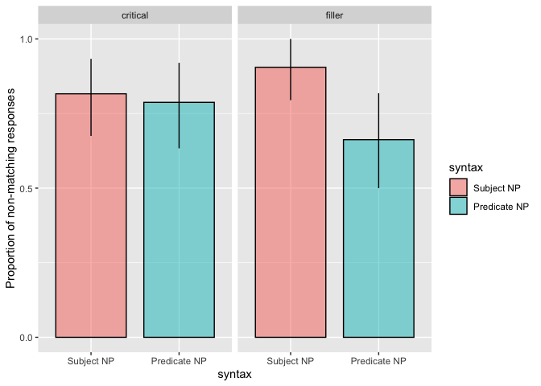
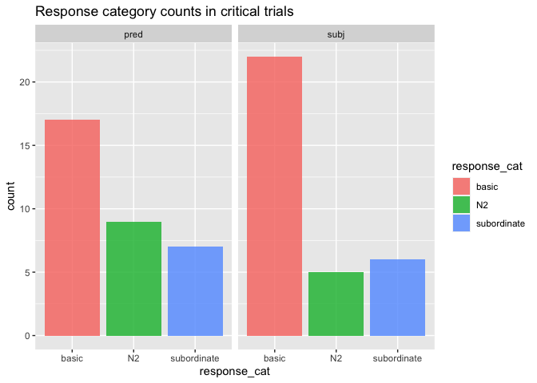

Direct Modification Experiment
================
Polina Tsvilodub
7/24/2020

``` r
data <- read_csv("../../data/direct-modification/results_35_modXrefUt_prolific_pilot_n20.csv")
```

``` r
# exclude participants who report glitches
data %>% select(submission_id, comments, problems) %>% distinct() %>% View()
d_modRef_woGlitches <- data 

# exclude non-native English speakers
d_modRef_woGlitches %>% distinct(languages) %>% View()

d_modRef_Native <- d_modRef_woGlitches %>% 
  filter(grepl("en", languages, ignore.case = T)) 

# cleaning warm-up trials
# comparison class paraphrase trial
d_failed_cc_warmup <- d_modRef_Native %>% 
  filter( trial_name == "comp_class_warmup") %>%
  group_by(submission_id) %>% count() %>%
  filter( n > 4 )
d_failed_label_warmup <- d_modRef_Native %>%
  filter( (trial_name == "warmup1") | (trial_name == "warmup2")) %>%
  group_by(submission_id) %>%
  filter(attempts > 4)
d_label_warmup_more1 <- d_modRef_Native %>%
  filter( (trial_name == "warmup1") | (trial_name == "warmup2")) %>%
  group_by(submission_id) %>%
  filter(attempts > 1) %>% ungroup() %>% 
  select(submission_id, picture1, response1, picture2, response2, attempts)

d_modRef_filter <- anti_join(d_modRef_Native, d_failed_cc_warmup, by = c("submission_id"))
d_modRef_filter <- anti_join(d_modRef_filter, d_failed_label_warmup, by = c("submission_id"))
```

``` r
d_modRef_filter %>% count(trial_type, syntax, target_size)
```

    ## # A tibble: 9 x 4
    ##   trial_type syntax target_size     n
    ##   <chr>      <chr>  <chr>       <int>
    ## 1 critical   pred   big            17
    ## 2 critical   pred   small          17
    ## 3 critical   subj   big            17
    ## 4 critical   subj   small          17
    ## 5 filler     pred   big            17
    ## 6 filler     pred   small          17
    ## 7 filler     subj   big            17
    ## 8 filler     subj   small          17
    ## 9 <NA>       <NA>   <NA>          103

### Response Classification

``` r
d_modRef_main <- d_modRef_filter %>% filter((trial_name == "custom_main_text1") |
                                (trial_name == "custom_main_text2")) %>%
  select(submission_id, trial_number, context_picture, response, target_size, adj, syntax, target, item, adj_cond, trial_type )

d_modRef_main %>% distinct(response) %>% View()

d_modRef_valid <- d_modRef_main %>% 
  subset(., !(tolower(response) %in% c("corona", "fogs", "trees or people", "dogs or people", "birds or people")))

d_modRef_main_responseCat <- d_modRef_valid %>% 
  mutate(response_cat = ifelse(
    tolower(response) %in% 
      c("flowers", "flower", "trees", "tree", "birds", "bird",  "dogs", "dog", "plants", "fish", "other trees", "animal", "other tree", "other birds", "nearby trees.", "animals", "building", "buildings", "gift flowers", "prize flowers", "prize dogs", "prize winning dogs", "rescue birds", "landmark", "landmarks", "gift", "prize winner", "rescues", "gifts", "prize-winners", "service-animals", "service dogs", "floral gifts", "service animals", "other landmarks", "prize winners", "tree landmarks", "prizewinners"), 
    "nonmatch", "match"
  ),
  response_num = ifelse(response_cat == "nonmatch", 1, 0)
  )

# detailed analysis of non-matching responses, distinguishing between basic and N2 comparison classes
d_modRef_main_responseCat_nonmatch <- d_modRef_main_responseCat %>%
  mutate(
    response_cat = ifelse(
      tolower(response) %in% 
        c("flowers", "flower", "trees", "tree", "birds", "bird",  "dogs", "dog", "plants", "fish", "other trees", "animal", "other tree", "other birds", "nearby trees.", "animals", "building", "buildings", "gift flowers", "prize flowers", "prize dogs", "prize winning dogs"
          
        ), "basic",
      ifelse( tolower(response) %in% c("landmark",  "landmarks", "gift", "prize winner", "rescues", "gifts", "prize-winners", "service-animals", "floral gifts", "service animals", "other landmarks", "prize winners", "rescue birds", "gift", "prize winner", "rescues", "gifts", "prize-winners", "service-animals", "service dogs", "floral gifts", "service animals", "other landmarks", "prize winners", "tree landmarks", "prizewinners"), "N2", "subordinate")
    )
  )
```

### Proportion of responses not matching critical N by-syntax and by-trial type

    ## Warning: `as_data_frame()` is deprecated as of tibble 2.0.0.
    ## Please use `as_tibble()` instead.
    ## The signature and semantics have changed, see `?as_tibble`.
    ## This warning is displayed once every 8 hours.
    ## Call `lifecycle::last_warnings()` to see where this warning was generated.

    ## Warning: `cols` is now required when using unnest().
    ## Please use `cols = c(strap)`

<!-- -->

<!-- -->

### Stats

    ## Running /Library/Frameworks/R.framework/Resources/bin/R CMD SHLIB foo.c
    ## clang -I"/Library/Frameworks/R.framework/Resources/include" -DNDEBUG   -I"/Library/Frameworks/R.framework/Versions/3.6/Resources/library/Rcpp/include/"  -I"/Library/Frameworks/R.framework/Versions/3.6/Resources/library/RcppEigen/include/"  -I"/Library/Frameworks/R.framework/Versions/3.6/Resources/library/RcppEigen/include/unsupported"  -I"/Library/Frameworks/R.framework/Versions/3.6/Resources/library/BH/include" -I"/Library/Frameworks/R.framework/Versions/3.6/Resources/library/StanHeaders/include/src/"  -I"/Library/Frameworks/R.framework/Versions/3.6/Resources/library/StanHeaders/include/"  -I"/Library/Frameworks/R.framework/Versions/3.6/Resources/library/rstan/include" -DEIGEN_NO_DEBUG  -D_REENTRANT  -DBOOST_DISABLE_ASSERTS -DBOOST_PENDING_INTEGER_LOG2_HPP -include stan/math/prim/mat/fun/Eigen.hpp   -isysroot /Library/Developer/CommandLineTools/SDKs/MacOSX.sdk -I/usr/local/include  -fPIC  -isysroot /Library/Developer/CommandLineTools/SDKs/MacOSX.sdk -c foo.c -o foo.o
    ## In file included from <built-in>:1:
    ## In file included from /Library/Frameworks/R.framework/Versions/3.6/Resources/library/StanHeaders/include/stan/math/prim/mat/fun/Eigen.hpp:13:
    ## In file included from /Library/Frameworks/R.framework/Versions/3.6/Resources/library/RcppEigen/include/Eigen/Dense:1:
    ## In file included from /Library/Frameworks/R.framework/Versions/3.6/Resources/library/RcppEigen/include/Eigen/Core:88:
    ## /Library/Frameworks/R.framework/Versions/3.6/Resources/library/RcppEigen/include/Eigen/src/Core/util/Macros.h:613:1: error: unknown type name 'namespace'
    ## namespace Eigen {
    ## ^
    ## /Library/Frameworks/R.framework/Versions/3.6/Resources/library/RcppEigen/include/Eigen/src/Core/util/Macros.h:613:16: error: expected ';' after top level declarator
    ## namespace Eigen {
    ##                ^
    ##                ;
    ## In file included from <built-in>:1:
    ## In file included from /Library/Frameworks/R.framework/Versions/3.6/Resources/library/StanHeaders/include/stan/math/prim/mat/fun/Eigen.hpp:13:
    ## In file included from /Library/Frameworks/R.framework/Versions/3.6/Resources/library/RcppEigen/include/Eigen/Dense:1:
    ## /Library/Frameworks/R.framework/Versions/3.6/Resources/library/RcppEigen/include/Eigen/Core:96:10: fatal error: 'complex' file not found
    ## #include <complex>
    ##          ^~~~~~~~~
    ## 3 errors generated.
    ## make: *** [foo.o] Error 1

``` r
summary(model)
```

    ##  Family: bernoulli 
    ##   Links: mu = logit 
    ## Formula: response_num ~ syntax_dev * trial_type_dev + (1 + syntax_dev * trial_type_dev | submission_id) + (1 + syntax_dev * trial_type_dev | target) 
    ##    Data: d_modRef_main_responseCat (Number of observations: 128) 
    ## Samples: 4 chains, each with iter = 3000; warmup = 1500; thin = 1;
    ##          total post-warmup samples = 6000
    ## 
    ## Group-Level Effects: 
    ## ~submission_id (Number of levels: 17) 
    ##                                                  Estimate Est.Error l-95% CI
    ## sd(Intercept)                                        5.47      2.10     2.58
    ## sd(syntax_dev1)                                      1.22      0.90     0.05
    ## sd(trial_type_dev1)                                  1.41      1.02     0.06
    ## sd(syntax_dev1:trial_type_dev1)                      1.02      0.85     0.04
    ## cor(Intercept,syntax_dev1)                           0.12      0.43    -0.72
    ## cor(Intercept,trial_type_dev1)                       0.24      0.42    -0.66
    ## cor(syntax_dev1,trial_type_dev1)                     0.21      0.43    -0.69
    ## cor(Intercept,syntax_dev1:trial_type_dev1)          -0.17      0.44    -0.87
    ## cor(syntax_dev1,syntax_dev1:trial_type_dev1)         0.00      0.45    -0.81
    ## cor(trial_type_dev1,syntax_dev1:trial_type_dev1)    -0.07      0.44    -0.83
    ##                                                  u-95% CI Rhat Bulk_ESS
    ## sd(Intercept)                                       10.63 1.00     1883
    ## sd(syntax_dev1)                                      3.37 1.00     1995
    ## sd(trial_type_dev1)                                  3.86 1.00     1726
    ## sd(syntax_dev1:trial_type_dev1)                      3.17 1.00     2350
    ## cor(Intercept,syntax_dev1)                           0.84 1.00     5198
    ## cor(Intercept,trial_type_dev1)                       0.89 1.00     4772
    ## cor(syntax_dev1,trial_type_dev1)                     0.87 1.00     3192
    ## cor(Intercept,syntax_dev1:trial_type_dev1)           0.73 1.00     4501
    ## cor(syntax_dev1,syntax_dev1:trial_type_dev1)         0.81 1.00     4297
    ## cor(trial_type_dev1,syntax_dev1:trial_type_dev1)     0.79 1.00     3985
    ##                                                  Tail_ESS
    ## sd(Intercept)                                        2916
    ## sd(syntax_dev1)                                      2400
    ## sd(trial_type_dev1)                                  2392
    ## sd(syntax_dev1:trial_type_dev1)                      3054
    ## cor(Intercept,syntax_dev1)                           4481
    ## cor(Intercept,trial_type_dev1)                       4239
    ## cor(syntax_dev1,trial_type_dev1)                     4141
    ## cor(Intercept,syntax_dev1:trial_type_dev1)           3858
    ## cor(syntax_dev1,syntax_dev1:trial_type_dev1)         4265
    ## cor(trial_type_dev1,syntax_dev1:trial_type_dev1)     4430
    ## 
    ## ~target (Number of levels: 14) 
    ##                                                  Estimate Est.Error l-95% CI
    ## sd(Intercept)                                        1.45      0.97     0.08
    ## sd(syntax_dev1)                                      1.61      0.99     0.12
    ## sd(trial_type_dev1)                                  0.92      0.76     0.03
    ## sd(syntax_dev1:trial_type_dev1)                      1.14      0.85     0.05
    ## cor(Intercept,syntax_dev1)                           0.14      0.42    -0.72
    ## cor(Intercept,trial_type_dev1)                      -0.09      0.44    -0.85
    ## cor(syntax_dev1,trial_type_dev1)                    -0.16      0.44    -0.86
    ## cor(Intercept,syntax_dev1:trial_type_dev1)          -0.12      0.43    -0.85
    ## cor(syntax_dev1,syntax_dev1:trial_type_dev1)         0.16      0.43    -0.71
    ## cor(trial_type_dev1,syntax_dev1:trial_type_dev1)    -0.01      0.44    -0.80
    ##                                                  u-95% CI Rhat Bulk_ESS
    ## sd(Intercept)                                        3.75 1.00     1410
    ## sd(syntax_dev1)                                      3.94 1.00     1858
    ## sd(trial_type_dev1)                                  2.77 1.00     2487
    ## sd(syntax_dev1:trial_type_dev1)                      3.19 1.00     2099
    ## cor(Intercept,syntax_dev1)                           0.85 1.00     2776
    ## cor(Intercept,trial_type_dev1)                       0.77 1.00     4698
    ## cor(syntax_dev1,trial_type_dev1)                     0.74 1.00     4411
    ## cor(Intercept,syntax_dev1:trial_type_dev1)           0.73 1.00     3487
    ## cor(syntax_dev1,syntax_dev1:trial_type_dev1)         0.85 1.00     4273
    ## cor(trial_type_dev1,syntax_dev1:trial_type_dev1)     0.79 1.00     4415
    ##                                                  Tail_ESS
    ## sd(Intercept)                                        1714
    ## sd(syntax_dev1)                                      2223
    ## sd(trial_type_dev1)                                  2574
    ## sd(syntax_dev1:trial_type_dev1)                      2782
    ## cor(Intercept,syntax_dev1)                           3528
    ## cor(Intercept,trial_type_dev1)                       4370
    ## cor(syntax_dev1,trial_type_dev1)                     4092
    ## cor(Intercept,syntax_dev1:trial_type_dev1)           3980
    ## cor(syntax_dev1,syntax_dev1:trial_type_dev1)         4343
    ## cor(trial_type_dev1,syntax_dev1:trial_type_dev1)     4869
    ## 
    ## Population-Level Effects: 
    ##                             Estimate Est.Error l-95% CI u-95% CI Rhat Bulk_ESS
    ## Intercept                       4.85      2.00     1.70     9.55 1.00     1928
    ## syntax_dev1                     1.99      1.20     0.06     4.82 1.00     2344
    ## trial_type_dev1                 0.29      1.01    -1.58     2.50 1.00     2769
    ## syntax_dev1:trial_type_dev1     1.26      1.03    -0.66     3.47 1.00     2474
    ##                             Tail_ESS
    ## Intercept                       2528
    ## syntax_dev1                     2201
    ## trial_type_dev1                 2739
    ## syntax_dev1:trial_type_dev1     2869
    ## 
    ## Samples were drawn using sampling(NUTS). For each parameter, Bulk_ESS
    ## and Tail_ESS are effective sample size measures, and Rhat is the potential
    ## scale reduction factor on split chains (at convergence, Rhat = 1).

``` r
# get effect of syntax by trial type 
model_draws <- model %>%
  spread_draws(b_Intercept, b_syntax_dev1, b_trial_type_dev1, `b_syntax_dev1:trial_type_dev1`) %>%
  mutate(critical_subj = b_Intercept + b_syntax_dev1 - b_trial_type_dev1 - `b_syntax_dev1:trial_type_dev1`,
         critical_pred = b_Intercept - b_syntax_dev1 - b_trial_type_dev1 + `b_syntax_dev1:trial_type_dev1`,
         syntax_critical = critical_subj - critical_pred, # subject vs predicate 
         filler_subj = b_Intercept + b_syntax_dev1 + b_trial_type_dev1 + `b_syntax_dev1:trial_type_dev1`,
         filler_pred = b_Intercept - b_syntax_dev1 + b_trial_type_dev1 - `b_syntax_dev1:trial_type_dev1`,
         syntax_filler = filler_subj - filler_pred) %>% # subject vs predicate
  select(b_Intercept, b_syntax_dev1, b_trial_type_dev1, `b_syntax_dev1:trial_type_dev1`, critical_subj, critical_pred, syntax_critical, filler_subj, filler_pred, syntax_filler) %>%
  gather(key, val) %>%
  group_by(key) %>%
  summarise(
    mean = mean(val),
    lower = quantile(val, probs = 0.025),
    upper = quantile(val, probs = 0.975)
  )
```

    ## `summarise()` ungrouping output (override with `.groups` argument)

``` r
model_draws  
```

    ## # A tibble: 10 x 4
    ##    key                            mean   lower upper
    ##    <chr>                         <dbl>   <dbl> <dbl>
    ##  1 b_Intercept                   4.85   1.70    9.55
    ##  2 b_syntax_dev1                 1.99   0.0598  4.82
    ##  3 b_syntax_dev1:trial_type_dev1 1.26  -0.660   3.47
    ##  4 b_trial_type_dev1             0.292 -1.58    2.50
    ##  5 critical_pred                 3.84   0.413   8.81
    ##  6 critical_subj                 5.29   1.13   11.8 
    ##  7 filler_pred                   1.90  -2.56    7.11
    ##  8 filler_subj                   8.39   3.05   16.9 
    ##  9 syntax_critical               1.45  -3.19    7.30
    ## 10 syntax_filler                 6.49   0.697  14.8
