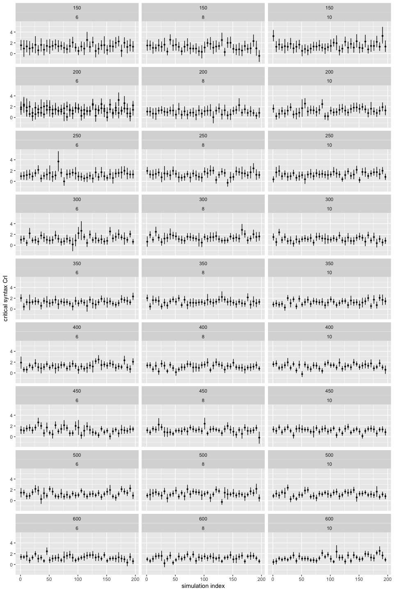
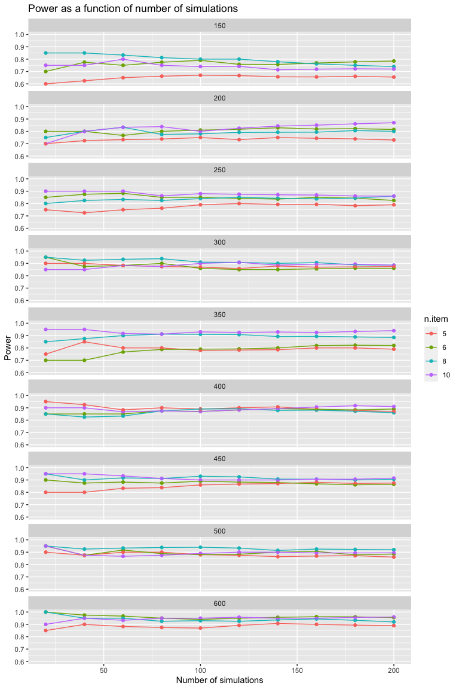
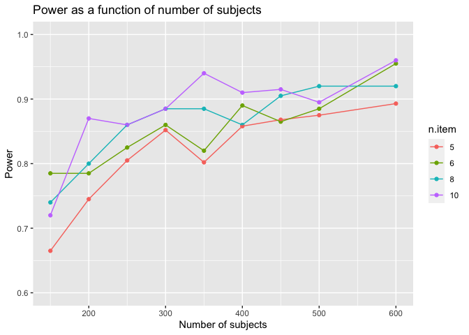

Direct Modification Power Analysis Write-Up
================
Polina Tsvilodub
9/01/2020

This write-up summarizes results of the Bayesian power analysis for the
Direct Modification refpred experiment including an iteration both over
different numbers of subjects and over different numbers of experimental
items. For more details in the experiment and the power analysis
procedure, see
<https://github.com/polina-tsvilodub/refpred/blob/master/analysis/direct-modification/direct-modification_power_write-up.md>.

Crucially, we are interested in a credible *effect of syntax in the
critical condition*. We decided to build the power analysis assuming a
maximal model including a main effects of syntax (subject vs
predicate-N), trial type (critical vs. filler) and their *interaction*
since this model is most appropriate given our experimental design, but
we’ll remain agnostic about the direction of the interaction estimate.

The power analysis proceeds as follows:

1.  The desired model to be used in final analyses is fit on pilot data
    (n = 180 subjects):

response-category = syntax \* trial-type + (1 + syntax \* trial-type ||
subjectID) + (1 + syntax \* trial-type || item)

``` r
summary(pilot_model)
```

    ##  Family: bernoulli 
    ##   Links: mu = logit 
    ## Formula: response_num ~ syntax_dev * trial_dev + (1 + syntax_dev * trial_dev || workerid) + (1 + syntax_dev * trial_dev || target) 
    ##    Data: pilot_data (Number of observations: 918) 
    ## Samples: 4 chains, each with iter = 4000; warmup = 2000; thin = 1;
    ##          total post-warmup samples = 8000
    ## 
    ## Group-Level Effects: 
    ## ~target (Number of levels: 10) 
    ##                            Estimate Est.Error l-95% CI u-95% CI Rhat Bulk_ESS
    ## sd(Intercept)                  0.27      0.21     0.01     0.77 1.00     3560
    ## sd(syntax_dev1)                0.21      0.17     0.01     0.64 1.00     3909
    ## sd(trial_dev1)                 0.47      0.26     0.05     1.07 1.00     2499
    ## sd(syntax_dev1:trial_dev1)     0.24      0.19     0.01     0.72 1.00     3667
    ##                            Tail_ESS
    ## sd(Intercept)                  4096
    ## sd(syntax_dev1)                4288
    ## sd(trial_dev1)                 2696
    ## sd(syntax_dev1:trial_dev1)     4201
    ## 
    ## ~workerid (Number of levels: 180) 
    ##                            Estimate Est.Error l-95% CI u-95% CI Rhat Bulk_ESS
    ## sd(Intercept)                  3.09      0.42     2.37     3.99 1.00     2511
    ## sd(syntax_dev1)                0.41      0.25     0.02     0.93 1.00     1701
    ## sd(trial_dev1)                 0.73      0.31     0.12     1.34 1.00     1542
    ## sd(syntax_dev1:trial_dev1)     0.29      0.21     0.01     0.76 1.00     2437
    ##                            Tail_ESS
    ## sd(Intercept)                  5260
    ## sd(syntax_dev1)                2989
    ## sd(trial_dev1)                 2474
    ## sd(syntax_dev1:trial_dev1)     3920
    ## 
    ## Population-Level Effects: 
    ##                        Estimate Est.Error l-95% CI u-95% CI Rhat Bulk_ESS
    ## Intercept                  2.90      0.44     2.12     3.81 1.00     3005
    ## syntax_dev1                0.66      0.19     0.29     1.05 1.00     7559
    ## trial_dev1                -0.12      0.27    -0.65     0.43 1.00     6069
    ## syntax_dev1:trial_dev1     0.07      0.19    -0.29     0.44 1.00     8208
    ##                        Tail_ESS
    ## Intercept                  4877
    ## syntax_dev1                6022
    ## trial_dev1                 5268
    ## syntax_dev1:trial_dev1     6093
    ## 
    ## Samples were drawn using sampling(NUTS). For each parameter, Bulk_ESS
    ## and Tail_ESS are effective sample size measures, and Rhat is the potential
    ## scale reduction factor on split chains (at convergence, Rhat = 1).

2.  Then, posterior predictive samples are drawn from this fitted model,
    simulating a given number of subjects (increased iteratively from
    150 to 600) and a given number of experimental items (iterating over
    12, 16 or 20). New potential by-subject and by-item effects for the
    respective number are sampled from a gaussian distribution specified
    by the estimated group-level standard deviations and correlations of
    pilot data.
3.  The model is re-computed on these posterior samples and the
    parameter of interest (i.e., the syntax coefficient in the critical
    condition) is extracted. The models were fit using 4 chains and 4000
    iterations each.
4.  This process is repeated *200 times* for each simulated
    subjects-number and item-number.
5.  The power for the given number of participants/items is calculated
    as the proportion of critical coefficients that were estimated in
    the predicted direction (i.e., the credible interval excludes 0)
    over all the simulations.

The power analysis script can be found under:
<https://github.com/polina-tsvilodub/refpred/blob/master/analysis/direct-modification/power_analysis.R>

Here is the credible interval over the estimate for the effect of syntax
in the critical condition over the progressing simulations, faceted by
number of simulated subjects:

<!-- -->

The results of the simulations reveal the following power for
subject-numbers between 150 and 600, increasing by 50 subjects and over
12, 16, 20 items can be found under
<https://github.com/polina-tsvilodub/refpred/blob/master/analysis/direct-modification/results/direct_mod_power_analysis_bySubj-byItem_4000iter_200sim_summary.csv>.

The power plotted as a function of number of simulations, by subject
number and items-number:
<!-- -->

This plot shows the power as a function of the number of subjects, by -
item-number:

<!-- -->

Overall, we see that simulations of around 250 subjects already achieve
a power of 0.8 and 300 subjects around 0.85 for 12 items or more. The
number of items does not seem to have a large effect for more than 400
subjects.

#### Attrition rates in the pilots

Over the course of all 6 pilots, we recruited 207 participants and
excluded 27 (13%), mostly due to failing the warm-up trials (i.e.,
taking more than 4 attempts to provide correct picture labels upon
correction on labeling warm-up trials; 17 participants, 8%) or reporting
a native language other than English. The rate of invalid responses
post-exclusion (i.e., unclassifiable free-production responses) is
around 1-3%. The participants were paid $1.00/participant.
