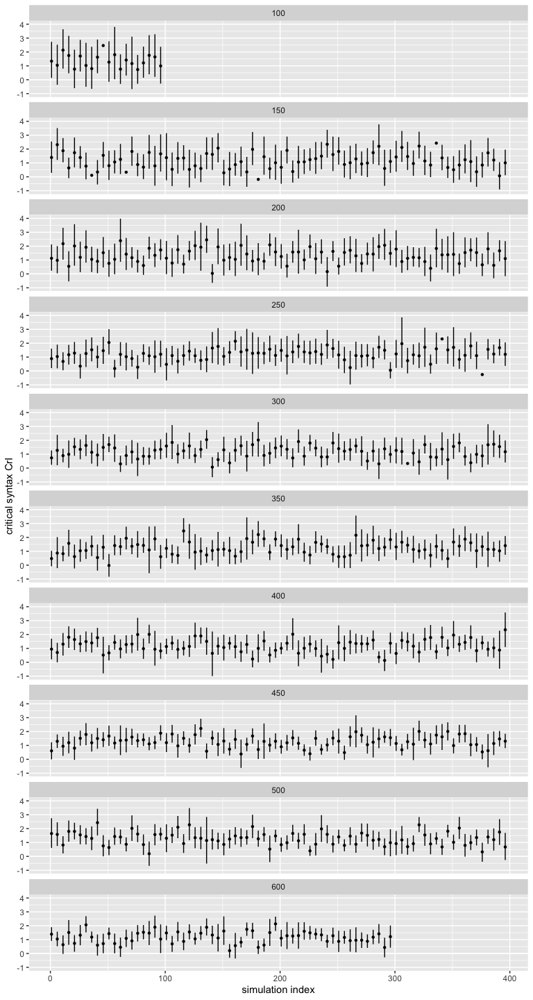

Direct Modification Power Analysis Write-Up
================
Polina Tsvilodub
8/18/2020

This write-up summarizes results of a Bayesian power analysis for the
Direct Modification refpred experiment. In this experiment, we
manipulate the syntactic position of the noun directly modified by the
adjective (“big Great Dane” appearing in the subject or in the
predicate) in order to disentangle effects of reasoning about
informational goals on comparison class inference from effects of
syntactic modification. The experiment has a 2-by-2 within-subjects
design, manipulating the syntax (subject vs predicate N) and the
trial-type (critical vs filer, where fillers are trials from our CogSci
Experiment 3).

Smaller simulations based on data from last two direct modification
pilots only (n = 45) which match the experimental design planned for the
large-scale experiment revealed a high level of noise (large by-subject
intercepts). Therefore, this power analysis is based on pilot data from
*all 6* direct-modification pilots (n = 180). The pilots differ in
details like warm-up trials, but all use the same critical experimental
items and critical condition (subject-N vs. predicate-N sentences: “That
big Great Dane is a prize-winner” vs. “That prize-winner is a big Great
Dane”). A detailed write-up of pilot results can be found under
<https://github.com/polina-tsvilodub/refpred/blob/master/analysis/direct-modification/modificationXrefUt-pilot2.md>.

Crucially, we are interested in a credible *effect of syntax in the
critical condition*. We decided to build the power analysis assuming a
maximal model including a main effects of syntax (subject vs
predicate-N), trial type (critical vs. filler) and their *interaction*
since this model is most appropriate given our experimental design, but
we’ll remain agnostic about the direction of the interaction estimate.

The power analysis proceeds as follows:

1.  The desired model to be used in final analyses is fit on pilot data
    (n = 180 subjects):

response-category = syntax \* trial-type + (1 + syntax \* trial-type ||
subjectID) + (1 + syntax \* trial-type || item)

``` r
summary(pilot_model)
```

    ##  Family: bernoulli 
    ##   Links: mu = logit 
    ## Formula: response_num ~ syntax_dev * trial_dev + (1 + syntax_dev * trial_dev || workerid) + (1 + syntax_dev * trial_dev || target) 
    ##    Data: pilot_data (Number of observations: 918) 
    ## Samples: 4 chains, each with iter = 3000; warmup = 1500; thin = 1;
    ##          total post-warmup samples = 6000
    ## 
    ## Group-Level Effects: 
    ## ~target (Number of levels: 10) 
    ##                            Estimate Est.Error l-95% CI u-95% CI Rhat Bulk_ESS
    ## sd(Intercept)                  0.28      0.21     0.01     0.78 1.00     2606
    ## sd(syntax_dev1)                0.22      0.17     0.01     0.63 1.00     2876
    ## sd(trial_dev1)                 0.47      0.26     0.05     1.10 1.00     1772
    ## sd(syntax_dev1:trial_dev1)     0.25      0.20     0.01     0.77 1.00     2263
    ##                            Tail_ESS
    ## sd(Intercept)                  3081
    ## sd(syntax_dev1)                2843
    ## sd(trial_dev1)                 2068
    ## sd(syntax_dev1:trial_dev1)     3515
    ## 
    ## ~workerid (Number of levels: 180) 
    ##                            Estimate Est.Error l-95% CI u-95% CI Rhat Bulk_ESS
    ## sd(Intercept)                  3.09      0.42     2.36     4.00 1.00     1579
    ## sd(syntax_dev1)                0.40      0.25     0.02     0.93 1.00     1314
    ## sd(trial_dev1)                 0.73      0.32     0.09     1.36 1.00      796
    ## sd(syntax_dev1:trial_dev1)     0.28      0.20     0.01     0.74 1.00     1849
    ##                            Tail_ESS
    ## sd(Intercept)                  2640
    ## sd(syntax_dev1)                2589
    ## sd(trial_dev1)                 1121
    ## sd(syntax_dev1:trial_dev1)     2443
    ## 
    ## Population-Level Effects: 
    ##                        Estimate Est.Error l-95% CI u-95% CI Rhat Bulk_ESS
    ## Intercept                  2.92      0.43     2.14     3.84 1.00     1999
    ## syntax_dev1                0.66      0.20     0.29     1.07 1.00     5036
    ## trial_dev1                -0.12      0.28    -0.65     0.46 1.00     3783
    ## syntax_dev1:trial_dev1     0.07      0.20    -0.32     0.46 1.00     4894
    ##                        Tail_ESS
    ## Intercept                  2971
    ## syntax_dev1                3824
    ## trial_dev1                 3407
    ## syntax_dev1:trial_dev1     3675
    ## 
    ## Samples were drawn using sampling(NUTS). For each parameter, Bulk_ESS
    ## and Tail_ESS are effective sample size measures, and Rhat is the potential
    ## scale reduction factor on split chains (at convergence, Rhat = 1).

2.  Then, posterior predictive samples are drawn from this fitted model,
    simulating a given number of subjects (increased iteratively from 50
    to 600). New potential by-subject effects for the respective number
    are sampled from a gaussian distribution specified by the estimated
    group-level standard deviations and correlations of pilot data.
3.  The model is re-computed on these posterior samples and the
    parameter of interest (i.e., the syntax coefficient in the critical
    condition) is extracted. The models were fit using 4 chains and 3000
    iterations each.
4.  This process is repeated *400 times* for each simulated
    subjects-number. (for n = 50, 100 we only did 100 simulations, for n
    = 600 only 300)
5.  The power for the given number of participants is calculated as the
    proportion of critical coefficients that were estimated in the
    predicted direction (i.e., the credible interval excludes 0) over
    all the simulations.

The power analysis script can be found under:
<https://github.com/polina-tsvilodub/refpred/blob/master/analysis/direct-modification/power_analysis.R>

Here is the credible interval over the estimate for the effect of syntax
in the critical condition over the progressing simulations, faceted by
number of simulated subjects:
<!-- -->

The results of the simulations reveal the following power for
subject-numbers between 50 and 600, increasing by 50 subjects:

    ## Parsed with column specification:
    ## cols(
    ##   n.subj = col_double(),
    ##   power_syntax = col_double()
    ## )

    ## # A tibble: 11 x 2
    ##    n.subj power_syntax
    ##     <dbl>        <dbl>
    ##  1     50        0.28 
    ##  2    100        0.52 
    ##  3    150        0.665
    ##  4    200        0.745
    ##  5    250        0.805
    ##  6    300        0.852
    ##  7    350        0.802
    ##  8    400        0.858
    ##  9    450        0.868
    ## 10    500        0.875
    ## 11    600        0.893

The power plotted as a function of number of simulations reveals
oscillations of the power for less than 200 simulations:

    ## Parsed with column specification:
    ## cols(
    ##   n.subj = col_double(),
    ##   power_syntax = col_double(),
    ##   n.sim = col_double()
    ## )

<!-- -->

Overall, we see that simulations of around 250 subjects already achieve
a power of 0.8 and 300 subjects around 0.85, but for 350 subjects the
power drops back to 0.8. 400 subjects or more show a more stable power
\> 0.8.

#### Attrition rates in the pilots

Over the course of all 6 pilots, we recruited 207 participants and
excluded 27 (13%), mostly due to failing the warm-up trials (i.e.,
taking more than 4 attempts to provide correct picture labels upon
correction on labeling warm-up trials; 17 participants, 8%) or reporting
a native language other than English. The rate of invalid responses
post-exclusion (i.e., unclassifiable free-production responses) is
around 1-3%. The participants were paid $1.00/participant.
