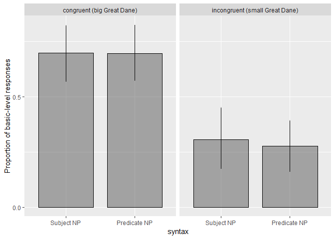
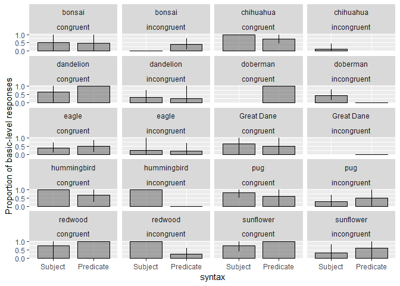
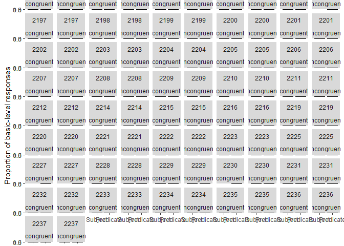

Double Modification X Congruence Pilot 1
================
Polina Tsvilodub
24 04 2020

In this pilot (n = 46), we explore the combined effects of syntax and
congruence in our double modification experiment where we disentangle
the effects of syntax and noun modification. This means we manipulate
the modified noun position (subject NP vs. predicate NP) and if the
adjective matches the general expectations about the size of the target
subordinate category relative to its basic-level category (congruent -
matching expectation, ‘big Great Dane’; incongruent - mismatching
expectations, ‘small Great Dane’) (within-subjects). We use an
additional referential noun which can also appear either in the subject
or in the predicate position to allow for symmetric syntactic
manipulation of the critical NP. (e.g. ‘That big Great Dane is a
prize-winner’ and ‘Thta’ prize-winner is abig Great Dane’.)

As we saw in the syntax-by-congruence E3 pilot, the presense of
incongruent trials might draw participants’ attention to the potential
flexibility of comparison classes. This might make them more sensitive
to the syntactic manipulation in the congruent trials. So we might
expect a stronger effect of syntax in congruent conditions.

We use the same warm-up trials as in the syntax-congruence E3 pilot
where the participants see a click-through and a labeling view of the
subordinate members which appear in the context of the main trials, and
they don’t provide basic-level labels for these targets.

In the main trials, each participant completes 5 trials: one trial in
each syntax X congruence condition and one trial in a random condition.

## Data Exclusion

Four participants are excluded for not reporting their native language.
One is excluded for failing labeling trials (mostly due to typos).

``` r
# exclude participants who report glitches
d_mod_congr %>% select(submission_id, comments, problems) %>% distinct() %>% View()
d_woGlitches <- d_mod_congr 

# exclude non-native English speakers
d_woGlitches %>% distinct(languages) %>% View()

d_Native <- d_woGlitches %>% 
  filter(grepl("en", languages, ignore.case = T)) 

# cleaning warm-up trials
# comparison class paraphrase trial
d_failed_cc_warmup <- d_Native %>% 
  filter( trial_name == "comp_class_warmup") %>%
  group_by(submission_id) %>% count() %>%
  filter( n > 4 )
d_failed_label_warmup <- d_Native %>%
  filter( (trial_name == "warmup1") | (trial_name == "warmup2")) %>%
  group_by(submission_id) %>%
  filter(attempts > 4)
d_label_warmup_more1 <- d_Native %>%
  filter( (trial_name == "warmup1") | (trial_name == "warmup2")) %>%
  group_by(submission_id) %>%
  filter(attempts > 1) %>% ungroup() %>% 
  select(submission_id, picture1, response1, picture2, response2, attempts)
# check where and why people need more than one attempt 
# d_Native %>% 
#filter((trial_name == "warmup1") | (trial_name == "warmup2")) %>% #semi_join(., d_label_warmup_more1, by=c("submission_id")) %>% #select(submission_id, picture1, response1, picture2, response2, attempts) %>% View()
d_filter <- anti_join(d_Native, d_failed_cc_warmup, by = c("submission_id"))
d_filter <- anti_join(d_filter, d_failed_label_warmup, by = c("submission_id"))
```

The number of conditions we collected data for is relatively balanced.

``` r
d_filter %>% count(adj_cond, syntax)
```

    ## # A tibble: 5 x 3
    ##   adj_cond    syntax     n
    ##   <chr>       <chr>  <int>
    ## 1 congruent   pred      55
    ## 2 congruent   subj      48
    ## 3 incongruent pred      51
    ## 4 incongruent subj      51
    ## 5 <NA>        <NA>     275

``` r
d_filter %>% count(adj_cond, syntax, target_size)
```

    ## # A tibble: 9 x 4
    ##   adj_cond    syntax target_size     n
    ##   <chr>       <chr>  <chr>       <int>
    ## 1 congruent   pred   big            22
    ## 2 congruent   pred   small          33
    ## 3 congruent   subj   big            27
    ## 4 congruent   subj   small          21
    ## 5 incongruent pred   big            29
    ## 6 incongruent pred   small          22
    ## 7 incongruent subj   big            22
    ## 8 incongruent subj   small          29
    ## 9 <NA>        <NA>   <NA>          275

``` r
d_filter %>% count(adj_cond, target, syntax)
```

    ## # A tibble: 38 x 4
    ##    adj_cond  target     syntax     n
    ##    <chr>     <chr>      <chr>  <int>
    ##  1 congruent bonsai     pred       6
    ##  2 congruent bonsai     subj       4
    ##  3 congruent chihuahua  pred      11
    ##  4 congruent chihuahua  subj       4
    ##  5 congruent dandelion  pred       5
    ##  6 congruent dandelion  subj       3
    ##  7 congruent doberman   pred       3
    ##  8 congruent eagle      pred       9
    ##  9 congruent eagle      subj      10
    ## 10 congruent Great Dane pred       4
    ## # ... with 28 more rows

## Response Classification

Data from n = 41 is classified into basic-level and subordinate
responses. 9 (4 %) invalid responses where participants fail to
establish correct reference or produce nonsense are excluded.

``` r
d_main <- d_filter %>% filter((trial_name == "custom_main_text1") |
                                (trial_name == "custom_main_text2")) %>%
  select(submission_id, context_picture, response, target_size, adj, syntax, target, item, adj_cond )


d_main %>% distinct(response) %>% View()

d_valid <- d_main %>% 
  subset(., !(tolower(response) %in% c("prize-winner", "big", "powerful", "small", "gifts", "rescues", "prizes", "people", "landmarks")))

d_main_responseCat <- d_valid %>% 
  mutate(response_cat = ifelse(
    tolower(response) %in% c("flowers", "flower", "trees", "tree",  "birds", "bird", "fish", "dogs", "dog", "plants", "fishes", "pets", "tall trees", "canines"), "basic", "subordinate"
  ),
  response_num = ifelse(response_cat == "basic", 1, 0)
  )
```

There are 8 participants (20%) who produce basic-level responses only.
This is a higher rate than in the original cogsci Experiment 3 or in the
syntax-congruence E3 pilot. This means that the presence of the second
noun decreases the salience of the incongruent trials and that the
participants are more confused by this complex syntactic frame.

6 participants (15%) provide subordinate responses only.

``` r
d_main_responseCat %>% group_by(submission_id) %>% summarize(mean = mean(response_num)) %>% ungroup() %>% count(mean) 
```

    ## # A tibble: 8 x 2
    ##    mean     n
    ##   <dbl> <int>
    ## 1 0         6
    ## 2 0.2       7
    ## 3 0.333     1
    ## 4 0.4      10
    ## 5 0.5       1
    ## 6 0.6       4
    ## 7 0.8       4
    ## 8 1         8

There are 10 participants who provide basic-level responses only in the
congruent and subordinate responses only in the incongruent condition.

Within the congruent condition, there are 13 participants who flexibly
adjust their response and provide (at least) one response of each kind
(basic vs. sub). (Reminder: some participants might see two trials in a
specific condition, whereas others see only trial in each condition).

``` r
d_main_responseCat %>% group_by(submission_id, adj_cond) %>% summarize(mean = mean(response_num)) %>% ungroup() %>% group_by(submission_id) %>% spread(adj_cond, mean) %>% filter(((congruent == 1) ) & ( (incongruent == 0)))
```

    ## # A tibble: 10 x 3
    ## # Groups:   submission_id [10]
    ##    submission_id congruent incongruent
    ##            <int>     <dbl>       <dbl>
    ##  1          2194         1           0
    ##  2          2203         1           0
    ##  3          2204         1           0
    ##  4          2206         1           0
    ##  5          2207         1           0
    ##  6          2210         1           0
    ##  7          2212         1           0
    ##  8          2220         1           0
    ##  9          2223         1           0
    ## 10          2231         1           0

``` r
d_main_responseCat %>% filter(adj_cond == "congruent") %>% group_by(submission_id, syntax) %>% summarize(mean = mean(response_num)) %>% ungroup() %>% group_by(submission_id) %>% spread(syntax, mean) %>% filter(!(((subj ==1) & (pred == 1)) | ((subj == 0) & (pred == 0))))
```

    ## # A tibble: 13 x 3
    ## # Groups:   submission_id [13]
    ##    submission_id  pred  subj
    ##            <int> <dbl> <dbl>
    ##  1          2195   0     0.5
    ##  2          2197   0.5   0  
    ##  3          2199   1     0  
    ##  4          2200   0     1  
    ##  5          2201   0.5   1  
    ##  6          2202   1     0  
    ##  7          2209   0     1  
    ##  8          2211   1     0  
    ##  9          2214   0     1  
    ## 10          2216   1     0  
    ## 11          2222   1     0  
    ## 12          2235   0     0.5
    ## 13          2236   1     0.5

## By-congruence plot of the syntactic conditions

We only see a main effect of congruence.

    ## Warning: Duplicated aesthetics after name standardisation: colour

<!-- -->

## By-item Plot

There is a lot of by-item variablity, although there might be too few
data points per item per condition to make specific claims.

    ## Warning: Duplicated aesthetics after name standardisation: colour

<!-- -->

## By-subject Plot

Participants are more flexible in switching their responses between the
syntactic conditions (in either adjectival condition) - 19 participants
(46%) provide responses of both kinds between the subject and the
predicate condition. However, the by-subject variability is quite high.

``` r
d_main_responseCat %>% group_by(syntax, adj_cond, submission_id) %>%
  tidyboot_mean(column = response_num) -> d_main_responseCat.bySubj

d_main_responseCat.bySubj %>%
  ungroup() %>%
  mutate(syntax = factor(syntax, levels = c("subj", "pred"), 
                         labels = c("Subject", "Predicate"))) %>%
  ggplot(., aes(x=syntax, y = mean, ymin = ci_lower, ymax = ci_upper)) +
  geom_col(position = position_dodge(bar.width), width = bar.width, color= 'black',
           alpha = 0.5, color = 'black', size = 0.5) +
  geom_linerange(position = position_dodge(bar.width), size = 0.5) +
  scale_y_continuous(breaks = c(0, 0.5, 1))+
  ylab("Proportion of basic-level responses") +
  facet_wrap(submission_id~adj_cond)
```

    ## Warning: Duplicated aesthetics after name standardisation: colour

<!-- -->

``` r
#ggsave('double-modXcongruence-pilot1-bySubj.pdf', height = 8, width = 8)
```

## Stats

Both predictors are deviation-coded. A Bayesian model with maixmal
random effects structure:

``` r
# deviation coding
d_main_responseCat <- d_main_responseCat %>% 
  mutate(syntax_dev = ifelse(syntax == "subj", 1, -1),
         adj_cond_dev = ifelse(adj_cond == "congruent", 1, -1))
lm.modXcongr.pilot <- brm(response_num ~ syntax_dev * adj_cond_dev + 
                     (1 + adj_cond_dev * syntax_dev | submission_id) +
                     (1 + adj_cond_dev * syntax_dev | target),
                   data = d_main_responseCat,
                   family = "bernoulli",
                   control = list(adapt_delta = 0.9),
                   iter = 1000, 
                   cores = 4)
```

    ## Compiling the C++ model

    ## Start sampling

``` r
summary(lm.modXcongr.pilot)
```

    ##  Family: bernoulli 
    ##   Links: mu = logit 
    ## Formula: response_num ~ syntax_dev * adj_cond_dev + (1 + adj_cond_dev * syntax_dev | submission_id) + (1 + adj_cond_dev * syntax_dev | target) 
    ##    Data: d_main_responseCat (Number of observations: 196) 
    ## Samples: 4 chains, each with iter = 1000; warmup = 500; thin = 1;
    ##          total post-warmup samples = 2000
    ## 
    ## Group-Level Effects: 
    ## ~submission_id (Number of levels: 41) 
    ##                                           Estimate Est.Error l-95% CI
    ## sd(Intercept)                                47.78     17.18    21.21
    ## sd(adj_cond_dev)                             15.59      8.23     2.28
    ## sd(syntax_dev)                               12.36      7.71     0.98
    ## sd(adj_cond_dev:syntax_dev)                  14.68      7.03     2.91
    ## cor(Intercept,adj_cond_dev)                  -0.28      0.36    -0.84
    ## cor(Intercept,syntax_dev)                     0.24      0.39    -0.60
    ## cor(adj_cond_dev,syntax_dev)                 -0.13      0.38    -0.77
    ## cor(Intercept,adj_cond_dev:syntax_dev)       -0.06      0.36    -0.72
    ## cor(adj_cond_dev,adj_cond_dev:syntax_dev)    -0.28      0.36    -0.87
    ## cor(syntax_dev,adj_cond_dev:syntax_dev)       0.28      0.36    -0.53
    ##                                           u-95% CI Eff.Sample Rhat
    ## sd(Intercept)                                89.00       1061 1.00
    ## sd(adj_cond_dev)                             35.80        433 1.00
    ## sd(syntax_dev)                               31.28        407 1.01
    ## sd(adj_cond_dev:syntax_dev)                  31.97        742 1.00
    ## cor(Intercept,adj_cond_dev)                   0.49       1260 1.00
    ## cor(Intercept,syntax_dev)                     0.84       1325 1.00
    ## cor(adj_cond_dev,syntax_dev)                  0.64        642 1.01
    ## cor(Intercept,adj_cond_dev:syntax_dev)        0.65       1437 1.00
    ## cor(adj_cond_dev,adj_cond_dev:syntax_dev)     0.50        433 1.01
    ## cor(syntax_dev,adj_cond_dev:syntax_dev)       0.84        494 1.00
    ## 
    ## ~target (Number of levels: 10) 
    ##                                           Estimate Est.Error l-95% CI
    ## sd(Intercept)                                11.08      5.85     1.65
    ## sd(adj_cond_dev)                              7.47      5.30     0.49
    ## sd(syntax_dev)                                9.94      6.82     0.58
    ## sd(adj_cond_dev:syntax_dev)                   7.94      5.85     0.42
    ## cor(Intercept,adj_cond_dev)                   0.16      0.41    -0.71
    ## cor(Intercept,syntax_dev)                    -0.17      0.40    -0.85
    ## cor(adj_cond_dev,syntax_dev)                  0.13      0.42    -0.73
    ## cor(Intercept,adj_cond_dev:syntax_dev)        0.12      0.41    -0.69
    ## cor(adj_cond_dev,adj_cond_dev:syntax_dev)     0.04      0.44    -0.76
    ## cor(syntax_dev,adj_cond_dev:syntax_dev)       0.01      0.45    -0.79
    ##                                           u-95% CI Eff.Sample Rhat
    ## sd(Intercept)                                24.50        866 1.00
    ## sd(adj_cond_dev)                             19.49        776 1.00
    ## sd(syntax_dev)                               26.32        619 1.00
    ## sd(adj_cond_dev:syntax_dev)                  21.69        867 1.00
    ## cor(Intercept,adj_cond_dev)                   0.85       1819 1.00
    ## cor(Intercept,syntax_dev)                     0.65       1216 1.00
    ## cor(adj_cond_dev,syntax_dev)                  0.83       1243 1.00
    ## cor(Intercept,adj_cond_dev:syntax_dev)        0.84       1814 1.00
    ## cor(adj_cond_dev,adj_cond_dev:syntax_dev)     0.81       1224 1.00
    ## cor(syntax_dev,adj_cond_dev:syntax_dev)       0.80       1719 1.00
    ## 
    ## Population-Level Effects: 
    ##                         Estimate Est.Error l-95% CI u-95% CI Eff.Sample
    ## Intercept                  -1.10      7.53   -15.84    14.19        954
    ## syntax_dev                 -0.20      6.57   -13.78    12.89        992
    ## adj_cond_dev               31.52     11.44    13.78    58.33        956
    ## syntax_dev:adj_cond_dev     1.09      6.19   -10.83    14.12        718
    ##                         Rhat
    ## Intercept               1.00
    ## syntax_dev              1.00
    ## adj_cond_dev            1.01
    ## syntax_dev:adj_cond_dev 1.00
    ## 
    ## Samples were drawn using sampling(NUTS). For each parameter, Eff.Sample 
    ## is a crude measure of effective sample size, and Rhat is the potential 
    ## scale reduction factor on split chains (at convergence, Rhat = 1).
