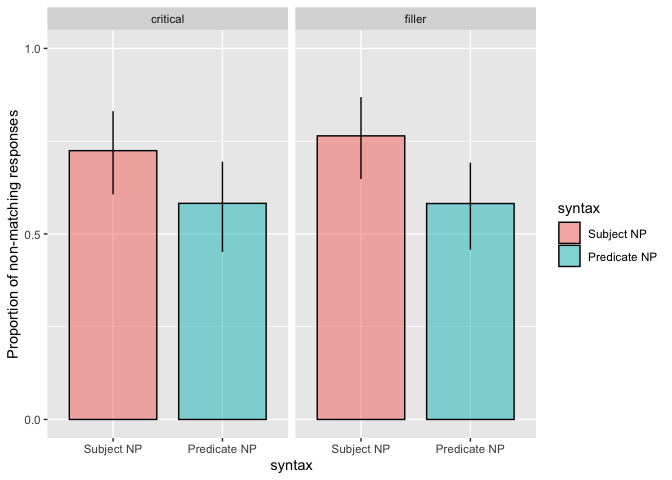
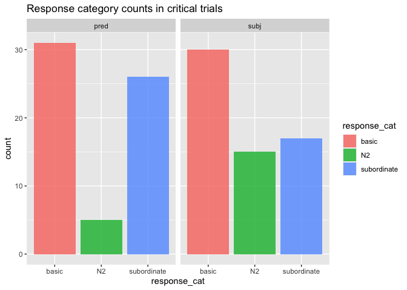
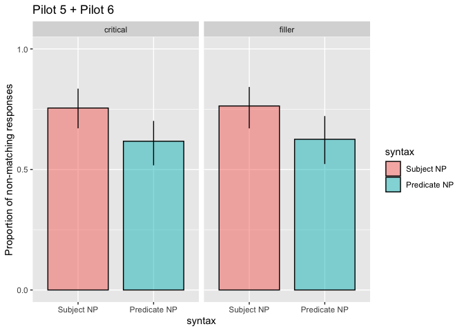

Double Modification Pilot 6
================
Polina Tsvilodub
6/24/2020

# Summary

This write-up presents the results of pilot 5 (last pilot discussed at
the last meeting, n = 17) and pilot 6 (new pilot, n = 36) of the double
modification comparison class studies. First, the data for pilot 6 is
analyzed separately, than the collapsed data sets are analyzed (section
`Pilot 5 + Pilot 6`).

The key design points of these pilots are: - there are two blocks, with
four warm-up and four main trials each - in each block, two distinct
basic-level contexts are used - only subordinate nouns and basic-level
contexts are used - the four main trials consist of two critical trials
(Subject N: That big Great Dane is a prize-winner; Predicate N: That
prize-winner is a big Great Dane) - and two ‘filler’ trials (Subject N:
That pug is small; Predicate N: That’s a small pug) (stimuli from CogSci
E3) - within one block, for one basic context, one possible target
appears in the critical trial (e.g. the Great Dane) and the other then
appears in the filler trial (e.g. the pug) - in the warm-up trials,
participants see: - labeled instances from a big and a small subordinate
category belonging to different basic categories, which later appear in
the contexts of main trials - they label other instances of the same
subordinate categories themselves and are provided feedback - they see
labeled instances of objects with features described by the second noun
used in critical double-modification sentences: e.g., they see dogs with
prize bows on them and read: “These dogs are prize-winners. Notice the
bow on them.” - they complete a comparison class paraphrase warm-up
trial (in the first block only) - the contexts in the critical main
trials include two members of the same subordinate category as the
target, and two members with the same additional feature (e.g., being a
prize-winner). Crucially, in these contexts the referential utility of
both nouns is equivalent. - the filler contexts have two members of the
same subordinate category as the target

We categorize the responses by checking whether they correspond to the
critical subordinate noun or not (`match` vs `nonmatch`). That is, we
count responses corresponding to the second noun in critical sentences
as valid comparison classes (e.g. ‘big compared to other
prize-winners’).

# Pilot 6 Details

This pilot improves the ordering of warm-up trials (to being as
presented above), the text, and the balancing of the trials compared to
pilot 5. For each participants, four out of possible five context are
sampled randomly (dogs x 2, flowers, trees, birds). In one block, two
distinct context are used, and the critical and the filler trial use one
of the possible targets each (i.e., if the critical sentence describes
the Great Dane in the dog context, the filler sentence in the same block
describes the pug in the dog context). The trial types (critical vs
filler), syntax (subject vs predicate N), and size of the targets (big
vs small) are balanced within-participant, resulting in 8 unique trials
(4 per block).

``` r
data <- read_csv("../../data/direct-modification/results_35_double-modXrefUt-pilot2.csv")
```

### Data Exclusion

One participant was excluded for not reporting their native language.
One is excluded for failing the comparison class warm-up trial, two are
excluded for failing labeling trials (mostly due to typos).

``` r
# exclude participants who report glitches
data %>% select(workerid, comments, problems) %>% distinct() %>% View()
d_modRef_woGlitches <- data 

# exclude non-native English speakers
d_modRef_woGlitches %>% distinct(languages) %>% View()

d_modRef_Native <- d_modRef_woGlitches %>% 
  filter(grepl("en", languages, ignore.case = T)) 

# cleaning warm-up trials
# comparison class paraphrase trial
d_failed_cc_warmup <- d_modRef_Native %>% 
  filter( trial_name == "comp_class_warmup") %>%
  group_by(workerid) %>% count() %>%
  filter( n > 4 )
d_failed_label_warmup <- d_modRef_Native %>%
  filter( (trial_name == "warmup1") | (trial_name == "warmup2")) %>%
  group_by(workerid) %>%
  filter(attempts > 4)
d_label_warmup_more1 <- d_modRef_Native %>%
  filter( (trial_name == "warmup1") | (trial_name == "warmup2")) %>%
  group_by(workerid) %>%
  filter(attempts > 1) %>% ungroup() %>% 
  select(workerid, picture1, response1, picture2, response2, attempts)

d_modRef_filter <- anti_join(d_modRef_Native, d_failed_cc_warmup, by = c("workerid"))
d_modRef_filter <- anti_join(d_modRef_filter, d_failed_label_warmup, by = c("workerid"))
```

``` r
d_modRef_filter %>% count(trial_type, syntax, target_size)
```

    ## # A tibble: 9 x 4
    ##   trial_type syntax target_size     n
    ##   <chr>      <chr>  <chr>       <int>
    ## 1 critical   pred   big            32
    ## 2 critical   pred   small          32
    ## 3 critical   subj   big            32
    ## 4 critical   subj   small          32
    ## 5 filler     pred   big            32
    ## 6 filler     pred   small          32
    ## 7 filler     subj   big            32
    ## 8 filler     subj   small          32
    ## 9 <NA>       <NA>   <NA>          190

### Response Classification

Data from n = 32 subjects is classified into responses *not matching*
the critical subordinate N (i.e. basic-level, superordinate or
feature-nouns) vs *matching* (i.e. subordinate) nouns. 6 (1 %) invalid
responses where participants fail to establish correct reference or
produce nonsense are excluded.

``` r
d_modRef_main <- d_modRef_filter %>% filter((trial_name == "custom_main_text1") |
                                (trial_name == "custom_main_text2")) %>%
  select(workerid, trial_number, context_picture, response, target_size, adj, syntax, target, item, adj_cond, trial_type )
```

``` r
d_modRef_main %>% distinct(response) %>% View()

d_modRef_valid <- d_modRef_main %>% 
  subset(., !(tolower(response) %in% c("height", "size", "height and weight", "distance", "wings", "width")))

d_modRef_main_responseCat <- d_modRef_valid %>% 
  mutate(response_cat = ifelse(
    tolower(response) %in% 
      c("flowers", "flower", "trees", "tree", "birds", "bird",  "dogs", "dog", "plants", "other trees", "animal", "other tree", "other birds", "nearby trees.", "animals", "gift flowers", "prize flowers", "prize dogs", "prize winning dogs", "rescue birds", "landmark", "gift", "prize winner", "rescues", "gifts", "prize-winners", "service-animals", "service dogs", "floral gifts", "service animals", "other landmarks", "prize winners"), 
    "nonmatch", "match"
  ),
  response_num = ifelse(response_cat == "nonmatch", 1, 0)
  )

# detailed analysis of non-matching responses, distinguishing between basic and N2 comparison classes
d_modRef_main_responseCat_nonmatch <- d_modRef_main_responseCat %>%
  mutate(
    response_cat = ifelse(
      tolower(response) %in% 
        c("flowers", "flower", "trees", "tree", "birds", "bird",  "dogs", "dog", "plants", "other trees", "animal", "other tree", "other birds", "nearby trees.", "animals", "gift flowers", "prize flowers", "prize dogs", "prize winning dogs", "rescue birds", "service dogs"
          
        ), "basic",
      ifelse( tolower(response) %in% c("landmark", "gift", "prize winner", "rescues", "gifts", "prize-winners", "service-animals", "floral gifts", "service animals", "other landmarks", "prize winners"), "N2", "subordinate")
    )
  )
```

### Proportion of responses not matching critical N by-syntax and by-trial type

The proportion of responses which don’t match the critical subordinate
Ns is plotted against the syntax by-trial type.

    ## Warning: `as_data_frame()` is deprecated as of tibble 2.0.0.
    ## Please use `as_tibble()` instead.
    ## The signature and semantics have changed, see `?as_tibble`.
    ## This warning is displayed once every 8 hours.
    ## Call `lifecycle::last_warnings()` to see where this warning was generated.

    ## Warning: `cols` is now required when using unnest().
    ## Please use `cols = c(strap)`

<!-- -->

### Comparison class types within critical trials

Within critical trials, among non-matching responses there are
basic-level and N2-matching comparison classes. We observe more N2
comparison classes when the N2 appears in the predicate position than in
the subject position, consistent with a reference-predication trade-off
hypothesis, as indicated by the syntactic position of the noun.

``` r
d_modRef_main_responseCat_nonmatch %>% count(response_cat, syntax, trial_type)
```

    ## # A tibble: 10 x 4
    ##    response_cat syntax trial_type     n
    ##    <chr>        <chr>  <chr>      <int>
    ##  1 basic        pred   critical      31
    ##  2 basic        pred   filler        36
    ##  3 basic        subj   critical      30
    ##  4 basic        subj   filler        47
    ##  5 N2           pred   critical       5
    ##  6 N2           subj   critical      15
    ##  7 subordinate  pred   critical      26
    ##  8 subordinate  pred   filler        26
    ##  9 subordinate  subj   critical      17
    ## 10 subordinate  subj   filler        15

``` r
d_modRef_main_responseCat_nonmatch %>%
  filter(trial_type == "critical") %>%
  ggplot(., aes(x = response_cat, fill = response_cat)) +
  geom_bar(alpha = 0.8) +
  facet_grid(~syntax) +
  ggtitle("Response category counts in critical trials")
```

<!-- -->

### Stats Pilot 6, critical trials

We fit a Bayesian regression model with maximal random effect structure
on the *critical trial data* (n = 31), predicting the response type
(non-matching vs. matching) by the syntax (subject vs predicate,
deviation-coded).

``` r
d_modRef_main_responseCat %>% 
  mutate(syntax_dev = factor(syntax, levels = c("subj", "pred"))) -> d_modRef_main_responseCat

contrasts(d_modRef_main_responseCat$syntax_dev) <- contr.sum(2)

d_modRef_main_responseCat_critical <- d_modRef_main_responseCat %>% filter(trial_type == "critical")

blm.critical <- brm(
  response_num ~ syntax_dev + (1 + syntax_dev | workerid) + (1 + syntax_dev | target),
  data = d_modRef_main_responseCat_critical,
  family = "bernoulli",
  cores = 4,
  control = list(adapt_delta = 0.9)
) 
```

    ## Compiling the C++ model

    ## Start sampling

``` r
summary(blm.critical)
```

    ##  Family: bernoulli 
    ##   Links: mu = logit 
    ## Formula: response_num ~ syntax_dev + (1 + syntax_dev | workerid) + (1 + syntax_dev | target) 
    ##    Data: d_modRef_main_responseCat_critical (Number of observations: 124) 
    ## Samples: 4 chains, each with iter = 2000; warmup = 1000; thin = 1;
    ##          total post-warmup samples = 4000
    ## 
    ## Group-Level Effects: 
    ## ~target (Number of levels: 10) 
    ##                            Estimate Est.Error l-95% CI u-95% CI Rhat Bulk_ESS
    ## sd(Intercept)                  0.72      0.53     0.03     1.98 1.01      958
    ## sd(syntax_dev1)                0.66      0.51     0.03     1.91 1.00     1129
    ## cor(Intercept,syntax_dev1)     0.03      0.57    -0.94     0.96 1.00     2070
    ##                            Tail_ESS
    ## sd(Intercept)                  1427
    ## sd(syntax_dev1)                1678
    ## cor(Intercept,syntax_dev1)     2265
    ## 
    ## ~workerid (Number of levels: 31) 
    ##                            Estimate Est.Error l-95% CI u-95% CI Rhat Bulk_ESS
    ## sd(Intercept)                  2.51      0.85     1.26     4.55 1.00      948
    ## sd(syntax_dev1)                0.82      0.61     0.03     2.22 1.00      869
    ## cor(Intercept,syntax_dev1)     0.29      0.52    -0.84     0.97 1.00     2451
    ##                            Tail_ESS
    ## sd(Intercept)                  1453
    ## sd(syntax_dev1)                1438
    ## cor(Intercept,syntax_dev1)     2393
    ## 
    ## Population-Level Effects: 
    ##             Estimate Est.Error l-95% CI u-95% CI Rhat Bulk_ESS Tail_ESS
    ## Intercept       1.23      0.65     0.02     2.66 1.00     1456     1682
    ## syntax_dev1     0.74      0.48    -0.09     1.84 1.00     1938     1750
    ## 
    ## Samples were drawn using sampling(NUTS). For each parameter, Bulk_ESS
    ## and Tail_ESS are effective sample size measures, and Rhat is the potential
    ## scale reduction factor on split chains (at convergence, Rhat = 1).

# Pilot 5 + Pilot 6

Here, we collapse the cleaned data from pilot 5 (n = 16) and pilot 6 (n
= 31), for a total of n = 47. Pilot 5 differs by the ordering of warm-up
trials and the text of N2 warm-up trials.

### Proportion of responses not matching critical N by-syntax and by-trial type

``` r
df_resps_tidy_5_6 %>% 
  group_by(trial_type, syntax) %>%
  tidyboot_mean(column = response_num) -> df_resps_tidy_5_6.bs
```

    ## Warning: `cols` is now required when using unnest().
    ## Please use `cols = c(strap)`

``` r
df_resps_tidy_5_6.bs %>%
  ungroup() %>%
  mutate(syntax = factor(syntax, levels = c("subj", "pred"), 
                         labels = c("Subject NP", "Predicate NP"))) %>%
  ggplot(., aes(x=syntax, y = mean, ymin = ci_lower, ymax = ci_upper, fill=syntax)) +
  geom_col(position = position_dodge(bar.width), width = bar.width,
           alpha = 0.5, color="black", size = 0.5) +
  geom_linerange(position = position_dodge(bar.width), size = 0.5) +
  scale_y_continuous(limits = c(0, 1),
                     breaks = c(0, 0.5, 1))+
  ylab("Proportion of non-matching responses") +
  facet_grid(~trial_type) +
  ggtitle("Pilot 5 + Pilot 6")
```

<!-- -->

### Stats Pilot 5 + 6, critical trials

A Bayesian regression model on data from *critical trials collapsed
across pilot 5 and pilot 6* (n = 47), including a maximal random effect
structure. The credible interval on the effect of syntax excludes 0, and
low by-item random effects indicate consistent syntax effects across
items:

``` r
df_resps_tidy_5_6 %>% 
  mutate(syntax_dev = factor(syntax, levels = c("subj", "pred"))) -> df_resps_tidy_5_6
contrasts(df_resps_tidy_5_6$syntax_dev) <- contr.sum(2)
df_resps_tidy_5_6_critical <- df_resps_tidy_5_6 %>% filter(trial_type == "critical")

blm.collapsed.critical <- brm(
  response_num ~ syntax_dev + (1 + syntax_dev | workerid) + (1 + syntax_dev | target),
  data = df_resps_tidy_5_6_critical,
  family = "bernoulli",
  cores = 4,
  control = list(adapt_delta = 0.95)
) 
```

    ## Compiling the C++ model

    ## recompiling to avoid crashing R session

    ## Start sampling

``` r
summary(blm.collapsed.critical)
```

    ##  Family: bernoulli 
    ##   Links: mu = logit 
    ## Formula: response_num ~ syntax_dev + (1 + syntax_dev | workerid) + (1 + syntax_dev | target) 
    ##    Data: df_resps_tidy_5_6_critical (Number of observations: 187) 
    ## Samples: 4 chains, each with iter = 2000; warmup = 1000; thin = 1;
    ##          total post-warmup samples = 4000
    ## 
    ## Group-Level Effects: 
    ## ~target (Number of levels: 10) 
    ##                            Estimate Est.Error l-95% CI u-95% CI Rhat Bulk_ESS
    ## sd(Intercept)                  0.40      0.32     0.02     1.18 1.00     1358
    ## sd(syntax_dev1)                0.59      0.45     0.02     1.67 1.00     1070
    ## cor(Intercept,syntax_dev1)     0.15      0.57    -0.93     0.97 1.00     1484
    ##                            Tail_ESS
    ## sd(Intercept)                  1750
    ## sd(syntax_dev1)                1185
    ## cor(Intercept,syntax_dev1)     2397
    ## 
    ## ~workerid (Number of levels: 47) 
    ##                            Estimate Est.Error l-95% CI u-95% CI Rhat Bulk_ESS
    ## sd(Intercept)                  2.81      0.74     1.63     4.51 1.00     1151
    ## sd(syntax_dev1)                0.62      0.50     0.02     1.87 1.00      974
    ## cor(Intercept,syntax_dev1)     0.30      0.55    -0.88     0.98 1.00     2193
    ##                            Tail_ESS
    ## sd(Intercept)                  1996
    ## sd(syntax_dev1)                1597
    ## cor(Intercept,syntax_dev1)     2323
    ## 
    ## Population-Level Effects: 
    ##             Estimate Est.Error l-95% CI u-95% CI Rhat Bulk_ESS Tail_ESS
    ## Intercept       1.56      0.59     0.51     2.88 1.00     1091     1523
    ## syntax_dev1     0.79      0.44     0.07     1.83 1.00     1558     1111
    ## 
    ## Samples were drawn using sampling(NUTS). For each parameter, Bulk_ESS
    ## and Tail_ESS are effective sample size measures, and Rhat is the potential
    ## scale reduction factor on split chains (at convergence, Rhat = 1).
