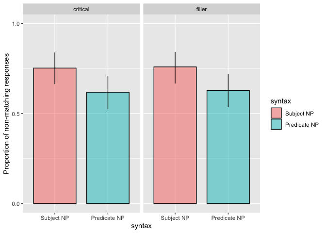

Double Modification Pilot 6
================
Polina Tsvilodub
6/24/2020

This pilot is a continuation of the double-modification pilot 5. Data
from n = 36 participants was collected. The experiment consists of two
blocks, each having a warm-up and a main phase.

First, participants see warm-up trials, wherein they first are shown
labeled instances of subordinate members from different basic
categories, which later appear as members of the context pictures; and
subsequently have to label other instances of same subordinate classes
themselves. Then, they see instances of features described by the second
noun presented in the critical sentences. For example, they see dogs
with prize bows on them and read: “These dogs are prize-winners. Notice
the bow on them.”. Then, they complete one comparison class paraphrase
warm-up trial.

In the main trials, participants complete 4 trials - two critical and
two ‘filler’ trials. On the critical trials, the *subordinate* directly
modified noun appears in the subject or in the predicate of the sentence
including a second feature-noun, e.g. “That big Great Dane is a
prize-winner” (Subject N) or “That prize-winner is a big Great Dane”
(predicate N). Critical sentences appear in a context where two of the
objects are instances of the same subordinate category as the target,
and two instances have the same additional feature (e.g. being a
prize-winner) as the target (the feature does not fully overlap with the
subordinate category). The filler trials are trials from CogSci
experiment 3: the sentences have only one, subordinate noun which
appears in the subject or in the predicate of the sentence. The context
includes two other subordinate members.

In one block, two distinct context are used, and the critical and the
filler trial use one of the possible targets each (i.e., if the critical
sentence describes the Great Dane in the dog context, the filler
sentence in the same block describes the pug in the dog context). The
trial types (critical vs filler), syntax (subject vs predicate N), and
size of the targets (big vs small) are balanced within-participant,
resulting in 8 unique trials (4 per block).

``` r
data <- read_csv("../../data/direct-modification/results_35_double-modXrefUt-pilot2.csv")
```

    ## Parsed with column specification:
    ## cols(
    ##   .default = col_character(),
    ##   trial_number = col_double(),
    ##   attempts = col_double(),
    ##   trials = col_double(),
    ##   RT = col_double(),
    ##   startTime = col_double(),
    ##   age = col_double(),
    ##   enjoyment = col_double(),
    ##   fairprice = col_double(),
    ##   experiment_id = col_double()
    ## )

    ## See spec(...) for full column specifications.

## Data Exclusion

One participant was excluded for not reporting their native language.
One is excluded for failing the comparison class warm-up trial, two are
excluded for failing labeling trials (mostly due to typos).

``` r
# exclude participants who report glitches
data %>% select(workerid, comments, problems) %>% distinct() %>% View()
d_modRef_woGlitches <- data 

# exclude non-native English speakers
d_modRef_woGlitches %>% distinct(languages) %>% View()

d_modRef_Native <- d_modRef_woGlitches %>% 
  filter(grepl("en", languages, ignore.case = T)) 

# cleaning warm-up trials
# comparison class paraphrase trial
d_failed_cc_warmup <- d_modRef_Native %>% 
  filter( trial_name == "comp_class_warmup") %>%
  group_by(workerid) %>% count() %>%
  filter( n > 4 )
d_failed_label_warmup <- d_modRef_Native %>%
  filter( (trial_name == "warmup1") | (trial_name == "warmup2")) %>%
  group_by(workerid) %>%
  filter(attempts > 4)
d_label_warmup_more1 <- d_modRef_Native %>%
  filter( (trial_name == "warmup1") | (trial_name == "warmup2")) %>%
  group_by(workerid) %>%
  filter(attempts > 1) %>% ungroup() %>% 
  select(workerid, picture1, response1, picture2, response2, attempts)

d_modRef_filter <- anti_join(d_modRef_Native, d_failed_cc_warmup, by = c("workerid"))
d_modRef_filter <- anti_join(d_modRef_filter, d_failed_label_warmup, by = c("workerid"))
```

``` r
d_modRef_filter %>% count(trial_type, syntax, target_size)
```

    ## # A tibble: 9 x 4
    ##   trial_type syntax target_size     n
    ##   <chr>      <chr>  <chr>       <int>
    ## 1 critical   pred   big            32
    ## 2 critical   pred   small          32
    ## 3 critical   subj   big            32
    ## 4 critical   subj   small          32
    ## 5 filler     pred   big            32
    ## 6 filler     pred   small          32
    ## 7 filler     subj   big            32
    ## 8 filler     subj   small          32
    ## 9 <NA>       <NA>   <NA>          190

## Response Classification

Data from n = 32 subjects is classified into responses *not matching*
the critical subordinate N (i.e. basic-level, superordinate or
feature-nouns) vs *matching* (i.e. subordinate) nouns. 6 (1 %) invalid
responses where participants fail to establish correct reference or
produce nonsense are excluded.

``` r
d_modRef_main <- d_modRef_filter %>% filter((trial_name == "custom_main_text1") |
                                (trial_name == "custom_main_text2")) %>%
  select(workerid, trial_number, context_picture, response, target_size, adj, syntax, target, item, adj_cond, trial_type )
```

``` r
d_modRef_main %>% distinct(response) %>% View()

d_modRef_valid <- d_modRef_main %>% 
  subset(., !(tolower(response) %in% c("height", "size", "height and weight", "distance", "wings", "width")))

d_modRef_main_responseCat <- d_modRef_valid %>% 
  mutate(response_cat = ifelse(
    tolower(response) %in% 
      c("flowers", "flower", "trees", "tree", "birds", "bird",  "dogs", "dog", "plants", "other trees", "animal", "other tree", "other birds", "nearby trees.", "animals", "gift flowers", "prize flowers", "prize dogs", "prize winning dogs", "rescue birds", "landmark", "gift", "prize winner", "rescues", "gifts", "prize-winners", "service-animals", "service dogs", "floral gifts", "service animals", "other landmarks", "prize winners"), 
    "nonmatch", "match"
  ),
  response_num = ifelse(response_cat == "nonmatch", 1, 0)
  )

# analysis of non-matching responses
d_modRef_main_responseCat_nonmatch <- d_modRef_main_responseCat %>%
  mutate(
    response_cat = ifelse(
      tolower(response) %in% 
        c("flowers", "flower", "trees", "tree", "birds", "bird",  "dogs", "dog", "plants", "other trees", "animal", "other tree", "other birds", "nearby trees.", "animals", "gift flowers", "prize flowers", "prize dogs", "prize winning dogs", "rescue birds", "service dogs"
          
        ), "basic",
      ifelse( tolower(response) %in% c("landmark", "gift", "prize winner", "rescues", "gifts", "prize-winners", "service-animals", "floral gifts", "service animals", "other landmarks", "prize winners"), "N2", "subordinate")
    )
  )
```

``` r
d_modRef_main_responseCat_nonmatch %>% count(response_cat, syntax, trial_type)
```

    ## # A tibble: 10 x 4
    ##    response_cat syntax trial_type     n
    ##    <chr>        <chr>  <chr>      <int>
    ##  1 basic        pred   critical      31
    ##  2 basic        pred   filler        36
    ##  3 basic        subj   critical      30
    ##  4 basic        subj   filler        47
    ##  5 N2           pred   critical       5
    ##  6 N2           subj   critical      15
    ##  7 subordinate  pred   critical      26
    ##  8 subordinate  pred   filler        26
    ##  9 subordinate  subj   critical      17
    ## 10 subordinate  subj   filler        15

``` r
d_modRef_main_responseCat_nonmatch %>%
  filter(trial_type == "critical") %>%
  ggplot(., aes(x = response_cat, fill = response_cat)) +
  geom_bar(alpha = 0.8) +
  facet_grid(~syntax) +
  ggtitle("Response category counts in critical trials")
```

<!-- -->

# Proportion of responses not matching critical N by-syntax and by-trial type

The proportion of responses which don’t match the critical subordinate
Ns is plotted against the syntax by-trial type.

### Pilot 6

    ## Warning: `as_data_frame()` is deprecated as of tibble 2.0.0.
    ## Please use `as_tibble()` instead.
    ## The signature and semantics have changed, see `?as_tibble`.
    ## This warning is displayed once every 8 hours.
    ## Call `lifecycle::last_warnings()` to see where this warning was generated.

    ## Warning: `cols` is now required when using unnest().
    ## Please use `cols = c(strap)`

<!-- -->
\#\#\# Pilot 5 + Pilot 6

``` r
df_resps_tidy_5_6 %>% 
  group_by(trial_type, syntax) %>%
  tidyboot_mean(column = response_num) -> df_resps_tidy_5_6.bs
```

    ## Warning: `cols` is now required when using unnest().
    ## Please use `cols = c(strap)`

``` r
df_resps_tidy_5_6.bs %>%
  ungroup() %>%
  mutate(syntax = factor(syntax, levels = c("subj", "pred"), 
                         labels = c("Subject NP", "Predicate NP"))) %>%
  ggplot(., aes(x=syntax, y = mean, ymin = ci_lower, ymax = ci_upper, fill=syntax)) +
  geom_col(position = position_dodge(bar.width), width = bar.width,
           alpha = 0.5, color="black", size = 0.5) +
  geom_linerange(position = position_dodge(bar.width), size = 0.5) +
  scale_y_continuous(limits = c(0, 1),
                     breaks = c(0, 0.5, 1))+
  ylab("Proportion of non-matching responses") +
  facet_grid(~trial_type)
```

<!-- -->

# Stats

### Pilot 6, critical trials

We fit a Bayesian regression model with maximal random effect structure
on the *critical trial data* (n = 31), predicting the response type
(non-matching vs. matching) by the syntax (subject vs predicate,
deviation-coded).

``` r
d_modRef_main_responseCat %>% 
  mutate(syntax_dev = factor(syntax, levels = c("subj", "pred"))) -> d_modRef_main_responseCat

contrasts(d_modRef_main_responseCat$syntax_dev) <- contr.sum(2)

d_modRef_main_responseCat_critical <- d_modRef_main_responseCat %>% filter(trial_type == "critical")

blm.critical <- brm(
  response_num ~ syntax_dev + (1 + syntax_dev | workerid) + (1 + syntax_dev | target),
  data = d_modRef_main_responseCat_critical,
  family = "bernoulli",
  cores = 4,
  control = list(adapt_delta = 0.9)
) 
```

    ## Compiling the C++ model

    ## Start sampling

``` r
summary(blm.critical)
```

    ##  Family: bernoulli 
    ##   Links: mu = logit 
    ## Formula: response_num ~ syntax_dev + (1 + syntax_dev | workerid) + (1 + syntax_dev | target) 
    ##    Data: d_modRef_main_responseCat_critical (Number of observations: 124) 
    ## Samples: 4 chains, each with iter = 2000; warmup = 1000; thin = 1;
    ##          total post-warmup samples = 4000
    ## 
    ## Group-Level Effects: 
    ## ~target (Number of levels: 10) 
    ##                            Estimate Est.Error l-95% CI u-95% CI Rhat Bulk_ESS
    ## sd(Intercept)                  0.75      0.53     0.04     2.04 1.00     1328
    ## sd(syntax_dev1)                0.67      0.53     0.02     1.98 1.01     1092
    ## cor(Intercept,syntax_dev1)     0.03      0.56    -0.94     0.94 1.00     2096
    ##                            Tail_ESS
    ## sd(Intercept)                  2007
    ## sd(syntax_dev1)                1914
    ## cor(Intercept,syntax_dev1)     2078
    ## 
    ## ~workerid (Number of levels: 31) 
    ##                            Estimate Est.Error l-95% CI u-95% CI Rhat Bulk_ESS
    ## sd(Intercept)                  2.52      0.83     1.26     4.45 1.01      688
    ## sd(syntax_dev1)                0.82      0.60     0.04     2.25 1.00      921
    ## cor(Intercept,syntax_dev1)     0.30      0.52    -0.86     0.98 1.00     1835
    ##                            Tail_ESS
    ## sd(Intercept)                  2020
    ## sd(syntax_dev1)                1885
    ## cor(Intercept,syntax_dev1)     2255
    ## 
    ## Population-Level Effects: 
    ##             Estimate Est.Error l-95% CI u-95% CI Rhat Bulk_ESS Tail_ESS
    ## Intercept       1.23      0.65     0.03     2.67 1.00     1539     2125
    ## syntax_dev1     0.75      0.49    -0.07     1.86 1.00     1563     1340
    ## 
    ## Samples were drawn using sampling(NUTS). For each parameter, Bulk_ESS
    ## and Tail_ESS are effective sample size measures, and Rhat is the potential
    ## scale reduction factor on split chains (at convergence, Rhat = 1).

### Pilot 5 + 6, critical trials

A Bayesian regression model on data from *critical trials collapsed
across pilot 5 and pilot 6* (n = 47), including a maximal random effect
structure:

``` r
df_resps_tidy_5_6 %>% 
  mutate(syntax_dev = factor(syntax, levels = c("subj", "pred"))) -> df_resps_tidy_5_6
contrasts(df_resps_tidy_5_6$syntax_dev) <- contr.sum(2)
df_resps_tidy_5_6_critical <- df_resps_tidy_5_6 %>% filter(trial_type == "critical")

blm.collapsed.critical <- brm(
  response_num ~ syntax_dev + (1 + syntax_dev | workerid) + (1 + syntax_dev | target),
  data = df_resps_tidy_5_6_critical,
  family = "bernoulli",
  cores = 4,
  control = list(adapt_delta = 0.95)
) 
```

    ## Compiling the C++ model

    ## recompiling to avoid crashing R session

    ## Start sampling

``` r
summary(blm.collapsed.critical)
```

    ##  Family: bernoulli 
    ##   Links: mu = logit 
    ## Formula: response_num ~ syntax_dev + (1 + syntax_dev | workerid) + (1 + syntax_dev | target) 
    ##    Data: df_resps_tidy_5_6_critical (Number of observations: 187) 
    ## Samples: 4 chains, each with iter = 2000; warmup = 1000; thin = 1;
    ##          total post-warmup samples = 4000
    ## 
    ## Group-Level Effects: 
    ## ~target (Number of levels: 10) 
    ##                            Estimate Est.Error l-95% CI u-95% CI Rhat Bulk_ESS
    ## sd(Intercept)                  0.43      0.34     0.02     1.29 1.00     1528
    ## sd(syntax_dev1)                0.62      0.47     0.02     1.77 1.00      766
    ## cor(Intercept,syntax_dev1)     0.16      0.57    -0.92     0.98 1.00     1491
    ##                            Tail_ESS
    ## sd(Intercept)                  1831
    ## sd(syntax_dev1)                1140
    ## cor(Intercept,syntax_dev1)     2156
    ## 
    ## ~workerid (Number of levels: 47) 
    ##                            Estimate Est.Error l-95% CI u-95% CI Rhat Bulk_ESS
    ## sd(Intercept)                  2.80      0.72     1.63     4.41 1.00      998
    ## sd(syntax_dev1)                0.65      0.50     0.03     1.90 1.00      746
    ## cor(Intercept,syntax_dev1)     0.31      0.55    -0.86     0.98 1.00     1907
    ##                            Tail_ESS
    ## sd(Intercept)                  1523
    ## sd(syntax_dev1)                1379
    ## cor(Intercept,syntax_dev1)     1852
    ## 
    ## Population-Level Effects: 
    ##             Estimate Est.Error l-95% CI u-95% CI Rhat Bulk_ESS Tail_ESS
    ## Intercept       1.59      0.57     0.56     2.75 1.00     1170     1735
    ## syntax_dev1     0.81      0.44     0.09     1.80 1.00     1402     1405
    ## 
    ## Samples were drawn using sampling(NUTS). For each parameter, Bulk_ESS
    ## and Tail_ESS are effective sample size measures, and Rhat is the potential
    ## scale reduction factor on split chains (at convergence, Rhat = 1).
