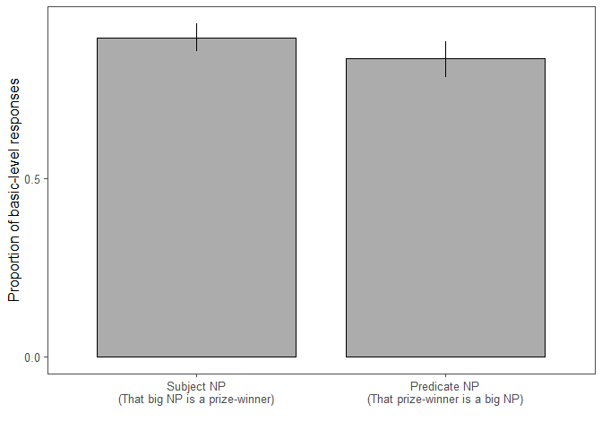
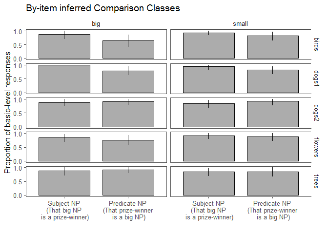

Modification Manipulation Pilots 1-3 Exploratory Analyses
================
Polina Tsvilodub
09 04 2020

For an exploratory analysis, the categorized data from all three noun
modification manipulation pilots is pooled.

``` r
bar.width = 0.8

all_pilots %>%
  group_by(syntax) %>%
  tidyboot_mean(column = response_num) -> all_pilots.bs


all_pilots.bs %>%
  ungroup() %>%
  mutate(syntax = factor(syntax, levels = c( "subject", "predicate"),
                            labels = c(  "Subject NP\n(That big NP is a prize-winner)", "Predicate NP\n(That prize-winner is a big NP)"))) %>%
  ggplot(., aes(x=syntax, y = mean, ymin = ci_lower, ymax = ci_upper)) +
  geom_col(position = position_dodge(bar.width), width = bar.width, color= 'black',
           alpha = 0.5, color = 'black', size = 0.5) +
  geom_linerange(position = position_dodge(bar.width), size = 0.5) +
  ggthemes::theme_few()+
  xlab("") +
  theme(legend.position = c(0.88, 0.84),
        legend.key.size = unit(0.5,"line"))+
  scale_y_continuous(breaks = c(0, 0.5, 1))+
  ylab("Proportion of basic-level responses")
```

    ## Warning: Duplicated aesthetics after name standardisation: colour

<!-- -->

``` r
all_pilots %>%  
  group_by(syntax, item, adj) %>%
  tidyboot_mean(column = response_num) -> all_pilots.bs.item


all_pilots.bs.item %>%
  ungroup() %>%
  mutate(syntax = factor(syntax, levels = c( "subject", "predicate"),
                            labels = c(  "Subject NP\n(That big NP\n is a prize-winner)", 
                                         "Predicate NP\n(That prize-winner\n is a big NP)")),
         size = factor(adj, level = c("big", "small"), labels = c("big", "small"))) %>%
  ggplot(., aes(x=syntax, y = mean, ymin = ci_lower, ymax = ci_upper)) +
  geom_col(position = position_dodge(bar.width), width = bar.width, color= 'black',
           alpha = 0.5, color = 'black', size = 0.5) +
  geom_linerange(position = position_dodge(bar.width), size = 0.5) +
  ggthemes::theme_few()+
  xlab("") +
  theme(legend.position = c(0.88, 0.84),#legend.text = element_text(size = 7),
        #legend.title = element_text(size = 7), 
        legend.key.size = unit(0.5,"line"))+
  scale_y_continuous(breaks = c(0, 0.5, 1))+
  ylab("Proportion of basic-level responses") +
  ggtitle("By-item inferred Comparison Classes")+
  facet_grid(item~size)
```

    ## Warning: Duplicated aesthetics after name standardisation: colour

<!-- -->
A Bayesian model with random by-item and by-subject intercepts and
random syntax slope-effects and fixed effects of syntax (deviation
coded) and experiment (dummy-coded):

``` r
all_pilots <- all_pilots %>%
  mutate(pilot_nr = factor(pilot_nr))

d.infer.full.brm <- brm(response_num ~ syntax_dev + pilot_nr + 
                          (1 + syntax_dev | submission_id ) + 
                          (1 + syntax_dev | target ),
                   data = all_pilots,
                   family = "bernoulli",
                   cores = 4,
                   control = list(adapt_delta = 0.99))
```

    ## Compiling the C++ model

    ## Start sampling

``` r
summary(d.infer.full.brm)
```

    ##  Family: bernoulli 
    ##   Links: mu = logit 
    ## Formula: response_num ~ syntax_dev + pilot_nr + (1 + syntax_dev | submission_id) + (1 + syntax_dev | target) 
    ##    Data: all_pilots (Number of observations: 446) 
    ## Samples: 4 chains, each with iter = 2000; warmup = 1000; thin = 1;
    ##          total post-warmup samples = 4000
    ## 
    ## Group-Level Effects: 
    ## ~submission_id (Number of levels: 92) 
    ##                           Estimate Est.Error l-95% CI u-95% CI Eff.Sample
    ## sd(Intercept)                 3.69      0.91     2.28     5.93        952
    ## sd(syntax_dev)                0.97      0.57     0.07     2.22        991
    ## cor(Intercept,syntax_dev)    -0.39      0.47    -0.97     0.70       2061
    ##                           Rhat
    ## sd(Intercept)             1.00
    ## sd(syntax_dev)            1.00
    ## cor(Intercept,syntax_dev) 1.00
    ## 
    ## ~target (Number of levels: 10) 
    ##                           Estimate Est.Error l-95% CI u-95% CI Eff.Sample
    ## sd(Intercept)                 0.41      0.34     0.01     1.25       2185
    ## sd(syntax_dev)                0.53      0.41     0.02     1.54       1894
    ## cor(Intercept,syntax_dev)    -0.03      0.57    -0.95     0.95       2682
    ##                           Rhat
    ## sd(Intercept)             1.00
    ## sd(syntax_dev)            1.00
    ## cor(Intercept,syntax_dev) 1.00
    ## 
    ## Population-Level Effects: 
    ##            Estimate Est.Error l-95% CI u-95% CI Eff.Sample Rhat
    ## Intercept      5.53      1.42     3.32     8.79       1277 1.00
    ## syntax_dev     0.12      0.60    -1.18     1.28       1831 1.00
    ## pilot_nr2     -0.32      1.43    -3.22     2.55       1784 1.00
    ## pilot_nr3     -2.22      1.37    -5.12     0.30       1573 1.00
    ## 
    ## Samples were drawn using sampling(NUTS). For each parameter, Eff.Sample 
    ## is a crude measure of effective sample size, and Rhat is the potential 
    ## scale reduction factor on split chains (at convergence, Rhat = 1).
