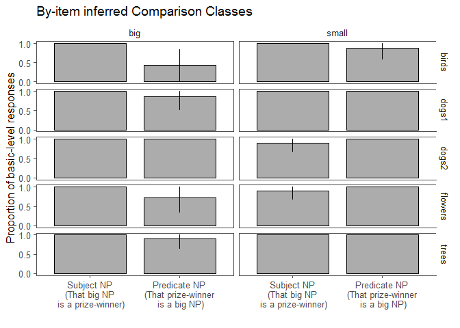
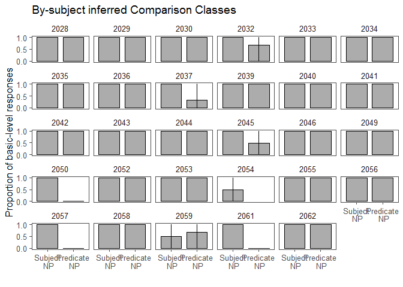

Modification Manipulation Pilot
================
Polina Tsvilodub
30 03 2020

We ran a pilot (n=36) for an NP modification manipulation experiment.
Here, we disentangle the effects of noun modification (direct vs
indirect) from the effect of the noun position (subject vs predicate) on
comparison class inference. Participants inferred the comparison class
(via free paraphrase) from the sentences ‘That {big, small} NP is a
prize-winner’ or ‘That prize-winner is a {small, big} NP’
(within-subject). We created nouns like ‘prize-winner’ for five context
items (trees, 2 x dogs, flowers, birds).

``` r
d_infer1_1 <- read_csv('../data/results_32_modification_manipulation_pilot.csv')
```

    ## Parsed with column specification:
    ## cols(
    ##   .default = col_character(),
    ##   submission_id = col_integer(),
    ##   experiment_id = col_integer(),
    ##   enjoyment = col_integer(),
    ##   trials = col_integer(),
    ##   age = col_integer(),
    ##   RT = col_integer(),
    ##   trial_number = col_integer(),
    ##   startTime = col_double(),
    ##   attempts = col_integer(),
    ##   fairprice = col_double()
    ## )

    ## See spec(...) for full column specifications.

7 participants were excluded for failing the warm-up tasks (1 test
comparison class inference trial and 5 labeling trials) or reporting a
native language other than English.

``` r
# exclude participants who report difficulties
d_infer1_1 %>% select(submission_id, comments, problems) %>% distinct() %>% View()

d_infer_woGlitches1 <- d_infer1_1 # %>% subset( !(submission_id %in% c()))

# exclude data from non-native English speakers and those where the language information is missing
d_infer_woGlitches1 %>% distinct(languages) %>% View()
d_infer_Native1 <- d_infer_woGlitches1 %>%
  filter(grepl("en", languages, ignore.case = T)) %>%
  select(submission_id, trial_name, trial_number, adj, item, target, response, botresponse,
         syntax, attempts, reference)

# participants who do not get the comparison class warmup right
d_infer_cc_warmup1 <- d_infer_Native1 %>% filter( trial_name == "comp_class_warmup") %>%
  group_by(submission_id) %>% count() %>%
  filter( n > 4 )

# exclude participants who need more than 4 attempts per warmup
d_infer_warmup1 <- d_infer_Native1 %>%
  filter( (trial_name == "warmup1") | (trial_name == "warmup2")) %>%
  group_by(submission_id) %>%
  filter(attempts > 4)

# excluding 6 participants
d_infer_filt1_1 <- anti_join(d_infer_Native1, d_infer_warmup1, by = c("submission_id"))
d_infer_filt1_1 <- anti_join(d_infer_filt1_1, d_infer_cc_warmup1, by = c("submission_id"))
```

``` r
d_infer_filt1_1 %>% count(syntax, adj)
```

    ## # A tibble: 5 x 3
    ##   syntax    adj       n
    ##   <chr>     <chr> <int>
    ## 1 predicate big      38
    ## 2 predicate small    34
    ## 3 subject   big      34
    ## 4 subject   small    39
    ## 5 <NA>      <NA>    285

The produced responses are categorized into basic-level and subordinate
responses. There were 11 invalid responses (mostly, they were blank
adjectives or referring to the human in the picture). Superordinate
responses are collapsed with basic-level responses.

``` r
d_infer_main1 <- d_infer_filt1_1 %>% filter((trial_name == "custom_main_text1")|
                                          (trial_name == "custom_main_text2")) %>%

  mutate(syntax = factor(syntax)
         ) %>%
  select(submission_id, trial_number, target, item, response, syntax,
        adj)

# categorize responses
d_infer_main1 %>% distinct(response) %>% View()
# exclude invalid responses
d_infer_valid1 <- d_infer_main1 %>% subset(., !(tolower(response) %in% c( "human", "small", "place", "man", "little", "winner", "yes", "swifts", "size"))) # 11 responses excluded
d_infer_main_responseCat1 <- d_infer_valid1 %>%
  rowwise() %>%
  mutate(  
    response_cat =
      ifelse( # do be extended dependent on responses provided
        tolower(response) %in% c("birds", "bird","dog", "dogs", "fish","flower", "flowers","trees", "tree", "other dogs", "other flowers", "plant", "plants", "animals", "flowers in the garden", "all the other trees", 
                                 "the other birds in the animal shelter", "all the other dogs at the dog park", "dogs at the dog show"), "basic", "subordinate"),

    response_num = ifelse(response_cat == "basic", 1, 0),
    response_label = "basic"
  )
```

## Subject vs. predicate NP position plot

The proportion of inferred basic-level comparison classes is plotted
by-syntax (subject vs. predicate) (n=29 participants).

``` r
# plot
bar.width = 0.8
d_infer_main_responseCat1 %>%  
  group_by(syntax) %>%
  tidyboot_mean(column = response_num) -> d_infer_main_responseCat.bs1
```

    ## Warning: Grouping rowwise data frame strips rowwise nature

``` r
d_infer_main_responseCat.bs1 %>%
  ungroup() %>%
  mutate(syntax = factor(syntax, levels = c( "subject", "predicate"),
                            labels = c(  "Subject NP\n(That big NP is a prize-winner)", "Predicate NP\n(That prize-winner is a big NP)"))) %>%
  ggplot(., aes(x=syntax, y = mean, ymin = ci_lower, ymax = ci_upper)) +
  geom_col(position = position_dodge(bar.width), width = bar.width, color= 'black',
           alpha = 0.5, color = 'black', size = 0.5) +
  geom_linerange(position = position_dodge(bar.width), size = 0.5) +
  ggthemes::theme_few()+
  xlab("") +
  theme(legend.position = c(0.88, 0.84),#legend.text = element_text(size = 7),
        #legend.title = element_text(size = 7), 
        legend.key.size = unit(0.5,"line"))+
  scale_y_continuous(breaks = c(0, 0.5, 1))+
  ylab("Proportion of basic-level responses")
```

    ## Warning: Duplicated aesthetics after name standardisation: colour

<!-- -->

``` r
 # ggtitle("Experiment 3: Comparison Class Inference")+
 # facet_grid(~context)  +
  #ggsave("figs/expt3-cc-inference.pdf", width = 7.5, height = 3.5)
```

## By-item plot

The overall effect is mainly driven by the big bird and flower items
(eagle and sunflower) and a bit by the big tree (redwood) and the small
bird (hummingbird) items.

``` r
d_infer_main_responseCat1 %>%  
  group_by(syntax, item, adj) %>%
  tidyboot_mean(column = response_num) -> d_infer_main_responseCat.bs.item1
```

    ## Warning: Grouping rowwise data frame strips rowwise nature

``` r
d_infer_main_responseCat.bs.item1 %>%
  ungroup() %>%
  mutate(syntax = factor(syntax, levels = c( "subject", "predicate"),
                            labels = c(  "Subject NP\n(That big NP\n is a prize-winner)", 
                                         "Predicate NP\n(That prize-winner\n is a big NP)")),
         size = factor(adj, level = c("big", "small"), labels = c("big", "small"))) %>%
  ggplot(., aes(x=syntax, y = mean, ymin = ci_lower, ymax = ci_upper)) +
  geom_col(position = position_dodge(bar.width), width = bar.width, color= 'black',
           alpha = 0.5, color = 'black', size = 0.5) +
  geom_linerange(position = position_dodge(bar.width), size = 0.5) +
  ggthemes::theme_few()+
  xlab("") +
  theme(legend.position = c(0.88, 0.84),#legend.text = element_text(size = 7),
        #legend.title = element_text(size = 7), 
        legend.key.size = unit(0.5,"line"))+
  scale_y_continuous(breaks = c(0, 0.5, 1))+
  ylab("Proportion of basic-level responses") +
  ggtitle("By-item inferred Comparison Classes")+
  facet_grid(item~size)
```

    ## Warning: Duplicated aesthetics after name standardisation: colour

<!-- -->

## By-subject plot

Participants seem to choose a strategy (mostly basic-level labels) and
to stick to it throughout the experiment, showing low flexibility in
adjusting the comparison class.

``` r
d_infer_main_responseCat1 %>%  
  group_by(syntax, submission_id) %>%
  tidyboot_mean(column = response_num) -> d_infer_main_responseCat.bs.subj1
```

    ## Warning: Grouping rowwise data frame strips rowwise nature

``` r
d_infer_main_responseCat.bs.subj1 %>%
  ungroup() %>%
  mutate(syntax = factor(syntax, levels = c( "subject", "predicate"),
                            labels = c(  "Subject\n NP", 
                                         "Predicate\n NP"))) %>%
  ggplot(., aes(x=syntax, y = mean, ymin = ci_lower, ymax = ci_upper)) +
  geom_col(position = position_dodge(bar.width), width = bar.width, color= 'black',
           alpha = 0.5, color = 'black', size = 0.5) +
  geom_linerange(position = position_dodge(bar.width), size = 0.5) +
  ggthemes::theme_few()+
  xlab("") +
  theme(legend.position = c(0.88, 0.84),#legend.text = element_text(size = 7),
        #legend.title = element_text(size = 7), 
        legend.key.size = unit(0.5,"line"))+
  scale_y_continuous(breaks = c(0, 0.5, 1))+
  ylab("Proportion of basic-level responses") +
  ggtitle("By-subject inferred Comparison Classes")+
  facet_wrap(~submission_id)
```

    ## Warning: Duplicated aesthetics after name standardisation: colour

<!-- -->

``` r
d_infer_main_responseCat1 %>% count( item, syntax)
```

    ## Warning: Grouping rowwise data frame strips rowwise nature

    ## # A tibble: 10 x 3
    ##    item    syntax        n
    ##    <chr>   <fct>     <int>
    ##  1 birds   predicate    15
    ##  2 birds   subject      12
    ##  3 dogs1   predicate    15
    ##  4 dogs1   subject      13
    ##  5 dogs2   predicate     8
    ##  6 dogs2   subject      18
    ##  7 flowers predicate     9
    ##  8 flowers subject      19
    ##  9 trees   predicate    18
    ## 10 trees   subject       7

``` r
#d_infer_main_responseCat %>% count(item)
```

## Stats

``` r
# deviation coded syntax 
d_infer_main_responseCat1 <- d_infer_main_responseCat1 %>%
  rowwise() %>%
  mutate(syntax_dev = ifelse(syntax == "subject", 1, -1))

d.infer.brm <- brm(response_num ~ syntax_dev + (1 + syntax_dev | submission_id ) + (1 + syntax_dev | target ),
                   data = d_infer_main_responseCat1,
                   family = "bernoulli",
                   cores = 4,
                   control = list(adapt_delta = 0.98))
```

    ## Compiling the C++ model

    ## Start sampling

``` r
summary(d.infer.brm)
```

    ##  Family: bernoulli 
    ##   Links: mu = logit 
    ## Formula: response_num ~ syntax_dev + (1 + syntax_dev | submission_id) + (1 + syntax_dev | target) 
    ##    Data: d_infer_main_responseCat1 (Number of observations: 134) 
    ## Samples: 4 chains, each with iter = 2000; warmup = 1000; thin = 1;
    ##          total post-warmup samples = 4000
    ## 
    ## Group-Level Effects: 
    ## ~submission_id (Number of levels: 29) 
    ##                           Estimate Est.Error l-95% CI u-95% CI Eff.Sample
    ## sd(Intercept)                 7.22      4.34     1.59    17.55        774
    ## sd(syntax_dev)                4.88      3.56     0.36    13.60        719
    ## cor(Intercept,syntax_dev)    -0.21      0.52    -0.97     0.82       1315
    ##                           Rhat
    ## sd(Intercept)             1.00
    ## sd(syntax_dev)            1.00
    ## cor(Intercept,syntax_dev) 1.00
    ## 
    ## ~target (Number of levels: 10) 
    ##                           Estimate Est.Error l-95% CI u-95% CI Eff.Sample
    ## sd(Intercept)                 2.44      2.39     0.09     8.45       1579
    ## sd(syntax_dev)                3.73      2.99     0.16    11.48       1305
    ## cor(Intercept,syntax_dev)    -0.10      0.58    -0.97     0.95       1276
    ##                           Rhat
    ## sd(Intercept)             1.00
    ## sd(syntax_dev)            1.00
    ## cor(Intercept,syntax_dev) 1.00
    ## 
    ## Population-Level Effects: 
    ##            Estimate Est.Error l-95% CI u-95% CI Eff.Sample Rhat
    ## Intercept     12.78      6.78     4.49    28.29        596 1.00
    ## syntax_dev     2.76      3.88    -4.19    11.89       1031 1.00
    ## 
    ## Samples were drawn using sampling(NUTS). For each parameter, Eff.Sample 
    ## is a crude measure of effective sample size, and Rhat is the potential 
    ## scale reduction factor on split chains (at convergence, Rhat = 1).
