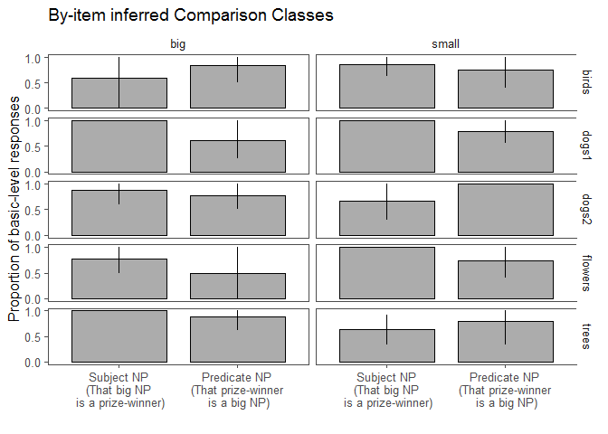
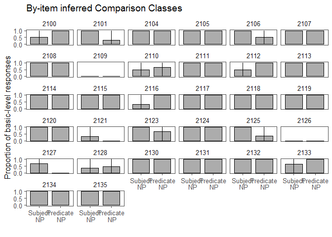

Modification Manipulation Pilot 3
================
Polina Tsvilodub
07 04 2020

We ran a third pilot (n=36) for the NP modification manipulation
experiment. In order to make the subordinate comparison class even more
salient than in the previous pilots, we create context pictures with
three subordinate representatives of the same category as the referent.
Due to this manipulation the referential utility of the subordinate NP
decreases which we expect to lead to more subordinate comparison class
inferences, driven by both the manipulated context and the NP. We still
expect an effect of syntax - more subordinate comparison classes should
be inferred from predicate than from subject NPs. The referent is
perceptually slightly bigger (smaller) than the other subordinate
members. One of the context-members is presented as the instance to be
labeled in the labeling warm-up trials - hence we make sure that
participants recognize them as members of the same subordinate category
as the target. The target is always described with the subordinate label
and hence its subordinate category is clear.

Participants inferred the comparison class (via free paraphrase) from
the sentences ‘That {big, small} NP is a prize-winner’ or ‘That
prize-winner is a {small, big} NP’ (within-subject). We created nouns
like ‘prize-winner’ for five context items (trees, 2 x dogs, flowers,
birds).

    ## -- Attaching packages ----------------------------------- tidyverse 1.2.1 --

    ## v ggplot2 3.1.0     v purrr   0.2.5
    ## v tibble  2.1.3     v dplyr   0.8.3
    ## v tidyr   0.8.2     v stringr 1.3.1
    ## v readr   1.1.1     v forcats 0.3.0

    ## Warning: package 'tibble' was built under R version 3.5.3

    ## Warning: package 'dplyr' was built under R version 3.5.3

    ## -- Conflicts -------------------------------------- tidyverse_conflicts() --
    ## x dplyr::filter() masks stats::filter()
    ## x dplyr::lag()    masks stats::lag()

    ## Warning: package 'tidyboot' was built under R version 3.5.3

    ## Warning: package 'brms' was built under R version 3.5.3

    ## Loading required package: Rcpp

    ## Warning: package 'Rcpp' was built under R version 3.5.3

    ## Loading 'brms' package (version 2.8.0). Useful instructions
    ## can be found by typing help('brms'). A more detailed introduction
    ## to the package is available through vignette('brms_overview').

    ## Loading required package: lme4

    ## Loading required package: Matrix

    ## 
    ## Attaching package: 'Matrix'

    ## The following object is masked from 'package:tidyr':
    ## 
    ##     expand

    ## 
    ## Attaching package: 'lme4'

    ## The following object is masked from 'package:brms':
    ## 
    ##     ngrps

    ## 
    ## Attaching package: 'lmerTest'

    ## The following object is masked from 'package:lme4':
    ## 
    ##     lmer

    ## The following object is masked from 'package:stats':
    ## 
    ##     step

    ## Parsed with column specification:
    ## cols(
    ##   .default = col_character(),
    ##   submission_id = col_integer(),
    ##   experiment_id = col_integer(),
    ##   enjoyment = col_integer(),
    ##   trials = col_integer(),
    ##   age = col_integer(),
    ##   RT = col_integer(),
    ##   trial_number = col_integer(),
    ##   startTime = col_double(),
    ##   attempts = col_integer(),
    ##   fairprice = col_double()
    ## )

    ## See spec(...) for full column specifications.

4 participants were excluded for failing the labeling warm-up task.

``` r
# exclude participants who report difficulties
d_infer1 %>% select(submission_id, comments, problems) %>% distinct() %>% View()

d_infer_woGlitches <- d_infer1 # %>% subset( !(submission_id %in% c()))

# exclude data from non-native English speakers and those where the language information is missing
d_infer_woGlitches %>% distinct(languages) %>% View()
d_infer_Native <- d_infer_woGlitches %>%
  filter(grepl("en", languages, ignore.case = T)) %>%
  select(submission_id, trial_name, trial_number, adj, item, target, response, botresponse,
         syntax, attempts, reference)

# participants who do not get the comparison class warmup right
d_infer_cc_warmup <- d_infer_Native %>% filter( trial_name == "comp_class_warmup") %>%
  group_by(submission_id) %>% count() %>%
  filter( n > 4 )

# exclude participants who need more than 4 attempts per warmup
d_infer_warmup <- d_infer_Native %>%
  filter( (trial_name == "warmup1") | (trial_name == "warmup2")) %>%
  group_by(submission_id) %>%
  filter(attempts > 4)

# excluding 6 participants
d_infer_filt1 <- anti_join(d_infer_Native, d_infer_warmup, by = c("submission_id"))
d_infer_filt1 <- anti_join(d_infer_filt1, d_infer_cc_warmup, by = c("submission_id"))
```

Participants need more labeling warm-up trials for the tree and dog
items (they correct their responses about 2 times), for both items it is
mostly for the big targets.

``` r
# labeling warm-up trial analysis

d_infer1 %>%
  filter((trial_name == "warmup1") | (trial_name == "warmup2")) -> d_infer_label_warmup
         
d_infer_label_warmup %>% group_by(submission_id, item, response1, response2) %>% count() %>%
  gather(key="responseNr", value="response", response1, response2) -> warmup.resps.counts.long
warmup.resps.counts.long %>% group_by(submission_id, item) %>% count(response) -> warmup.resps.counts.long.subs
warmup.resps.counts.long.subs %>% group_by(submission_id, item) %>%  count(item) %>% mutate(nr_super = n) %>% select(-n) -> warmup.resps.counts.long.supers
warmup.resps.counts.long.final <- warmup.resps.counts.long.subs %>%
  left_join(., warmup.resps.counts.long.supers)
```

    ## Joining, by = c("submission_id", "item")

``` r
warmup.resps.counts.long.final %>% group_by(item) %>% tidyboot_mean(column=nr_super) %>% select(-ci_lower, -ci_upper, - mean)
```

    ## # A tibble: 5 x 3
    ##   item        n empirical_stat
    ##   <chr>   <int>          <dbl>
    ## 1 birds      81           2.36
    ## 2 dogs1     106           3.13
    ## 3 dogs2     101           3   
    ## 4 flowers    90           2.64
    ## 5 trees     117           3.51

The numbers of size-syntax and item-syntax combinations are relatively
balanced.

``` r
d_infer_filt1 %>% count(syntax, adj)
```

    ## # A tibble: 5 x 3
    ##   syntax    adj       n
    ##   <chr>     <chr> <int>
    ## 1 predicate big      38
    ## 2 predicate small    41
    ## 3 subject   big      38
    ## 4 subject   small    43
    ## 5 <NA>      <NA>    300

There are no invalid responses. Superordinate responses are collapsed
with basic-level responses.

``` r
d_infer_main <- d_infer_filt1 %>% filter((trial_name == "custom_main_text1")|
                                          (trial_name == "custom_main_text2")) %>%

  mutate(syntax = factor(syntax)
         ) %>%
  select(submission_id, trial_number, target, item, response, syntax,
        adj)

# categorize responses
d_infer_main %>% distinct(response) %>% View()
# exclude invalid responses
d_infer_valid <- d_infer_main #%>% subset(., !(tolower(response) %in% c( "gifts", "landmarks", "service animals"))) # 3 responses excluded
d_infer_main_responseCat <- d_infer_valid %>%
  rowwise() %>%
  mutate(  
    response_cat =
      ifelse( # do be extended dependent on responses provided
        tolower(response) %in% c("birds", "bird","dog", "dogs", "fish","flower", "flowers","trees", "tree", "animals", "plants" 
                               ), "basic", "subordinate"),

    response_num = ifelse(response_cat == "basic", 1, 0),
    response_label = "basic"
  )
```

``` r
d_infer_main_responseCat %>% count( item, syntax)
```

    ## Warning: Grouping rowwise data frame strips rowwise nature

    ## # A tibble: 10 x 3
    ##    item    syntax        n
    ##    <chr>   <fct>     <int>
    ##  1 birds   predicate    14
    ##  2 birds   subject      18
    ##  3 dogs1   predicate    22
    ##  4 dogs1   subject      10
    ##  5 dogs2   predicate    15
    ##  6 dogs2   subject      17
    ##  7 flowers predicate    14
    ##  8 flowers subject      18
    ##  9 trees   predicate    14
    ## 10 trees   subject      18

``` r
#d_infer_main_responseCat %>% count(item)
```

``` r
d_infer_main_responseCat %>% count(item, adj, syntax)
```

    ## Warning: Grouping rowwise data frame strips rowwise nature

    ## # A tibble: 20 x 4
    ##    item    adj   syntax        n
    ##    <chr>   <chr> <fct>     <int>
    ##  1 birds   big   predicate     6
    ##  2 birds   big   subject       5
    ##  3 birds   small predicate     8
    ##  4 birds   small subject      13
    ##  5 dogs1   big   predicate     8
    ##  6 dogs1   big   subject       5
    ##  7 dogs1   small predicate    14
    ##  8 dogs1   small subject       5
    ##  9 dogs2   big   predicate     9
    ## 10 dogs2   big   subject       8
    ## 11 dogs2   small predicate     6
    ## 12 dogs2   small subject       9
    ## 13 flowers big   predicate     6
    ## 14 flowers big   subject      13
    ## 15 flowers small predicate     8
    ## 16 flowers small subject       5
    ## 17 trees   big   predicate     9
    ## 18 trees   big   subject       7
    ## 19 trees   small predicate     5
    ## 20 trees   small subject      11

## Subject vs. predicate NP position plot

The proportion of inferred basic-level comparison classes is plotted
by-syntax (subject vs. predicate) (n=32 participants). A very weak
effect of syntax is visible.

``` r
# plot
bar.width = 0.8
d_infer_main_responseCat %>%  
  group_by(syntax) %>%
  tidyboot_mean(column = response_num) -> d_infer_main_responseCat.bs
```

    ## Warning: Grouping rowwise data frame strips rowwise nature

``` r
d_infer_main_responseCat.bs %>%
  ungroup() %>%
  mutate(syntax = factor(syntax, levels = c( "subject", "predicate"),
                            labels = c(  "Subject NP\n(That big NP is a prize-winner)", "Predicate NP\n(That prize-winner is a big NP)"))) %>%
  ggplot(., aes(x=syntax, y = mean, ymin = ci_lower, ymax = ci_upper)) +
  geom_col(position = position_dodge(bar.width), width = bar.width, color= 'black',
           alpha = 0.5, color = 'black', size = 0.5) +
  geom_linerange(position = position_dodge(bar.width), size = 0.5) +
  ggthemes::theme_few()+
  xlab("") +
  theme(legend.position = c(0.88, 0.84),#legend.text = element_text(size = 7),
        #legend.title = element_text(size = 7), 
        legend.key.size = unit(0.5,"line"))+
  scale_y_continuous(breaks = c(0, 0.5, 1))+
  ylab("Proportion of basic-level responses")
```

    ## Warning: Duplicated aesthetics after name standardisation: colour

<!-- -->

## By-item plot

We achieve more flexibility of the single items compared to the previous
pilots. However, some items still elicit more subordinate comparison
classes in the subject then in the predicate position.

``` r
d_infer_main_responseCat %>%  
  group_by(syntax, item, adj) %>%
  tidyboot_mean(column = response_num) -> d_infer_main_responseCat.bs.item
```

    ## Warning: Grouping rowwise data frame strips rowwise nature

``` r
d_infer_main_responseCat.bs.item %>%
  ungroup() %>%
  mutate(syntax = factor(syntax, levels = c( "subject", "predicate"),
                            labels = c(  "Subject NP\n(That big NP\n is a prize-winner)", 
                                         "Predicate NP\n(That prize-winner\n is a big NP)")),
         size = factor(adj, level = c("big", "small"), labels = c("big", "small"))) %>%
  ggplot(., aes(x=syntax, y = mean, ymin = ci_lower, ymax = ci_upper)) +
  geom_col(position = position_dodge(bar.width), width = bar.width, color= 'black',
           alpha = 0.5, color = 'black', size = 0.5) +
  geom_linerange(position = position_dodge(bar.width), size = 0.5) +
  ggthemes::theme_few()+
  xlab("") +
  theme(legend.position = c(0.88, 0.84),#legend.text = element_text(size = 7),
        #legend.title = element_text(size = 7), 
        legend.key.size = unit(0.5,"line"))+
  scale_y_continuous(breaks = c(0, 0.5, 1))+
  ylab("Proportion of basic-level responses") +
  ggtitle("By-item inferred Comparison Classes")+
  facet_grid(item~size)
```

    ## Warning: Duplicated aesthetics after name standardisation: colour

<!-- -->

## By-subject plot

In this pilot more subjects provide subordinate responses compared to
previous pilots. However, the effect of syntax is not very salient, and
still many subjects stick to basic-level responses only.

``` r
d_infer_main_responseCat %>%  
  group_by(syntax, submission_id) %>%
  tidyboot_mean(column = response_num) -> d_infer_main_responseCat.bs.subj
```

    ## Warning: Grouping rowwise data frame strips rowwise nature

``` r
d_infer_main_responseCat.bs.subj %>%
  ungroup() %>%
  mutate(syntax = factor(syntax, levels = c( "subject", "predicate"),
                            labels = c(  "Subject\n NP", 
                                         "Predicate\n NP"))) %>%
  ggplot(., aes(x=syntax, y = mean, ymin = ci_lower, ymax = ci_upper)) +
  geom_col(position = position_dodge(bar.width), width = bar.width, color= 'black',
           alpha = 0.5, color = 'black', size = 0.5) +
  geom_linerange(position = position_dodge(bar.width), size = 0.5) +
  ggthemes::theme_few()+
  xlab("") +
  theme(legend.position = c(0.88, 0.84),#legend.text = element_text(size = 7),
        #legend.title = element_text(size = 7), 
        legend.key.size = unit(0.5,"line"))+
  scale_y_continuous(breaks = c(0, 0.5, 1))+
  ylab("Proportion of basic-level responses") +
  ggtitle("By-item inferred Comparison Classes")+
  facet_wrap(~submission_id)
```

    ## Warning: Duplicated aesthetics after name standardisation: colour

<!-- -->

## Stats

Bayesian stats with maximal random effects:

``` r
# deviation coding syntax
d_infer_main_responseCat <- d_infer_main_responseCat %>%
  rowwise() %>%
  mutate(syntax_dev = ifelse(syntax=="subject", 1, -1))

d.infer.brm.dev <- brm(response_num ~ syntax_dev + (1 + syntax_dev | submission_id ) + (1 + syntax_dev | target ),
                   data = d_infer_main_responseCat,
                   family = "bernoulli",
                   cores = 4,
                   control = list(adapt_delta = 0.95))
```

    ## Compiling the C++ model

    ## Start sampling

``` r
summary(d.infer.brm.dev)
```

    ##  Family: bernoulli 
    ##   Links: mu = logit 
    ## Formula: response_num ~ syntax_dev + (1 + syntax_dev | submission_id) + (1 + syntax_dev | target) 
    ##    Data: d_infer_main_responseCat (Number of observations: 160) 
    ## Samples: 4 chains, each with iter = 2000; warmup = 1000; thin = 1;
    ##          total post-warmup samples = 4000
    ## 
    ## Group-Level Effects: 
    ## ~submission_id (Number of levels: 32) 
    ##                           Estimate Est.Error l-95% CI u-95% CI Eff.Sample
    ## sd(Intercept)                 5.51      2.48     2.36    11.66        622
    ## sd(syntax_dev)                1.93      1.45     0.14     5.81        717
    ## cor(Intercept,syntax_dev)    -0.30      0.51    -0.97     0.78       2025
    ##                           Rhat
    ## sd(Intercept)             1.01
    ## sd(syntax_dev)            1.00
    ## cor(Intercept,syntax_dev) 1.00
    ## 
    ## ~target (Number of levels: 10) 
    ##                           Estimate Est.Error l-95% CI u-95% CI Eff.Sample
    ## sd(Intercept)                 1.11      0.98     0.05     3.74        844
    ## sd(syntax_dev)                1.28      1.14     0.04     4.25        702
    ## cor(Intercept,syntax_dev)     0.10      0.57    -0.93     0.96       1923
    ##                           Rhat
    ## sd(Intercept)             1.00
    ## sd(syntax_dev)            1.00
    ## cor(Intercept,syntax_dev) 1.00
    ## 
    ## Population-Level Effects: 
    ##            Estimate Est.Error l-95% CI u-95% CI Eff.Sample Rhat
    ## Intercept      4.75      2.14     1.83    10.20        602 1.01
    ## syntax_dev    -0.08      1.31    -3.04     2.41        932 1.00
    ## 
    ## Samples were drawn using sampling(NUTS). For each parameter, Eff.Sample 
    ## is a crude measure of effective sample size, and Rhat is the potential 
    ## scale reduction factor on split chains (at convergence, Rhat = 1).
