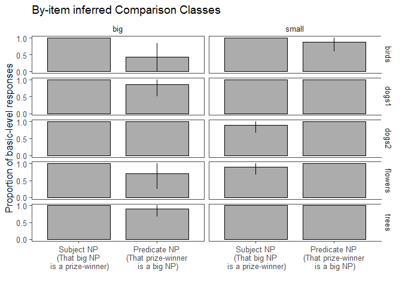

Modification Manipulation Pilot
================
Polina Tsvilodub
30 03 2020

We ran a pilot (n=36) for an NP modification manipulation experiment.
Here, we disentangle the effects of noun modification (direct vs
indirect) from the effect of the noun position (subject vs predicate) on
comparison class inference. Participants inferred the comparison class
(via free paraphrase) from the sentences ‘That {big, small} NP is a
prize-winner’ or ‘That prize-winner is a {small, big} NP’
(within-subject). We created nouns like ‘prize-winner’ for five context
items (trees, 2 x dogs, flowers, birds).

    ## -- Attaching packages --------------------------------------------------------------------------- tidyverse 1.2.1 --

    ## v ggplot2 3.1.0     v purrr   0.2.5
    ## v tibble  2.1.3     v dplyr   0.8.3
    ## v tidyr   0.8.2     v stringr 1.3.1
    ## v readr   1.1.1     v forcats 0.3.0

    ## Warning: package 'tibble' was built under R version 3.5.3

    ## Warning: package 'dplyr' was built under R version 3.5.3

    ## -- Conflicts ------------------------------------------------------------------------------ tidyverse_conflicts() --
    ## x dplyr::filter() masks stats::filter()
    ## x dplyr::lag()    masks stats::lag()

    ## Warning: package 'tidyboot' was built under R version 3.5.3

    ## Warning: package 'brms' was built under R version 3.5.3

    ## Loading required package: Rcpp

    ## Warning: package 'Rcpp' was built under R version 3.5.3

    ## Loading 'brms' package (version 2.8.0). Useful instructions
    ## can be found by typing help('brms'). A more detailed introduction
    ## to the package is available through vignette('brms_overview').

    ## Loading required package: lme4

    ## Loading required package: Matrix

    ## 
    ## Attaching package: 'Matrix'

    ## The following object is masked from 'package:tidyr':
    ## 
    ##     expand

    ## 
    ## Attaching package: 'lme4'

    ## The following object is masked from 'package:brms':
    ## 
    ##     ngrps

    ## 
    ## Attaching package: 'lmerTest'

    ## The following object is masked from 'package:lme4':
    ## 
    ##     lmer

    ## The following object is masked from 'package:stats':
    ## 
    ##     step

``` r
d_infer1 <- read_csv('../data/results_32_modification_manipulation_pilot.csv')
```

    ## Parsed with column specification:
    ## cols(
    ##   .default = col_character(),
    ##   submission_id = col_integer(),
    ##   experiment_id = col_integer(),
    ##   enjoyment = col_integer(),
    ##   trials = col_integer(),
    ##   age = col_integer(),
    ##   RT = col_integer(),
    ##   trial_number = col_integer(),
    ##   startTime = col_double(),
    ##   attempts = col_integer(),
    ##   fairprice = col_double()
    ## )

    ## See spec(...) for full column specifications.

7 participants were excluded for failing the warm-up tasks (1 test
comparison class inference trial and 5 labeling trials) or reporting a
native language other than English.

``` r
# exclude participants who report difficulties
d_infer1 %>% select(submission_id, comments, problems) %>% distinct() %>% View()

d_infer_woGlitches <- d_infer1 # %>% subset( !(submission_id %in% c()))

# exclude data from non-native English speakers and those where the language information is missing
d_infer_woGlitches %>% distinct(languages) %>% View()
d_infer_Native <- d_infer_woGlitches %>%
  filter(grepl("en", languages, ignore.case = T)) %>%
  select(submission_id, trial_name, trial_number, adj, item, target, response, botresponse,
         syntax, attempts, reference)

# participants who do not get the comparison class warmup right
d_infer_cc_warmup <- d_infer_Native %>% filter( trial_name == "comp_class_warmup") %>%
  group_by(submission_id) %>% count() %>%
  filter( n > 4 )

# exclude participants who need more than 4 attempts per warmup
d_infer_warmup <- d_infer_Native %>%
  filter( (trial_name == "warmup1") | (trial_name == "warmup2")) %>%
  group_by(submission_id) %>%
  filter(attempts > 4)

# excluding 6 participants
d_infer_filt1 <- anti_join(d_infer_Native, d_infer_warmup, by = c("submission_id"))
d_infer_filt1 <- anti_join(d_infer_filt1, d_infer_cc_warmup, by = c("submission_id"))
```

``` r
d_infer_filt1 %>% count(syntax, adj)
```

    ## # A tibble: 5 x 3
    ##   syntax    adj       n
    ##   <chr>     <chr> <int>
    ## 1 predicate big      38
    ## 2 predicate small    34
    ## 3 subject   big      34
    ## 4 subject   small    39
    ## 5 <NA>      <NA>    285

The produced responses are categorized into basic-level and subordinate
responses. There were 11 invalid responses (mostly, they were blank
adjectives or referring to the human in the picture). Superordinate
responses are collapsed with basic-level responses.

``` r
d_infer_main <- d_infer_filt1 %>% filter((trial_name == "custom_main_text1")|
                                          (trial_name == "custom_main_text2")) %>%

  mutate(syntax = factor(syntax)
         ) %>%
  select(submission_id, trial_number, target, item, response, syntax,
        adj)

# categorize responses
d_infer_main %>% distinct(response) %>% View()
# exclude invalid responses
d_infer_valid <- d_infer_main %>% subset(., !(tolower(response) %in% c( "human", "small", "place", "man", "little", "winner", "yes", "swifts", "size"))) # 11 responses excluded
d_infer_main_responseCat <- d_infer_valid %>%
  rowwise() %>%
  mutate(  
    response_cat =
      ifelse( # do be extended dependent on responses provided
        tolower(response) %in% c("birds", "bird","dog", "dogs", "fish","flower", "flowers","trees", "tree", "other dogs", "other flowers", "plant", "plants", "animals", "flowers in the garden", "all the other trees", 
                                 "the other birds in the animal shelter", "all the other dogs at the dog park", "dogs at the dog show"), "basic", "subordinate"),

    response_num = ifelse(response_cat == "basic", 1, 0),
    response_label = "basic"
  )
```

## Subject vs. predicate NP position plot

The proportion of inferred basic-level comparison classes is plotted
by-syntax (subject vs. predicate) (n=29 participants).

``` r
# plot
bar.width = 0.8
d_infer_main_responseCat %>%  
  group_by(syntax) %>%
  tidyboot_mean(column = response_num) -> d_infer_main_responseCat.bs
```

    ## Warning: Grouping rowwise data frame strips rowwise nature

``` r
d_infer_main_responseCat.bs %>%
  ungroup() %>%
  mutate(syntax = factor(syntax, levels = c( "subject", "predicate"),
                            labels = c(  "Subject NP\n(That big NP is a prize-winner)", "Predicate NP\n(That prize-winner is a big NP)"))) %>%
  ggplot(., aes(x=syntax, y = mean, ymin = ci_lower, ymax = ci_upper)) +
  geom_col(position = position_dodge(bar.width), width = bar.width, color= 'black',
           alpha = 0.5, color = 'black', size = 0.5) +
  geom_linerange(position = position_dodge(bar.width), size = 0.5) +
  ggthemes::theme_few()+
  xlab("") +
  theme(legend.position = c(0.88, 0.84),#legend.text = element_text(size = 7),
        #legend.title = element_text(size = 7), 
        legend.key.size = unit(0.5,"line"))+
  scale_y_continuous(breaks = c(0, 0.5, 1))+
  ylab("Proportion of basic-level responses")
```

    ## Warning: Duplicated aesthetics after name standardisation: colour

<!-- -->

``` r
 # ggtitle("Experiment 3: Comparison Class Inference")+
 # facet_grid(~context)  +
  #ggsave("figs/expt3-cc-inference.pdf", width = 7.5, height = 3.5)
```

## By-item plot

The overall effect is mainly driven by the big bird and flower items
(eagle and sunflower) and a bit by the big tree (redwood) and the small
bird (hummingbird) items.

``` r
d_infer_main_responseCat %>%  
  group_by(syntax, item, adj) %>%
  tidyboot_mean(column = response_num) -> d_infer_main_responseCat.bs.item
```

    ## Warning: Grouping rowwise data frame strips rowwise nature

``` r
d_infer_main_responseCat.bs.item %>%
  ungroup() %>%
  mutate(syntax = factor(syntax, levels = c( "subject", "predicate"),
                            labels = c(  "Subject NP\n(That big NP\n is a prize-winner)", 
                                         "Predicate NP\n(That prize-winner\n is a big NP)")),
         size = factor(adj, level = c("big", "small"), labels = c("big", "small"))) %>%
  ggplot(., aes(x=syntax, y = mean, ymin = ci_lower, ymax = ci_upper)) +
  geom_col(position = position_dodge(bar.width), width = bar.width, color= 'black',
           alpha = 0.5, color = 'black', size = 0.5) +
  geom_linerange(position = position_dodge(bar.width), size = 0.5) +
  ggthemes::theme_few()+
  xlab("") +
  theme(legend.position = c(0.88, 0.84),#legend.text = element_text(size = 7),
        #legend.title = element_text(size = 7), 
        legend.key.size = unit(0.5,"line"))+
  scale_y_continuous(breaks = c(0, 0.5, 1))+
  ylab("Proportion of basic-level responses") +
  ggtitle("By-item inferred Comparison Classes")+
  facet_grid(item~size)
```

    ## Warning: Duplicated aesthetics after name standardisation: colour

<!-- -->

``` r
d_infer_main_responseCat %>% count( item, syntax)
```

    ## Warning: Grouping rowwise data frame strips rowwise nature

    ## # A tibble: 10 x 3
    ##    item    syntax        n
    ##    <chr>   <fct>     <int>
    ##  1 birds   predicate    15
    ##  2 birds   subject      12
    ##  3 dogs1   predicate    15
    ##  4 dogs1   subject      13
    ##  5 dogs2   predicate     8
    ##  6 dogs2   subject      18
    ##  7 flowers predicate     9
    ##  8 flowers subject      19
    ##  9 trees   predicate    18
    ## 10 trees   subject       7

``` r
#d_infer_main_responseCat %>% count(item)
```

## Stats

Including random by-participant intercepts, we get a significant effect
of syntax (dummy-coded) (p=0.04).

``` r
# a simple model

d.infer.glm <- glmer(response_num ~ syntax + (1 | submission_id), # + (0 + syntax || item), 
                     data = d_infer_main_responseCat,
                     family = 'binomial')
summary(d.infer.glm)
```

    ## Generalized linear mixed model fit by maximum likelihood (Laplace
    ##   Approximation) [glmerMod]
    ##  Family: binomial  ( logit )
    ## Formula: response_num ~ syntax + (1 | submission_id)
    ##    Data: d_infer_main_responseCat
    ## 
    ##      AIC      BIC   logLik deviance df.resid 
    ##     72.0     80.7    -33.0     66.0      131 
    ## 
    ## Scaled residuals: 
    ##     Min      1Q  Median      3Q     Max 
    ## -4.6609  0.0116  0.0595  0.0618  1.1401 
    ## 
    ## Random effects:
    ##  Groups        Name        Variance Std.Dev.
    ##  submission_id (Intercept) 25.97    5.096   
    ## Number of obs: 134, groups:  submission_id, 29
    ## 
    ## Fixed effects:
    ##               Estimate Std. Error z value Pr(>|z|)  
    ## (Intercept)      5.360      3.135   1.710   0.0873 .
    ## syntaxsubject    3.341      1.661   2.011   0.0444 *
    ## ---
    ## Signif. codes:  0 '***' 0.001 '**' 0.01 '*' 0.05 '.' 0.1 ' ' 1
    ## 
    ## Correlation of Fixed Effects:
    ##             (Intr)
    ## syntaxsbjct 0.625
