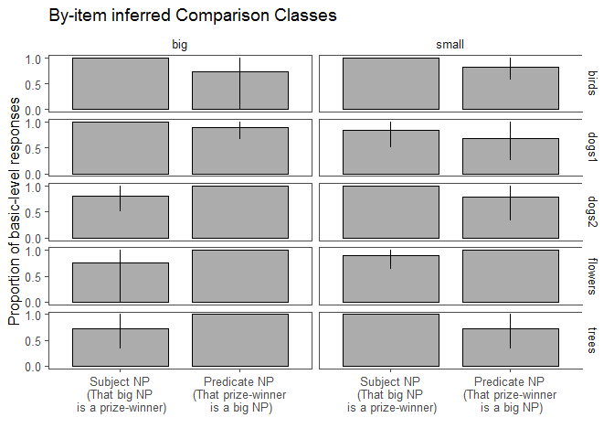
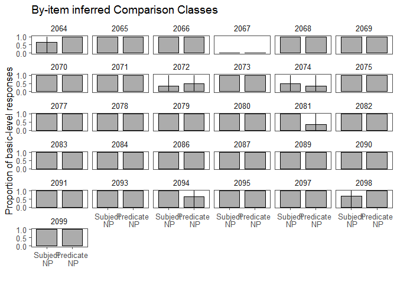

Modification Manipulation Pilot 2
================
Polina Tsvilodub
03 04 2020

We ran a second pilot (n=36) for the NP modification manipulation
experiment. In contrast to the previous pilot, we push the perceptual
set-up of the experiment more towards the subordinate comparison class:
the target referent is perceptually slightly bigger (smaller) than the
other member of the same subordinate category in the context, thus
making the subordinate comparison class potentially more felicitous than
the basic-level comparison class. Additionally, these context-members
are presented as the instances to be labelled in the labeling warm-up
trials - hence we make sure that participants recognize them as members
of the same subordinate category as the target. The target is always
described with the subordinate label and hence its subordinate category
is clear.

Participants inferred the comparison class (via free paraphrase) from
the sentences ‘That {big, small} NP is a prize-winner’ or ‘That
prize-winner is a {small, big} NP’ (within-subject). We created nouns
like ‘prize-winner’ for five context items (trees, 2 x dogs, flowers,
birds).

    ## -- Attaching packages ----------------------------------- tidyverse 1.2.1 --

    ## v ggplot2 3.1.0     v purrr   0.2.5
    ## v tibble  2.1.3     v dplyr   0.8.3
    ## v tidyr   0.8.2     v stringr 1.3.1
    ## v readr   1.1.1     v forcats 0.3.0

    ## Warning: package 'tibble' was built under R version 3.5.3

    ## Warning: package 'dplyr' was built under R version 3.5.3

    ## -- Conflicts -------------------------------------- tidyverse_conflicts() --
    ## x dplyr::filter() masks stats::filter()
    ## x dplyr::lag()    masks stats::lag()

    ## Warning: package 'tidyboot' was built under R version 3.5.3

    ## Warning: package 'brms' was built under R version 3.5.3

    ## Loading required package: Rcpp

    ## Warning: package 'Rcpp' was built under R version 3.5.3

    ## Loading 'brms' package (version 2.8.0). Useful instructions
    ## can be found by typing help('brms'). A more detailed introduction
    ## to the package is available through vignette('brms_overview').

    ## Loading required package: lme4

    ## Loading required package: Matrix

    ## 
    ## Attaching package: 'Matrix'

    ## The following object is masked from 'package:tidyr':
    ## 
    ##     expand

    ## 
    ## Attaching package: 'lme4'

    ## The following object is masked from 'package:brms':
    ## 
    ##     ngrps

    ## 
    ## Attaching package: 'lmerTest'

    ## The following object is masked from 'package:lme4':
    ## 
    ##     lmer

    ## The following object is masked from 'package:stats':
    ## 
    ##     step

``` r
#d_infer <- read_csv('../data/results_32_modification-manipulation-pilot3.csv')
#d_infer1 <- d_infer %>% subset( select = -c(worker_id, hit_id, assignment_id, startDate))
#write_csv(d_infer1, '../data/results_32_modification_manipulation_pilot3.csv')

d_infer1 <- read_csv('../data/results_32_modification_manipulation_pilot2.csv')
```

    ## Parsed with column specification:
    ## cols(
    ##   .default = col_character(),
    ##   submission_id = col_integer(),
    ##   experiment_id = col_integer(),
    ##   enjoyment = col_integer(),
    ##   trials = col_integer(),
    ##   age = col_integer(),
    ##   RT = col_integer(),
    ##   trial_number = col_integer(),
    ##   startTime = col_double(),
    ##   attempts = col_integer(),
    ##   fairprice = col_double()
    ## )

    ## See spec(...) for full column specifications.

5 participants were excluded for failing the warm-up task ( n=3 for the
labeling trials) or reporting a native language other than English
(n=2).

``` r
# exclude participants who report difficulties
d_infer1 %>% select(submission_id, comments, problems) %>% distinct() %>% View()

d_infer_woGlitches <- d_infer1 # %>% subset( !(submission_id %in% c()))

# exclude data from non-native English speakers and those where the language information is missing
d_infer_woGlitches %>% distinct(languages) %>% View()
d_infer_Native <- d_infer_woGlitches %>%
  filter(grepl("en", languages, ignore.case = T)) %>%
  select(submission_id, trial_name, trial_number, adj, item, target, response, botresponse,
         syntax, attempts, reference)

# participants who do not get the comparison class warmup right
d_infer_cc_warmup <- d_infer_Native %>% filter( trial_name == "comp_class_warmup") %>%
  group_by(submission_id) %>% count() %>%
  filter( n > 4 )

# exclude participants who need more than 4 attempts per warmup
d_infer_warmup <- d_infer_Native %>%
  filter( (trial_name == "warmup1") | (trial_name == "warmup2")) %>%
  group_by(submission_id) %>%
  filter(attempts > 4)

# excluding 6 participants
d_infer_filt1 <- anti_join(d_infer_Native, d_infer_warmup, by = c("submission_id"))
d_infer_filt1 <- anti_join(d_infer_filt1, d_infer_cc_warmup, by = c("submission_id"))
```

The numbers of size-syntax and item-syntax combinations are relatively
balanced.

``` r
d_infer_filt1 %>% count(syntax, adj)
```

    ## # A tibble: 5 x 3
    ##   syntax    adj       n
    ##   <chr>     <chr> <int>
    ## 1 predicate big      38
    ## 2 predicate small    38
    ## 3 subject   big      36
    ## 4 subject   small    43
    ## 5 <NA>      <NA>    283

The produced responses are categorized into basic-level and subordinate
responses. There were 3 invalid responses (the participants failed to
establish reference and produced the other noun as the comparison
class). Superordinate responses are collapsed with basic-level
responses.

``` r
d_infer_main <- d_infer_filt1 %>% filter((trial_name == "custom_main_text1")|
                                          (trial_name == "custom_main_text2")) %>%

  mutate(syntax = factor(syntax)
         ) %>%
  select(submission_id, trial_number, target, item, response, syntax,
        adj)

# categorize responses
d_infer_main %>% distinct(response) %>% View()
# exclude invalid responses
d_infer_valid <- d_infer_main %>% subset(., !(tolower(response) %in% c( "gifts", "landmarks", "service animals"))) # 3 responses excluded
d_infer_main_responseCat <- d_infer_valid %>%
  rowwise() %>%
  mutate(  
    response_cat =
      ifelse( # do be extended dependent on responses provided
        tolower(response) %in% c("birds", "bird","dog", "dogs", "fish","flower", "flowers","trees", "tree", "big dogs", "other dogs", "animals", "plants","flowerrs", "tres"
                               ), "basic", "subordinate"),

    response_num = ifelse(response_cat == "basic", 1, 0),
    response_label = "basic"
  )
```

``` r
d_infer_main_responseCat %>% count( item, syntax)
```

    ## Warning: Grouping rowwise data frame strips rowwise nature

    ## # A tibble: 10 x 3
    ##    item    syntax        n
    ##    <chr>   <fct>     <int>
    ##  1 birds   predicate    15
    ##  2 birds   subject      16
    ##  3 dogs1   predicate    16
    ##  4 dogs1   subject      14
    ##  5 dogs2   predicate    15
    ##  6 dogs2   subject      16
    ##  7 flowers predicate    16
    ##  8 flowers subject      14
    ##  9 trees   predicate    12
    ## 10 trees   subject      18

``` r
#d_infer_main_responseCat %>% count(item)
```

``` r
d_infer_main_responseCat %>% count(item, adj, syntax)
```

    ## Warning: Grouping rowwise data frame strips rowwise nature

    ## # A tibble: 20 x 4
    ##    item    adj   syntax        n
    ##    <chr>   <chr> <fct>     <int>
    ##  1 birds   big   predicate     4
    ##  2 birds   big   subject       5
    ##  3 birds   small predicate    11
    ##  4 birds   small subject      11
    ##  5 dogs1   big   predicate    10
    ##  6 dogs1   big   subject       8
    ##  7 dogs1   small predicate     6
    ##  8 dogs1   small subject       6
    ##  9 dogs2   big   predicate    10
    ## 10 dogs2   big   subject      10
    ## 11 dogs2   small predicate     5
    ## 12 dogs2   small subject       6
    ## 13 flowers big   predicate     8
    ## 14 flowers big   subject       4
    ## 15 flowers small predicate     8
    ## 16 flowers small subject      10
    ## 17 trees   big   predicate     5
    ## 18 trees   big   subject       8
    ## 19 trees   small predicate     7
    ## 20 trees   small subject      10

## Subject vs. predicate NP position plot

The proportion of inferred basic-level comparison classes is plotted
by-syntax (subject vs. predicate) (n=31 participants). there seems to be
no effect of syntax.

``` r
# plot
bar.width = 0.8
d_infer_main_responseCat %>%  
  group_by(syntax) %>%
  tidyboot_mean(column = response_num) -> d_infer_main_responseCat.bs
```

    ## Warning: Grouping rowwise data frame strips rowwise nature

``` r
d_infer_main_responseCat.bs %>%
  ungroup() %>%
  mutate(syntax = factor(syntax, levels = c( "subject", "predicate"),
                            labels = c(  "Subject NP\n(That big NP is a prize-winner)", "Predicate NP\n(That prize-winner is a big NP)"))) %>%
  ggplot(., aes(x=syntax, y = mean, ymin = ci_lower, ymax = ci_upper)) +
  geom_col(position = position_dodge(bar.width), width = bar.width, color= 'black',
           alpha = 0.5, color = 'black', size = 0.5) +
  geom_linerange(position = position_dodge(bar.width), size = 0.5) +
  ggthemes::theme_few()+
  xlab("") +
  theme(legend.position = c(0.88, 0.84),#legend.text = element_text(size = 7),
        #legend.title = element_text(size = 7), 
        legend.key.size = unit(0.5,"line"))+
  scale_y_continuous(breaks = c(0, 0.5, 1))+
  ylab("Proportion of basic-level responses")
```

    ## Warning: Duplicated aesthetics after name standardisation: colour

<!-- -->

``` r
 # ggtitle("Experiment 3: Comparison Class Inference")+
 # facet_grid(~context)  +
  #ggsave("figs/expt3-cc-inference.pdf", width = 7.5, height = 3.5)
```

## By-item plot

We achieve more flexibility of the single items compared to the previous
design. However, some items elicit more subordinate comparison classes
in the subject then in the predicate position. Whereas the dog-item
(dogs2, including the great dane) might show this behavior because it
might be not very salient, the big tree item (redwood) and the big
flower item (sunflower) showed the predicted behavior in the previous
experiment, but not in this one.

``` r
d_infer_main_responseCat %>%  
  group_by(syntax, item, adj) %>%
  tidyboot_mean(column = response_num) -> d_infer_main_responseCat.bs.item
```

    ## Warning: Grouping rowwise data frame strips rowwise nature

``` r
d_infer_main_responseCat.bs.item %>%
  ungroup() %>%
  mutate(syntax = factor(syntax, levels = c( "subject", "predicate"),
                            labels = c(  "Subject NP\n(That big NP\n is a prize-winner)", 
                                         "Predicate NP\n(That prize-winner\n is a big NP)")),
         size = factor(adj, level = c("big", "small"), labels = c("big", "small"))) %>%
  ggplot(., aes(x=syntax, y = mean, ymin = ci_lower, ymax = ci_upper)) +
  geom_col(position = position_dodge(bar.width), width = bar.width, color= 'black',
           alpha = 0.5, color = 'black', size = 0.5) +
  geom_linerange(position = position_dodge(bar.width), size = 0.5) +
  ggthemes::theme_few()+
  xlab("") +
  theme(legend.position = c(0.88, 0.84),#legend.text = element_text(size = 7),
        #legend.title = element_text(size = 7), 
        legend.key.size = unit(0.5,"line"))+
  scale_y_continuous(breaks = c(0, 0.5, 1))+
  ylab("Proportion of basic-level responses") +
  ggtitle("By-item inferred Comparison Classes")+
  facet_grid(item~size)
```

    ## Warning: Duplicated aesthetics after name standardisation: colour

<!-- -->

## By-subject plot

Participants seem to choose a strategy (mostly basic-level labels) and
to stick to it throughout the experiment, showing low flexibility in
adjusting the comparison class.

``` r
d_infer_main_responseCat %>%  
  group_by(syntax, submission_id) %>%
  tidyboot_mean(column = response_num) -> d_infer_main_responseCat.bs.subj
```

    ## Warning: Grouping rowwise data frame strips rowwise nature

``` r
d_infer_main_responseCat.bs.subj %>%
  ungroup() %>%
  mutate(syntax = factor(syntax, levels = c( "subject", "predicate"),
                            labels = c(  "Subject\n NP", 
                                         "Predicate\n NP"))) %>%
  ggplot(., aes(x=syntax, y = mean, ymin = ci_lower, ymax = ci_upper)) +
  geom_col(position = position_dodge(bar.width), width = bar.width, color= 'black',
           alpha = 0.5, color = 'black', size = 0.5) +
  geom_linerange(position = position_dodge(bar.width), size = 0.5) +
  ggthemes::theme_few()+
  xlab("") +
  theme(legend.position = c(0.88, 0.84),#legend.text = element_text(size = 7),
        #legend.title = element_text(size = 7), 
        legend.key.size = unit(0.5,"line"))+
  scale_y_continuous(breaks = c(0, 0.5, 1))+
  ylab("Proportion of basic-level responses") +
  ggtitle("By-item inferred Comparison Classes")+
  facet_wrap(~submission_id)
```

    ## Warning: Duplicated aesthetics after name standardisation: colour

<!-- -->

## Stats

Bayesian stats with maximal random effects: Whereas visually we observe
no effect of syntax, the Bayesian model with maximal random effects
shows a tendency towards the predicted effect.

``` r
d.infer.brm <- brm(response_num ~ syntax + (1 + syntax | submission_id ) + (1 + syntax | target ),
                   data = d_infer_main_responseCat,
                   family = "bernoulli",
                   cores = 4,
                   control = list(adapt_delta = 0.95))
```

    ## Compiling the C++ model

    ## Start sampling

``` r
summary(d.infer.brm)
```

    ##  Family: bernoulli 
    ##   Links: mu = logit 
    ## Formula: response_num ~ syntax + (1 + syntax | submission_id) + (1 + syntax | target) 
    ##    Data: d_infer_main_responseCat (Number of observations: 152) 
    ## Samples: 4 chains, each with iter = 2000; warmup = 1000; thin = 1;
    ##          total post-warmup samples = 4000
    ## 
    ## Group-Level Effects: 
    ## ~submission_id (Number of levels: 31) 
    ##                              Estimate Est.Error l-95% CI u-95% CI
    ## sd(Intercept)                    8.74      4.75     2.74    21.20
    ## sd(syntaxsubject)                6.49      5.45     0.28    21.46
    ## cor(Intercept,syntaxsubject)     0.22      0.54    -0.89     0.97
    ##                              Eff.Sample Rhat
    ## sd(Intercept)                      1176 1.00
    ## sd(syntaxsubject)                  1332 1.00
    ## cor(Intercept,syntaxsubject)       2838 1.00
    ## 
    ## ~target (Number of levels: 10) 
    ##                              Estimate Est.Error l-95% CI u-95% CI
    ## sd(Intercept)                    2.85      2.58     0.08     9.86
    ## sd(syntaxsubject)                6.98      4.97     0.56    19.53
    ## cor(Intercept,syntaxsubject)    -0.23      0.53    -0.96     0.87
    ##                              Eff.Sample Rhat
    ## sd(Intercept)                      1012 1.00
    ## sd(syntaxsubject)                  1318 1.00
    ## cor(Intercept,syntaxsubject)       1301 1.00
    ## 
    ## Population-Level Effects: 
    ##               Estimate Est.Error l-95% CI u-95% CI Eff.Sample Rhat
    ## Intercept        10.46      5.69     3.46    25.80       1201 1.00
    ## syntaxsubject     5.50      7.63    -5.70    25.49       1651 1.00
    ## 
    ## Samples were drawn using sampling(NUTS). For each parameter, Eff.Sample 
    ## is a crude measure of effective sample size, and Rhat is the potential 
    ## scale reduction factor on split chains (at convergence, Rhat = 1).
