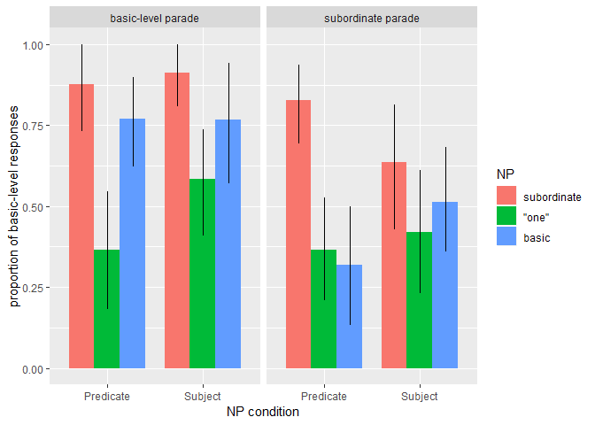
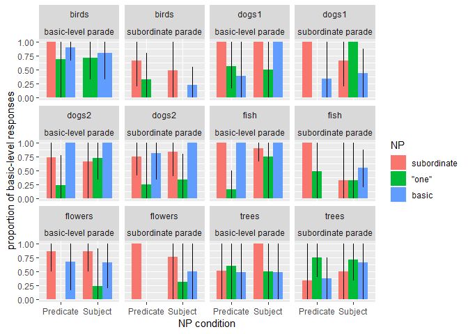
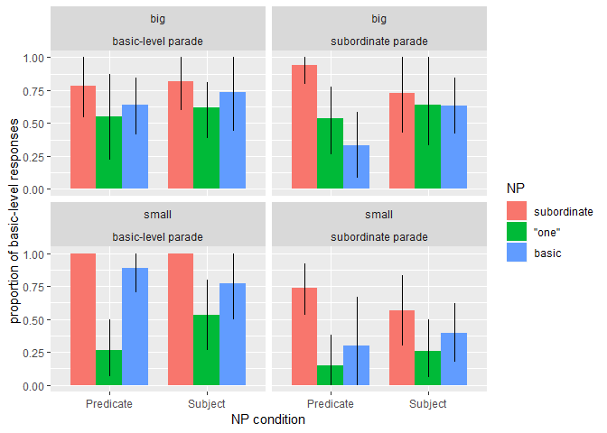

Comparison Class Inference Novel context pilot
================
Polina Tsvilodub
10 10 2019

    ## -- Attaching packages --------------------------------------------------------------------------------------------------- tidyverse 1.2.1 --

    ## v ggplot2 3.1.0     v purrr   0.2.5
    ## v tibble  1.4.2     v dplyr   0.7.7
    ## v tidyr   0.8.2     v stringr 1.3.1
    ## v readr   1.1.1     v forcats 0.3.0

    ## -- Conflicts ------------------------------------------------------------------------------------------------------ tidyverse_conflicts() --
    ## x dplyr::filter() masks stats::filter()
    ## x dplyr::lag()    masks stats::lag()

    ## Warning: package 'tidyboot' was built under R version 3.5.3

    ## Loading required package: lme4

    ## Loading required package: Matrix

    ## 
    ## Attaching package: 'Matrix'

    ## The following object is masked from 'package:tidyr':
    ## 
    ##     expand

    ## 
    ## Attaching package: 'lmerTest'

    ## The following object is masked from 'package:lme4':
    ## 
    ##     lmer

    ## The following object is masked from 'package:stats':
    ## 
    ##     step

## Outline

In this pilot, in contrast to the previous comparison class inference
free production experiment we only have congruent conditions.
Furthermore, we included an third noun phrase condition (basic-level
NP), to be more consistent with the other experiments. We now mention
the subordinate category of the target referent in the context setup to
provide the necessary information for the basic-level NP condition. An
example trial would look like this: The first sentence is “You and your
friend see the following:”, Then a context picture is presented. Below,
the sentence “You and your friend see another great dane ( not pictured
) and your friend says:” appears. The critical sentence could be “That
is a big great dane.” 30 participants (15 per syntactic condition) were
recruited, no data points were excluded.

**Between-subjects:** syntactic condition (subject NP vs predicate NP)
**Within-subjects:** Noun Phrase (‘one’ vs subordinate level vs
basic-level label), context picture (basic-level vs subordinate parade)
**Expectation:** Basic - level context: In the basic-level NP condition,
we expect similarly high basic response proportions in both conditions.
In the subordinate NP condition (critical condition), we expect an
effect of syntax: less basic responses in the predicate NP than in the
subject NP condition. In the ‘one’ condition we also expect similarly
high basic response proportions across syntactic conditions. Subordinate
context: We might expect more basic responses in the basic Np condition
than in the other two. We expect similarly high subordinate response
proportions in the ‘one’ condition across syntactic conditions. In the
subordinate NP condition, we might expect a smaller syntax effect than
in the basic context condition and an overall small basic response
proportion.

## Results

Including the subordinate label of the persumable target in the context
setup seems to have an effect on the inferences in an unexpected way.

1.  Basic-level context: In the underspecified noun phrase condition
    (‘one’), the reference of the NP is interpreted to be the
    subordinate category. We see an effect of the syntactic condition:
    there are less basic-level responses in the predicate NP condition
    than in the subject NP condition.
2.  In the subordinate noun phrase condition, we do not see any syntax
    effect, around 90% of responses are basic-level. This seems to
    indicate that both the predicate and the subject NP are interpreted
    referentially, to distinguish the target from the basic-level
    context.
3.  In the basic-level noun phrase condition, we see an overall lower
    proportion of basic-level responses than in the subordinate
    condition. There seems to be a tendency towards less basic-level
    responses in the predicate condition. However, there is a big
    variance, given the small sample size.
4.  Subordinate context: the results look very similar to the basic
    level condition, just with a lower overall basic response
    proportion. There might be a tendency to syntax sensitivity in the
    subordinate NP context, but the errors are very big. We see a
    surprisingly high basic response proportion in the subordinate NP
    condition.

<!-- end list -->

``` r
d1_infer <- read_csv("./../data/results_12_comp-class-infer-pred_congr.csv")
```

    ## Parsed with column specification:
    ## cols(
    ##   .default = col_character(),
    ##   submission_id = col_integer(),
    ##   experiment_id = col_integer(),
    ##   enjoyment = col_integer(),
    ##   trials = col_integer(),
    ##   pic_spec = col_integer(),
    ##   age = col_integer(),
    ##   ref_spec = col_integer(),
    ##   trial_number = col_integer(),
    ##   startTime = col_double(),
    ##   attempts = col_integer()
    ## )

    ## See spec(...) for full column specifications.

``` r
d2_infer <- read_csv("./../data/results_13_comp-class-infer-prenom_congr.csv")
```

    ## Parsed with column specification:
    ## cols(
    ##   .default = col_character(),
    ##   submission_id = col_integer(),
    ##   experiment_id = col_integer(),
    ##   enjoyment = col_integer(),
    ##   trials = col_integer(),
    ##   pic_spec = col_integer(),
    ##   age = col_integer(),
    ##   ref_spec = col_integer(),
    ##   trial_number = col_integer(),
    ##   startTime = col_double(),
    ##   attempts = col_integer(),
    ##   fairprice = col_double()
    ## )
    ## See spec(...) for full column specifications.

``` r
d3_infer <- read_csv("./../data/results_13_comp-class-infer-prenom_congr2.csv")
```

    ## Parsed with column specification:
    ## cols(
    ##   .default = col_character(),
    ##   submission_id = col_integer(),
    ##   experiment_id = col_integer(),
    ##   enjoyment = col_integer(),
    ##   trials = col_integer(),
    ##   pic_spec = col_integer(),
    ##   age = col_integer(),
    ##   ref_spec = col_integer(),
    ##   trial_number = col_integer(),
    ##   startTime = col_double(),
    ##   attempts = col_integer(),
    ##   fairprice = col_double()
    ## )
    ## See spec(...) for full column specifications.

``` r
d4_infer <- read_csv("./../data/results_12_comp-class-infer-pred_congr2.csv")
```

    ## Parsed with column specification:
    ## cols(
    ##   .default = col_character(),
    ##   submission_id = col_integer(),
    ##   experiment_id = col_integer(),
    ##   enjoyment = col_integer(),
    ##   trials = col_integer(),
    ##   pic_spec = col_integer(),
    ##   age = col_integer(),
    ##   ref_spec = col_integer(),
    ##   trial_number = col_integer(),
    ##   startTime = col_double(),
    ##   attempts = col_integer(),
    ##   fairprice = col_double()
    ## )
    ## See spec(...) for full column specifications.

``` r
d5 <- rbind(d1_infer, d2_infer)
d6 <- rbind(d3_infer, d4_infer)
d_infer <- rbind(d5, d6)

d_infer <- mutate(d_infer, NP = factor(ref_spec, levels= c(0, 1, 2), 
                                       labels = c("subordinate", '"one"', "basic")), 
                  context = factor(pic_spec, levels = c(0, 1), 
                                       labels = c("basic-level parade", 
                                                  "subordinate parade")))
d_infer_filt <- d_infer %>% 
  filter(grepl("en", languages, ignore.case = T))
# choose main trials 
# 2 (context) x 3 (NP) x 2 (condition)
d_infer_main <- d_infer_filt %>% filter((trial_name == "custom_main_text1")|
                                          (trial_name == "custom_main_text2")) %>%
  select(submission_id, trial_number, NP, context, item, response, condition,
         context_picture, target_size)

d_infer_main_valid <- subset(d_infer_main, !(response %in% c("big"))) 


d_infer_main_responseCat <- d_infer_main %>%
  rowwise() %>%
  mutate(  
    response_cat =
      ifelse(
        tolower(response) %in% c("birds", "dogs", "fish", "flowers", 
                                 "flower", "trees","tree", "dog breeds",
                                 "fishes", "dog", "Fish"), "basic", 
        ifelse(tolower(response) %in% c("things", "weeds", "plants"),
               "super", "sub")),
    
    response_num = ifelse(response_cat == "sub", 0, 1),
    response_label = "basic"
  )


d_infer_main_responseCat$condition <- factor(d_infer_main_responseCat$condition, 
                                             levels = c("prenominal", "predicative"))
bar.width = 0.8
d_infer_main_responseCat %>%  
  group_by(response_label, NP, context, condition) %>%
  tidyboot_mean(column = response_num) %>% ungroup() %>% 
  mutate(condition = factor(condition, levels = c("prenominal",  "predicative"), 
                            labels = c("Predicate",  "Subject"))) %>%
  ggplot(aes(x=condition, y = mean, fill = NP, ymin = ci_lower, ymax = ci_upper)) +
  geom_col(position = position_dodge(bar.width), width = bar.width) +
  geom_linerange(position = position_dodge(bar.width)) + 
  xlab("NP condition") +
  ylab("proportion of basic-level responses")+
  facet_grid(~context)  
```

    ## Warning: Grouping rowwise data frame strips rowwise nature

<!-- -->
\#\# Conclusion

It is not entirely clear if the change in observed effects is due to the
context manipulation or also due to the presence of the basic-level NP
condition.

## Stats

``` r
# 1 prenominal, -1 predicative
#d_infer_main_responseCat <- d_infer_main_responseCat %>% mutate(
 # condition = ifelse(condition == 'predicative', -1, 1),
#                                   context = ifelse(context == 'basic-level parade',
#                                                         -1, 1))
#contrasts(d_infer_main_responseCat$NP) <- matrix(c(-1/3, 2/3, -1/3, -1/3, -1/3, 2/3), ncol=2, byrow = FALSE)
#contrasts(d_infer_main_responseCat$condition) <- matrix(c(-1, 1), byrow = F)
#contrasts(d_infer_main_responseCat$context) <- matrix(c(-1, 1), byrow = F)
```

``` r
#lm.fit <- glmer(response_num ~ condition*NP*context + 
 #                 (0 + condition:NP| submission_id), 
                #  (0 + condition:NP:context | item), 
 #               data = d_infer_main_responseCat, family = "binomial", REML = F)
#summary(lm.fit)
```

``` r
# analysis of condition distribution by items
bar.width = 0.8
d_infer_main_responseCat %>%  
  group_by(response_label, NP, context, condition, item) %>%
  tidyboot_mean(column = response_num) %>% ungroup() %>% 
  mutate(condition = factor(condition, levels = c("prenominal",  "predicative"), 
                            labels = c("Predicate",  "Subject"))) %>%
  ggplot(aes(x=condition, y = mean, fill = NP, ymin = ci_lower, ymax = ci_upper)) +
  geom_col(position = position_dodge(bar.width), width = bar.width) +
  geom_linerange(position = position_dodge(bar.width)) + 
  xlab("NP condition") +
  ylab("proportion of basic-level responses")+
  facet_wrap(item~context) 
```

    ## Warning: Grouping rowwise data frame strips rowwise nature

<!-- -->

``` r
# analysis of condition distribution by items
bar.width = 0.8
d_infer_main_responseCat %>%  
  group_by(response_label, NP, context, condition, target_size) %>%
  tidyboot_mean(column = response_num) %>% ungroup() %>% 
  mutate(condition = factor(condition, levels = c("prenominal",  "predicative"), 
                            labels = c("Predicate",  "Subject"))) %>%
  ggplot(aes(x=condition, y = mean, fill = NP, ymin = ci_lower, ymax = ci_upper)) +
  geom_col(position = position_dodge(bar.width), width = bar.width) +
  geom_linerange(position = position_dodge(bar.width)) + 
  xlab("NP condition") +
  ylab("proportion of basic-level responses")+
  facet_wrap(target_size~context) 
```

    ## Warning: Grouping rowwise data frame strips rowwise nature

<!-- -->
