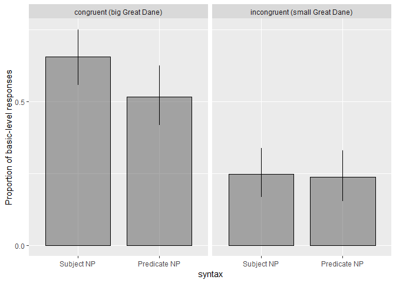
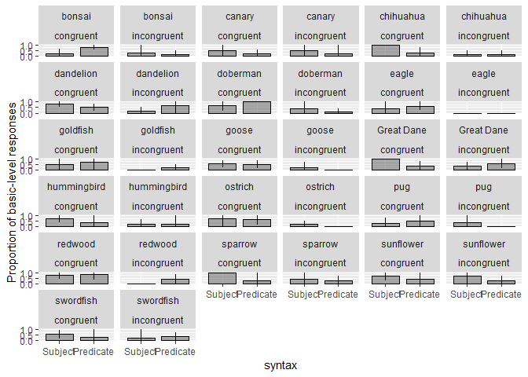
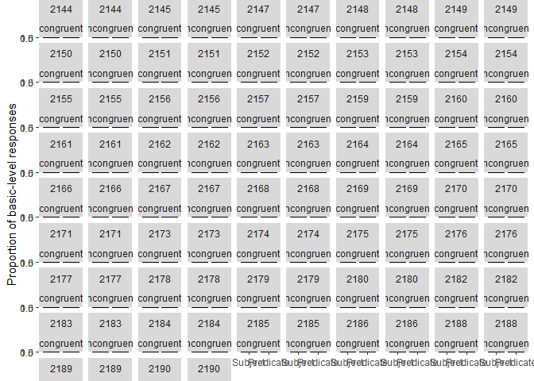

E3: Syntax X Congruence Modification Pilot
================
Polina Tsvilodub
19 04 2020

In this pilot (n = 54), we explore the combined effects of syntax and
congruence, i.e. we manipulate the NP position (subject NP vs. predicate
NP) and if the adjective matches the general expectations about the size
of the target subordinate category relative to its basic-level category
(congruent - matching expectation, ‘big Great Dane’; incongruent -
mismatching expectations, ‘small Great Dane’) (both factors
within-subjects).

The presence of incongruent trials might draw participants’ attention to
the potential flexibility of comparison classes. This might make them
more sensitive to the syntactic manipulation in the congruent trials. So
we expect a stronger effect of syntax in congruent conditions (compared
to the orignial Experiment 3). However, the syntax effect might be an
additional effect operating on top of world knowledge, so we might
expect a weak(er) effect of syntax in incongruent conditions.

Participants complete a paraphrase warm-up trial and two blocks a four
labeling warm-up trials and four main comparison class paraphrase trials
(with a total of 8 main trials). Each warm-up trial consists of a
click-through trial where participants see one of the subordinate
members which later appears in the respective basic-level context and
read its subordinate label (i.e. ‘That is a Great Dane’); and a labeling
trial where they have to provide the subordinate label for the other
subordinate member which later appears in the context. The basic-level
labeling task was removed to decrease the overall basic-level bias. We
use 8 items (2x dogs, 1x flowers, 3x birds, 1x trees, 1x fish), among
which six were used in the original Experiment 3, one was used in the NP
production experiment and one is new.

On the main trials, participants read ‘You and your friend see the
following:’, see a big context picture and read below: “Your friend goes
ahead of you and you see the following:”. Below they see the target
picture, displaying the friend next to the referent (small relative to
the context picture (creating the distance cover story)). Then the
critical utterance appears. Participants are asked to paraphrase the
utterance.

## Experiment 3: Syntax X Congruence Pilot

Two participants are excluded for not reporting their native language.
Three are excluded for failing labeling trials (mostly due to typos).

``` r
# exclude participants who report glitches
d_e3pilot %>% select(submission_id, comments, problems) %>% distinct() %>% View()
d_woGlitches <- d_e3pilot 

# exclude non-native English speakers
d_woGlitches %>% distinct(languages) %>% View()
d_Native <- d_woGlitches %>% 
  filter(grepl("e", languages, ignore.case = T)) 

# cleaning warm-up trials
# comparison class paraphrase trial
d_failed_cc_warmup <- d_Native %>% 
  filter( trial_name == "comp_class_warmup") %>%
  group_by(submission_id) %>% count() %>%
  filter( n > 4 )
d_failed_label_warmup <- d_Native %>%
  filter( (trial_name == "warmup1") | (trial_name == "warmup2")) %>%
  group_by(submission_id) %>%
  filter(attempts > 4)
d_label_warmup_more1 <- d_Native %>%
  filter( (trial_name == "warmup1") | (trial_name == "warmup2")) %>%
  group_by(submission_id) %>%
  filter(attempts > 1) %>% ungroup() %>% 
  select(submission_id, picture1, response1, picture2, response2, attempts)
# check where and why people need more than one attempt 
# d_Native %>% 
#filter((trial_name == "warmup1") | (trial_name == "warmup2")) %>% #semi_join(., d_label_warmup_more1, by=c("submission_id")) %>% #select(submission_id, picture1, response1, picture2, response2, attempts) %>% View()
d_filter <- anti_join(d_Native, d_failed_cc_warmup, by = c("submission_id"))
d_filter <- anti_join(d_filter, d_failed_label_warmup, by = c("submission_id"))
```

``` r
d_filter %>% count(adj_cond, syntax)
```

    ## # A tibble: 5 x 3
    ##   adj_cond    syntax     n
    ##   <chr>       <chr>  <int>
    ## 1 congruent   pred      98
    ## 2 congruent   subj      98
    ## 3 incongruent pred      98
    ## 4 incongruent subj      98
    ## 5 <NA>        <NA>     481

``` r
d_filter %>% count(adj_cond, syntax, target_size)
```

    ## # A tibble: 9 x 4
    ##   adj_cond    syntax target_size     n
    ##   <chr>       <chr>  <chr>       <int>
    ## 1 congruent   pred   big            46
    ## 2 congruent   pred   small          52
    ## 3 congruent   subj   big            52
    ## 4 congruent   subj   small          46
    ## 5 incongruent pred   big            50
    ## 6 incongruent pred   small          48
    ## 7 incongruent subj   big            48
    ## 8 incongruent subj   small          50
    ## 9 <NA>        <NA>   <NA>          481

## Categorizing data

The data from n = 49 participants is categorized into subordinate and
basic-level responses; superordinate responses are collapsed with the
basic-level. 20 invalid responses (5.1%) are excluded.

``` r
d_main <- d_filter %>% filter((trial_name == "custom_main_text1") |
                                (trial_name == "custom_main_text2")) %>%
  select(submission_id, context_picture, response, target_size, adj, syntax, target, item, adj_cond )


d_main %>% distinct(response) %>% View()

d_valid <- d_main %>% 
  subset(., !(tolower(response) %in% c("nkghfghgfh", "good", "love", "like", "king", "lovely", "friend", "cousin", "father", "sworn", "sword", "ducks", "snake")))

d_main_responseCat <- d_valid %>% 
  mutate(response_cat = ifelse(
    tolower(response) %in% c("flowers", "flower", "trees", "tree", "brd", "birds", "bird", "fish", "dogs", "dog", "plants", "large fish", "large mammals", "fishes"), "basic", "subordinate"
  ),
  response_num = ifelse(response_cat == "basic", 1, 0)
  )
```

There are 7 participants (14%) providing subordinate reponses only and 5
who provide basic-level responses only (10%).

``` r
d_main_responseCat %>% group_by(submission_id) %>% summarize(mean = mean(response_num)) %>% ungroup() %>% count(mean) 
```

    ## # A tibble: 11 x 2
    ##     mean     n
    ##    <dbl> <int>
    ##  1 0         7
    ##  2 0.125     4
    ##  3 0.2       1
    ##  4 0.25      6
    ##  5 0.375    10
    ##  6 0.5       8
    ##  7 0.625     2
    ##  8 0.75      2
    ##  9 0.857     1
    ## 10 0.875     1
    ## 11 1         5

## By-congruence plot of syntactic conditions

We observe a big main effect of congruence and an effect of syntax in
the congruent condition.

    ## Warning: Duplicated aesthetics after name standardisation: colour

<!-- --> \#\#
By-item plot

Overall the items behave quite heterogeneously in the different
conditions. 6 out of 16 items show the opposite of the expected pattern
in the congruent condition (i.e. more basic-level inferences in the
predicate NP condition). In the incongruent condition, for 5 out of the
16 items more basic-level responses are inferred in the predicate than
in the subject condition.

    ## Warning: Duplicated aesthetics after name standardisation: colour

<!-- -->

## By-subject plot

Overall participants show more flexibility in their comparison class
inferences compared to previous pilots. 12 out of 47 participants (24%)
provide basic-level or subordinate responses only. 6 out of 47
participants (13%) produced only basic-level responses in the congruent
condition, and only subordinate responses in the incongruent condition.

``` r
d_main_responseCat %>% group_by(syntax, adj_cond, submission_id) %>%
  tidyboot_mean(column = response_num) -> d_main_responseCat.bySubj

d_main_responseCat.bySubj %>%
  ungroup() %>%
  mutate(syntax = factor(syntax, levels = c("subj", "pred"), 
                         labels = c("Subject", "Predicate"))) %>%
  ggplot(., aes(x=syntax, y = mean, ymin = ci_lower, ymax = ci_upper)) +
  geom_col(position = position_dodge(bar.width), width = bar.width, color= 'black',
           alpha = 0.5, color = 'black', size = 0.5) +
  geom_linerange(position = position_dodge(bar.width), size = 0.5) +
  scale_y_continuous(breaks = c(0, 0.5, 1))+
  ylab("Proportion of basic-level responses") +
  facet_wrap(submission_id~adj_cond)
```

    ## Warning: Duplicated aesthetics after name standardisation: colour

<!-- -->

``` r
#ggsave('e3-syntaxXcongruence-pilot1-bySubj.pdf', height = 8, width = 8)
```

## Stats

Both predictors are deviation-coded. A Bayesian model with maixmal
random effects structure:

``` r
# deviation coding
d_main_responseCat <- d_main_responseCat %>% 
  mutate(syntax_dev = ifelse(syntax == "subj", 1, -1),
         adj_cond_dev = ifelse(adj_cond == "congruent", 1, -1))
lm.e3.pilot <- brm(response_num ~ syntax_dev * adj_cond_dev + 
                     (1 + adj_cond_dev * syntax_dev | submission_id) +
                     (1 + adj_cond_dev * syntax_dev | target),
                   data = d_main_responseCat,
                   family = "bernoulli",
                   control = list(adapt_delta = 0.9),
                   iter = 1000, 
                   cores = 4)
```

    ## Compiling the C++ model

    ## Start sampling

``` r
summary(lm.e3.pilot)
```

    ##  Family: bernoulli 
    ##   Links: mu = logit 
    ## Formula: response_num ~ syntax_dev * adj_cond_dev + (1 + adj_cond_dev * syntax_dev | submission_id) + (1 + adj_cond_dev * syntax_dev | target) 
    ##    Data: d_main_responseCat (Number of observations: 372) 
    ## Samples: 4 chains, each with iter = 1000; warmup = 500; thin = 1;
    ##          total post-warmup samples = 2000
    ## 
    ## Group-Level Effects: 
    ## ~submission_id (Number of levels: 47) 
    ##                                           Estimate Est.Error l-95% CI
    ## sd(Intercept)                                35.06     12.79    15.26
    ## sd(adj_cond_dev)                             18.85      6.82     8.27
    ## sd(syntax_dev)                                9.05      4.08     2.31
    ## sd(adj_cond_dev:syntax_dev)                  13.15      5.29     5.21
    ## cor(Intercept,adj_cond_dev)                  -0.06      0.28    -0.59
    ## cor(Intercept,syntax_dev)                    -0.22      0.36    -0.81
    ## cor(adj_cond_dev,syntax_dev)                  0.21      0.32    -0.45
    ## cor(Intercept,adj_cond_dev:syntax_dev)       -0.16      0.32    -0.71
    ## cor(adj_cond_dev,adj_cond_dev:syntax_dev)     0.15      0.27    -0.42
    ## cor(syntax_dev,adj_cond_dev:syntax_dev)       0.24      0.33    -0.44
    ##                                           u-95% CI Eff.Sample Rhat
    ## sd(Intercept)                                63.73        550 1.01
    ## sd(adj_cond_dev)                             34.58        577 1.00
    ## sd(syntax_dev)                               18.09        552 1.01
    ## sd(adj_cond_dev:syntax_dev)                  25.72        637 1.00
    ## cor(Intercept,adj_cond_dev)                   0.48        902 1.00
    ## cor(Intercept,syntax_dev)                     0.55       1358 1.00
    ## cor(adj_cond_dev,syntax_dev)                  0.75       1266 1.00
    ## cor(Intercept,adj_cond_dev:syntax_dev)        0.49       1114 1.00
    ## cor(adj_cond_dev,adj_cond_dev:syntax_dev)     0.62       1205 1.00
    ## cor(syntax_dev,adj_cond_dev:syntax_dev)       0.79        417 1.01
    ## 
    ## ~target (Number of levels: 16) 
    ##                                           Estimate Est.Error l-95% CI
    ## sd(Intercept)                                 3.86      2.74     0.20
    ## sd(adj_cond_dev)                              9.37      4.05     3.36
    ## sd(syntax_dev)                                8.37      3.67     2.56
    ## sd(adj_cond_dev:syntax_dev)                   9.93      4.10     3.65
    ## cor(Intercept,adj_cond_dev)                  -0.18      0.40    -0.82
    ## cor(Intercept,syntax_dev)                     0.33      0.39    -0.53
    ## cor(adj_cond_dev,syntax_dev)                 -0.29      0.32    -0.86
    ## cor(Intercept,adj_cond_dev:syntax_dev)        0.13      0.40    -0.68
    ## cor(adj_cond_dev,adj_cond_dev:syntax_dev)    -0.15      0.32    -0.73
    ## cor(syntax_dev,adj_cond_dev:syntax_dev)       0.25      0.32    -0.43
    ##                                           u-95% CI Eff.Sample Rhat
    ## sd(Intercept)                                10.46        600 1.00
    ## sd(adj_cond_dev)                             18.50        743 1.00
    ## sd(syntax_dev)                               16.80        755 1.00
    ## sd(adj_cond_dev:syntax_dev)                  19.49        783 1.01
    ## cor(Intercept,adj_cond_dev)                   0.66        546 1.00
    ## cor(Intercept,syntax_dev)                     0.92        515 1.00
    ## cor(adj_cond_dev,syntax_dev)                  0.39       1498 1.00
    ## cor(Intercept,adj_cond_dev:syntax_dev)        0.83        513 1.00
    ## cor(adj_cond_dev,adj_cond_dev:syntax_dev)     0.46       1078 1.00
    ## cor(syntax_dev,adj_cond_dev:syntax_dev)       0.79       1103 1.00
    ## 
    ## Population-Level Effects: 
    ##                         Estimate Est.Error l-95% CI u-95% CI Eff.Sample
    ## Intercept                  -7.17      5.81   -20.55     2.69        699
    ## syntax_dev                  3.84      4.26    -3.61    12.56        916
    ## adj_cond_dev               18.99      7.80     6.90    37.03        615
    ## syntax_dev:adj_cond_dev     3.54      4.51    -4.81    12.86       1066
    ##                         Rhat
    ## Intercept               1.01
    ## syntax_dev              1.00
    ## adj_cond_dev            1.00
    ## syntax_dev:adj_cond_dev 1.00
    ## 
    ## Samples were drawn using sampling(NUTS). For each parameter, Eff.Sample 
    ## is a crude measure of effective sample size, and Rhat is the potential 
    ## scale reduction factor on split chains (at convergence, Rhat = 1).

An exploratory model of the congruent condition only:

``` r
d_main_responseCat_congr <- d_main_responseCat %>% filter(adj_cond == "congruent")

lm.e3.pilot.congr <- brm(response_num ~ syntax_dev  + 
                     (1 + syntax_dev | submission_id) +
                     (1 + syntax_dev | target),
                   data = d_main_responseCat_congr,
                   family = "bernoulli",
                   control = list(adapt_delta = 0.9),
                   iter = 1000,
                   cores = 4)
```

    ## Compiling the C++ model

    ## Start sampling

``` r
summary(lm.e3.pilot.congr)
```

    ##  Family: bernoulli 
    ##   Links: mu = logit 
    ## Formula: response_num ~ syntax_dev + (1 + syntax_dev | submission_id) + (1 + syntax_dev | target) 
    ##    Data: d_main_responseCat_congr (Number of observations: 186) 
    ## Samples: 4 chains, each with iter = 1000; warmup = 500; thin = 1;
    ##          total post-warmup samples = 2000
    ## 
    ## Group-Level Effects: 
    ## ~submission_id (Number of levels: 47) 
    ##                           Estimate Est.Error l-95% CI u-95% CI Eff.Sample
    ## sd(Intercept)                22.26     11.56     6.48    50.76        370
    ## sd(syntax_dev)               11.29      5.90     2.77    25.57        364
    ## cor(Intercept,syntax_dev)    -0.01      0.41    -0.78     0.75        417
    ##                           Rhat
    ## sd(Intercept)             1.00
    ## sd(syntax_dev)            1.00
    ## cor(Intercept,syntax_dev) 1.01
    ## 
    ## ~target (Number of levels: 16) 
    ##                           Estimate Est.Error l-95% CI u-95% CI Eff.Sample
    ## sd(Intercept)                 4.17      3.13     0.16    12.14        443
    ## sd(syntax_dev)                9.46      5.30     2.31    22.79        427
    ## cor(Intercept,syntax_dev)     0.09      0.49    -0.84     0.91        293
    ##                           Rhat
    ## sd(Intercept)             1.01
    ## sd(syntax_dev)            1.00
    ## cor(Intercept,syntax_dev) 1.01
    ## 
    ## Population-Level Effects: 
    ##            Estimate Est.Error l-95% CI u-95% CI Eff.Sample Rhat
    ## Intercept      4.57      4.06    -2.10    14.28        601 1.00
    ## syntax_dev     4.35      4.12    -1.93    14.26        709 1.00
    ## 
    ## Samples were drawn using sampling(NUTS). For each parameter, Eff.Sample 
    ## is a crude measure of effective sample size, and Rhat is the potential 
    ## scale reduction factor on split chains (at convergence, Rhat = 1).
