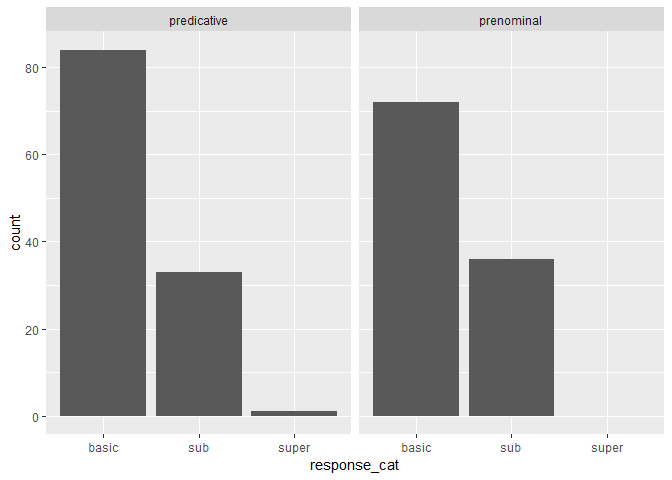
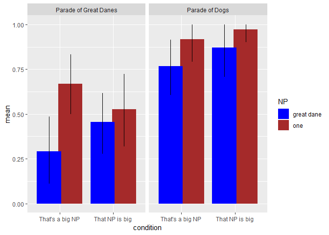
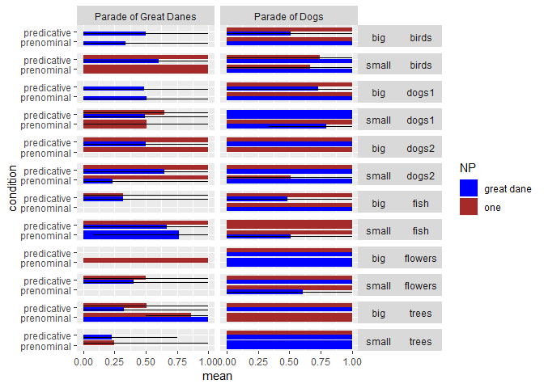
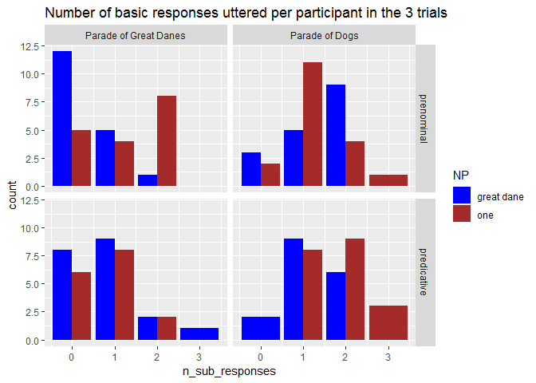
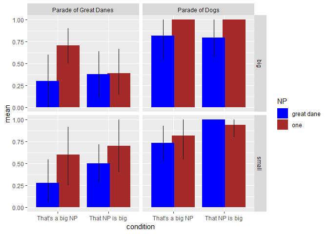
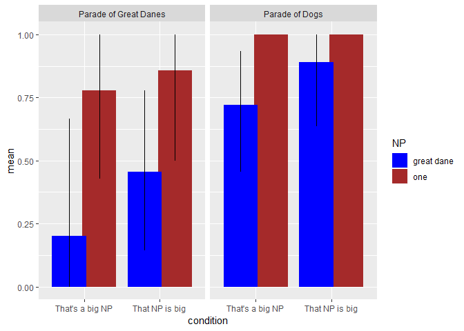

Comparison class inference free production pilot
================
Polina Tsvilodub
08/18/2019

    ## -- Attaching packages ---------------------------------------------------- tidyverse 1.2.1 --

    ## v ggplot2 3.1.0     v purrr   0.2.5
    ## v tibble  1.4.2     v dplyr   0.7.7
    ## v tidyr   0.8.2     v stringr 1.3.1
    ## v readr   1.1.1     v forcats 0.3.0

    ## -- Conflicts ------------------------------------------------------- tidyverse_conflicts() --
    ## x dplyr::filter() masks stats::filter()
    ## x dplyr::lag()    masks stats::lag()

    ## Loading required package: Rcpp

    ## Loading 'brms' package (version 2.8.0). Useful instructions
    ## can be found by typing help('brms'). A more detailed introduction
    ## to the package is available through vignette('brms_overview').

    ## Parsed with column specification:
    ## cols(
    ##   .default = col_character(),
    ##   submission_id = col_integer(),
    ##   experiment_id = col_integer(),
    ##   enjoyment = col_integer(),
    ##   pic_spec = col_integer(),
    ##   age = col_integer(),
    ##   ref_spec = col_integer(),
    ##   trial_number = col_integer(),
    ##   startTime = col_double(),
    ##   attempts = col_integer(),
    ##   fairprice = col_double()
    ## )

    ## See spec(...) for full column specifications.

    ## Parsed with column specification:
    ## cols(
    ##   .default = col_character(),
    ##   submission_id = col_integer(),
    ##   experiment_id = col_integer(),
    ##   enjoyment = col_integer(),
    ##   pic_spec = col_integer(),
    ##   age = col_integer(),
    ##   ref_spec = col_integer(),
    ##   trial_number = col_integer(),
    ##   startTime = col_double(),
    ##   attempts = col_integer(),
    ##   fairprice = col_double()
    ## )

    ## See spec(...) for full column specifications.

    ## Parsed with column specification:
    ## cols(
    ##   .default = col_character(),
    ##   submission_id = col_integer(),
    ##   experiment_id = col_integer(),
    ##   enjoyment = col_integer(),
    ##   pic_spec = col_integer(),
    ##   age = col_integer(),
    ##   ref_spec = col_integer(),
    ##   trial_number = col_integer(),
    ##   startTime = col_double(),
    ##   attempts = col_integer(),
    ##   fairprice = col_double()
    ## )

    ## See spec(...) for full column specifications.

    ## # A tibble: 6 x 1
    ##   `d$languages` 
    ##   <chr>         
    ## 1 english       
    ## 2 English       
    ## 3 <NA>          
    ## 4 English, Dutch
    ## 5 englsih       
    ## 6 Englilsh

    ## # A tibble: 52 x 1
    ##    `d_main$response`
    ##    <chr>            
    ##  1 birds            
    ##  2 fish             
    ##  3 dogs             
    ##  4 trees            
    ##  5 flowers          
    ##  6 plant            
    ##  7 bonsais          
    ##  8 swordfishes      
    ##  9 flower           
    ## 10 hummingbird      
    ## # ... with 42 more rows

## Response categorization

<!-- --> \#\#
Proportion of basic responses by syntactic condition, context
specificity and NP

Expectations: When the underspecified ‘one’ is used, participants infer
the comparison class froom the perceptual context: subordinate label
(comparison class) for the subordinate parade, basic-level label for the
basic-level parade. When thue subordinate noun phrase is used, the
prenominal syntax sets the comparison class, whereas the predicative
syntax allows for stronger context influence: more basic-level labels in
the basic-level context are expected than in the subordinate context.

## Basic responses proportion by context condition

<!-- -->

## Stats

    ## Loading required package: Matrix

    ## 
    ## Attaching package: 'Matrix'

    ## The following object is masked from 'package:tidyr':
    ## 
    ##     expand

    ## 
    ## Attaching package: 'lme4'

    ## The following object is masked from 'package:brms':
    ## 
    ##     ngrps

    ## Generalized linear mixed model fit by maximum likelihood (Laplace
    ##   Approximation) [glmerMod]
    ##  Family: binomial  ( logit )
    ## Formula: response_num ~ condition * NP * context + (1 | submission_id)
    ##    Data: d_main_responseCat
    ## 
    ##      AIC      BIC   logLik deviance df.resid 
    ##    198.9    229.7    -90.4    180.9      217 
    ## 
    ## Scaled residuals: 
    ##      Min       1Q   Median       3Q      Max 
    ## -10.6630  -0.2138   0.0938   0.3042   2.0585 
    ## 
    ## Random effects:
    ##  Groups        Name        Variance Std.Dev.
    ##  submission_id (Intercept) 6.652    2.579   
    ## Number of obs: 226, groups:  submission_id, 38
    ## 
    ## Fixed effects:
    ##                                                  Estimate Std. Error
    ## (Intercept)                                       -1.7575     0.9629
    ## conditionpredicative                               1.7750     1.2571
    ## NPone                                              3.1863     1.0927
    ## contextParade of Dogs                              4.3286     1.2455
    ## conditionpredicative:NPone                        -2.9586     1.3379
    ## conditionpredicative:contextParade of Dogs        -1.2668     1.4894
    ## NPone:contextParade of Dogs                       -1.1738     1.6214
    ## conditionpredicative:NPone:contextParade of Dogs   3.1400     2.2923
    ##                                                  z value Pr(>|z|)    
    ## (Intercept)                                       -1.825  0.06796 .  
    ## conditionpredicative                               1.412  0.15798    
    ## NPone                                              2.916  0.00355 ** 
    ## contextParade of Dogs                              3.476  0.00051 ***
    ## conditionpredicative:NPone                        -2.211  0.02701 *  
    ## conditionpredicative:contextParade of Dogs        -0.851  0.39502    
    ## NPone:contextParade of Dogs                       -0.724  0.46910    
    ## conditionpredicative:NPone:contextParade of Dogs   1.370  0.17074    
    ## ---
    ## Signif. codes:  0 '***' 0.001 '**' 0.01 '*' 0.05 '.' 0.1 ' ' 1
    ## 
    ## Correlation of Fixed Effects:
    ##             (Intr) cndtnp NPone  cntPoD cnd:NP cn:PoD NP:PoD
    ## cndtnprdctv -0.787                                          
    ## NPone       -0.597  0.496                                   
    ## cntxtPrdofD -0.582  0.492  0.703                            
    ## cndtnprd:NP  0.487 -0.547 -0.815 -0.572                     
    ## cndtnpr:PoD  0.458 -0.512 -0.535 -0.773  0.578              
    ## NPn:cntxPoD  0.362 -0.292 -0.645 -0.628  0.526  0.505       
    ## cndt:NP:PoD -0.268  0.305  0.478  0.471 -0.607 -0.619 -0.716

## Condition counts table

    ## # A tibble: 8 x 4
    ## # Groups:   condition, NP, context [8]
    ##   condition   NP         context                   n
    ##   <fct>       <fct>      <fct>                 <int>
    ## 1 prenominal  great dane Parade of Great Danes    24
    ## 2 prenominal  great dane Parade of Dogs           30
    ## 3 prenominal  one        Parade of Great Danes    30
    ## 4 prenominal  one        Parade of Dogs           24
    ## 5 predicative great dane Parade of Great Danes    35
    ## 6 predicative great dane Parade of Dogs           24
    ## 7 predicative one        Parade of Great Danes    23
    ## 8 predicative one        Parade of Dogs           36

## Basic responses proportion by item, target size and context

<!-- --> \#\#
Response consistency within participants
<!-- --> \#\# Size
effects: Basic responses proportion by size
<!-- --> \#\# First
trial analysis
<!-- -->
