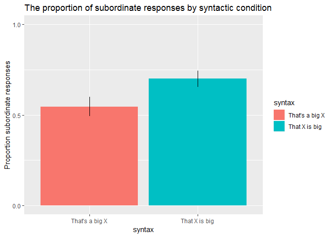
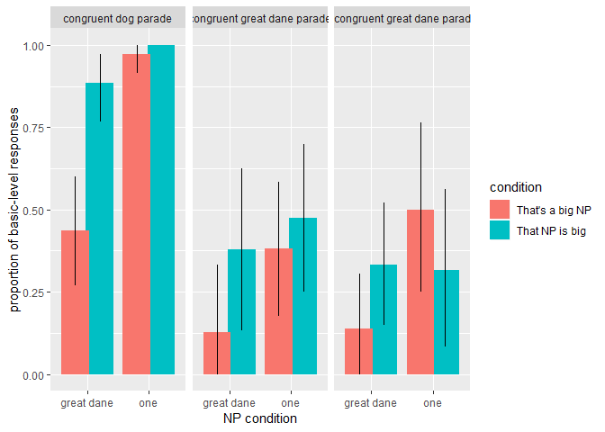

Comparison class inference via syntactic cues
================
Polina Tsvilodub
25 09 2019

``` r
library(tidyboot)
library(tidyverse)
```

    ## -- Attaching packages ----------------------------------------------------------------------------------------------- tidyverse 1.2.1 --

    ## v ggplot2 3.1.0     v purrr   0.2.5
    ## v tibble  1.4.2     v dplyr   0.7.7
    ## v tidyr   0.8.2     v stringr 1.3.1
    ## v readr   1.1.1     v forcats 0.3.0

    ## -- Conflicts -------------------------------------------------------------------------------------------------- tidyverse_conflicts() --
    ## x dplyr::filter() masks stats::filter()
    ## x dplyr::lag()    masks stats::lag()

``` r
library(lmerTest)
```

    ## Loading required package: lme4

    ## Loading required package: Matrix

    ## 
    ## Attaching package: 'Matrix'

    ## The following object is masked from 'package:tidyr':
    ## 
    ##     expand

    ## 
    ## Attaching package: 'lmerTest'

    ## The following object is masked from 'package:lme4':
    ## 
    ##     lmer

    ## The following object is masked from 'package:stats':
    ## 
    ##     step

``` r
library(emmeans)
library(brms)
```

    ## Loading required package: Rcpp

    ## Loading 'brms' package (version 2.8.0). Useful instructions
    ## can be found by typing help('brms'). A more detailed introduction
    ## to the package is available through vignette('brms_overview').

    ## 
    ## Attaching package: 'brms'

    ## The following object is masked from 'package:lme4':
    ## 
    ##     ngrps

# Hypothesis Outline

Syntactic cues like the position of the noun phrase in a sentence might
help listeners restrict the possible comparison classes upon hearing a
sentence with a gradable adjective like “That great dane is big”. We
test this hypothesis in three experiments manipulating the syntax of a
sentence that is used to describe an object: the syntax is either “That
NP is big (small)” (predicative condition) or “That’s a big (small) NP”
(prenominal condition). **We hypothesis that NPs in the prenominal
condition restrict the comparison class and thus, given our experimental
design, this syntax is felicitous with a basic-level label of the target
object but not with a subordinate label. In contrast, in the predicative
condition the comparison class is less restricted, and thus using both
the basic-level and the subordinate label of the target as the NP is
felicitous.** Here, both Bayesian and frequentist analyses of the
experimental data are presented.

## Syntax Rating Experiment

The goal of the experiment was to obtain ratings of both syntactic
conditions in direct comparison as descriptions of a target referent in
context. The context picture was followed by a sentence providing the
subordinate level label of the traget. Below the sentence, the picture
of the target appeared and they were asked: “How well does each of the
sentences describe it?” **Between-subject:** order of the syntactic
frames on the sliders **Within-subject:** NP (basic-level or subordinate
level), target size (big or small), congruence (big great dane or small
great dane) **Expectation:** Given sentences with subordinate noun
phrases (e. g. great dane), we expect higher mean ratings of the
predicative than the prenominal condition.

### Mean rating in different conditions

n = 30 (1 excluded as non-native speaker)

    ## Parsed with column specification:
    ## cols(
    ##   .default = col_character(),
    ##   submission_id = col_integer(),
    ##   response1 = col_integer(),
    ##   experiment_id = col_integer(),
    ##   enjoyment = col_integer(),
    ##   age = col_integer(),
    ##   target_size = col_integer(),
    ##   np = col_integer(),
    ##   trial_number = col_integer(),
    ##   startTime = col_double(),
    ##   fairprice = col_double(),
    ##   congruence = col_integer(),
    ##   response2 = col_integer()
    ## )

    ## See spec(...) for full column specifications.

<!-- -->

### Stats

This is a linear model of the rating predicted by the syntactic
condition, the noun phrase, the congruence and their interaction with
random intercept by-participant and random intercept by-item
effects.

``` r
lm.fit <- glmer(response1 ~ condition * np * congruence + (1 | submission_id) + (1 | item), data = d_rating_full)
summary(lm.fit)
```

    ## Linear mixed model fit by REML ['lmerMod']
    ## Formula: response1 ~ condition * np * congruence + (1 | submission_id) +  
    ##     (1 | item)
    ##    Data: d_rating_full
    ## 
    ## REML criterion at convergence: 3118.2
    ## 
    ## Scaled residuals: 
    ##     Min      1Q  Median      3Q     Max 
    ## -2.8570 -0.5918 -0.1358  0.5556  3.1697 
    ## 
    ## Random effects:
    ##  Groups        Name        Variance Std.Dev.
    ##  submission_id (Intercept)  84.90    9.214  
    ##  item          (Intercept)  18.81    4.336  
    ##  Residual                  457.11   21.380  
    ## Number of obs: 348, groups:  submission_id, 29; item, 12
    ## 
    ## Fixed effects:
    ##                                           Estimate Std. Error t value
    ## (Intercept)                                 84.312      4.135  20.388
    ## conditionprenom                            -18.658      4.905  -3.804
    ## npsuper                                      4.009      4.727   0.848
    ## congruenceincongr                          -69.381      4.754 -14.594
    ## conditionprenom:npsuper                     16.617      6.536   2.542
    ## conditionprenom:congruenceincongr           19.637      6.536   3.005
    ## npsuper:congruenceincongr                   -6.793      6.803  -0.998
    ## conditionprenom:npsuper:congruenceincongr  -18.281      9.243  -1.978
    ## 
    ## Correlation of Fixed Effects:
    ##             (Intr) cndtnp npsupr cngrnc cndtnprnm:n cndtnprnm:c npspr:
    ## conditnprnm -0.593                                                    
    ## npsuper     -0.648  0.519                                             
    ## cngrncncngr -0.651  0.516  0.577                                      
    ## cndtnprnm:n  0.445 -0.750 -0.691 -0.387                               
    ## cndtnprnm:c  0.445 -0.750 -0.389 -0.687  0.563                        
    ## npspr:cngrn  0.462 -0.360 -0.717 -0.714  0.480       0.480            
    ## cndtnprnm:: -0.315  0.531  0.489  0.486 -0.707      -0.707      -0.679

``` r
confint(lm.fit)
```

    ## Computing profile confidence intervals ...

    ##                                                2.5 %      97.5 %
    ## .sig01                                      6.032719  13.1726658
    ## .sig02                                      0.000000   8.6826001
    ## .sigma                                     19.582798  22.9470939
    ## (Intercept)                                76.206985  92.3822107
    ## conditionprenom                           -28.199557  -9.1162324
    ## npsuper                                    -5.204070  13.1954014
    ## congruenceincongr                         -78.660927 -60.1420271
    ## conditionprenom:npsuper                     3.902978  29.3311786
    ## conditionprenom:congruenceincongr           6.923386  32.3515868
    ## npsuper:congruenceincongr                 -20.042014   6.4226877
    ## conditionprenom:npsuper:congruenceincongr -36.261334  -0.3004278

``` r
car::Anova(lm.fit)
```

    ## Analysis of Deviance Table (Type II Wald chisquare tests)
    ## 
    ## Response: response1
    ##                            Chisq Df Pr(>Chisq)    
    ## condition                 3.8936  1   0.048471 *  
    ## np                        3.5235  1   0.060503 .  
    ## congruence              791.5653  1  < 2.2e-16 ***
    ## condition:np              2.6173  1   0.105704    
    ## condition:congruence      5.1591  1   0.023125 *  
    ## np:congruence            10.1833  1   0.001417 ** 
    ## condition:np:congruence   3.9118  1   0.047949 *  
    ## ---
    ## Signif. codes:  0 '***' 0.001 '**' 0.01 '*' 0.05 '.' 0.1 ' ' 1

``` r
emmip(lm.fit, np ~ condition | congruence)
```

<!-- -->

### Bayesian Stats

``` r
b.lm.fit <- brm(response1 ~ condition * np * congruence + (1 | submission_id) + (1 | item), data = d_rating_full)
```

    ## Compiling the C++ model

    ## Start sampling

    ## 
    ## SAMPLING FOR MODEL '43865e4fc4073b296d5fb1632a9d72b7' NOW (CHAIN 1).
    ## Chain 1: 
    ## Chain 1: Gradient evaluation took 0.001 seconds
    ## Chain 1: 1000 transitions using 10 leapfrog steps per transition would take 10 seconds.
    ## Chain 1: Adjust your expectations accordingly!
    ## Chain 1: 
    ## Chain 1: 
    ## Chain 1: Iteration:    1 / 2000 [  0%]  (Warmup)
    ## Chain 1: Iteration:  200 / 2000 [ 10%]  (Warmup)
    ## Chain 1: Iteration:  400 / 2000 [ 20%]  (Warmup)
    ## Chain 1: Iteration:  600 / 2000 [ 30%]  (Warmup)
    ## Chain 1: Iteration:  800 / 2000 [ 40%]  (Warmup)
    ## Chain 1: Iteration: 1000 / 2000 [ 50%]  (Warmup)
    ## Chain 1: Iteration: 1001 / 2000 [ 50%]  (Sampling)
    ## Chain 1: Iteration: 1200 / 2000 [ 60%]  (Sampling)
    ## Chain 1: Iteration: 1400 / 2000 [ 70%]  (Sampling)
    ## Chain 1: Iteration: 1600 / 2000 [ 80%]  (Sampling)
    ## Chain 1: Iteration: 1800 / 2000 [ 90%]  (Sampling)
    ## Chain 1: Iteration: 2000 / 2000 [100%]  (Sampling)
    ## Chain 1: 
    ## Chain 1:  Elapsed Time: 4.653 seconds (Warm-up)
    ## Chain 1:                0.835 seconds (Sampling)
    ## Chain 1:                5.488 seconds (Total)
    ## Chain 1: 
    ## 
    ## SAMPLING FOR MODEL '43865e4fc4073b296d5fb1632a9d72b7' NOW (CHAIN 2).
    ## Chain 2: 
    ## Chain 2: Gradient evaluation took 0 seconds
    ## Chain 2: 1000 transitions using 10 leapfrog steps per transition would take 0 seconds.
    ## Chain 2: Adjust your expectations accordingly!
    ## Chain 2: 
    ## Chain 2: 
    ## Chain 2: Iteration:    1 / 2000 [  0%]  (Warmup)
    ## Chain 2: Iteration:  200 / 2000 [ 10%]  (Warmup)
    ## Chain 2: Iteration:  400 / 2000 [ 20%]  (Warmup)
    ## Chain 2: Iteration:  600 / 2000 [ 30%]  (Warmup)
    ## Chain 2: Iteration:  800 / 2000 [ 40%]  (Warmup)
    ## Chain 2: Iteration: 1000 / 2000 [ 50%]  (Warmup)
    ## Chain 2: Iteration: 1001 / 2000 [ 50%]  (Sampling)
    ## Chain 2: Iteration: 1200 / 2000 [ 60%]  (Sampling)
    ## Chain 2: Iteration: 1400 / 2000 [ 70%]  (Sampling)
    ## Chain 2: Iteration: 1600 / 2000 [ 80%]  (Sampling)
    ## Chain 2: Iteration: 1800 / 2000 [ 90%]  (Sampling)
    ## Chain 2: Iteration: 2000 / 2000 [100%]  (Sampling)
    ## Chain 2: 
    ## Chain 2:  Elapsed Time: 2.676 seconds (Warm-up)
    ## Chain 2:                1.325 seconds (Sampling)
    ## Chain 2:                4.001 seconds (Total)
    ## Chain 2: 
    ## 
    ## SAMPLING FOR MODEL '43865e4fc4073b296d5fb1632a9d72b7' NOW (CHAIN 3).
    ## Chain 3: 
    ## Chain 3: Gradient evaluation took 0 seconds
    ## Chain 3: 1000 transitions using 10 leapfrog steps per transition would take 0 seconds.
    ## Chain 3: Adjust your expectations accordingly!
    ## Chain 3: 
    ## Chain 3: 
    ## Chain 3: Iteration:    1 / 2000 [  0%]  (Warmup)
    ## Chain 3: Iteration:  200 / 2000 [ 10%]  (Warmup)
    ## Chain 3: Iteration:  400 / 2000 [ 20%]  (Warmup)
    ## Chain 3: Iteration:  600 / 2000 [ 30%]  (Warmup)
    ## Chain 3: Iteration:  800 / 2000 [ 40%]  (Warmup)
    ## Chain 3: Iteration: 1000 / 2000 [ 50%]  (Warmup)
    ## Chain 3: Iteration: 1001 / 2000 [ 50%]  (Sampling)
    ## Chain 3: Iteration: 1200 / 2000 [ 60%]  (Sampling)
    ## Chain 3: Iteration: 1400 / 2000 [ 70%]  (Sampling)
    ## Chain 3: Iteration: 1600 / 2000 [ 80%]  (Sampling)
    ## Chain 3: Iteration: 1800 / 2000 [ 90%]  (Sampling)
    ## Chain 3: Iteration: 2000 / 2000 [100%]  (Sampling)
    ## Chain 3: 
    ## Chain 3:  Elapsed Time: 2.733 seconds (Warm-up)
    ## Chain 3:                1.531 seconds (Sampling)
    ## Chain 3:                4.264 seconds (Total)
    ## Chain 3: 
    ## 
    ## SAMPLING FOR MODEL '43865e4fc4073b296d5fb1632a9d72b7' NOW (CHAIN 4).
    ## Chain 4: 
    ## Chain 4: Gradient evaluation took 0 seconds
    ## Chain 4: 1000 transitions using 10 leapfrog steps per transition would take 0 seconds.
    ## Chain 4: Adjust your expectations accordingly!
    ## Chain 4: 
    ## Chain 4: 
    ## Chain 4: Iteration:    1 / 2000 [  0%]  (Warmup)
    ## Chain 4: Iteration:  200 / 2000 [ 10%]  (Warmup)
    ## Chain 4: Iteration:  400 / 2000 [ 20%]  (Warmup)
    ## Chain 4: Iteration:  600 / 2000 [ 30%]  (Warmup)
    ## Chain 4: Iteration:  800 / 2000 [ 40%]  (Warmup)
    ## Chain 4: Iteration: 1000 / 2000 [ 50%]  (Warmup)
    ## Chain 4: Iteration: 1001 / 2000 [ 50%]  (Sampling)
    ## Chain 4: Iteration: 1200 / 2000 [ 60%]  (Sampling)
    ## Chain 4: Iteration: 1400 / 2000 [ 70%]  (Sampling)
    ## Chain 4: Iteration: 1600 / 2000 [ 80%]  (Sampling)
    ## Chain 4: Iteration: 1800 / 2000 [ 90%]  (Sampling)
    ## Chain 4: Iteration: 2000 / 2000 [100%]  (Sampling)
    ## Chain 4: 
    ## Chain 4:  Elapsed Time: 2.528 seconds (Warm-up)
    ## Chain 4:                1.482 seconds (Sampling)
    ## Chain 4:                4.01 seconds (Total)
    ## Chain 4:

``` r
summary(b.lm.fit)
```

    ##  Family: gaussian 
    ##   Links: mu = identity; sigma = identity 
    ## Formula: response1 ~ condition * np * congruence + (1 | submission_id) + (1 | item) 
    ##    Data: d_rating_full (Number of observations: 348) 
    ## Samples: 4 chains, each with iter = 2000; warmup = 1000; thin = 1;
    ##          total post-warmup samples = 4000
    ## 
    ## Group-Level Effects: 
    ## ~item (Number of levels: 12) 
    ##               Estimate Est.Error l-95% CI u-95% CI Eff.Sample Rhat
    ## sd(Intercept)     4.65      2.46     0.44     9.90       1061 1.00
    ## 
    ## ~submission_id (Number of levels: 29) 
    ##               Estimate Est.Error l-95% CI u-95% CI Eff.Sample Rhat
    ## sd(Intercept)     9.62      2.02     6.23    14.32       1256 1.00
    ## 
    ## Population-Level Effects: 
    ##                                           Estimate Est.Error l-95% CI
    ## Intercept                                    84.15      4.29    75.89
    ## conditionprenom                             -18.69      5.14   -28.67
    ## npsuper                                       4.17      4.76    -5.33
    ## congruenceincongr                           -69.41      4.89   -79.01
    ## conditionprenom:npsuper                      16.50      6.71     3.18
    ## conditionprenom:congruenceincongr            19.68      6.73     6.37
    ## npsuper:congruenceincongr                    -6.86      6.95   -20.62
    ## conditionprenom:npsuper:congruenceincongr   -18.21      9.43   -36.66
    ##                                           u-95% CI Eff.Sample Rhat
    ## Intercept                                    92.52       1499 1.00
    ## conditionprenom                              -8.68       1480 1.00
    ## npsuper                                      13.63       1448 1.00
    ## congruenceincongr                           -59.80       1480 1.00
    ## conditionprenom:npsuper                      29.57       1410 1.00
    ## conditionprenom:congruenceincongr            32.78       1437 1.00
    ## npsuper:congruenceincongr                     6.49       1341 1.00
    ## conditionprenom:npsuper:congruenceincongr     0.70       1370 1.00
    ## 
    ## Family Specific Parameters: 
    ##       Estimate Est.Error l-95% CI u-95% CI Eff.Sample Rhat
    ## sigma    21.52      0.88    19.82    23.33       3257 1.00
    ## 
    ## Samples were drawn using sampling(NUTS). For each parameter, Eff.Sample 
    ## is a crude measure of effective sample size, and Rhat is the potential 
    ## scale reduction factor on split chains (at convergence, Rhat = 1).

## NP Free Production Experiment

In this experiment we want to see if speakers actually use different
labels as noun phrases to describe the target, given different syntactic
frames. The participants saw a basic-level context, below the sentence
“This one is also in the parade”, referring to the target. The target
picture (big or small, balanced within-subject) was followed by the
prompt “You say to your friend:”. Participants see either “That’s a big
(small) \_\_” or “That \_\_ is big (small)” (between-subjects), blank to
be filed in. The target size and adjective were always ‘congruent’.
**Expectation:** We expect a higher proportion of subordinate target
labels in the predicative than in the prenominal conidtion.

### Proportions of subordinate responses by syntactic condition

n = 120 (n = 58 prenominal syntax, n = 60 predicative syntax)

    ## Parsed with column specification:
    ## cols(
    ##   .default = col_character(),
    ##   submission_id = col_integer(),
    ##   experiment_id = col_integer(),
    ##   enjoyment = col_integer(),
    ##   age = col_integer(),
    ##   trial_number = col_integer(),
    ##   startTime = col_double(),
    ##   attempts = col_integer(),
    ##   fairprice = col_double()
    ## )

    ## See spec(...) for full column specifications.

    ## Parsed with column specification:
    ## cols(
    ##   .default = col_character(),
    ##   submission_id = col_integer(),
    ##   experiment_id = col_integer(),
    ##   enjoyment = col_integer(),
    ##   age = col_integer(),
    ##   trial_number = col_integer(),
    ##   startTime = col_double(),
    ##   attempts = col_integer(),
    ##   fairprice = col_double()
    ## )

    ## See spec(...) for full column specifications.

    ## Parsed with column specification:
    ## cols(
    ##   .default = col_character(),
    ##   submission_id = col_integer(),
    ##   experiment_id = col_integer(),
    ##   enjoyment = col_integer(),
    ##   age = col_integer(),
    ##   trial_number = col_integer(),
    ##   startTime = col_double(),
    ##   attempts = col_integer(),
    ##   fairprice = col_double()
    ## )

    ## See spec(...) for full column specifications.

    ## Parsed with column specification:
    ## cols(
    ##   .default = col_character(),
    ##   submission_id = col_integer(),
    ##   experiment_id = col_integer(),
    ##   enjoyment = col_integer(),
    ##   age = col_integer(),
    ##   trial_number = col_integer(),
    ##   startTime = col_double(),
    ##   attempts = col_integer(),
    ##   fairprice = col_double()
    ## )

    ## See spec(...) for full column specifications.

<!-- -->

### Stats

The reponse category (subordinate vs basic-level) is regressed against
the syntax and random intercept by-participant and random intercept and
syntax-effects by-item. The syntax is contrast coded, predicative syntax
being the reference level.

``` r
# predicative syntax is reference level (-1)
contrasts(d_prod_main_responseCat$syntax)=matrix(c(-1, 1))
# fit regression model
prod.lm.fit <- glmer(resp_cat ~  syntax + (1| submission_id) + (1 + syntax|picture), data = d_prod_main_responseCat, family="binomial")
summary(prod.lm.fit)
```

    ## Generalized linear mixed model fit by maximum likelihood (Laplace
    ##   Approximation) [glmerMod]
    ##  Family: binomial  ( logit )
    ## Formula: resp_cat ~ syntax + (1 | submission_id) + (1 + syntax | picture)
    ##    Data: d_prod_main_responseCat
    ## 
    ##      AIC      BIC   logLik deviance df.resid 
    ##    619.5    646.9   -303.8    607.5      696 
    ## 
    ## Scaled residuals: 
    ##     Min      1Q  Median      3Q     Max 
    ## -3.9737 -0.2227  0.1308  0.2352  2.2839 
    ## 
    ## Random effects:
    ##  Groups        Name        Variance Std.Dev. Corr
    ##  submission_id (Intercept) 14.69533 3.8334       
    ##  picture       (Intercept)  0.73521 0.8574       
    ##                syntax1      0.02253 0.1501   1.00
    ## Number of obs: 702, groups:  submission_id, 118; picture, 20
    ## 
    ## Fixed effects:
    ##             Estimate Std. Error z value Pr(>|z|)   
    ## (Intercept)   1.4339     0.4910   2.920   0.0035 **
    ## syntax1      -0.9152     0.4340  -2.109   0.0350 * 
    ## ---
    ## Signif. codes:  0 '***' 0.001 '**' 0.01 '*' 0.05 '.' 0.1 ' ' 1
    ## 
    ## Correlation of Fixed Effects:
    ##         (Intr)
    ## syntax1 -0.063

``` r
confint(prod.lm.fit)
```

    ## Computing profile confidence intervals ...

    ##                  2.5 %      97.5 %
    ## .sig01       2.9516883  5.10607423
    ## .sig02       0.4658304  1.42510889
    ## .sig03      -1.0000000  1.00000000
    ## .sig04       0.0000000  0.54346991
    ## (Intercept)  0.5204652  2.54094929
    ## syntax1     -1.8704181 -0.08472818

### Bayesian Stats

``` r
contrasts(d_prod_main_responseCat$syntax)=matrix(c(-1, 1))

get_prior(resp_cat ~ 0 + syntax + (1| submission_id) + (1 + syntax|picture),
          data=d_prod_main_responseCat, family= "bernoulli")
```

    ##                  prior class              coef         group resp dpar
    ## 1                          b                                          
    ## 2                          b syntaxpredicative                        
    ## 3                          b  syntaxprenominal                        
    ## 4               lkj(1)   cor                                          
    ## 5                        cor                         picture          
    ## 6  student_t(3, 0, 10)    sd                                          
    ## 7                         sd                         picture          
    ## 8                         sd         Intercept       picture          
    ## 9                         sd           syntax1       picture          
    ## 10                        sd                   submission_id          
    ## 11                        sd         Intercept submission_id          
    ##    nlpar bound
    ## 1             
    ## 2             
    ## 3             
    ## 4             
    ## 5             
    ## 6             
    ## 7             
    ## 8             
    ## 9             
    ## 10            
    ## 11

``` r
# uniform prior 
Prior <- set_prior("beta(1,1)", class = "b", lb = 0, ub = 1)
b.lm.w_prior <- brm(resp_cat ~   0 + syntax + (1| submission_id) + (1 + syntax|picture), 
                  data = d_prod_main_responseCat, family = "bernoulli",
                  prior = Prior, sample_prior = T)
```

    ## Compiling the C++ model

    ## Start sampling

    ## 
    ## SAMPLING FOR MODEL 'c8a2c26634b6cc142aae2c0e95413a04' NOW (CHAIN 1).
    ## Chain 1: 
    ## Chain 1: Gradient evaluation took 0.064 seconds
    ## Chain 1: 1000 transitions using 10 leapfrog steps per transition would take 640 seconds.
    ## Chain 1: Adjust your expectations accordingly!
    ## Chain 1: 
    ## Chain 1: 
    ## Chain 1: Iteration:    1 / 2000 [  0%]  (Warmup)
    ## Chain 1: Iteration:  200 / 2000 [ 10%]  (Warmup)
    ## Chain 1: Iteration:  400 / 2000 [ 20%]  (Warmup)
    ## Chain 1: Iteration:  600 / 2000 [ 30%]  (Warmup)
    ## Chain 1: Iteration:  800 / 2000 [ 40%]  (Warmup)
    ## Chain 1: Iteration: 1000 / 2000 [ 50%]  (Warmup)
    ## Chain 1: Iteration: 1001 / 2000 [ 50%]  (Sampling)
    ## Chain 1: Iteration: 1200 / 2000 [ 60%]  (Sampling)
    ## Chain 1: Iteration: 1400 / 2000 [ 70%]  (Sampling)
    ## Chain 1: Iteration: 1600 / 2000 [ 80%]  (Sampling)
    ## Chain 1: Iteration: 1800 / 2000 [ 90%]  (Sampling)
    ## Chain 1: Iteration: 2000 / 2000 [100%]  (Sampling)
    ## Chain 1: 
    ## Chain 1:  Elapsed Time: 7.678 seconds (Warm-up)
    ## Chain 1:                2.932 seconds (Sampling)
    ## Chain 1:                10.61 seconds (Total)
    ## Chain 1: 
    ## 
    ## SAMPLING FOR MODEL 'c8a2c26634b6cc142aae2c0e95413a04' NOW (CHAIN 2).
    ## Chain 2: 
    ## Chain 2: Gradient evaluation took 0.001 seconds
    ## Chain 2: 1000 transitions using 10 leapfrog steps per transition would take 10 seconds.
    ## Chain 2: Adjust your expectations accordingly!
    ## Chain 2: 
    ## Chain 2: 
    ## Chain 2: Iteration:    1 / 2000 [  0%]  (Warmup)
    ## Chain 2: Iteration:  200 / 2000 [ 10%]  (Warmup)
    ## Chain 2: Iteration:  400 / 2000 [ 20%]  (Warmup)
    ## Chain 2: Iteration:  600 / 2000 [ 30%]  (Warmup)
    ## Chain 2: Iteration:  800 / 2000 [ 40%]  (Warmup)
    ## Chain 2: Iteration: 1000 / 2000 [ 50%]  (Warmup)
    ## Chain 2: Iteration: 1001 / 2000 [ 50%]  (Sampling)
    ## Chain 2: Iteration: 1200 / 2000 [ 60%]  (Sampling)
    ## Chain 2: Iteration: 1400 / 2000 [ 70%]  (Sampling)
    ## Chain 2: Iteration: 1600 / 2000 [ 80%]  (Sampling)
    ## Chain 2: Iteration: 1800 / 2000 [ 90%]  (Sampling)
    ## Chain 2: Iteration: 2000 / 2000 [100%]  (Sampling)
    ## Chain 2: 
    ## Chain 2:  Elapsed Time: 9.909 seconds (Warm-up)
    ## Chain 2:                2.649 seconds (Sampling)
    ## Chain 2:                12.558 seconds (Total)
    ## Chain 2: 
    ## 
    ## SAMPLING FOR MODEL 'c8a2c26634b6cc142aae2c0e95413a04' NOW (CHAIN 3).
    ## Chain 3: 
    ## Chain 3: Gradient evaluation took 0.001 seconds
    ## Chain 3: 1000 transitions using 10 leapfrog steps per transition would take 10 seconds.
    ## Chain 3: Adjust your expectations accordingly!
    ## Chain 3: 
    ## Chain 3: 
    ## Chain 3: Iteration:    1 / 2000 [  0%]  (Warmup)
    ## Chain 3: Iteration:  200 / 2000 [ 10%]  (Warmup)
    ## Chain 3: Iteration:  400 / 2000 [ 20%]  (Warmup)
    ## Chain 3: Iteration:  600 / 2000 [ 30%]  (Warmup)
    ## Chain 3: Iteration:  800 / 2000 [ 40%]  (Warmup)
    ## Chain 3: Iteration: 1000 / 2000 [ 50%]  (Warmup)
    ## Chain 3: Iteration: 1001 / 2000 [ 50%]  (Sampling)
    ## Chain 3: Iteration: 1200 / 2000 [ 60%]  (Sampling)
    ## Chain 3: Iteration: 1400 / 2000 [ 70%]  (Sampling)
    ## Chain 3: Iteration: 1600 / 2000 [ 80%]  (Sampling)
    ## Chain 3: Iteration: 1800 / 2000 [ 90%]  (Sampling)
    ## Chain 3: Iteration: 2000 / 2000 [100%]  (Sampling)
    ## Chain 3: 
    ## Chain 3:  Elapsed Time: 8.602 seconds (Warm-up)
    ## Chain 3:                2.757 seconds (Sampling)
    ## Chain 3:                11.359 seconds (Total)
    ## Chain 3: 
    ## 
    ## SAMPLING FOR MODEL 'c8a2c26634b6cc142aae2c0e95413a04' NOW (CHAIN 4).
    ## Chain 4: 
    ## Chain 4: Gradient evaluation took 0.001 seconds
    ## Chain 4: 1000 transitions using 10 leapfrog steps per transition would take 10 seconds.
    ## Chain 4: Adjust your expectations accordingly!
    ## Chain 4: 
    ## Chain 4: 
    ## Chain 4: Iteration:    1 / 2000 [  0%]  (Warmup)
    ## Chain 4: Iteration:  200 / 2000 [ 10%]  (Warmup)
    ## Chain 4: Iteration:  400 / 2000 [ 20%]  (Warmup)
    ## Chain 4: Iteration:  600 / 2000 [ 30%]  (Warmup)
    ## Chain 4: Iteration:  800 / 2000 [ 40%]  (Warmup)
    ## Chain 4: Iteration: 1000 / 2000 [ 50%]  (Warmup)
    ## Chain 4: Iteration: 1001 / 2000 [ 50%]  (Sampling)
    ## Chain 4: Iteration: 1200 / 2000 [ 60%]  (Sampling)
    ## Chain 4: Iteration: 1400 / 2000 [ 70%]  (Sampling)
    ## Chain 4: Iteration: 1600 / 2000 [ 80%]  (Sampling)
    ## Chain 4: Iteration: 1800 / 2000 [ 90%]  (Sampling)
    ## Chain 4: Iteration: 2000 / 2000 [100%]  (Sampling)
    ## Chain 4: 
    ## Chain 4:  Elapsed Time: 9.165 seconds (Warm-up)
    ## Chain 4:                5.145 seconds (Sampling)
    ## Chain 4:                14.31 seconds (Total)
    ## Chain 4:

``` r
summary(b.lm.w_prior)
```

    ##  Family: bernoulli 
    ##   Links: mu = logit 
    ## Formula: resp_cat ~ 0 + syntax + (1 | submission_id) + (1 + syntax | picture) 
    ##    Data: d_prod_main_responseCat (Number of observations: 702) 
    ## Samples: 4 chains, each with iter = 2000; warmup = 1000; thin = 1;
    ##          total post-warmup samples = 4000
    ## 
    ## Group-Level Effects: 
    ## ~picture (Number of levels: 20) 
    ##                        Estimate Est.Error l-95% CI u-95% CI Eff.Sample
    ## sd(Intercept)              1.08      0.30     0.57     1.75       1032
    ## sd(syntax1)                0.24      0.18     0.01     0.67       1518
    ## cor(Intercept,syntax1)     0.23      0.52    -0.87     0.95       2828
    ##                        Rhat
    ## sd(Intercept)          1.00
    ## sd(syntax1)            1.00
    ## cor(Intercept,syntax1) 1.00
    ## 
    ## ~submission_id (Number of levels: 118) 
    ##               Estimate Est.Error l-95% CI u-95% CI Eff.Sample Rhat
    ## sd(Intercept)     4.50      0.67     3.36     5.98       1068 1.00
    ## 
    ## Population-Level Effects: 
    ##                   Estimate Est.Error l-95% CI u-95% CI Eff.Sample Rhat
    ## syntaxpredicative     0.75      0.21     0.21     0.99       2011 1.00
    ## syntaxprenominal      0.48      0.28     0.03     0.97       1687 1.00
    ## 
    ## Samples were drawn using sampling(NUTS). For each parameter, Eff.Sample 
    ## is a crude measure of effective sample size, and Rhat is the potential 
    ## scale reduction factor on split chains (at convergence, Rhat = 1).

``` r
# nullhypothesis that proportions do not differ
h1_1 <- hypothesis(b.lm.w_prior, "0 - syntaxpredicative = 0 + syntaxprenominal") 

print(h1_1, digits = 3)
```

    ## Hypothesis Tests for class b:
    ##                 Hypothesis Estimate Est.Error CI.Lower CI.Upper Evid.Ratio
    ## 1 (0-syntaxpredicat... = 0   -1.228      0.35   -1.851   -0.507       0.06
    ##   Post.Prob Star
    ## 1     0.057    *
    ## ---
    ## '*': The expected value under the hypothesis lies outside the 95%-CI.
    ## Posterior probabilities of point hypotheses assume equal prior probabilities.

``` r
# probability of alternative hypothesis given the data 
1/h1_1$hypothesis$Evid.Ratio
```

    ## [1] 16.66228

## Comparison Class Inference Experiment

The question in this experiment is whether participants’ comparison
class inference is influenced by the syntactic frame. Participants are
asked to paraphrase a sentence in a free production task: They see the
context (basic-level or subordinate, balanced within-subject) and are
told that they and a friend see another not pictured member of the
group. Their friend utters a sentence (one of the two syntactic frames,
between-subject), after which the question “What do you think your
friend meant?” is presented. The NP of the uttered sentence is either
unerspecified (‘one’) or the subordinate target label (balnced
within-subject). The paraphrase template is “It is big (small) relative
to other \_\_”, blank to be filled in. There are congruent and
incongruent trials in the basic-level context. **Expectation:** In the
underspecified NP condition (‘one’), we expect the perceptual context to
set the comparison class, i. e. subordinate paraphrase in subordinate
contexts and basic-level paraphrase in basic-level contexts in both
congruent and incongruent trials. In the subordinate NP condition, in
the congruent condition (‘big’ with a priori big targets) we expect a
syntax effect: The prenominal syntax should elicit less basic-level
paraphrases than the predicative syntax.

### Proportion of basic-level responses by congruence and NP condition

n = 50 (n = 25 in prenominal, n = 25 in predicative condition)
Superordinate labels are collapsed with the basic labels

    ## Parsed with column specification:
    ## cols(
    ##   .default = col_character(),
    ##   submission_id = col_integer(),
    ##   experiment_id = col_integer(),
    ##   enjoyment = col_integer(),
    ##   trials = col_integer(),
    ##   pic_spec = col_integer(),
    ##   age = col_integer(),
    ##   ref_spec = col_integer(),
    ##   trial_number = col_integer(),
    ##   startTime = col_double(),
    ##   attempts = col_integer(),
    ##   fairprice = col_double()
    ## )

    ## See spec(...) for full column specifications.

    ## Parsed with column specification:
    ## cols(
    ##   .default = col_character(),
    ##   submission_id = col_integer(),
    ##   experiment_id = col_integer(),
    ##   enjoyment = col_integer(),
    ##   trials = col_integer(),
    ##   pic_spec = col_integer(),
    ##   age = col_integer(),
    ##   ref_spec = col_integer(),
    ##   trial_number = col_integer(),
    ##   startTime = col_double(),
    ##   attempts = col_integer(),
    ##   fairprice = col_double()
    ## )

    ## See spec(...) for full column specifications.

<!-- -->

### Stats

The response category (basic collapsed with superordinate labels vs
subordinate) is regressed against the syntactic condition (contrast
coded), NP (‘one’ vs subordinate), the congruence + context condition
(context\_adj) , their interaction and random intercept by-participant
and random intercept and syntax by-context-item (context conditions)
effects. NB: model does not converge for separate context and congruence
conditions.

``` r
# prenominal condition is reference level (-1)
contrasts(d_infer_main_responseCat$condition)=matrix(c(-1, 1))
lm.infer.fit <- glmer(response_num ~ condition*NP*context_adj + 
                       (1|submission_id) + (1 + condition | item), 
                data = d_infer_main_responseCat, family = "binomial" )
summary(lm.infer.fit)
```

    ## Generalized linear mixed model fit by maximum likelihood (Laplace
    ##   Approximation) [glmerMod]
    ##  Family: binomial  ( logit )
    ## Formula: 
    ## response_num ~ condition * NP * context_adj + (1 | submission_id) +  
    ##     (1 + condition | item)
    ##    Data: d_infer_main_responseCat
    ## 
    ##      AIC      BIC   logLik deviance df.resid 
    ##    267.5    326.7   -117.7    235.5      284 
    ## 
    ## Scaled residuals: 
    ##     Min      1Q  Median      3Q     Max 
    ## -3.1987 -0.3508  0.0000  0.2683  3.2941 
    ## 
    ## Random effects:
    ##  Groups        Name        Variance Std.Dev. Corr
    ##  submission_id (Intercept) 3.16497  1.7790       
    ##  item          (Intercept) 0.15051  0.3880       
    ##                condition1  0.02962  0.1721   1.00
    ## Number of obs: 300, groups:  submission_id, 50; item, 6
    ## 
    ## Fixed effects:
    ##                                                            Estimate
    ## (Intercept)                                                  1.3126
    ## condition1                                                   1.7637
    ## NPone                                                       11.5655
    ## context_adjcongruent great dane parade                      -3.2746
    ## context_adjincongruent great dane parade                    -3.1568
    ## condition1:NPone                                             6.2947
    ## condition1:context_adjcongruent great dane parade           -0.9103
    ## condition1:context_adjincongruent great dane parade         -0.8713
    ## NPone:context_adjcongruent great dane parade               -10.0673
    ## NPone:context_adjincongruent great dane parade             -10.3247
    ## condition1:NPone:context_adjcongruent great dane parade     -6.8931
    ## condition1:NPone:context_adjincongruent great dane parade   -7.6733
    ##                                                           Std. Error
    ## (Intercept)                                                   0.5087
    ## condition1                                                    0.4887
    ## NPone                                                      2164.9457
    ## context_adjcongruent great dane parade                        0.7255
    ## context_adjincongruent great dane parade                      0.6456
    ## condition1:NPone                                           2164.9457
    ## condition1:context_adjcongruent great dane parade             0.7250
    ## condition1:context_adjincongruent great dane parade           0.6452
    ## NPone:context_adjcongruent great dane parade               2164.9459
    ## NPone:context_adjincongruent great dane parade             2164.9459
    ## condition1:NPone:context_adjcongruent great dane parade    2164.9459
    ## condition1:NPone:context_adjincongruent great dane parade  2164.9459
    ##                                                           z value Pr(>|z|)
    ## (Intercept)                                                 2.581 0.009865
    ## condition1                                                  3.609 0.000307
    ## NPone                                                       0.005 0.995738
    ## context_adjcongruent great dane parade                     -4.514 6.37e-06
    ## context_adjincongruent great dane parade                   -4.890 1.01e-06
    ## condition1:NPone                                            0.003 0.997680
    ## condition1:context_adjcongruent great dane parade          -1.256 0.209248
    ## condition1:context_adjincongruent great dane parade        -1.350 0.176876
    ## NPone:context_adjcongruent great dane parade               -0.005 0.996290
    ## NPone:context_adjincongruent great dane parade             -0.005 0.996195
    ## condition1:NPone:context_adjcongruent great dane parade    -0.003 0.997460
    ## condition1:NPone:context_adjincongruent great dane parade  -0.004 0.997172
    ##                                                              
    ## (Intercept)                                               ** 
    ## condition1                                                ***
    ## NPone                                                        
    ## context_adjcongruent great dane parade                    ***
    ## context_adjincongruent great dane parade                  ***
    ## condition1:NPone                                             
    ## condition1:context_adjcongruent great dane parade            
    ## condition1:context_adjincongruent great dane parade          
    ## NPone:context_adjcongruent great dane parade                 
    ## NPone:context_adjincongruent great dane parade               
    ## condition1:NPone:context_adjcongruent great dane parade      
    ## condition1:NPone:context_adjincongruent great dane parade    
    ## ---
    ## Signif. codes:  0 '***' 0.001 '**' 0.01 '*' 0.05 '.' 0.1 ' ' 1
    ## 
    ## Correlation of Fixed Effects:
    ##                         (Intr) cndtn1 NPone  cntxt_djcgdp cntxt_djngdp
    ## condition1               0.377                                        
    ## NPone                    0.000  0.000                                 
    ## cntxt_djcgdp            -0.487 -0.251  0.000                          
    ## cntxt_djngdp            -0.538 -0.274  0.000  0.373                   
    ## condtn1:NPn              0.000  0.000  1.000  0.000        0.000      
    ## cndtn1:cntxt_djcgdp     -0.239 -0.506  0.000 -0.076        0.199      
    ## cndtn1:cntxt_djngdp     -0.266 -0.560  0.000  0.206        0.065      
    ## NPn:cntxt_djcgdp         0.000  0.000 -1.000  0.000        0.000      
    ## NPn:cntxt_djngdp         0.000  0.000 -1.000  0.000        0.000      
    ## cndtn1:NPn:cntxt_djcgdp  0.000  0.000 -1.000  0.000        0.000      
    ## cndtn1:NPn:cntxt_djngdp  0.000  0.000 -1.000  0.000        0.000      
    ##                         cn1:NP cndtn1:cntxt_djcgdp cndtn1:cntxt_djngdp
    ## condition1                                                            
    ## NPone                                                                 
    ## cntxt_djcgdp                                                          
    ## cntxt_djngdp                                                          
    ## condtn1:NPn                                                           
    ## cndtn1:cntxt_djcgdp      0.000                                        
    ## cndtn1:cntxt_djngdp      0.000  0.371                                 
    ## NPn:cntxt_djcgdp        -1.000  0.000               0.000             
    ## NPn:cntxt_djngdp        -1.000  0.000               0.000             
    ## cndtn1:NPn:cntxt_djcgdp -1.000  0.000               0.000             
    ## cndtn1:NPn:cntxt_djngdp -1.000  0.000               0.000             
    ##                         NPn:cntxt_djcgdp NPn:cntxt_djngdp
    ## condition1                                               
    ## NPone                                                    
    ## cntxt_djcgdp                                             
    ## cntxt_djngdp                                             
    ## condtn1:NPn                                              
    ## cndtn1:cntxt_djcgdp                                      
    ## cndtn1:cntxt_djngdp                                      
    ## NPn:cntxt_djcgdp                                         
    ## NPn:cntxt_djngdp         1.000                           
    ## cndtn1:NPn:cntxt_djcgdp  1.000            1.000          
    ## cndtn1:NPn:cntxt_djngdp  1.000            1.000          
    ##                         cndtn1:NPn:cntxt_djcgdp
    ## condition1                                     
    ## NPone                                          
    ## cntxt_djcgdp                                   
    ## cntxt_djngdp                                   
    ## condtn1:NPn                                    
    ## cndtn1:cntxt_djcgdp                            
    ## cndtn1:cntxt_djngdp                            
    ## NPn:cntxt_djcgdp                               
    ## NPn:cntxt_djngdp                               
    ## cndtn1:NPn:cntxt_djcgdp                        
    ## cndtn1:NPn:cntxt_djngdp  1.000                 
    ## convergence code: 0
    ## unable to evaluate scaled gradient
    ## Model failed to converge: degenerate  Hessian with 1 negative eigenvalues

``` r
# stats on interactions
car::Anova(lm.infer.fit)
```

    ## Analysis of Deviance Table (Type II Wald chisquare tests)
    ## 
    ## Response: response_num
    ##                            Chisq Df Pr(>Chisq)    
    ## condition                16.3708  3  0.0009518 ***
    ## NP                       18.7412  4  0.0008835 ***
    ## context_adj              42.0039  4  1.665e-08 ***
    ## condition:NP              4.7550  2  0.0927825 .  
    ## condition:context_adj     3.0688  2  0.2155818    
    ## NP:context_adj            3.6268  3  0.3046867    
    ## condition:NP:context_adj  0.5694  2  0.7522342    
    ## ---
    ## Signif. codes:  0 '***' 0.001 '**' 0.01 '*' 0.05 '.' 0.1 ' ' 1

``` r
confint.merMod(lm.infer.fit, method = "Wald")
```

    ##                                                                   2.5 %
    ## .sig01                                                               NA
    ## .sig02                                                               NA
    ## .sig03                                                               NA
    ## .sig04                                                               NA
    ## (Intercept)                                                   0.3156582
    ## condition1                                                    0.8058486
    ## NPone                                                     -4231.6502183
    ## context_adjcongruent great dane parade                       -4.6965412
    ## context_adjincongruent great dane parade                     -4.4221046
    ## condition1:NPone                                          -4236.9210012
    ## condition1:context_adjcongruent great dane parade            -2.3312986
    ## condition1:context_adjincongruent great dane parade          -2.1359713
    ## NPone:context_adjcongruent great dane parade              -4253.2832015
    ## NPone:context_adjincongruent great dane parade            -4253.5405795
    ## condition1:NPone:context_adjcongruent great dane parade   -4250.1090548
    ## condition1:NPone:context_adjincongruent great dane parade -4250.8892476
    ##                                                                 97.5 %
    ## .sig01                                                              NA
    ## .sig02                                                              NA
    ## .sig03                                                              NA
    ## .sig04                                                              NA
    ## (Intercept)                                                  2.3095571
    ## condition1                                                   2.7215155
    ## NPone                                                     4254.7811321
    ## context_adjcongruent great dane parade                      -1.8526666
    ## context_adjincongruent great dane parade                    -1.8914120
    ## condition1:NPone                                          4249.5103525
    ## condition1:context_adjcongruent great dane parade            0.5106345
    ## condition1:context_adjincongruent great dane parade          0.3932847
    ## NPone:context_adjcongruent great dane parade              4233.1486499
    ## NPone:context_adjincongruent great dane parade            4232.8912231
    ## condition1:NPone:context_adjcongruent great dane parade   4236.3227970
    ## condition1:NPone:context_adjincongruent great dane parade 4235.5425505

### Bayesian Stats

``` r
contrasts(d_infer_main_responseCat$condition)=matrix(c(-1, 1))
b.lm.infer.fit <- brm(response_num ~ condition*NP*context_adj + 
                       (1|submission_id) + (1 + condition | item), 
                data = d_infer_main_responseCat, family = "binomial" )
```

    ## Using the maximum response value as the number of trials.

    ## Only 2 levels detected so that family 'bernoulli' might be a more efficient choice.

    ## Compiling the C++ model

    ## Start sampling

    ## 
    ## SAMPLING FOR MODEL '324e5a0e5ec27e672a4aa792e56873f5' NOW (CHAIN 1).
    ## Chain 1: 
    ## Chain 1: Gradient evaluation took 0.008 seconds
    ## Chain 1: 1000 transitions using 10 leapfrog steps per transition would take 80 seconds.
    ## Chain 1: Adjust your expectations accordingly!
    ## Chain 1: 
    ## Chain 1: 
    ## Chain 1: Iteration:    1 / 2000 [  0%]  (Warmup)
    ## Chain 1: Iteration:  200 / 2000 [ 10%]  (Warmup)
    ## Chain 1: Iteration:  400 / 2000 [ 20%]  (Warmup)
    ## Chain 1: Iteration:  600 / 2000 [ 30%]  (Warmup)
    ## Chain 1: Iteration:  800 / 2000 [ 40%]  (Warmup)
    ## Chain 1: Iteration: 1000 / 2000 [ 50%]  (Warmup)
    ## Chain 1: Iteration: 1001 / 2000 [ 50%]  (Sampling)
    ## Chain 1: Iteration: 1200 / 2000 [ 60%]  (Sampling)
    ## Chain 1: Iteration: 1400 / 2000 [ 70%]  (Sampling)
    ## Chain 1: Iteration: 1600 / 2000 [ 80%]  (Sampling)
    ## Chain 1: Iteration: 1800 / 2000 [ 90%]  (Sampling)
    ## Chain 1: Iteration: 2000 / 2000 [100%]  (Sampling)
    ## Chain 1: 
    ## Chain 1:  Elapsed Time: 67.079 seconds (Warm-up)
    ## Chain 1:                306.808 seconds (Sampling)
    ## Chain 1:                373.887 seconds (Total)
    ## Chain 1: 
    ## 
    ## SAMPLING FOR MODEL '324e5a0e5ec27e672a4aa792e56873f5' NOW (CHAIN 2).
    ## Chain 2: 
    ## Chain 2: Gradient evaluation took 0.001 seconds
    ## Chain 2: 1000 transitions using 10 leapfrog steps per transition would take 10 seconds.
    ## Chain 2: Adjust your expectations accordingly!
    ## Chain 2: 
    ## Chain 2: 
    ## Chain 2: Iteration:    1 / 2000 [  0%]  (Warmup)
    ## Chain 2: Iteration:  200 / 2000 [ 10%]  (Warmup)
    ## Chain 2: Iteration:  400 / 2000 [ 20%]  (Warmup)
    ## Chain 2: Iteration:  600 / 2000 [ 30%]  (Warmup)
    ## Chain 2: Iteration:  800 / 2000 [ 40%]  (Warmup)
    ## Chain 2: Iteration: 1000 / 2000 [ 50%]  (Warmup)
    ## Chain 2: Iteration: 1001 / 2000 [ 50%]  (Sampling)
    ## Chain 2: Iteration: 1200 / 2000 [ 60%]  (Sampling)
    ## Chain 2: Iteration: 1400 / 2000 [ 70%]  (Sampling)
    ## Chain 2: Iteration: 1600 / 2000 [ 80%]  (Sampling)
    ## Chain 2: Iteration: 1800 / 2000 [ 90%]  (Sampling)
    ## Chain 2: Iteration: 2000 / 2000 [100%]  (Sampling)
    ## Chain 2: 
    ## Chain 2:  Elapsed Time: 125.872 seconds (Warm-up)
    ## Chain 2:                149.191 seconds (Sampling)
    ## Chain 2:                275.063 seconds (Total)
    ## Chain 2: 
    ## 
    ## SAMPLING FOR MODEL '324e5a0e5ec27e672a4aa792e56873f5' NOW (CHAIN 3).
    ## Chain 3: 
    ## Chain 3: Gradient evaluation took 0 seconds
    ## Chain 3: 1000 transitions using 10 leapfrog steps per transition would take 0 seconds.
    ## Chain 3: Adjust your expectations accordingly!
    ## Chain 3: 
    ## Chain 3: 
    ## Chain 3: Iteration:    1 / 2000 [  0%]  (Warmup)
    ## Chain 3: Iteration:  200 / 2000 [ 10%]  (Warmup)
    ## Chain 3: Iteration:  400 / 2000 [ 20%]  (Warmup)
    ## Chain 3: Iteration:  600 / 2000 [ 30%]  (Warmup)
    ## Chain 3: Iteration:  800 / 2000 [ 40%]  (Warmup)
    ## Chain 3: Iteration: 1000 / 2000 [ 50%]  (Warmup)
    ## Chain 3: Iteration: 1001 / 2000 [ 50%]  (Sampling)
    ## Chain 3: Iteration: 1200 / 2000 [ 60%]  (Sampling)
    ## Chain 3: Iteration: 1400 / 2000 [ 70%]  (Sampling)
    ## Chain 3: Iteration: 1600 / 2000 [ 80%]  (Sampling)
    ## Chain 3: Iteration: 1800 / 2000 [ 90%]  (Sampling)
    ## Chain 3: Iteration: 2000 / 2000 [100%]  (Sampling)
    ## Chain 3: 
    ## Chain 3:  Elapsed Time: 54.119 seconds (Warm-up)
    ## Chain 3:                116.28 seconds (Sampling)
    ## Chain 3:                170.399 seconds (Total)
    ## Chain 3: 
    ## 
    ## SAMPLING FOR MODEL '324e5a0e5ec27e672a4aa792e56873f5' NOW (CHAIN 4).
    ## Chain 4: 
    ## Chain 4: Gradient evaluation took 0.001 seconds
    ## Chain 4: 1000 transitions using 10 leapfrog steps per transition would take 10 seconds.
    ## Chain 4: Adjust your expectations accordingly!
    ## Chain 4: 
    ## Chain 4: 
    ## Chain 4: Iteration:    1 / 2000 [  0%]  (Warmup)
    ## Chain 4: Iteration:  200 / 2000 [ 10%]  (Warmup)
    ## Chain 4: Iteration:  400 / 2000 [ 20%]  (Warmup)
    ## Chain 4: Iteration:  600 / 2000 [ 30%]  (Warmup)
    ## Chain 4: Iteration:  800 / 2000 [ 40%]  (Warmup)
    ## Chain 4: Iteration: 1000 / 2000 [ 50%]  (Warmup)
    ## Chain 4: Iteration: 1001 / 2000 [ 50%]  (Sampling)
    ## Chain 4: Iteration: 1200 / 2000 [ 60%]  (Sampling)
    ## Chain 4: Iteration: 1400 / 2000 [ 70%]  (Sampling)
    ## Chain 4: Iteration: 1600 / 2000 [ 80%]  (Sampling)
    ## Chain 4: Iteration: 1800 / 2000 [ 90%]  (Sampling)
    ## Chain 4: Iteration: 2000 / 2000 [100%]  (Sampling)
    ## Chain 4: 
    ## Chain 4:  Elapsed Time: 72.828 seconds (Warm-up)
    ## Chain 4:                169.368 seconds (Sampling)
    ## Chain 4:                242.196 seconds (Total)
    ## Chain 4:

``` r
summary(b.lm.infer.fit)
```

    ##  Family: binomial 
    ##   Links: mu = logit 
    ## Formula: response_num ~ condition * NP * context_adj + (1 | submission_id) + (1 + condition | item) 
    ##    Data: d_infer_main_responseCat (Number of observations: 300) 
    ## Samples: 4 chains, each with iter = 2000; warmup = 1000; thin = 1;
    ##          total post-warmup samples = 4000
    ## 
    ## Group-Level Effects: 
    ## ~item (Number of levels: 6) 
    ##                           Estimate Est.Error l-95% CI u-95% CI Eff.Sample
    ## sd(Intercept)                 0.88      0.64     0.06     2.47       1494
    ## sd(condition1)                0.41      0.38     0.01     1.35       1997
    ## cor(Intercept,condition1)     0.19      0.57    -0.90     0.97       4124
    ##                           Rhat
    ## sd(Intercept)             1.00
    ## sd(condition1)            1.00
    ## cor(Intercept,condition1) 1.00
    ## 
    ## ~submission_id (Number of levels: 50) 
    ##               Estimate Est.Error l-95% CI u-95% CI Eff.Sample Rhat
    ## sd(Intercept)     2.48      0.57     1.55     3.77       1096 1.00
    ## 
    ## Population-Level Effects: 
    ##                                                        Estimate Est.Error
    ## Intercept                                                  1.55      0.73
    ## condition1                                                 2.11      0.66
    ## NPone                                                     59.95     93.14
    ## context_adjcongruentgreatdaneparade                       -4.02      0.94
    ## context_adjincongruentgreatdaneparade                     -3.77      0.81
    ## condition1:NPone                                          53.03     93.10
    ## condition1:context_adjcongruentgreatdaneparade            -0.94      0.84
    ## condition1:context_adjincongruentgreatdaneparade          -0.91      0.76
    ## NPone:context_adjcongruentgreatdaneparade                -58.04     93.12
    ## NPone:context_adjincongruentgreatdaneparade              -58.48     93.15
    ## condition1:NPone:context_adjcongruentgreatdaneparade     -53.85     93.07
    ## condition1:NPone:context_adjincongruentgreatdaneparade   -54.68     93.11
    ##                                                        l-95% CI u-95% CI
    ## Intercept                                                  0.22     3.06
    ## condition1                                                 0.90     3.52
    ## NPone                                                      5.94   433.85
    ## context_adjcongruentgreatdaneparade                       -5.95    -2.30
    ## context_adjincongruentgreatdaneparade                     -5.46    -2.27
    ## condition1:NPone                                          -0.92   425.03
    ## condition1:context_adjcongruentgreatdaneparade            -2.65     0.69
    ## condition1:context_adjincongruentgreatdaneparade          -2.40     0.57
    ## NPone:context_adjcongruentgreatdaneparade               -432.00    -3.98
    ## NPone:context_adjincongruentgreatdaneparade             -432.76    -4.30
    ## condition1:NPone:context_adjcongruentgreatdaneparade    -425.97     0.23
    ## condition1:NPone:context_adjincongruentgreatdaneparade  -427.33    -0.46
    ##                                                        Eff.Sample Rhat
    ## Intercept                                                    2667 1.00
    ## condition1                                                   1654 1.00
    ## NPone                                                          16 1.23
    ## context_adjcongruentgreatdaneparade                          3126 1.00
    ## context_adjincongruentgreatdaneparade                        3050 1.00
    ## condition1:NPone                                               16 1.23
    ## condition1:context_adjcongruentgreatdaneparade               3437 1.00
    ## condition1:context_adjincongruentgreatdaneparade             3351 1.00
    ## NPone:context_adjcongruentgreatdaneparade                      16 1.23
    ## NPone:context_adjincongruentgreatdaneparade                    16 1.23
    ## condition1:NPone:context_adjcongruentgreatdaneparade           16 1.23
    ## condition1:NPone:context_adjincongruentgreatdaneparade         16 1.23
    ## 
    ## Samples were drawn using sampling(NUTS). For each parameter, Eff.Sample 
    ## is a crude measure of effective sample size, and Rhat is the potential 
    ## scale reduction factor on split chains (at convergence, Rhat = 1).

### Stats including label frequency

    ## Parsed with column specification:
    ## cols(
    ##   X1 = col_integer(),
    ##   np = col_character(),
    ##   basic = col_character(),
    ##   np_freqs = col_integer(),
    ##   basic_freqs = col_integer(),
    ##   log_prop = col_double(),
    ##   log_sub_log_basic = col_double()
    ## )

``` r
# lm with frequency by-item effect
contrasts(d_infer_main_responseCat$condition)=matrix(c(-1, 1))
lm.infer.freq.fit <- glmer(response_num ~ condition*NP*context_adj + sub_freq +
                       (1|submission_id) + (1 + condition | exp_sub), 
                data = d_infer_main_responseCat, family = "binomial" )
summary(lm.infer.freq.fit)
```

    ## Generalized linear mixed model fit by maximum likelihood (Laplace
    ##   Approximation) [glmerMod]
    ##  Family: binomial  ( logit )
    ## Formula: response_num ~ condition * NP * context_adj + sub_freq + (1 |  
    ##     submission_id) + (1 + condition | exp_sub)
    ##    Data: d_infer_main_responseCat
    ## 
    ##      AIC      BIC   logLik deviance df.resid 
    ##    266.3    329.3   -116.2    232.3      283 
    ## 
    ## Scaled residuals: 
    ##     Min      1Q  Median      3Q     Max 
    ## -3.8751 -0.3326  0.0000  0.2542  3.4635 
    ## 
    ## Random effects:
    ##  Groups        Name        Variance  Std.Dev. Corr
    ##  submission_id (Intercept) 3.5289096 1.87854      
    ##  exp_sub       (Intercept) 0.5017244 0.70833      
    ##                condition1  0.0007249 0.02692  0.94
    ## Number of obs: 300, groups:  submission_id, 50; exp_sub, 12
    ## 
    ## Fixed effects:
    ##                                                            Estimate
    ## (Intercept)                                                  3.9858
    ## condition1                                                   1.7152
    ## NPone                                                       12.1130
    ## context_adjcongruent great dane parade                      -3.6032
    ## context_adjincongruent great dane parade                    -3.3583
    ## sub_freq                                                    -3.2983
    ## condition1:NPone                                             6.7509
    ## condition1:context_adjcongruent great dane parade           -0.6134
    ## condition1:context_adjincongruent great dane parade         -0.8632
    ## NPone:context_adjcongruent great dane parade               -10.3361
    ## NPone:context_adjincongruent great dane parade             -10.6957
    ## condition1:NPone:context_adjcongruent great dane parade     -7.7180
    ## condition1:NPone:context_adjincongruent great dane parade   -8.0114
    ##                                                           Std. Error
    ## (Intercept)                                                   3.5911
    ## condition1                                                    0.5064
    ## NPone                                                      3554.8018
    ## context_adjcongruent great dane parade                        0.7656
    ## context_adjincongruent great dane parade                      0.6897
    ## sub_freq                                                      4.4352
    ## condition1:NPone                                           3554.8018
    ## condition1:context_adjcongruent great dane parade             0.7640
    ## condition1:context_adjincongruent great dane parade           0.6772
    ## NPone:context_adjcongruent great dane parade               3554.8019
    ## NPone:context_adjincongruent great dane parade             3554.8019
    ## condition1:NPone:context_adjcongruent great dane parade    3554.8019
    ## condition1:NPone:context_adjincongruent great dane parade  3554.8019
    ##                                                           z value Pr(>|z|)
    ## (Intercept)                                                 1.110 0.267035
    ## condition1                                                  3.387 0.000706
    ## NPone                                                       0.003 0.997281
    ## context_adjcongruent great dane parade                     -4.706 2.52e-06
    ## context_adjincongruent great dane parade                   -4.869 1.12e-06
    ## sub_freq                                                   -0.744 0.457087
    ## condition1:NPone                                            0.002 0.998485
    ## condition1:context_adjcongruent great dane parade          -0.803 0.422077
    ## condition1:context_adjincongruent great dane parade        -1.275 0.202420
    ## NPone:context_adjcongruent great dane parade               -0.003 0.997680
    ## NPone:context_adjincongruent great dane parade             -0.003 0.997599
    ## condition1:NPone:context_adjcongruent great dane parade    -0.002 0.998268
    ## condition1:NPone:context_adjincongruent great dane parade  -0.002 0.998202
    ##                                                              
    ## (Intercept)                                                  
    ## condition1                                                ***
    ## NPone                                                        
    ## context_adjcongruent great dane parade                    ***
    ## context_adjincongruent great dane parade                  ***
    ## sub_freq                                                     
    ## condition1:NPone                                             
    ## condition1:context_adjcongruent great dane parade            
    ## condition1:context_adjincongruent great dane parade          
    ## NPone:context_adjcongruent great dane parade                 
    ## NPone:context_adjincongruent great dane parade               
    ## condition1:NPone:context_adjcongruent great dane parade      
    ## condition1:NPone:context_adjincongruent great dane parade    
    ## ---
    ## Signif. codes:  0 '***' 0.001 '**' 0.01 '*' 0.05 '.' 0.1 ' ' 1

    ## 
    ## Correlation matrix not shown by default, as p = 13 > 12.
    ## Use print(x, correlation=TRUE)  or
    ##     vcov(x)        if you need it

    ## convergence code: 0
    ## unable to evaluate scaled gradient
    ## Model failed to converge: degenerate  Hessian with 1 negative eigenvalues
